# HSIC Bottleneck for Cross-Generator and Domain-Incremental Synthetic Image Detection

**Conference**: ICLR 2026  
**OpenReview**: [https://openreview.net/forum?id=msLnKDvhBx](https://openreview.net/forum?id=msLnKDvhBx)  
**Code**: To be confirmed  
**Area**: AIGC Detection / Synthetic Image Detection / Continual Learning  
**Keywords**: Synthetic Image Detection, HSIC Information Bottleneck, CLIP, Cross-generator Generalization, Domain-incremental Continual Learning, 3DGS head avatar  

## TL;DR
To address the challenges of synthetic image detectors failing to generalize across generators and the need to continuously expand with new generation paradigms, this paper introduces an HSIC Information Bottleneck loss on intermediate CLIP ViT features to suppress "authentication-irrelevant" vision-language alignment semantics. Combined with an HSIC-Guided Rehearsal sampling strategy (HGR), it achieves mutual transfer between diffusion↔GAN while incrementally adapting to 3DGS rendered faces.

## Background & Motivation
- **Background**: Synthetic image generators iterate extremely rapidly (diffusion, GAN, and even realistic head avatars rendered by 3D Gaussian Splatting). Detection is essentially an open-world problem—future generators are never seen during training. Detectors based on CLIP visual backbones have shown promising cross-generator transfer between diffusion and GANs, becoming the current mainstream approach.
- **Limitations of Prior Work**: CLIP features are optimized for "vision-language alignment," embedding a large amount of caption semantics irrelevant to "real/fake" classification. The paper uses t-SNE to demonstrate that original CLIP features primarily cluster by object category; real and synthetic samples are mixed within each category cluster rather than being separated along a real/fake boundary. This nuisance semantics is not only useless but harmful for pure image authentication tasks.
- **Key Challenge**: A practical detector needs two simultaneous capabilities: (i) robust generalization across various generation paradigms; (ii) continuous absorption of new synthetic sources without catastrophic forgetting of old domains. Existing CLIP detectors satisfy only half of (i) while ignoring nuisance suppression and lacking a continual learning scheme for synthetic detection. Furthermore, 3DGS rendered faces represent a new "hard case" that existing detectors almost fail to identify reliably.
- **Goal**: Resolve "cross-generator generalization" and "domain-incremental adaptation" within a single pipeline and provide a practical 3DGS test benchmark for the latter.
- **Core Idea**: **Shaping features via information theory**—using HSIC as a statistical independence measure to force the compressed latent representation to maximize dependence on the label $y$ while minimizing dependence on the input $x$ (along with its vision-language alignment nuisances). This yields a "generator-agnostic yet discriminative" representation. The same HSIC correlation metric is then reused for selecting rehearsal samples to create a **compact and representative memory** to combat forgetting.

## Method

### Overall Architecture
The detector is denoted as $h_\theta = g_{\theta_g}\circ f_{\theta_f}$: an encoder $f_{\theta_f}$ compresses the CLIP features of each image into a compact latent code $z$, and a classifier $g_{\theta_g}$ outputs the real/fake logit. Training follows a two-step process: first, the CLIP intermediate features are reshaped into generator-agnostic discriminative representations using the HSIC bottleneck (addressing generalization), and then HGR is used to pick rehearsal samples for domain-incremental adaptation (addressing forgetting). The evaluation follows a two-phase protocol: Phase I trains only on diffusion or GAN and tests on their union to quantify bi-directional cross-generator transfer; Phase II sequentially introduces three 3DGS head avatar domains, monitoring old domain accuracy during adaptation.

```mermaid
flowchart LR
    A[Image] --> B[CLIP ViT<br/>Concatenate 24 intermediate + final layer features x]
    B --> C[Encoder f_θf<br/>Compress to latent code z]
    C --> D[Classifier g_θg<br/>Real/Fake logit]
    C -. HSIC Bottleneck Loss .-> E[min HSIC&#40;x,z&#41;<br/>max HSIC&#40;y,z&#41;]
    C --> F[HGR Rehearsal Sampling<br/>Correlation + k-center Coverage]
    F -. Compact Memory .-> G[Domain-Incremental Adaptation 3DGS]
```

### Key Designs
**1. HSIC Information Bottleneck on Intermediate CLIP Features: Decoupling "Authentication" from "Semantics".** This is the foundation of the paper. HSIC is a statistical dependency measure defined by kernel methods, estimated empirically via the V-statistic: $\widehat{\mathrm{HSIC}}(a,b)=\frac{1}{(n-1)^2}\mathrm{tr}(\bar K\bar L)$, where $\bar K=HKH$ and $\bar L=HLH$ are centralized Gram matrices. Kernels are RBF with a median heuristic bandwidth, allowing estimation of dependencies between any two sets of features without density modeling. Unlike prior work (e.g., DualHSIC) that applies HSIC layer-by-layer across all ResNet intermediate layers, this paper **first concatenates 24 intermediate layers + the final layer of CLIP ViT into $x$**, then compresses it into $z=f_{\theta_f}(x)$, applying the bottleneck only on this single compact latent space:

$$\mathcal{L}_{\text{HSIC-Bottleneck}}(\theta_f)=\lambda_x\,\widehat{\mathrm{HSIC}}(x,z)-\lambda_y\,\widehat{\mathrm{HSIC}}(y,z)$$

The intuition is: the $-\lambda_y\widehat{\mathrm{HSIC}}(y,z)$ term pulls the latent code toward the label, while the $+\lambda_x\widehat{\mathrm{HSIC}}(x,z)$ term suppresses redundant dependence on the input (including vision-language alignment nuisances). Together, they force real images to cluster together and synthetic images to cluster together across object categories, transforming CLIP's "category-based" semantic structure into a "real/fake separable" decision boundary. The total loss also includes binary cross-entropy: $\mathcal{L}_{\text{total}}=\mathcal{L}_{\text{HSIC-Bottleneck}}+\mathcal{L}_{\text{BCE}}$.

**2. HSIC-Guided Rehearsal (HGR): Hybrid Scoring of Correlation × Coverage.** Regarding continual learning, the authors argue that the most critical part of rehearsal methods is "which samples to pick for memory." HGR selects samples independently for each category $c\in\{0,1\}$, calculating two components for each candidate $i$: first, **HSIC Correlation (Information Centrality)** $r_i=\lVert\bar K_{i,:}\rVert_2^2$, representing the energy of that sample's row in the centralized Gram matrix (higher means it is more critical to the overall dependency structure); second, **k-center Coverage** $d_i(t)=\min_{j\in S_{t-1}}\lVert z_i-z_j\rVert_2^2$ (using distance to class mean $\mu$ for the first step), where higher means it is further from the already selected set and better expands spatial coverage. The final selection uses a normalized score:

$$s_i(t)=\big(1-N(r_i)\big)+\lambda_{kc}\big(1-N(d_i(t))\big)$$

Samples are selected greedily $i^\star_t=\arg\min_i s_i(t)$ until the memory capacity $m_c$ for each category is filled ($N(\cdot)$ denotes normalization; $\lambda_{kc}=0$ reduces to pure correlation selection). Memory selected this way **contains both informative central samples and broad coverage**, remaining compact while suppressing forgetting of old domains—and the correlation metric directly reuses HSIC, sharing the same information-theoretic language as the bottleneck.

**3. Three-stage 3DGS Head Avatar Benchmark: A Continual Learning Testbed for "Rendered Fake Faces".** The authors constructed and standardized three 3DGS rendering datasets corresponding to three paradigms: multi-view reconstruction (Gaussian Head Avatar, based on NeRSemble), single-view reconstruction (SplattingAvatar), and single-image generative (GAGAvatar, pose-driven reenactment from FFHQ input). Each set provides paired real/synthetic frames, disjoint identity splits, and unified preprocessing. Since these 3DGS renders are almost unrecognizable by existing detectors, they serve as "new domains" in the Phase II domain-incremental protocol, supporting systematic cross-generator evaluation alongside diffusion/GAN. The authors claim this is the first realistic 3DGS synthetic image benchmark.

## Key Experimental Results

### Main Results: Cross-Generator Generalization (ACC/AP %, Avg listed)
- **Diffusion Training (starting from SDV1.4)**: Average ACC across 14 target datasets—CNNSpot 60.51, LGrad 65.29, UniFD 65.37, NPR 76.50, RINE 64.59, VIB-Net 85.83, Ours 91.69, **Ours + Intermediate 93.86** (AP 98.89). Improvements are particularly robust on GAN targets and multiple diffusion targets.

| Method | Diffusion Train Avg ACC | GAN Train Avg ACC |
|------|----:|----:|
| VIB-Net | 85.83 | 82.97 |
| Ours (w/o intermediate) | 91.69 | 86.66 |
| **Ours + Intermediate** | **93.86** | **91.07** |

- **GAN Training (starting from ProGAN)**: Ours + intermediate achieved an average ACC of 91.07, significantly improving transfer to diffusion targets (e.g., SDV1.4 98.82, Wukong 98.62), outperforming all strong baselines.

### Domain-Incremental Adaptation (mACC/mAP %, Average across 6 arrival orders, starting from SDV1.4, Table 3)

| Method | GHA | SA | GAGAvatar | Average |
|------|----:|----:|----:|----:|
| base (No 3DGS) | 66.05 | 64.65 | 50.39 | 88.27 |
| iCaRL | 96.01 | 94.99 | 94.52 | 92.40 |
| CBRS | 95.23 | 96.58 | **96.02** | 92.66 |
| **HGR** | **97.06** | **98.07** | 95.18 | **94.38** |
| Oracle (Joint training) | 94.57 | 98.67 | 94.90 | 93.75 |

HGR achieved the highest total mean among sampling methods, **even surpassing the non-continual Oracle**; it leads on GHA and SA, while CBRS is slightly higher on GAGAvatar. For the ProGAN starting point (Table 4), HGR also achieved the best sampling-based total mean (88.63) and significantly improved the GANs group. Pre-trained UniFD/RINE were almost ineffective on 3DGS.

### Ablation Study (mACC/mAP %, SDV1.4 / ProGAN)
- Enabling HSIC(x,z) + HSIC(y,z) + intermediate features simultaneously yielded the best performance (93.86/91.07); **HSIC(y,z) and intermediate features were the primary sources of gain** (y-only 91.64/87.05, intermediate-only 92.22/89.22).
- Kernel Choice: RBF with median heuristic bandwidth was optimal and used as default.

### Key Findings
- Applying the bottleneck to **concatenated intermediate features** is more stable and generalizes better than using only the final layer—nuisance suppression is most effective in intermediate layers.
- The contribution of information shaping (HSIC(y,z)) is greater than that of the compression term HSIC(x,z), indicating that "label alignment" is more critical than "input compression."
- The same HSIC metric spans both "feature shaping" and "rehearsal sampling" tasks, maintaining methodological consistency.

## Highlights & Insights
- **Effective Diagnosis**: The use of t-SNE to visualize the issue where "CLIP features cluster by category rather than real/fake" is very direct, and the comparison before and after the HSIC bottleneck clearly explains the motivation.
- **Elegant Dual-Use**: HSIC serves as both a bottleneck and a rehearsal correlation score, avoiding the introduction of a second heterogeneous mechanism.
- **HGR Surpassing Oracle**: The sampling method mean exceeding the joint-trained Oracle suggests that good rehearsal selection can approach or even exceed the upper bound in continual learning, an interesting conclusion.
- **Gap Filling**: This is the first continual learning setting for synthetic detection and the first realistic 3DGS synthetic image benchmark, providing infrastructure value to the community.

## Limitations & Future Work
- **Limited Domain Increments**: The authors only tested 3 domains; they acknowledged that 5+ domains and all permutations would lead to factorial computational growth, leaving it unclear if forgetting remains controllable over long sequences.
- **Reliance on CLIP Backbone**: The method is built on CLIP ViT intermediate features; its effectiveness on other backbones (e.g., DINOv2) has not been fully verified.
- **Weakness on Specific Targets**: The method is not optimal on certain targets like Deepfake or Midjourney, where nuisance suppression may have limited benefits for specific manipulation types.
- **3DGS Scope**: The rendered fake images only cover head avatars, and generalization to full-body or scene-level 3DGS rendering remains to be seen.

## Related Work & Insights
- **CLIP-based Routes**: UniFD uses frozen CLIP feature space for k-NN/linear probing; RINE takes intermediate block representations; VIB-Net suppresses task-irrelevant factors using variational information bottleneck—this paper is similar to VIB-Net but replaces it with HSIC (a non-parametric kernel measure, no variational approximation needed).
- **Forensic Cues**: LGrad finds generator-agnostic cues in gradient space, NPR uses neighbor pixel relationships, and DIRE/DRCT use diffusion reconstruction error—these are manual/reconstruction-type cues that complement the information-theoretic feature shaping of this paper.
- **Continual Learning**: HGR builds on iCaRL (herding), CBRS (class-balanced reservoir), and k-center (Sener & Savarese), directly drawing inspiration from DualHSIC for introducing HSIC into rehearsal.
- **Insight**: Information-theoretic measures (HSIC) can serve as "universal glue" for both representation learning and sample selection, a design that is worth reusing in other OOD or continual learning problems.

## Rating
- **Novelty**: ⭐⭐⭐⭐ — Combining HSIC bottleneck on concatenated CLIP intermediate features with its reuse for rehearsal scoring, alongside the first 3DGS benchmark and continual learning setting, is novel; individual techniques (HSIC, k-center) are established.
- **Experimental Thoroughness**: ⭐⭐⭐⭐ — Comprehensive coverage with bi-directional cross-generator (14+ targets), domain-incremental averages across 6 orders, and full ablation of HSIC components/kernels; long-sequence and multi-backbone validation are missing.
- **Writing Quality**: ⭐⭐⭐⭐ — Motivation is clearly explained with t-SNE, protocols and formulas are complete, and table density is high; some tables have a high entry barrier for reading.
- **Value**: ⭐⭐⭐⭐ — Addresses the practical pain points of "cross-generator + continuous adaptation" in synthetic detection; the 3DGS benchmark has long-term value for the community.

<!-- RELATED:START -->

## Related Papers

- [\[ICLR 2026\] FakeXplain: AI-Generated Image Detection via Human-Aligned Grounded Reasoning](fakexplain_ai-generated_image_detection_via_human-aligned_grounded_reasoning.md)
- [\[ICLR 2026\] Unveiling Perceptual Artifacts: A Fine-Grained Benchmark for Interpretable AI-Generated Image Detection](unveiling_perceptual_artifacts_a_fine-grained_benchmark_for_interpretable_ai-gen.md)
- [\[CVPR 2026\] PPM-CLIP: Probabilistic Prompt Modeling for Generalizable AI-Generated Image Detection](../../CVPR2026/aigc_detection/ppm-clip_probabilistic_prompt_modeling_for_generalizable_ai-generated_image_dete.md)
- [\[ICLR 2026\] No Pixel Left Behind: A Detail-Preserving Architecture for Robust High-Resolution AI-Generated Image Detection](no_pixel_left_behind_a_detail-preserving_architecture_for_robust_high-resolution.md)
- [\[CVPR 2025\] Enhancing Few-Shot Class-Incremental Learning via Training-Free Bi-Level Modality Calibration](../../CVPR2025/aigc_detection/enhancing_few-shot_class-incremental_learning_via_training-free_bi-level_modalit.md)

<!-- RELATED:END -->
