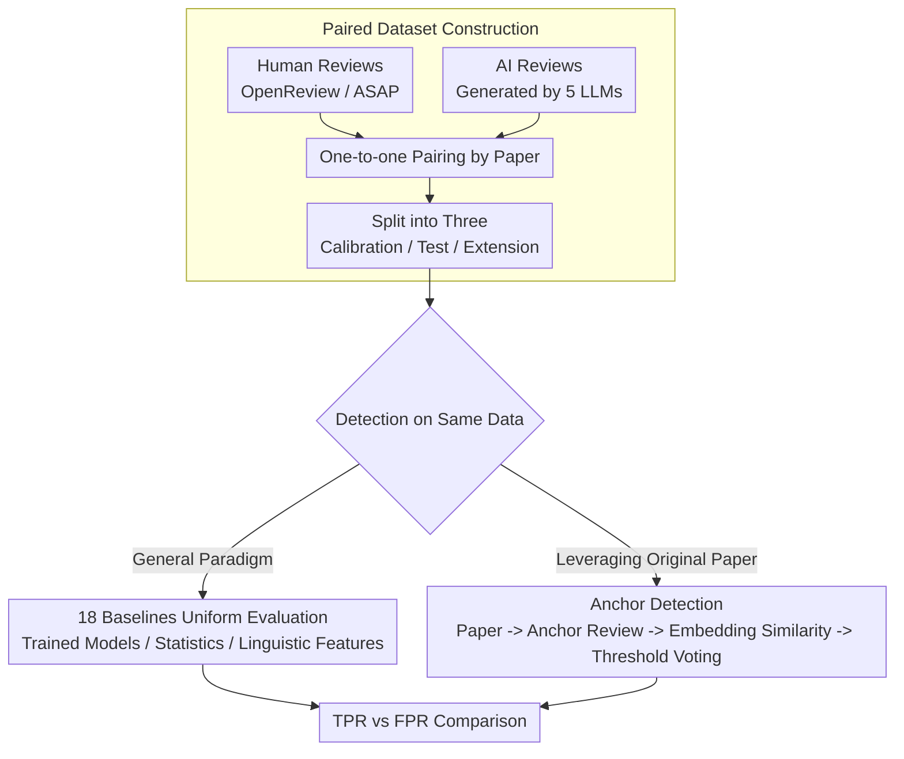

# Is Your Paper Being Reviewed by an LLM? Benchmarking AI Text Detection in Peer Review

**Conference**: ICLR2026  
**arXiv**: [2502.19614](https://arxiv.org/abs/2502.19614)  
**Code**: [IntelLabs/AI-Peer-Review-Detection-Benchmark](https://huggingface.co/datasets/IntelLabs/AI-Peer-Review-Detection-Benchmark)  
**Area**: AIGC Detection  
**Keywords**: AI text detection, peer review, LLM-generated text, benchmark, scientific integrity

## TL;DR

Constructed the largest AI-generated peer review dataset to date (788,984 reviews), systematically evaluated the performance of 18 AI text detection methods in peer review scenarios, and proposed the Anchor detection method leveraging original papers as context, significantly outperforming all baselines at low False Positive Rates.

## Background & Motivation

- With the rapid advancement of LLM capabilities, submissions to AI conferences have surged, significantly increasing reviewer workload, which may lead some reviewers to "outsource" their work to LLMs.
- Existing studies have found an increasing trend in the proportion of AI-generated text in recent AI conference reviews (ICLR, NeurIPS).
- LLM-generated reviews are inconsistent with human reviews in evaluation direction and lack robustness; undisclosed use of LLMs for reviewing severely damages the credibility of peer review.
- **Key Challenge**: Currently, there is a lack of large-scale benchmark datasets for systematically evaluating AI text detection methods specifically in the peer review domain.
- Existing AI text detection benchmarks (e.g., RAID-TD, M4, HC3) focus on general domains and do not cover peer review scenarios.

## Core Problem

1. Can existing general AI text detection methods reliably identify LLM-generated text in peer reviews?
2. In the specific scenario of peer review (where the original paper is available), can more effective detection methods be designed?
3. What is the impact of varying degrees of LLM-assisted editing on detection performance?

## Method

### Overall Architecture

This is a benchmark paper addressing the detection problem of whether peer reviews are clandestinely written by LLMs. The work consists of two parts. The first is **data construction**: pairing real human reviews with AI-generated reviews for the same set of papers to build the largest peer review detection dataset to date (788,984 reviews, balanced), divided into calibration, testing, and expansion sets. The second is **detection and comparison**: 18 existing general detection methods are evaluated as baselines, and a novel Anchor detection method specifically designed for review scenarios is proposed. The core insight is that peer review differs from general text detection because reviewers share a common "original text" (the paper under review); leveraging this original text allows for effective detection within a usable range at low false positive rates.

### Key Designs

**1. Paired Dataset Construction: One-to-one mapping of human and AI reviews for the same papers**

Since general AI text detection benchmarks (RAID-TD, M4, HC3) do not cover peer reviews, the dataset was constructed from scratch. Human reviews were scraped from ICLR 2017–2024 and NeurIPS 2016–2024 via the OpenReview API and ASAP dataset. For the AI side, five mainstream models (GPT-4o, Claude Sonnet 3.5, Gemini 1.5 Pro, Qwen 2.5 72B, Llama 3.1 70B) were used to generate one review each for the **same set of papers**. Specific conference review guidelines and templates were included in the prompts, and the final decision (accept/reject) was aligned to ensure AI reviews did not deviate from the real outcomes. The final 788,984 reviews were split into calibration (75,824, for setting thresholds), test (287,052), and expansion (426,108) sets. A critical detail: the main experiments only used human reviews from before the release of ChatGPT (pre-late 2022) to avoid potential LLM contamination in the "human" labels.

**2. Anchor Detection: Using the original paper to anchor a reference review for semantic similarity comparison**

This is the core methodological contribution, exploiting the unique advantage of the review scenario: the original paper corresponding to the target review (TR) is known. General methods only look at TR's token probabilities or perplexity and lack this contextual anchoring. The process involves using any LLM with a generic prompt to generate an anchor review (AR) for the paper (this prompt differs from the one used for test data and does not depend on the target source). An embedding model (text-embedding-003-small) encodes AR and TR into vectors to calculate the cosine similarity:

$$\text{Score} = \text{Cosine\_similarity}(\text{Emb}_{\text{AR}}, \text{Emb}_{\text{TR}})$$

If the $\text{Score}$ exceeds a threshold $\theta$ learned from the calibration set, it is classified as AI-generated. The semantic intuition is that reviews generated by different LLMs for the same paper are pulled closer in semantic space by the same original text, whereas human reviews exhibit higher natural variance and are further from AR. Thus, the distance between TR and AR serves as a "machine-like" signal. Since the specific model used for TR is unknown, the Anchor method uses multiple LLMs to generate several ARs and compares TR to each; **if any comparison triggers the threshold, it is classified as AI-generated**. This expands the problem from "guessing the model" to a more flexible "hitting at least one" condition, at the cost of additional API calls.

**3. Unified Evaluation of 18 Baselines: Covering three major general detection paradigms**

To provide a fair comparison for Anchor, the IMGTB framework was used to run 18 open-source general detection methods on the same dataset and calibration thresholds. These are categorized into: model-based (e.g., MAGE-D), statistical-based (Log-Likelihood, Rank, Entropy, DetectGPT, FastDetectGPT, Binoculars, etc.), and linguistic-based (e.g., GLTR). Evaluation specifically targeted extremely low FPR (0.1%/0.5%/1%) because the cost of misidentifying a human author in peer reviews is high. Cross-domain settings (calibrating only on ICLR reviews then testing on all) were also applied. These comparisons reveal that general methods largely fail in the specific distribution of peer reviews at low FPR, highlighting the necessity of "utilizing the original text."

## Key Experimental Results

### Main Results (Full AI-Generated Review Detection, Cross-Domain Calibration)

TPR (True Positive Rate) at a target FPR = 1%:

| Method | GPT-4o | Gemini | Claude |
|------|--------|--------|--------|
| **Anchor** | **88.8%** | **86.5%** | **81.8%** |
| Binoculars | 45.2% | 85.5% | 77.0% |
| Best Other Baseline | ≤17.5% | ≤19.4% | ≤17.5% |

At the strictest FPR = 0.1%:

| Method | GPT-4o | Gemini | Claude |
|------|--------|--------|--------|
| **Anchor** | **63.5%** | **59.7%** | **59.6%** |
| Binoculars | 17.1% | 61.5% | 43.5% |

- Anchor provides an absolute improvement of **46.4 percentage points** over Binoculars for GPT-4o detection (FPR=0.1%).
- Most baseline methods perform poorly at low FPR (TPR < 5%), making them nearly unusable in practice.

### Prompt Robustness

- Cross-testing using prompts for different reviewer archetypes (balanced, conservative, innovative, nitpicky) showed largely consistent detection performance.
- For reviews generated by complex agents like AI Scientist, AgentReview, and DeepReview, Binoculars still achieves AUROC > 0.99.

### AI-Assisted Editing

| Editing Level | Anchor (FPR=0.1%) | Binoculars (FPR=0.1%) |
|---------|-------------------|----------------------|
| Minimum | 0.4% | 0.6% |
| Moderate | 0.7% | 1.4% |
| Extensive | 1.9% | 2.5% |
| Maximum | **60.8%** | 9.2% |

- Ranking capability (NDCG): Anchor 0.90, Binoculars 0.86.
- Reviews generated from human bullet points are harder to detect (TPR only 5.8%@FPR=0.1%), but this use case is closer to legitimate writing assistance.

## Highlights & Insights

- **Dataset Scale and Quality**: 788,984 reviews across 5 LLMs over 8 years and 2 major conferences, making it the largest benchmark in peer review AI detection.
- **Simple and Effective Anchor Method**: A clever core idea—using the original paper as context to "anchor" a reference review, where simple cosine similarity significantly outperforms complex baselines.
- **Strict Evaluation at Low FPR**: Correctly identifies the high cost of false positives in peer review, focusing on the 0.1%-1% FPR range, which is more relevant than general AUC.
- **Comprehensive Analysis**: Covers prompt robustness, sensitivity to editing levels, and bullet-point generation scenarios.
- **Open Availability**: Released on HuggingFace to support future research.

## Limitations & Future Work

- **Domain Limitation**: Limited to AI conference reviews (ICLR/NeurIPS); review styles and LLM performance in other disciplines may differ.
- **API Dependency**: Requires calling LLMs for anchor reviews and embedding models, involving cost and latency.
- **Label Noise**: Human reviews after 2023 may be contaminated by LLMs; although the paper avoids this data, it limits the recency of the study.
- **Challenge in Detecting Light Editing**: Detection rates for Minimum/Moderate AI-assisted editing are extremely low, which may be the most common real-world use case.
- **Unexplored Scenarios**: The paper acknowledges that human-edited AI drafts were not extensively studied.
- **Embedding Model Dependency**: Anchor performance may depend on the choice of embedding model; only OpenAI's text-embedding-003-small was tested.

## Related Work & Insights

| Comparison Dimension | Ours | DetectLLM | DNA-GPT | General Benchmarks |
|---------|------|-----------|---------|------------|
| Detection Scenario | Black-box (Unknown LLM) | White-box (Source LLM Access) | Black-box | General |
| Context Utilization | ✓ (Original Paper) | ✗ | ✗ (Truncated Regeneration) | ✗ |
| Domain | Peer Review | General | General | General |
| Data Scale | 788K | - | - | Most < 100K |
| Low FPR Performance | Strong | - | Weak | Moderate |

The primary difference between the Anchor method and DetectLLM/DNA-GPT is that: (1) it does not require access to the generative model; (2) it uses the original paper as "grounding" information to generate reference reviews, which better represents the semantic distribution of real AI reviews compared to DNA-GPT's truncation strategy.

## Related Work & Insights

- **Method Transferability**: The core idea of Anchor (using source documents to generate reference outputs for semantic comparison) can be extended to other context-rich scenarios like AI-generated news summarization or translation detection.
- **Implications for Reviewing Practice**: Conference organizers could integrate Anchor into platforms like OpenReview as a supplementary screening tool for review quality.
- **Complementarity with AI Review Systems**: This work takes a "detection" stance, forming an interesting offensive/defensive relationship with "generation" works like AI Scientist and AgentReview.
- **The Boundary of Mixed Writing**: Highlighting a key ethical grey area—does using an LLM to generate a full review from human bullet points constitute "misuse"? The low detection rate (TPR ~6%) might suggest this use case fundamentally preserves the core of human judgment.

## Rating
- Novelty: ⭐⭐⭐⭐ — Anchor is simple and effective; the dataset fills a major gap.
- Experimental Thoroughness: ⭐⭐⭐⭐⭐ — 18 baselines, 5 LLMs, and multi-dimensional analysis are highly comprehensive.
- Writing Quality: ⭐⭐⭐⭐ — Clear structure, well-motivated, and informative visualizations.
- Value: ⭐⭐⭐⭐ — High practical significance for academic integrity; publicly available dataset.

<!-- RELATED:START -->

## Related Papers

- [\[ICLR 2026\] D&R: Recovery-based AI-Generated Text Detection via a Single Black-box LLM Call](dr_recovery-based_ai-generated_text_detection_via_a_single_black-box_llm_call.md)
- [\[ICML 2026\] AutoBaxBuilder: Bootstrapping Code Security Benchmarking](../../ICML2026/aigc_detection/autobaxbuilder_bootstrapping_code_security_benchmarking.md)
- [\[ICLR 2026\] EditLens: Quantifying the Extent of AI Editing in Text](editlens_quantifying_the_extent_of_ai_editing_in_text.md)
- [\[ICLR 2026\] Enabling Your Forensic Detector Know How Well It Performs on Distorted Samples](enabling_your_forensic_detector_know_how_well_it_performs_on_distorted_samples.md)
- [\[ICML 2026\] Feature-Augmented Transformers for Robust AI-Text Detection Across Domains and Generators](../../ICML2026/aigc_detection/feature-augmented_transformers_for_robust_ai-text_detection_across_domains_and_g.md)

<!-- RELATED:END -->
