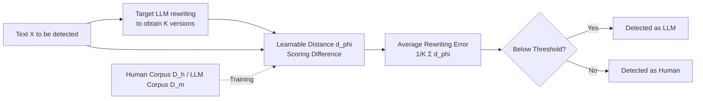

# Learn-to-Distance: Distance Learning for Detecting LLM-Generated Text

**Conference**: ICLR 2026  
**OpenReview**: [https://openreview.net/forum?id=2ZUPeEM3FH](https://openreview.net/forum?id=2ZUPeEM3FH)  
**Code**: [https://github.com/Mamba413/L2D](https://github.com/Mamba413/L2D)  
**Area**: AIGC Detection / LLM-Generated Text Detection  
**Keywords**: rewrite-based detection, distance learning, geometric perspective, rewriting error, zero-shot detection  

## TL;DR
This paper explains the effectiveness of "rewrite-based" LLM text detection methods from a geometric projection perspective and proposes L2D. Instead of using fixed distances to measure the difference between original and rewritten text, L2D adaptively **learns a distance function**, achieving an average improvement of 41.5%~75.4% over the strongest baselines across 100+ settings.

## Background & Motivation
- **Background**: Passive (watermark-free) LLM text detection is generally categorized into logits-based, rewrite-based, and others. The core observation of rewrite-based methods is that machine-generated text is "closer" to its rewritten version by the target LLM, whereas human-written text exhibits a larger rewriting error.
- **Limitations of Prior Work**: ① Logits-based methods (e.g., DetectGPT, Fast-DetectGPT) rely on the marginal distribution $\log q(x)$. When text is generated by an **unknown prompt**, the conditional distribution $\log q(x\mid \text{prompt})$ mismatches, causing performance collapse; ② Although rewrite-based methods are more robust to prompts, they all utilize **handcrafted fixed distances** (N-gram, Levenshtein, BERTScore, etc.), which fail to generalize across different target LLMs, datasets, and prompts.
- **Key Challenge**: The optimal distance function should vary according to the generation subspace of the target LLM. Fixed distances are inherently non-adaptive—a distance effective for one model may degrade for another.
- **Goal**: To theoretically clarify "why rewrite-based methods are effective" and "why they are robust to unknown prompts," and then replace fixed distances with a **learnable** distance function.
- **Core Idea**: **Adaptive Distance Learning** — parameterizing the distance between "original text vs. rewritten text" as a differentiable language model scoring difference. It is learned end-to-end using human and LLM corpora to maximize the gap in rewriting errors between the two classes.

## Method

### Overall Architecture
L2D follows the rewrite-based paradigm: given a text $X$ to be detected, it is first rewritten by the target LLM to obtain $R(X)$. The distance between them is measured as a statistic, where a small distance indicates machine generation. The key difference is that this distance is not fixed; it is parameterized by a lightweight fine-tuned language model $p_\phi$ and learned on human corpora $\mathcal{D}_h$ and LLM corpora $\mathcal{D}_m$ to separate the rewriting error distributions of the two categories as much as possible.

### Key Designs

**1. Geometric Projection Perspective: Proving "smaller rewriting error" as a theorem.** The authors embed text into a Hilbert space, assuming human and LLM text fall into subspaces $\mathcal{H}$ and $\mathcal{M}$ respectively. They propose a key assumption: the LLM text distribution $q$ is a projection $\Pi_\mathcal{M}$ of the human distribution $p$ onto $\mathcal{M}$. The rewriting process is modeled as a projection followed by a small perturbation within $\mathcal{M}$, i.e., $R(x)=\Pi_\mathcal{M}(x)+e$. Under this setting, Proposition 1 proves $\mathbb{E}_{X\sim p}[d^*(X,R(X))] \ge \mathbb{E}_{X\sim q}[d^*(X,R(X))]$—human text has a larger average rewriting error, with equality holding if and only if the LLM output space perfectly covers the human space. This provides a geometric explanation for a previously empirical observation.

**2. Robustness to Unknown Prompts.** In practice, LLM text is often generated with various prompts (e.g., "Polish this," "Rephrase this"), leading to distribution drift from $q$ to $q_{\text{prompt}}$, where logits-based methods fail. Proposition 2 provides a lower bound: if the perturbation satisfies $|e|\le\epsilon$, then $\mathbb{E}_{X\sim p}[d^*(X,R(X))]-\mathbb{E}_{X\sim q_{\text{prompt}}}[d^*(X,R(X))] \ge \mathbb{E}_{X\sim p}|X-\Pi_\mathcal{M}(X)|-O(\epsilon)$. This implies that as long as rewriting preserves semantics ($e$ is small), even if the prompt "shifts" the generated text, the human rewriting error remains significantly larger—explaining why rewrite-based methods are naturally resistant to prompt drift.

**3. Form of Optimal Distance and Soft Relaxation Parameterization.** Proposition 3 characterizes the ideal distance $d_{\text{opt}}$: it should be 0 when both the original and rewritten text are within $\mathcal{M}$, and reach a maximum $M$ when one belongs to $\mathcal{M}$ and the other to the human space. This optimal distance **depends on the target LLM** (since $\mathcal{M}$ differs per LLM), and fixed distances cannot approximate it. Based on this, the authors parameterize the distance in a soft, differentiable form:
$$d_\phi(X_1,X_2)=\left|\frac{\log p_\phi(X_1)}{\text{len}(X_1)}-\frac{\log p_\phi(X_2)}{\text{len}(X_2)}\right|,$$
where $p_\phi$ is a learnable language model. This form satisfies non-negativity, reflexivity, and the triangle inequality (pseudo-distance). When $p_\phi$ assigns a probability $\propto \kappa^{\text{len}(X)}$ to any $X\in\mathcal{M}$, the distance between two LLM texts is exactly 0, corresponding to the hard indicator of $d_{\text{opt}}$.

**4. Distance Learning Objective and Stabilized Inference.** The training objective is to maximize the margin between the rewriting errors of the two corpora: $\mathbb{E}_{X\sim\mathcal{D}_h}[d(X,R(X))]-\mathbb{E}_{X\sim\mathcal{D}_m}[d(X,R(X))]$. An ideal $p_\phi$ should assign low probabilities to human text and more uniformly distributed probabilities across tokens for LLM text—this is the opposite of conventional LLMs that "imitate humans and give high probability to human text," necessitating fine-tuning over pre-trained models. Implementation-wise, $p_\phi$ is initialized with a pre-trained LLM and updated only at the final layer or via LoRA to reduce overhead. During inference, to mitigate rewriting randomness, $K$ rewritten versions are generated for each text, and the average error $K^{-1}\sum_{k=1}^K d(X,\tilde{X}_k)$ is used as the final statistic.

## Key Experimental Results

### Main Results (GPT-3.5 Turbo, 21 Domain AUC, Selection + Average)

| Detector | RAIDAR | ImBD | **L2D** |
|---|---|---|---|
| AcademicResearch | 0.812 | 0.919 | **0.948** |
| Code | 0.539 | 0.771 | **0.906** |
| PersonalCommunication | 0.653 | 0.755 | **0.922** |
| TechnicalWriting | 0.818 | 0.944 | **0.994** |
| **Average (21 Domains)** | 0.745 | 0.890 | **0.948** |

- L2D leads almost entirely across the 21 domains with an average AUC of 0.948, showing significant improvement over the strongest baseline (ImBD at 0.890). In specific domains, the relative gain (RG) reaches as high as 76.7%~89.4%.

### Ablation Study (Learning Distance vs. Fixed Distance)

| Setting | Fixed Distance (Pre-trained $p_\phi$) | Learning Distance (L2D) |
|---|---|---|
| Avg. Relative Gain | — | **+96%** |

- Replacing the learnable distance with an un-tuned initial pre-trained model as a fixed distance causes a sharp performance drop. Learnable distances provide an average relative boost of approximately 96%, directly validating the "distance must be adaptive" conclusion from Proposition 3.

### Key Findings
- **Broad Coverage**: Tested on 24 datasets, 6-7 target LLMs (Llama-3-70B, Claude-3.5, GPT-3.5/4o, Gemini 1.5 Pro / 2.5 Flash), and 3 types of unknown prompts across 100+ settings. It achieves an average relative gain of 41.5%~75.4% over 12 SOTA baselines.
- **Attack Resistance**: Shows higher robustness than existing methods under paraphrasing and decoherence adversarial attacks.
- **Fairness Control**: All rewrite-based methods share the same backbone (`gemma-2-9b-it`) and the same set of rewritten texts. Fine-tuning methods use identical hyperparameters to ensure fair comparison.

## Highlights & Insights
- **Explanation before Improvement**: The paper uses geometric projection and three Propositions to prove "why it works," "why it's prompt-robust," and "why it needs to learn the distance." The theoretical motivation is complete rather than just being a collection of tricks.
- **Clever Parameterization of Learnable Distance**: Constructing a pseudo-distance using language model scoring differences satisfies distance axioms and serves as a continuous relaxation of the optimal hard indicator distance, making it differentiable and optimizable.
- **"Inverse LLM" Intuition**: The ideal $p_\phi$ should give low probability to human text and uniform probability to LLM text, which is contrary to standard LLM objectives, explaining why fine-tuning is indispensable.

## Limitations & Future Work
- The theory relies on strong geometric assumptions (LLM text being a projection of human text on a subspace, rewriting as projection + small perturbation). Whether real embedding spaces strictly satisfy this remains to be explored.
- It requires calling the target LLM to generate rewritten text and construct $\mathcal{D}_m$, which limits applicability to completely black-box or inaccessible target models.
- Distance learning requires fine-tuning $p_\phi$ for each target LLM. Multi-model migration and the feasibility of a "universal distance" have not been fully explored.

## Related Work & Insights
- **Rewrite-based Genealogy**: RAIDAR, L2R, and ImBD use rewriting errors or fine-tuned rewriters. This work differs by learning the "distance" rather than the "rewriter."
- **Logits-based Comparison**: DetectGPT/Fast-DetectGPT revealed marginal distribution mismatch under prompt drift, which is precisely the pain point addressed by this paper's geometric perspective.
- **Inspiration**: Theoretically characterizing the "optimal form" of a detection statistic before using differentiable models for soft relaxation and approximation is a paradigm worth transferring to other detection or metric learning tasks.

## Rating
- Novelty: ⭐⭐⭐⭐ The combination of a geometric projection perspective and learnable distance is a novel and self-consistent contribution to rewrite-based detection.
- Experimental Thoroughness: ⭐⭐⭐⭐⭐ Extremely broad coverage and fair control across 24 datasets / 7 LLMs / 100+ settings / 12 baselines / adversarial attacks / ablations.
- Writing Quality: ⭐⭐⭐⭐ The connection between theory and method is clear, with three Propositions progressing logically and a complete narrative.
- Value: ⭐⭐⭐⭐ Provides a high-performance solution with theoretical backing for the high-demand field of AIGC detection; code is open-sourced with high practical value.

<!-- RELATED:START -->

## Related Papers

- [\[ICLR 2026\] TSM-Bench: Detecting LLM-Generated Text in Real-World Wikipedia Editing Practices](tsm-bench_detecting_llm-generated_text_in_real-world_wikipedia_editing_practices.md)
- [\[ICLR 2026\] HLD: Approximate Hierarchical Linguistic Distribution Modeling for LLM-Generated Text Detection](hld_approximate_hierarchical_linguistic_distribution_modeling_for_llm-generated_.md)
- [\[ACL 2025\] Learning to Rewrite: Generalized LLM-Generated Text Detection](../../ACL2025/aigc_detection/learning_to_rewrite_generalized_llm-generated_text_detection.md)
- [\[ICLR 2026\] Learning From Dictionary: Enhancing Robustness of Machine-Generated Text Detection in Zero-Shot Language via Adversarial Training](learning_from_dictionary_enhancing_robustness_of_machine-generated_text_detectio.md)
- [\[ACL 2026\] GigaCheck: Detecting LLM-generated Content via Object-Centric Span Localization](../../ACL2026/aigc_detection/gigacheck_detecting_llm-generated_content_via_object-centric_span_localization.md)

<!-- RELATED:END -->
