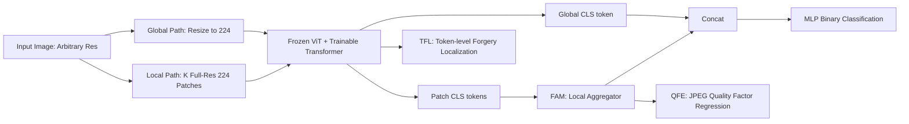

# No Pixel Left Behind: A Detail-Preserving Architecture for Robust High-Resolution AI-Generated Image Detection

**Conference**: ICLR 2026  
**OpenReview**: [https://openreview.net/forum?id=9QQ3Kc2hj6](https://openreview.net/forum?id=9QQ3Kc2hj6)  
**Code**: TBD  
**Area**: AIGI Detection / Image Forensics / High-Resolution Vision  
**Keywords**: AI-generated image detection, high-resolution, full-resolution patching, feature aggregation, JPEG robustness, forgery localization  

## TL;DR
The authors propose HiDA-Net: a dual-path input architecture using "global thumbnail + full-resolution patches covering the whole image," combined with feature aggregation, token-level forgery localization, and JPEG quality factor estimation. It achieves "no pixel left behind" and significantly advances the SOTA in high-resolution AIGI detection.

## Background & Motivation
- **Background**: Mainstream AI-Generated Image (AIGI) detection typically resizes or center-crops images to $224 \times 224$ for standard backbones (CLIP/CNN), with training and evaluation performed on low-resolution datasets.
- **Limitations of Prior Work**: Real-world generated images are often high-resolution, refined, or super-resolved, causing a severe distribution mismatch. On high-resolution benchmarks like Chameleon, existing methods drop below 60%. The authors attribute this to: **Input Degradation**, where resizing truncates the DFT in the frequency domain, **irreversibly erasing high-frequency fingerprints**; and **Limited Generalization**, where inconsistent JPEG compression histories cause models to become "compression detectors" rather than "synthesis detectors," while local inpainting requires fine-grained spatial perception.
- **Key Challenge**: Detecting high-frequency traces requires preserving all original pixels, yet standard backbones accept only fixed low-resolution inputs—a conflict between "full pixel coverage" and "fixed input size."
- **Goal**: Construct a high-resolution detection framework that preserves all pixels, resists local forgery and compression noise, and provides a benchmark reflecting real-world distributions.
- **Core Idea**: **Full-coverage Patching + Aggregation**. Divide the entire image into $224 \times 224$ full-resolution patches to **collectively cover the whole image** (mathematically allowing reconstruction of the full spectrum). Use an aggregation module to fuse local details with global semantics, and introduce two auxiliary tasks to decouple "compression" from "synthesis."

## Method

### Overall Architecture
HiDA-Net is a dual-path detector: the **Global Path** resizes the image to $224 \times 224$ for semantic context, while the **Local Path** crops $K$ full-resolution patches of $224 \times 224$ to preserve high-frequency details. Both paths share a **frozen ViT backbone + lightweight trainable Transformer refiner layers**. All patch tokens and the global image [CLS] token are fused by a Feature Aggregation Module (FAM) for binary classification. Two auxiliary tasks, Token-level Forgery Localization (TFL) and JPEG Quality Factor Estimation (QFE), are trained jointly.

### Key Designs

**1. Frequency Domain Basis for Full-coverage Patching.** This provides the mathematical foundation. Resizing is equivalent to center-truncating the DFT, $Y[r_1,r_2]=\frac{M_1 M_2}{N_1 N_2}X[r_1,r_2]$, which **permanently discards** high frequencies. In contrast, cropping a patch is equivalent to multiplying by a window function $W_k$. By the convolution theorem $\mathcal{F}\{P_k\}=\mathcal{F}\{I\}*\mathcal{F}\{W_k\}$, the Dirichlet kernel of the window function causes **spectral leakage**, spreading all frequency components (including high frequencies) across the spectrum. Furthermore, the DTFT of the whole image can be reconstructed from the DTFTs of patches covering it: $X=\sum_{a,b}e^{-j(\omega_1\Delta^{(1)}_a+\omega_2\Delta^{(2)}_b)}Y_{(a,b)}$. This proves **full coverage preserves the complete spectrum**, the theoretical guarantee for "no pixel left behind."

**2. Feature Aggregation Module (FAM): Fusing Variable Patch Details into Global Semantics.** During inference, patches are generated with $N=\lceil L/P\rceil$ along each dimension, with the last patch edge-aligned ($x_N=L-P$) for seamless coverage. During training, $K \in [1,16]$ patches are randomly sampled. FAM assembles [CLS] tokens from all patches into a sequence, prepends a learnable output token $t_{out}$, and feeds them into a Transformer: $f_{detail}=\text{LocalAggregator}([t_{out},t^1_{cls},\dots,t^K_{cls}])[0]$. This is then concatenated with the global token: $f_{final}=\text{Concat}(f_{global},f_{detail})$. This variable-length aggregation captures global consistency better than independent patch predictions.

**3. Token-level Forgery Localization (TFL): Fine-grained Sensing of Local Inpainting.** To address local forgery, **Random Patch Swap (RPS)** is used during training: regions are swapped between real and fake images. Each ViT patch token is assigned a soft label $y_{token}\in[0,1]$ based on the forgery ratio within its receptive field. A shared linear head with Sigmoid predicts forgery probability, optimized by $L_{tfl}=\frac{1}{M_{total}}\sum_{k,i}\text{BCE}(p^k_{token,i},y^k_{token,i})$. This enables the model to locate "where" an image was modified, improving robustness against AI inpainting.

**4. JPEG Quality Factor Estimation (QFE): Decoupling Compression Noise.** Inconsistent compression history can mislead models into becoming compression detectors. QFE regresses the JPEG quality factor $q_{pred}=\text{MLP}_{qf}(f_{detail})$ from the detail-rich local features. Since some images saved as PNG lack metadata, a pre-trained FBCNN estimator provides pseudo-ground truth $q_{true}$. The loss is $L_{qfe}=\text{MSE}(q_{pred},q_{true})$. This forces the model to explicitly recognize quantization artifacts, separating "content/synthesis traces" from "compression noise." Total loss: $L_{all}=L_{cls}+\alpha L_{tfl}+\beta L_{qfe}$.

## Key Experimental Results

### Main Results
Backbone: Frozen CLIP ViT-L/14. Patches: $224 \times 224$. Inference: Full coverage.

| Benchmark | Evaluation Setting | Prev. SOTA | HiDA-Net | Gain |
|-----------|--------------------|------------|----------|------|
| Chameleon | GenImage Trained (Acc) | 65.77 (AIDE) | **79.10** | +13.3% |
| HiRes-50K | GenImage Trained (Avg Acc) | 71.87 (SPAI) | **80.33** | +8.5% |
| GenImage  | SDv1.4 Trained (Avg Acc) | 95.8 (C2P-CLIP) | **97.1** | +1.3% |
| DRCT      | SDv1.4 Trained (Avg Acc) | 96.6 (DRCT/SDv2) | **98.4** | +1.8% |

On HiRes-50K, while methods like SPAI degrade as resolution increases, HiDA-Net remains stable (>69.84% even at >5000px, mostly 78–88%), highlighting its high-resolution advantage.

### Ablation Study

| Number of Patches (FAM) | 1 | 2 | 4 | 8 | 16 | FAM(1–16) |
|-------------------------|---|---|---|---|---|-----------|
| Acc (%)                 | 92.14 | 93.34 | 95.63 | 95.69 | 95.89 | **96.10** |

| Module Combination | FAM | FAM+TFL | FAM+QFE | ALL |
|--------------------|-----|---------|---------|-----|
| Acc (%)            | 93.92 | 94.36 | 94.73 | **96.10** |

| Branch | No Global | No Local | ALL |
|--------|-----------|----------|-----|
| Acc (%)| 94.75     | 91.88    | **96.10** |

### Key Findings
- **More Patches, Better Accuracy**: FAM allows accuracy to rise monotonically with patch coverage, validating the "full pixel coverage" value; the local branch contributes significantly more than the global branch.
- **Orthogonal Auxiliary Tasks**: TFL and QFE independently improve performance by +0.4% and +0.8%, respectively, with a combined gain of +2.2%, showing that spatial localization and compression decoupling are complementary.
- **Strong Robustness**: Gradual decay under JPEG compression, Gaussian blur, resizing, and noise; QFE significantly improves the performance curve for low-quality JPEG images.

## Highlights & Insights
- **Theoretical Support for "Lossless Coverage"**: Uses DFT truncation vs. window function spectral leakage and phase reconstruction to turn "resizing loses high-freq, cropping keeps high-freq" into a provable frequency domain proposition.
- **Frozen Backbone + Lightweight Aggregation**: Leverages frozen CLIP ViT, training only refinement layers and the aggregator, making it scalable to any resolution during inference.
- **Addressing Dataset Bias**: QFE directly addresses the issue of models learning compression artifacts. The HiRes-50K dataset further aligns resolution and JPEG levels to eliminate shortcuts.
- **New Benchmark**: HiRes-50K contains 50,568 images with long edges from <1K to >10K, sourced from AIGI communities with manual filtering for high-fidelity samples.

## Limitations & Future Work
- Inference on high-resolution images requires processing many patches through ViT; **computational/memory costs scale linearly with image area**.
- QFE's supervision depends on the accuracy of an external FBCNN estimator.
- Improvement on low-resolution scenarios (e.g., Mix Set) is marginal, as the benefits peak in high-resolution settings.
- TFL relies on RPS-synthesized images, which may have a distribution gap compared to diverse real-world inpainting/editing.

## Related Work & Insights
- **Feature Extraction**: UnivFD/C2P-CLIP use frozen CLIP + Resizing (suppresses high-freq); PatchCraft/AIDE use texture/frequency-based cropping (localized view). This paper unifies both via "End-to-end full-patch aggregation + global context."
- **Reconstruction-based Detection**: DIRE/Aeroblade use diffusion reconstruction residuals. This work borrows the idea of using VAE reconstruction errors to generate token-level labels for TFL.
- **Insight**: In tasks where high-resolution details are critical but backbones are constrained (e.g., medical imaging, remote sensing), the "Full-coverage patching + variable-length aggregation + frequency preservation proof" serves as a transferable paradigm.

## Rating
- Novelty: ⭐⭐⭐⭐ — While patching is not new, the combination of provable frequency domain preservation, FAM aggregation, and dual-auxiliary decoupling is well-justified.
- Experimental Thoroughness: ⭐⭐⭐⭐⭐ — Multiple benchmarks (Chameleon/HiRes-50K/GenImage/DRCT/Mix), robust evaluations, and a new high-res benchmark.
- Writing Quality: ⭐⭐⭐⭐ — Clear logic from motivation to theory and method; frequency domain derivation is a highlight.
- Value: ⭐⭐⭐⭐ — Addresses a real pain point in high-resolution AIGI detection with significant SOTA gains and useful community benchmarks.

<!-- RELATED:START -->

## Related Papers

- [\[ICLR 2026\] Preserving Forgery Artifacts: AI-Generated Video Detection at Native Scale](preserving_forgery_artifacts_ai-generated_video_detection_at_native_scale.md)
- [\[ICLR 2026\] FakeXplain: AI-Generated Image Detection via Human-Aligned Grounded Reasoning](fakexplain_ai-generated_image_detection_via_human-aligned_grounded_reasoning.md)
- [\[ICLR 2026\] Unveiling Perceptual Artifacts: A Fine-Grained Benchmark for Interpretable AI-Generated Image Detection](unveiling_perceptual_artifacts_a_fine-grained_benchmark_for_interpretable_ai-gen.md)
- [\[ICML 2026\] Dissect and Prune: Enhancing Robustness in AI-Generated Image Detection](../../ICML2026/aigc_detection/dissect_and_prune_enhancing_robustness_in_ai-generated_image_detection.md)
- [\[ICLR 2026\] CLARC: C/C++ Benchmark for Robust Code Search](clarc_cc_benchmark_for_robust_code_search.md)

<!-- RELATED:END -->
