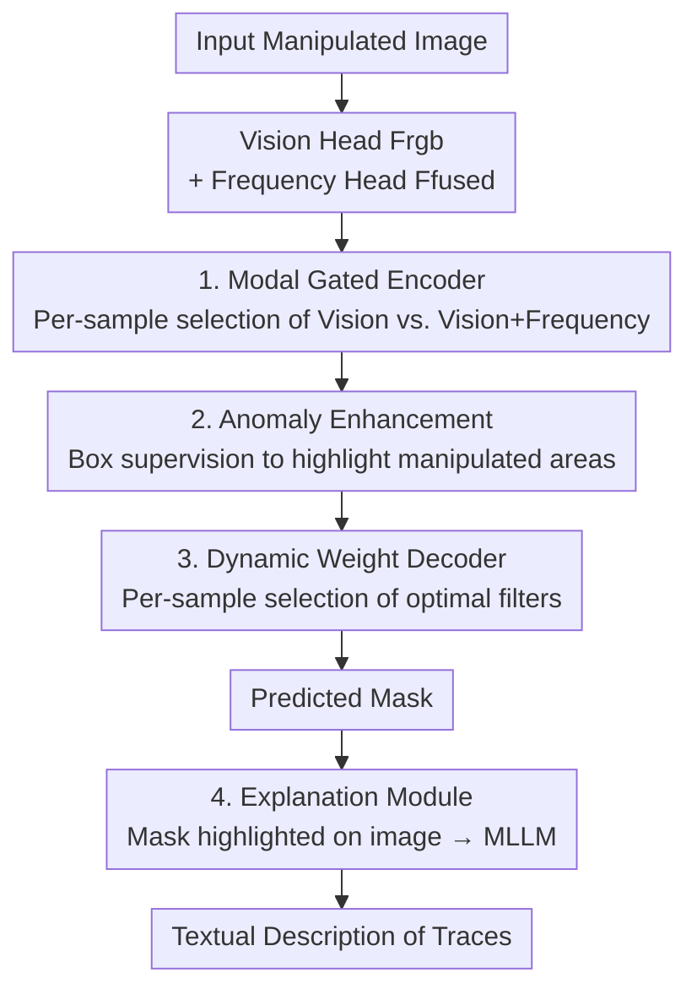

# Omni-IML: Towards Unified Interpretable Image Manipulation Localization

**Conference**: ICLR 2026  
**OpenReview**: [https://openreview.net/forum?id=jBJkP5Fv0m](https://openreview.net/forum?id=jBJkP5Fv0m)  
**Code**: https://github.com/qcf-568/OmniIML  
**Area**: Image Forensics / Manipulation Localization / Multimodal VLM  
**Keywords**: Image Manipulation Localization, Universal Model, Modal Gating, Dynamic Weights, Interpretable Forensics

## TL;DR
This paper proposes Omni-IML—the first universal model capable of achieving SOTA performance across four major Image Manipulation Localization (IML) tasks (natural images, documents, faces, and scene text) using a **single model**. It addresses the performance degradation in joint training via three sample-adaptive modules: the Modal Gated Encoder, Dynamic Weight Decoder, and Anomaly Enhancement. Additionally, it constructs the Omni-273k dataset and an interpretability module to provide natural language descriptions of manipulation traces.

## Background & Motivation
**Background**: Image Manipulation Localization (IML) aims to identify PS/spliced/AI-generated regions at the pixel level. Current mainstream approaches design specialized models for specific image types—natural images rely on edge anomaly enhancement and object attention, documents rely on early vision-frequency fusion, and faces rely on metric learning or noise filtering.

**Limitations of Prior Work**: This "one model per task" paradigm incurs high maintenance costs and fails when applied to different image types. Direct joint training—pooling data from all tasks—leads to **significant performance drops across all tasks**. For instance, HiFi-Net degrades so severely after joint training that it must maintain separate parameters for natural images and faces; TIFDM's IoU drops from 0.498 when trained on documents alone to 0.428 after joint training, a 7-point decrease.

**Key Challenge**: The failure of joint training stems from two factors. First, existing methods rely heavily on **task-specific designs**—edge enhancement or noise filtering for natural images is largely ineffective for documents (where edge artifacts are subtle and object features are less prominent), while frequency fusion for documents degrades on noise-heavy natural images. Second, current methods **lack mechanisms to distinguish manipulation features across tasks**: cues vary wildly (contrast/edges in natural images, DCT discontinuities in documents, texture unnaturalness in faces), and a fixed-parameter model becomes confused by these diverse features.

**Goal**: To create a universal model that achieves SOTA performance on four IML tasks simultaneously without task-specific designs, while further enabling the model to explain manipulation traces in natural language.

**Key Insight**: Rather than forcing specialized modules for each task, the model should **adaptively select** the optimal encoding modality and decoding parameters for each input sample. Since different image types require different processing, this "selection" should be determined dynamically by the model per sample.

**Core Idea**: Replace task-specific designs with sample-level adaptation (Modal Gating + Dynamic Weights) and suppress joint training noise using box-supervised anomaly enhancement, thereby unifying "one model per task" into "one universal model."

## Method

### Overall Architecture
Omni-IML consists of two independently trained components: the **Localization Module** (left, an encoder-decoder structure outputting pixel-level manipulation masks) and the **Explanation Module** (right, an MLLM outputting natural language descriptions of traces).

The data flow for localization is as follows: the original image passes through a **Vision Perception Head** to obtain visual features $F_{rgb}$ and a **Frequency Perception Head** to obtain frequency features, which are fused via convolution to produce $F_{fused}$. Both $F_{rgb}$ and $F_{fused}$ generate coarse prediction masks ($P_{rgb}, P_{fused}$). The **Modal Gate** examines these four inputs to determine, per sample, whether to use pure vision or vision+frequency for subsequent encoding. The selected features pass through the backbone to extract multi-scale high-level features, with an **Anomaly Enhancement Module** using box-level supervision to highlight manipulated areas. Finally, these are fed into the **Dynamic Weight Decoder** to produce the final mask. The Explanation Module overlays the predicted mask onto the original image as a visual prompt and feeds it into an MLLM to generate trace descriptions.

### Key Designs

**1. Modal Gated Encoder: Deciding Frequency Usage Per Sample**

Frequency features are a "double-edged sword" for universal IML models—they help detect visually seamless manipulations (e.g., modified text in documents that is visually identical but discontinuous in the DCT domain), but can degrade performance when images are noisy or highly distorted (e.g., many natural images or faces). Thus, neither pure vision nor vision+frequency is consistently optimal across all tasks. The Modal Gate is a binary classifier composed of several convolutional layers. It takes the concatenated $F_{rgb}$, $F_{fused}$, and their respective coarse predictions $P_{rgb}, P_{fused}$ as input. By observing the noise level of $F_{fused}$ and determining which coarse prediction is more confident and accurate, it decides whether to use $F_{fused}$ or $F_{rgb}$ as the encoder input. This converts the "whether frequency helps" decision from a manual heuristic into an automated per-sample identification, preventing document-specific frequency fusion from being incorrectly applied to noisy natural images.

**2. Anomaly Enhancement: Highlighting Regions and Learning Task-Agnostic Features**

Feature distributions vary significantly across image types, and joint training introduces noise that confuses the model. The Anomaly Enhancement (AE) module is placed between the encoder and decoder, introducing a novel **box-level supervision**. It uses a Region Proposal Network (RPN) + RoI Align + BBox head during training to explicitly locate manipulation bounding boxes, enhancing the feature contrast of manipulated regions. This component (black lines in the diagram) exists only during training and is removed during inference, incurring no additional inference cost. It suppresses feature noise and reduces model confusion during joint training, allowing the model to learn cleaner cross-domain manipulation features (task-agnostic features)—removing it results in a 4.6-point drop in average IoU.

**3. Dynamic Weight Decoder: Adapting Filters Per Sample**

Diverse manipulation cues result in a wide range of feature distributions in the encoded manipulation regions. A decoder with fixed filters would be confused by these varied features under unified training. The Dynamic Weight Decoder (DWD) first fuses low-level features top-down with high-level features to obtain multi-scale features $F_{1,2,3,4}$. Global average pooling is applied to $F_1$ to obtain a global vector $V_g$. Multi-scale features are reduced in dimension and passed through a sequence of **Dynamic Weight Filters (DWF)** with different dilation rates. Each DWF first averages input features to get a local global representation $V_c$, which then interacts with $V_g$ via fully connected layers to produce weights $A_i=\sigma(\mathrm{FC}(V_c,V_g))$. These weights are used to compute a sample-specific filter $D_{opt}=\sum_{i=1}^{4} A_i \ast W_i$ through a weighted sum of four regular convolution kernels, followed by depthwise and $1\times1$ point-wise convolutions. This provides a "tailor-made" decoding filter for each image. Ablations show DWD is the most significant module—removing it drops average IoU by 12.0 points; even keeping the DWD structure but fixing weights for all inputs (w.o. DW) is 4.0 points lower than the full model, proving the effectiveness of per-sample weight selection.

**4. Explanation Module: Highlighting Masks as Visual Prompts**

To enable linguistic explanations beyond localization, directly prompting an MLLM with the original image (as in FakeShield) often leads to misidentification of manipulated areas in multi-object or difficult cases (e.g., document tampering). This paper constructs a visual reference prompt $I_{ref}=(I_{input}+I_{mask})/2$ by highlighting the predicted mask over the original image, which is then concatenated with the original image along the longest edge and fed into the MLLM. Translucent highlighting is used instead of binary masks to avoid ambiguity in scenarios with dense text or faces where instances are closely packed. This design does not modify the internal MLLM structure, reducing overfitting and catastrophic forgetting. It significantly boosts the forensic explanation capabilities of various base MLLMs (e.g., InternVL3, Qwen2.5-VL).

### Loss & Training
The Localization and Explanation modules are **trained completely independently**. Supervision for localization includes segmentation loss for the final mask, auxiliary losses for the two coarse predictions, and box detection loss (RPN/BBox, training only) for the Anomaly Enhancement branch. The Explanation side uses structured annotations from Omni-273k to perform supervised fine-tuning (SFT) on the base MLLM.

## Key Experimental Results

### Main Results
A single Omni-IML achieves SOTA performance across four tasks simultaneously (Pixel-level IoU):

| Task | Dataset (Partial) | Omni-IML | Prev. SOTA | Note |
|------|------|------|------|------|
| Natural IML | Avg (5 sets) | **.612** | APSC-Net .552 | CASIA1/Coverage/NIST16 etc. |
| Document IML | DT-FCD | **.863** | DTD .749 | Frequency for visual consistency |
| Face IML | OpenForensics | **.923** | MoNFAP .902 | Uncut deepfake |
| Scene Text IML| Avg (T-IC13/OSTF) | **.610** | ConvNeXt .543 | Arbitrary style scene text |

The most critical comparison is "Single-task Training vs. All-task Joint Training" (Table 3, Average IoU):

| Model | Single-task Ability | Joint Training Avg | Joint Degradation |
|------|------|------|------|
| TIFDM (Doc) | Doc .498 | .533 | Doc drops 7.0 pts (.498→.428) |
| MoNFAP (Face) | Face .902 | .552 | Severe cross-task degradation |
| **Ours** | Strong on all | **.728** | Doc only drops 0.8 pts (.774→.766) |

While specialized models average only .4~.6 after joint training, Omni-IML reaches .728, with almost no drop in the document task, validating the effectiveness of "Sample Adaptation + Noise Suppression" against joint training degradation.

### Ablation Study

| Configuration | Avg IoU | Gain/Loss vs. Full |
|------|---------|------|
| Baseline (No modules) | .575 | −15.3 |
| w.o. MG (Forced Fusion) | .629 | −9.9 |
| w.o. MG* (Forced Visual) | .659 | −6.9 |
| w.o. DWD | .608 | −12.0 |
| w.o. DW (Fixed Weights) | .688 | −4.0 |
| w.o. AE | .682 | −4.6 |
| **Omni-IML (Full)** | **.728** | — |

Regarding interpretability (Table 6), adding the proposed visual prompts to various base MLLMs dramatically improves metrics such as document tampered text recognition: Qwen2.5-VL 7B's scores for text recognition/absolute position/relative position jumped from .312/.381/.429 to .653/.576/.698, and trace description increased from .521 to .689.

### Key Findings
- **DWD is the primary contributor**: Removing it causes a 12.0-point drop, far exceeding other modules; this suggests that "per-sample decoding filter adaptation" is the core of multi-task unification. Per-sample weight selection itself contributes 4.0 points (vs. fixed weights).
- **Modal Gating validation**: Forced pure vision drops 6.9 points (verifying frequency utility in docs), while forced fusion drops 9.9 points (verifying frequency harm in noisy samples)—only per-sample gating optimizes both scenarios.
- **Visual Prompts benefit difficult scenarios most**: In multi-target doc scenarios with dense text, FakeShield/SIDA fail due to frozen SAM/LISA + low-res LLaVA(336). Ours significantly boosts multiple base MLLMs, demonstrating generalizability.

## Highlights & Insights
- **Replacing "Task-Specific" with "Sample-Adaptive"**: This is a clever conceptual shift—rather than stacking modules for each task, the model selects modalities and filters per sample. This naturally circumvents the failure of A-specific designs on B, a valuable insight for any heterogeneous task unification.
- **Training-only Box Supervision**: Anomaly Enhancement uses RPN/BBox to highlight regions during training but is removed during inference. This "training-time enhancement, inference-time zero-cost" trick cleans up cross-domain features effectively.
- **Translucent Mask as Visual Prompt**: $I_{ref}=(I_{input}+I_{mask})/2$ is better suited for dense instance scenarios than binary masks and avoids catastrophic forgetting by not modifying the MLLM. This is transferable to any two-stage "localize-then-explain" pipeline.
- **CoT 3-Step Annotation + Structured JSON**: Breaking down recognition into "Instance Recognition → Focused Description → Self-Check" prevents GPT-4o from confusing multiple targets. Structured fields allow exact matching for closed-set fields (location/title) and fuzzy matching for open-set descriptions, resolving the evaluation distortion of non-structured labels.

## Limitations & Future Work
- Anomaly Enhancement relies on **box-level labels**, which require additional processing for datasets that only provide masks or weak labels (though boxes can be approximated via connected components).
- The Explanation and Localization modules are **trained independently** in a serial cascade; localization errors directly mislead the linguistic description, as there is no end-to-end feedback loop.
- Omni-273k annotations are automatically generated by GPT-4o; despite CoT self-checking, hallucinations may persist in extremely difficult samples; an upper bound for human verification accuracy was not provided.
- While covering four major IML tasks, generalization to newer scenarios like video manipulation, 3D, or novel generative manipulations (e.g., diffusion-based inpainting) remains unverified.

## Related Work & Insights
- **vs. FakeShield / SIDA (Interpretable IML)**: These freeze SAM/LISA and use LLaVA-336, which is poor at non-English text and multi-target docs. Ours uses a trainable localization module + translucent prompts, adapting to modern MLLMs and leading in hard scenarios. Furthermore, FakeShield's localization is still limited to natural images.
- **vs. HiFi-Net (Face IML)**: HiFi-Net requires separate parameters for natural vs. face images due to joint training drops. Omni-IML uses a single set of parameters to cover four tasks via sample adaptation with minimal drop.
- **vs. Document-specific Frequency Fusion (e.g., DTD)**: These early-fusion models excel at documents but degrade on noisy natural images. Ours uses modal gating to decide whether to activate frequency per sample, retaining its benefits while avoiding side effects.

## Rating
- Novelty: ⭐⭐⭐⭐⭐ First universal model to unify four IML tasks; the sample-adaptive strategy elegantly replaces task-specific designs.
- Experimental Thoroughness: ⭐⭐⭐⭐⭐ SOTA results on four tasks + joint/single training comparison + comprehensive ablation + multi-base MLLM evaluation + large-scale dataset.
- Writing Quality: ⭐⭐⭐⭐ Motivations and module alignments are clear, though some implementation details are relegated to the appendix.
- Value: ⭐⭐⭐⭐⭐ Replaces multiple specialized models with one, significantly reducing maintenance costs and advancing interpretable forensics through its dataset.

<!-- RELATED:START -->

## Related Papers

- [\[ICLR 2026\] RelayFormer: A Unified Local-Global Attention Framework for Scalable Image and Video Manipulation Localization](relayformer_a_unified_local-global_attention_framework_for_scalable_image_and_vi.md)
- [\[ICLR 2026\] Unveiling Perceptual Artifacts: A Fine-Grained Benchmark for Interpretable AI-Generated Image Detection](unveiling_perceptual_artifacts_a_fine-grained_benchmark_for_interpretable_ai-gen.md)
- [\[ICLR 2026\] FakeXplain: AI-Generated Image Detection via Human-Aligned Grounded Reasoning](fakexplain_ai-generated_image_detection_via_human-aligned_grounded_reasoning.md)
- [\[ICLR 2026\] HSIC Bottleneck for Cross-Generator and Domain-Incremental Synthetic Image Detection](hsic_bottleneck_for_cross-generator_and_domain-incremental_synthetic_image_detec.md)
- [\[ICLR 2026\] No Pixel Left Behind: A Detail-Preserving Architecture for Robust High-Resolution AI-Generated Image Detection](no_pixel_left_behind_a_detail-preserving_architecture_for_robust_high-resolution.md)

<!-- RELATED:END -->
