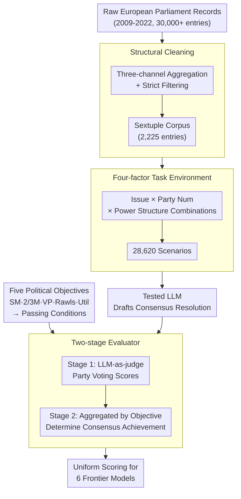

# PoliCon: Evaluating LLMs on Achieving Diverse Political Consensus Objectives

**Conference**: ICLR 2026  
**arXiv**: [2505.19558](https://arxiv.org/abs/2505.19558)

**Code**: Yes  
**Area**: AIGC Detection / LLM Evaluation

**Keywords**: Political consensus, LLM evaluation, European Parliament, Social choice theory, Voting simulation

## TL;DR

The PoliCon benchmark was constructed based on 2,225 high-quality deliberation records from the European Parliament (2009-2022) to evaluate the ability of LLMs to draft consensus resolutions under diverse voting mechanisms, power structures, and political objectives. Results indicate that frontier models perform reasonably well on simple majority tasks but fall significantly short on 2/3 majority and security-related issues.

## Background & Motivation

Building political consensus in a diverse society is a fundamental prerequisite for effective governance. While LLMs have demonstrated potential in facilitating group discussions and supporting democratic deliberation, their ability to achieve various consensus objectives in real-world, complex political scenarios has not been systematically evaluated. Existing political science evaluations focus primarily on stance classification or text analysis, lacking an assessment of the LLM's capability to "find consensus."

PoliCon designs four adjustable factors: (1) political issues and their thematic classification; (2) political objectives (Simple Majority / 2/3 Majority / Veto Power / Rawlsian / Utilitarian); (3) number of participating parties (2/4/6 parties); and (4) seat-based power structures. The combination of these factors generates 28,620 scenarios.

## Method

### Overall Architecture

PoliCon abstracts a political consensus task as "drafting a resolution that can be passed given multi-party stances" and builds an evaluation loop around real-world European Parliament deliberation data. It first performs **structural cleaning** on 13 years of parliamentary records into a sextuple corpus, which is then expanded into tens of thousands of scenarios using a **four-factor task environment**. Tested LLMs draft an open-ended resolution for each scenario, which is finally processed by a **two-stage evaluator**: first simulating votes for each party and then aggregating results based on the conditions of the selected **political objective**. This maps resolutions to comparable scalar scores, providing a unified evaluation for six frontier models.

### Key Designs

**1. Structural cleaning of real deliberation data: Transforming 13 years of parliamentary records into computable sextuples**

Directly evaluating using raw parliamentary records is hindered by noise and missing data. The first step involves organizing data into a uniform format. The authors aggregated 30,698 raw records from the 7th-9th European Parliaments (2009-2022) via the EP official website, HowTheyVote, and VoteWatch Europe. After strict filtering for completed votes and full information, 2,225 records were retained. Each record was structured as a sextuple $(issue, topic, background, stances, resolution, votes)$. DeepSeek-R1 was utilized for background summarization and stance extraction, with rule-based synonym replacement to expand the diversity of stance expressions. For voting, each MEP was matched to their party, and support rates were rounded to integers from 0-9. Issues were categorized into 5 broad and 19 fine-grained categories (e.g., security, economy), enabling difficulty analysis by theme.

**2. Four-factor task environment: Using adjustable knobs to cover the consensus spectrum from easy to difficult**

A single scenario cannot capture the diversity of political consensus. Thus, PoliCon decomposes the task into four independently adjustable factors: political issues (5 major/19 minor categories), political objectives (5 consensus standards), number of participants (2/4/6 parties), and power structure. Power structures are assigned based on a random distribution of seat proportions $w_i$ such that $\sum_{i=1}^{n} w_i = 1$, characterizing differences in influence and exposing potential model biases toward specific parties. With 15 configurations (3 party counts × 5 settings) applied to 2,225 records, 28,620 specific scenarios were generated to provide a systematic range of difficulty.

**3. Five political objectives: Encoding real-world voting rules into decidable passing conditions**

To automatically judge whether "consensus is reached," fuzzy political goals must be converted into clear numerical conditions. The total voting result is weighted by seats: $u = \sum_{i=1}^{n} w_i u_i$ (where $u_i$ is party $p_i$'s 0-9 voting score). Each objective corresponds to a passing rule: Simple Majority (SM) requires $u \geq 5$; 2/3 Majority (2/3M) requires $u \geq 6.67$, corresponding to major decisions like constitutional amendments; Veto Power (VP) requires $u \geq 5$ and $u_k \geq 6$ for a specific key party $k$, analogous to the UN Security Council; Rawlsianism takes $u = \min_{i}(u_i)$ to maximize the benefit of the most disadvantaged party; Utilitarianism takes $u = \sum_{i} u_i$ to maximize total utility. Consequently, free-text resolutions are converged into scalar values for unified comparison.

**4. Social choice theory-based two-stage evaluator: Enabling automatic scoring of open-ended resolutions**

As resolutions are open-ended text without gold labels, a two-stage evaluator ("Simulate Voting, then Aggregate Decision") was developed. The first stage uses an LLM-as-a-judge (GPT-4o-mini backbone) to generate a 0-9 voting score $u_i = \text{JUDGE}(\cdot \mid \text{background}, s_i, \text{resolution})$ for each party, considering consistency with the party's stance and feasibility. The second stage aggregates all scores according to the passing conditions of the chosen political objective to determine if consensus was reached. Validation on approximately 41,800 test samples showed a Pearson correlation of 0.83 between the evaluator and real votes, with a mean error of only 1.61 compared to human annotators (72% of errors within $\pm 1.92$), proving the model-simulated voting is a reliable proxy for real passing rates.

### Loss & Training

PoliCon is an evaluation-only framework and does not involve model training. All tested LLMs generated resolutions using inference settings of temperature=0.7 and top-p=0.95. The evaluator was also called in inference mode.

## Key Experimental Results

### Main Results (6-Party Setting)

| Model | SM | 2/3M | VP | Rawls | Util |
|------|-----|------|-----|-------|------|
| Random | 0.56 | 0.14 | 0.38 | 1.77 | 4.80 |
| Greedy | 0.73 | 0.28 | 0.44 | 1.74 | 4.79 |
| GPT-4o | 0.87 | 0.51 | 0.66 | 2.36 | 5.38 |
| DeepSeek-V3.1 | **0.92** | **0.58** | **0.73** | **2.59** | **5.55** |

### Ablation Study

| Setting | Difficulty Change | Description |
|------|---------|------|
| 2→6 Parties | SM stable, 2/3M drops sharply | More participants make reaching a supermajority harder. |
| Security Issues | Significant drop for all models | Impact of political sensitivity. |
| Dominant Party Bias | Models tend to cater to dominant parties | Rather than forming coalitions with small parties. |

### Key Findings

- All models perform well on Simple Majority (>80%), but performance drops significantly on 2/3 Majority (~40-58%).

- Security and defense issues are the most difficult thematic categories—potentially because safety training of models restricts related outputs.

- LLMs tend to prioritize the stances of parties with the most seats rather than attempting to unite small parties into a coalition, revealing an implicit "power-first" bias in models.

- The Greedy baseline (always choosing the dominant party's stance) is surprisingly effective in certain settings, suggesting that LLM strategies are sometimes no better than simple heuristics.

- Consistency analysis with 20 human annotators confirms the reliability of the evaluation framework.

## Highlights & Insights

- The first benchmark to systematically evaluate the political consensus capabilities of LLMs, featuring a sophisticated design (multi-objective + multi-power structure).

- Reveals implicit political biases in LLMs: a tendency to cater to powerful parties rather than seeking genuine compromise.

- The evaluation framework based on social choice theory provides an actionable solution for assessing open-ended political tasks.

## Limitations & Future Work

- Based exclusively on European Parliament data; performance under different political systems remains to be evaluated.

- The voting simulation evaluator (GPT-4o-mini) may possess its own biases.

- Real-world political negotiations involve dynamic processes such as compromises and quid pro quo, whereas this study is currently limited to single-round generation.

## Related Work & Insights

- Complementary to the group consensus work by Tessler et al. (2024), but focuses on more formal political scenarios.

- Extensible to other collective decision-making evaluation scenarios, such as corporate decision-making or community governance.

## Rating

- Novelty: ⭐⭐⭐⭐ First benchmark for political consensus evaluation.

- Experimental Thoroughness: ⭐⭐⭐⭐ 6 models + multiple settings + human validation.

- Writing Quality: ⭐⭐⭐⭐ Clear structure.

- Value: ⭐⭐⭐⭐ Insightful for AI governance.

<!-- RELATED:START -->

## Related Papers

- [\[ACL 2026\] mdok-style at SemEval-2026 Task 10: Finetuning LLMs for Conspiracy Detection](../../ACL2026/aigc_detection/mdok-style_at_semeval-2026_task_10_finetuning_llms_for_conspiracy_detection.md)
- [\[NeurIPS 2025\] ASCIIBench: Evaluating Language-Model-Based Understanding of Visually-Oriented Text](../../NeurIPS2025/aigc_detection/asciibench_evaluating_language-model-based_understanding_of_visually-oriented_te.md)
- [\[NeurIPS 2025\] Can LLMs Write Faithfully? An Agent-Based Evaluation of LLM-generated Islamic Content](../../NeurIPS2025/aigc_detection/can_llms_write_faithfully_an_agent-based_evaluation_of_llm-generated_islamic_con.md)
- [\[ACL 2026\] From Scoring to Explanations: Evaluating SHAP and LLM Rationales for Rubric-based Teaching Quality Assessment](../../ACL2026/aigc_detection/from_scoring_to_explanations_evaluating_shap_and_llm_rationales_for_rubric-based.md)
- [\[ACL 2026\] Who Wrote This Line? Evaluating the Detection of LLM-Generated Classical Chinese Poetry](../../ACL2026/aigc_detection/who_wrote_this_line_evaluating_the_detection_of_llm-generated_classical_chinese_.md)

<!-- RELATED:END -->
