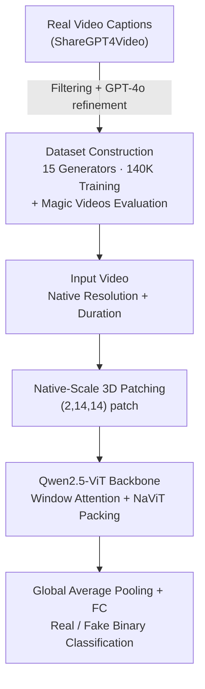

# Preserving Forgery Artifacts: AI-Generated Video Detection at Native Scale

**Conference**: ICLR 2026  
**OpenReview**: [https://openreview.net/forum?id=XD43lfRCg6](https://openreview.net/forum?id=XD43lfRCg6)  
**Code**: https://github.com/mgiant/Qwen2.5ViT-AIGVDetection  
**Area**: AI-Generated Content Detection / Video Understanding  
**Keywords**: AI-Generated Video Detection, Native Resolution, Forgery Artifacts, Qwen2.5-ViT, Dataset Construction

## TL;DR
Addressing the issue where existing AI-generated video detectors destroy critical forgery artifacts by scaling or cropping input frames to a fixed low resolution (e.g., 224×224), this paper proposes a "native-scale" detection framework. Based on Qwen2.5-VL, the visual Transformer directly processes videos at arbitrary original resolutions and durations. The work also constructs a 140k training set covering 15 generators and a high-fidelity benchmark, Magic Videos, achieving new SOTA results across multiple benchmarks.

## Background & Motivation
**Background**: As diffusion and DiT-based video generation models like Sora, Wan, and Kling approach photorealism, detecting AI-generated videos has become essential for combating misinformation. Existing detectors mostly follow the image forgery detection paradigm: resizing or cropping each frame to a fixed low resolution (typically 224×224) before feeding them into CNN, CLIP-ViT, or TimeSformer backbones for binary classification.

**Limitations of Prior Work**: Forgery detection relies on two types of cues: **subtle local artifacts** (pixel-level high-frequency patterns) and **global semantic inconsistencies**. Fixed-resolution preprocessing is destructive to both: resizing alters the original aspect ratio, forcing the detector to learn "surface distribution differences" rather than generalizable forgery features; cropping discards global semantic content outside the selection; and both resizing and cropping involve downsampling that erases pixel-level high-frequency artifacts crucial for identifying synthetic content.

**Key Challenge**: Through cross-generator validation experiments (Fig. 1), the authors uncovered two empirical rules. First, detector performance drops significantly when evaluated on videos with **different resolutions** from the training set—indicating that existing methods rely heavily on surface statistics like resolution. Second, detection performance correlates strongly with **generator quality** (VBench scores) (Pearson ρ=0.86)—more realistic generators provide more transferable training data. These points suggest that fixed-resolution preprocessing and outdated low-quality datasets are the root causes of poor generalization.

**Goal**: To build a unified detection framework robust to both resolution drift and generator differences, supported by modernized, high-quality, and diverse data.

**Key Insight**: Since preprocessing is the culprit, the paper proposes to **eliminate fixed downsampling** and allow the model to natively handle videos of any spatial resolution and temporal length, fully preserving high-frequency artifacts and spatio-temporal inconsistencies. The visual Transformer of Qwen2.5-VL naturally supports variable resolution and duration inputs, making it an ideal backbone.

**Core Idea**: Replace "fixed-resolution preprocessing" with "native-scale processing" to preserve forgery artifacts, and train on high-quality data from 15 of the latest generators to achieve strong cross-generator generalization.

## Method

### Overall Architecture
The contribution of this paper is twofold: **Data side**—constructing a training set of approximately 140k videos covering 15 advanced generators and the Magic Videos benchmark for ultra-realistic synthetic content; **Model side**—a native-resolution detection framework based on Qwen2.5-ViT. Input videos are neither resized nor cropped; they undergo 3D patchify and are processed by the Transformer, followed by a lightweight classification head for "real/fake" output.

### Key Designs

**1. Native-Scale 3D Patching: Preserving High-Frequency Artifacts without Scaling or Cropping**

This design directly addresses the core pain point where fixed-resolution preprocessing erases forgery artifacts. Traditional ViTs resize each frame to 224×224 before patching. Ours follows the Qwen2.5-VL approach, partitioning the input video tensor $V \in \mathbb{R}^{T \times H \times W \times C}$ into **non-overlapping 3D patches** of size $(P_t, P_h, P_w) = (2, 14, 14)$, followed by a linear projection $E$ to obtain embedding sequences:

$$X^{(0)} = \text{Unfold}(V; P_t, P_h, P_w)^{T} \cdot E$$

The key is "native"—patching occurs at the **original resolution and duration** without resizing or padding, maintaining the aspect ratio. This ensures pixel-level texture artifacts and inter-frame temporal inconsistencies are preserved at the patch level rather than being averaged out during downsampling. Extending patching to the temporal dimension ($P_t=2$) allows the model to capture video-specific temporal artifacts.

**2. Qwen2.5-ViT Backbone + High-Resolution Efficiency: Fidelity and Efficiency for Variable Inputs**

Preserving native resolution would normally cause a quadratic explosion in attention complexity; thus, backend optimizations are crucial. Qwen2.5-ViT consists of 32 Transformer layers using pre-norm (RMSNorm), SwiGLU activation, and **2D Rotary Positional Embedding (RoPE)** for cross-resolution extrapolation:

$$\hat{X}^{(l)} = X^{(l-1)} + \text{Attention}(\text{RMSNorm}(X^{(l-1)})), \quad X^{(l)} = \hat{X}^{(l)} + \text{FFN}_{\text{SwiGLU}}(\text{RMSNorm}(X^{(l-1)}))$$

To manage high-resolution computational costs, three optimizations are integrated: **batch packing** inspired by NaViT to handle variable-length sequences without padding; **Flash Attention** for sequence boundary awareness; and hybrid attention—using 112×112 window attention in most layers to achieve **linear** rather than quadratic complexity scaling with patch count.

**3. Lightweight Classification Head + Three Fine-Tuning Strategies**

The classification head is simple: output tokens from the last Transformer layer undergo **global average pooling** to produce a fixed-dimension feature vector, followed by a fully connected layer for "real/generated" logits. Three fine-tuning strategies were compared: **Full Finetuning** (joint training), **Linear-Probing** (frozen backbone), and **PEFT/LoRA**. Full finetuning performed best, indicating that forgery detection requires backbone features to adapt to the task.

**4. Modernized Dataset Construction: Aligning Training and Evaluation with SOTA Realism**

Recognizing that detection performance is proportional to generator quality, the training set aggregates data from VBench, Movie Gen models, and various commercial models (70K real + 70K fake). The **Magic Videos** benchmark focuses on high-realism scenes like landscapes and human interactions. It uses GPT-4o to refine ShareGPT4Video captions to under 500 characters, which are then used to generate videos using 6 frontier generators (Wan2.1, Hailuo, etc.). This ensures both training and evaluation reflect current AIGC realism levels.

### Loss & Training
The model is trained using Binary Cross-Entropy (BCE) loss for 5 epochs with AdamW. The learning rate is $1\times10^{-5}$ for full finetuning and $1\times10^{-4}$ for PEFT. Frames are scaled within a pixel budget (min_pixels, max_pixels) while maintaining aspect ratio, tested at ranges (224×224, 720×720) and (224×224, 448×448). Temporal sampling uses 2 fps, with $T=8$ frames for both training and evaluation.

## Key Experimental Results

### Main Results
Performance (mACC) on Magic Videos (test) and Movie Gen (val) across different generators:

| Method | Training Data | mACC | mAP |
|------|---------|------|-----|
| RINE† | ldm | 49.47 | 46.00 |
| Effort† | SD 1.4 | 62.79 | 78.60 |
| NPR | 15Model-140K | 71.74 | 88.82 |
| X-CLIP-L/14 | 15Model-140K | 80.63 | 94.39 |
| Moon-ViT | 15Model-140K | 76.60 | 89.66 |
| **Qwen2.5-ViT (Ours)** | 15Model-140K | **83.20** | 93.28 |

Cross-dataset generalization (zero-shot transfer):

| Benchmark | Metric | Ours | Runner-up |
|------|------|------|------|
| DVF-Test | AUC | **97.6** | 95.4 (TimeSformer) |
| GenVideo-Val | Overall ACC | **96.64** | 96.14 (DeMamba-CLIP) |
| DeepTraceReward | ACC | **97.2** | 92.9 (GPT-4.1) |

On DeepTraceReward, Ours (97.2%) significantly exceeds GPT-5 (90.7%) and Gemini 2.5 Pro (84.3%), showing no overfitting to the training generators.

### Ablation Study
Ablation on spatial resolution, temporal frames, and fine-tuning (Magic and GenVideo Avg ACC).

| Dimension | Configuration | Magic | GenVideo | Avg |
|------|------|-------|----------|-----|
| Spatial | random crop 224p | 62.62 | 93.50 | 78.06 |
| Spatial | random resize 224p | 73.69 | 95.52 | 84.61 |
| Spatial | dynamic [224p,448p] | 81.19 | 96.01 | 88.60 |
| Spatial | dynamic [224p,720p] | 83.20 | 96.64 | **89.92** |
| Temporal | T=2 | 71.15 | 94.70 | 82.93 |
| Temporal | T=8 | 81.19 | 96.01 | **88.60** |
| Fine-tuning | LP | 70.60 | 91.91 | 81.26 |
| Fine-tuning | LoRA(r=16) | 78.73 | 94.95 | 86.84 |
| Fine-tuning | full | 81.19 | 96.01 | **88.60** |

### Key Findings
- **Native resolution is the primary performance driver**: Moving from crop 224p (78.06) to dynamic [224p, 720p] (89.92) shows progressive improvement, primarily on high-res Magic Videos (+20.6 ACC).
- **More frames help**: T=2 to T=8 improves Magic ACC from 71.15 to 81.19.
- **Full Finetuning > LoRA > LP**: Forgery detection requires backbone adaptation; LP shows significant performance drops.
- **Image detectors fail on video**: RINE and Effort perform poorly even when trained on video, highlighting the fundamental difference between image and video artifacts.

## Highlights & Insights
- **"Removing preprocessing" as a method**: While others design complex modules, this work identifies fixed-resolution preprocessing as the bottleneck and recovers lost high-frequency cues through native-scale processing.
- **Instructive empirical rules**: The findings that resolution mismatch hurts performance and generator quality correlates with transferability (ρ=0.86) provide evidence for future dataset selection.
- **Engineering enables native-scale**: NaViT packing, Flash Attention, and window attention turn native-resolution processing from a theory into a trainable framework.
- **Simultaneous modernization of data and models**: Magic Videos avoids over-optimism on outdated data by using the latest generators, serving as a valuable asset for the community.

## Limitations & Future Work
- **Backbone dependency**: Based on the 32-layer Qwen2.5-ViT, inference costs remain high compared to lightweight CNNs, posing challenges for real-time large-scale auditing.
- **Generalization boundaries**: While successful on current generators, performance against future architectures (e.g., advanced autoregressive long-video models) remains an open question.
- **Real video sources**: Training data mostly comes from MSVD/Kinetics/Panda-70M; further analysis is needed on whether dataset bias is mistaken for forgery cues.
- **Robustness limits**: Native-scale advantages may diminish under heavy compression (JPEG/H264), which naturally wipes out high-frequency artifacts.

## Related Work & Insights
- **vs. Image Forgery Detection (NPR / Effort)**: These rely on fixed resolutions and lack temporal awareness; Ours leads significantly by using 3D patching and native scale.
- **vs. Deepfake Detection (F3Net / TALL)**: These focus on facial manipulation; Ours detects general spatio-temporal artifacts with broader coverage.
- **vs. VLM-based Detection (MM-Det / GPT-5)**: General VLMs have limited zero-shot accuracy; specifically fine-tuned Qwen2.5-ViT shows that specialized training is still indispensable.
- **vs. Moon-ViT / DeMamba**: Ours outperforms DeMamba despite having 15x less training data, emphasizing that data quality and native-scale processing are more critical than sheer volume.

## Rating
- Novelty: ⭐⭐⭐⭐ Identifying preprocessing as the bottleneck is insightful; the framework architecture relies heavily on Qwen2.5-VL components.
- Experimental Thoroughness: ⭐⭐⭐⭐⭐ Comprehensive benchmarks, ablations, and robustness tests with extensive comparisons.
- Writing Quality: ⭐⭐⭐⭐ Logically driven by empirical rules; some technical details are slightly fragmented.
- Value: ⭐⭐⭐⭐⭐ Significant practical value to the detection community through both the framework and the Magic Videos dataset.

## Related Papers

- [\[ICLR 2026\] Unveiling Perceptual Artifacts: A Fine-Grained Benchmark for Interpretable AI-Generated Image Detection](unveiling_perceptual_artifacts_a_fine-grained_benchmark_for_interpretable_ai-gen.md)
- [\[ICLR 2026\] No Pixel Left Behind: A Detail-Preserving Architecture for Robust High-Resolution AI-Generated Image Detection](no_pixel_left_behind_a_detail-preserving_architecture_for_robust_high-resolution.md)
- [\[CVPR 2026\] Learning Forgery-Aware Lip Representations Without Forgery Priors](../../CVPR2026/aigc_detection/learning_forgery-aware_lip_representations_without_forgery_priors.md)
- [\[ICLR 2026\] RelayFormer: A Unified Local-Global Attention Framework for Scalable Image and Video Manipulation Localization](relayformer_a_unified_local-global_attention_framework_for_scalable_image_and_vi.md)
- [\[ICLR 2026\] FakeXplain: AI-Generated Image Detection via Human-Aligned Grounded Reasoning](fakexplain_ai-generated_image_detection_via_human-aligned_grounded_reasoning.md)

<!-- RELATED:END -->

<!-- RELATED:START -->

## Related Papers

- [\[ICLR 2026\] No Pixel Left Behind: A Detail-Preserving Architecture for Robust High-Resolution AI-Generated Image Detection](no_pixel_left_behind_a_detail-preserving_architecture_for_robust_high-resolution.md)
- [\[ICLR 2026\] Unveiling Perceptual Artifacts: A Fine-Grained Benchmark for Interpretable AI-Generated Image Detection](unveiling_perceptual_artifacts_a_fine-grained_benchmark_for_interpretable_ai-gen.md)
- [\[ICLR 2026\] Exploring Specular Reflection Inconsistency for Generalizable Face Forgery Detection](exploring_specular_reflection_inconsistency_for_generalizable_face_forgery_detec.md)
- [\[ICLR 2026\] RelayFormer: A Unified Local-Global Attention Framework for Scalable Image and Video Manipulation Localization](relayformer_a_unified_local-global_attention_framework_for_scalable_image_and_vi.md)
- [\[ICLR 2026\] Semantic Visual Anomaly Detection and Reasoning in AI-Generated Images](semantic_visual_anomaly_detection_and_reasoning_in_ai-generated_images.md)

<!-- RELATED:END -->
