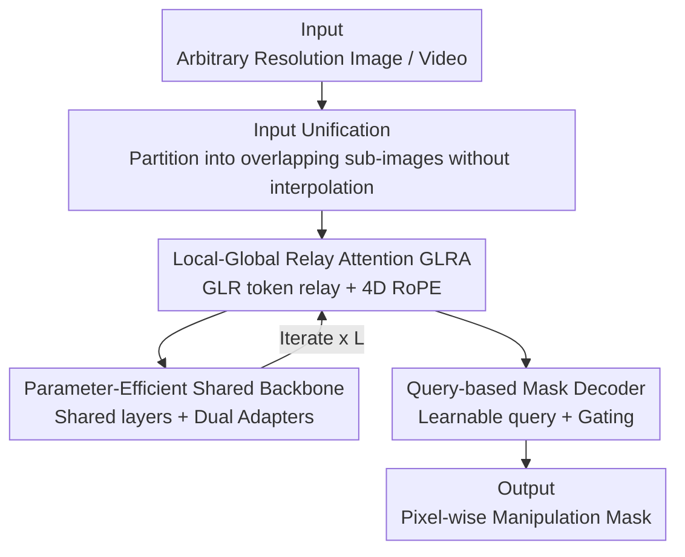

# RelayFormer: A Unified Local-Global Attention Framework for Scalable Image and Video Manipulation Localization

**Conference**: ICLR 2026  
**OpenReview**: [https://openreview.net/forum?id=e61YQdLIam](https://openreview.net/forum?id=e61YQdLIam)  
**Code**: https://github.com/WenOOI/RelayFormer  
**Area**: AIGC Detection / Manipulation Localization / Efficient Attention  
**Keywords**: Visual manipulation localization, local-global relay attention, resolution adaptation, unified image-video modeling, parameter efficient

## TL;DR
RelayFormer partitions images/videos of arbitrary resolutions into fixed-size sub-images and utilizes a small set of [GLR] relay tokens to propagate scene-level global consistency cues across sub-images. Without interpolation or dense full-resolution attention, this unified architecture achieves SOTA performance on both image and video manipulation localization benchmarks, with FLOPs that scale dynamically with the input.

## Background & Motivation

**Background**: Visual Manipulation Localization (VML) aims to precisely delineate pixel regions tampered with via splicing, copy-move, or inpainting, serving as a fundamental task in digital forensics. Common practices involve resizing or padding inputs to a fixed resolution (e.g., 512×512 or 1024×1024) before feeding them into high-resolution ViTs or multi-scale CNN-Transformer hybrid networks to predict masks.

**Limitations of Prior Work**: The authors highlight two specific issues. First, **resolution diversity**: real-world content ranges from 256×256 to 4K, and forensic evidence relies precisely on low-level subtle traces like noise and compression residuals—interpolation directly erases these traces, while padding to a large canvas introduces heavy redundant computation. Furthermore, uniform resizing severely distorts non-standard aspect ratios (e.g., 9:19.5). Second, the **modeling gap between images and videos**: image models lack temporal cues, while video models generalize poorly to single images, forcing practitioners to maintain two separate models, which doubles the cost.

**Key Challenge**: Tampered regions are often small and visually inconspicuous (requiring fine-grained local sensitivity), yet reliable judgment depends on scene-level global consistency (e.g., matching illumination, source regions in copy-move, or inter-frame coherence). While dense global attention can theoretically capture these dependencies, it is computationally prohibitive for high-resolution content.

**Key Insight**: The authors observe that global cues required for forensics are actually **coarse-grained**—reflecting scene-level patterns (lighting, object semantics, temporal continuity) rather than pixel-to-pixel exact correspondences. Since global information only needs "sparse but effective propagation," there is no need to pay the premium for dense attention.

**Core Idea**: A small set of learnable **Global-Local Relay (GLR) tokens** is used as an "information bottleneck." They absorb local evidence during local attention and exchange compressed semantics with GLR tokens from other sub-images during global attention, before injecting the enriched context back into their respective sub-images. This structured global-local relay replaces expensive full-resolution dense attention.

## Method

### Overall Architecture

RelayFormer is a modular unified framework that takes images of arbitrary resolution or videos of arbitrary length as input and outputs pixel-wise manipulation masks. The pipeline consists of three stages: first, the input is partitioned into overlapping fixed-size sub-images **without interpolation** (Input Unification), flattening both images and videos into the same "sub-image batch." Second, GLRA modules perform local attention within sub-images and relay-based global attention between sub-images using GLR tokens across iterative layers. Finally, a lightweight query-based mask decoder transforms the feature maps into masks. The key design lies in the dynamic allocation of computation based on the number of sub-images (input resolution), while global information flows only through minimal GLR tokens, enabling scalability to high resolutions and natural extension from static images to temporal videos.

### Key Designs

**1. Input Unification: Flattening Images and Videos into Atomic Units using Overlapping Sub-images**

This step addresses both "resolution diversity" and the "dual-model" issue. For an image $x\in\mathbb{R}^{C\times H_{img}\times W_{img}}$, the authors use a sliding window of size $H_p\times W_p$ and strides $S_h, S_w$ to partition it into slightly overlapping sub-images. The number of sub-images per dimension is $N_h=\lfloor (H_{img}-H_p)/S_h\rfloor+1$ and $N_w=\lfloor (W_{img}-W_p)/S_w\rfloor+1$, with padding applied only at boundaries. This **avoids redundant computation and interpolation**, preserving low-level forensic traces. For a video $x\in\mathbb{R}^{T\times C\times H_{vid}\times W_{vid}}$, the batch and temporal dimensions are merged, and each frame is partitioned similarly. All sub-images—whether from images or videos—are concatenated into a large batch of shape $(B_{total}, C, H_p, W_p)$, where $B_{total}=\sum_{img}N_{img}+\sum_{vid}T\cdot N_{vid}$. Consequently, during subsequent local modeling, the model **does not distinguish whether the input is an image or video**; each sub-image is an independent sample ready for batch processing. This unified representation is the foundation for a "single architecture for all" approach.

**2. Local-Global Relay Attention (GLRA): Sparse Global Propagation via GLR Token Bottlenecks**

This is the core of the paper, addressing the conflict between "global consistency and dense attention costs." For each sub-image $U_i$, patch tokens $X_i$ are obtained via ViT patch embedding and concatenated with a small set of learnable GLR tokens $T_i\in\mathbb{R}^{m\times d}$ (where $m=2$ is optimal). **Local Perception Attention** performs self-attention within the sub-image $[T_i^{(l)}, X_i^{(l)}] = \mathrm{SelfAttn}_{local}([T_i^{(l-1)}; X_i^{(l-1)}])$, where GLR tokens relay global information from previous layers to local patches while absorbing new local evidence. **Relay Global Attention** then aggregates GLR tokens from all sub-images $T_{flat} = \mathrm{Concat}_{j=1}^{N_i} T_j$, performs cross-sub-image self-attention $T_{updated} = \mathrm{SelfAttn}_{global}(\mathrm{RoPE4D}(T_{flat}))$, and redistributes them back to their sub-images. This local $\leftrightarrow$ global iteration ensures that global attention occurs only on $N_i \cdot m$ tokens (rather than all patches), minimizing computation while propagating scene-level consistency. To support extrapolation to unseen resolutions or durations, **4D RoPE** is applied to each GLR token by splitting the hidden dimension into $[x_T, x_{id}, x_H, x_W, x_{rem}]$ groups, each receiving standard 1D RoPE independently ($\theta_i=10000^{-2i/d_g}$).

**3. Parameter-Efficient Shared Backbone + Dual Adapters: One Layer, Dual Functions**

While using independent Transformer layers for local and global attention is intuitive, it doubles parameters. Sharing identical weights often degrades performance due to conflicting objectives (local needs fine-grained details, global needs long-range context). The authors hypothesize that while functions differ, the underlying computation structures are shared. Thus, they retain a **single shared Transformer backbone** and attach lightweight adaptation modules (LoRA or Adapter) for local and global tasks respectively. The shared backbone learns general base features, while the local adapter learns residual transforms for fine-grained patterns and the global adapter focuses on long-range contextual reasoning. This achieves the representational power of a two-layer model while keeping parameters only slightly higher than a single-layer baseline (Relay-ViT adds only +2.36M, Relay-Seg adds +2.39M).

**4. Query-based Mask Decoder: Avoiding New Bottlenecks**

After partitioning, feature maps are reorganized as $F\in\mathbb{R}^{H_f\times W_f\times d}$. To prevent heavy decoding from offsetting computational savings, a query-based decoder inspired by Mask2Former is used. Features are projected to a lower dimension $\tilde F$ and interact with a set of learnable queries $Q\in\mathbb{R}^{M_f\times d}$. Each layer performs cross-attention $Q^{(k)'} = \mathrm{CrossAttn}(Q^{(k-1)}, \tilde F)$ followed by self-attention with RoPE $Q^{(k)} = \mathrm{SelfAttn}(\mathrm{RoPE}(Q^{(k)'}))$. Finally, a gated MLP assigns weights to each query to modulate its contribution to the final mask. Ablation shows that replacing a naive MLP head with this decoder increases average F1 from 0.521 to 0.532.

### Loss & Training

Following IML-ViT, BCE loss and edge loss are employed: $L = L_{BCE}(P, M) + \lambda \cdot L_{Edge}(P \odot M_e, M \odot M_e)$, where $P$ is the predicted mask, $M$ is the ground truth, and $M_e$ is the edge mask. The edge loss emphasizes boundary accuracy by recomputing BCE strictly on edge regions. Implementations use ViT and SegFormer backbones (Relay-ViT / Relay-Seg), $n=2$ GLR tokens, 512×512 sub-images for images, 256×256 sub-images for videos, and a clip length of 4. Training uses AdamW with cosine decay for 200 epochs.

## Key Experimental Results

### Main Results

Image Manipulation Localization (Protocol-MVSS, trained on CASIAv2, tested on others), pixel-level F1 (threshold 0.5):

| Method | COVERAGE | Columbia | NIST16 | CASIAv1 | IMD2020 | Average |
|--------|----------|----------|--------|---------|---------|---------|
| TruFor | 0.419 | 0.865 | 0.311 | 0.721 | 0.317 | 0.527 |
| IML-ViT | 0.438 | 0.747 | 0.269 | 0.718 | 0.328 | 0.500 |
| SparseViT | 0.287 | 0.781 | 0.245 | 0.646 | 0.230 | 0.438 |
| **Relay-ViT** | 0.551 | 0.762 | 0.335 | 0.740 | 0.381 | **0.554** |
| **Relay-Seg** | 0.569 | 0.756 | 0.273 | 0.760 | 0.357 | 0.543 |

Video Manipulation Localization (trained on DAVIS, tested on three types of inpainting in MOSE), IoU/F1:

| Method | MOSE100 | E2FGVI | STTN |
|--------|---------|--------|------|
| TruVIL | 0.521/0.674 | 0.557/0.699 | 0.462/0.612 |
| ViLocal | 0.485/0.620 | 0.597/0.721 | 0.393/0.524 |
| **Relay-ViT** | 0.552/0.689 | 0.561/0.695 | **0.549/0.684** |
| **Relay-Seg** | **0.561/0.698** | 0.554/0.692 | 0.534/0.674 |

Efficiency (Table 3): Relay-Seg utilizes only 45.90+2.39M parameters. GFLOPs scale dynamically between 52.7, 105.4, and 210.8 for $N=1, 2, 4$ sub-images, significantly lower than IML-ViT's 576.78 GFLOPs (fixed 1024×1024 input).

### Ablation Study

GLR token quantity and decoder (average F1 of five benchmarks, Table 5):

| n (GLR tokens) | Decoder | Avg F1 | Note |
|----------------|---------|--------|------|
| 0 | - | 0.454 | No GLRA module (Pure local) |
| 1 | - | 0.521 | Added 1 GLR token |
| 1 | ✓ | 0.532 | Switched to Query Decoder |
| **2** | ✓ | **0.554** | Full model, optimal |
| 3 | ✓ | 0.524 | Token redundancy leads to drop |

GLRA Spatial-Temporal Ablation (MOSE100, Table 6): Pure local F1=0.6124; + Spatial Global $\rightarrow$ 0.6745; + Temporal Global $\rightarrow$ 0.6877. Impact of Interpolation (IMD2020, Table 7): No resize (2958×4437) F1=0.453, while forcing a resize to 1024×1024 drops F1 to 0.350.

### Key Findings
- **GLRA is the primary performance driver**: Average F1 increases by 0.10 from n=0 (0.454) to n=2 (0.554), proving that global cues propagated by minimal GLR tokens provide the largest gain—though more tokens are not better (n=3 drops to 0.524).
- **Interpolation is a forensic adversary**: Table 7 shows that forcing a resize on high-resolution images causes F1 to plummet from 0.453 to 0.350, validating the necessity of "interpolation-free partitioning."
- **Asymmetric transfer between modalities**: Unified training experiments (Table 4) show that adding video forgery data yields negligible gains for images (due to limited diversity/quality), but high-quality image forgery data significantly enhances video detection for shared manipulation types. No cross-benefit is observed when manipulation types are non-overlapping.

## Highlights & Insights
- **Reinterpreting Global Attention as an "Information Bottleneck"**: Compressing global consistency requirements into minimal GLR tokens is a precise engineering realization of the observation that "forensic global cues are inherently coarse-grained." This is not a rough sparsification just to save compute, but a task-oriented design. This relay paradigm could transfer to other tasks that involve "local detail sensitivity + global consistency + varying resolutions" (e.g., medical segmentation or remote sensing).
- **Shared Backbone + Dual Adapters**: Using a single set of weights with lightweight adapters to handle functionally conflicting local and global attention is a clever application of parameter efficiency, packing the expressiveness of "two layers" into the footprint of "nearly one."
- **Sub-image Partitioning for Modality Unification**: Merging the temporal dimension into the batch and treating all sub-images equally effectively bridges the architectural gap between images and videos.

## Limitations & Future Work
- **Reliance on Video Data Quality**: The authors acknowledge that current video manipulation datasets lack diversity and annotation precision, leading to minimal video-to-image transfer gains.
- **Sub-image Hyperparameters**: Strides and sub-image sizes require manual tuning; no adaptive policy is provided. While GFLOPs are low, the actual parallel scheduling overhead for a high number of sub-images is not fully discussed.
- **Sufficiency of Global Information**: Whether 2 GLR tokens are sufficient for manipulation types requiring precise long-range correspondences (e.g., large-scale copy-move matching between distant regions) remains to be tested under pressure.

## Related Work & Insights
- **vs IML-ViT**: IML-ViT proved high-res ViTs with edge supervision are effective but suffer from high memory costs (576 GFLOPs). RelayFormer adopts the edge loss but uses GLR relaying to shift global attention from all patches to minimal tokens, allowing dynamic compute allocation.
- **vs SparseViT / FOCAL**: These methods reduce compute via sparse attention, but they "prune connections uniformly." RelayFormer focuses on task-guided global propagation and dynamic scaling based on resolution.
- **vs TruVIL / ViLocal (Video)**: These utilize contrastive learning or dense temporal sampling, often resulting in high compute and video-specific architectures. RelayFormer outperforms them on STTN inpainting tasks while maintaining a single unified architecture.

## Rating
- Novelty: ⭐⭐⭐⭐ The combination of GLR token relay, shared backbone dual adapters, and 4D RoPE is a novel and self-consistent design for forensic scenarios.
- Experimental Thoroughness: ⭐⭐⭐⭐ Covers multiple image/video benchmarks, dual protocols, and detailed ablation/efficiency analyses.
- Writing Quality: ⭐⭐⭐⭐ Clear motivation, complete visualizations, and well-explained components.
- Value: ⭐⭐⭐⭐ Strong practical utility through unified image-video forensics and resolution adaptation.

<!-- RELATED:START -->

## Related Papers

- [\[ICLR 2026\] Omni-IML: Towards Unified Interpretable Image Manipulation Localization](omni-iml_towards_unified_interpretable_image_manipulation_localization.md)
- [\[ICLR 2026\] Preserving Forgery Artifacts: AI-Generated Video Detection at Native Scale](preserving_forgery_artifacts_ai-generated_video_detection_at_native_scale.md)
- [\[ICLR 2026\] A Rich Knowledge Space for Scalable Deepfake Detection](a_rich_knowledge_space_for_scalable_deepfake_detection.md)
- [\[ICLR 2026\] Attack-Resistant Watermarking for AIGC Image Forensics via Diffusion-based Semantic Deflection](attack-resistant_watermarking_for_aigc_image_forensics_via_diffusion-based_seman.md)
- [\[ICLR 2026\] Unveiling Perceptual Artifacts: A Fine-Grained Benchmark for Interpretable AI-Generated Image Detection](unveiling_perceptual_artifacts_a_fine-grained_benchmark_for_interpretable_ai-gen.md)

<!-- RELATED:END -->
