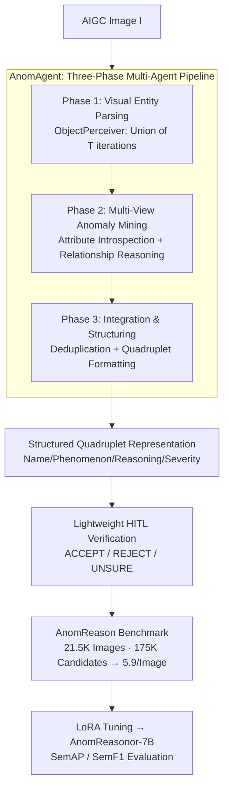

# Semantic Visual Anomaly Detection and Reasoning in AI-Generated Images

**Conference**: ICLR 2026  
**OpenReview**: [https://openreview.net/forum?id=0iN4UKZwgn](https://openreview.net/forum?id=0iN4UKZwgn)  
**Code**: https://github.com/chuangchuangtan/Semantic-Visual-Anomaly-Detection-and-Reasoning  
**Area**: AIGC Detection / Multimodal VLM / Explainable Deepfake  
**Keywords**: Semantic Anomaly Detection, AIGC Forensics, Multi-agent Annotation, Structured Reasoning, Explainable Deepfake

## TL;DR
Focusing on "looks real but defies logic" semantic anomalies in AI-generated images (violating physics, common sense, or anatomy), this paper formalizes the task of "detection + explanation + scoring." By utilizing the multi-agent pipeline AnomAgent and lightweight human verification, the authors curate the AnomReason benchmark with 21.5K images and hundreds of thousands of structured quadruplet annotations. They propose semantic matching metrics SemAP/SemF1; the fine-tuned AnomReasonor-7B outperforms all open-source VLMs in semantic detection, approaching the performance of GPT-4o.

## Background & Motivation

**Background**: Generative models like Stable Diffusion, Midjourney, and Flux can now synthesize photo-realistic images. Consequently, AIGC forensics and Deepfake detection have become a pressing need. Most existing forensic methods focus on **low-level forgery cues**—frequency-domain statistical artifacts, repetitive textures, and inconsistent lighting or shadows—to distinguish real from fake.

**Limitations of Prior Work**: These low-level cues have two major drawbacks. First, they are **invisible to humans**: they represent subtle statistical traces decoupled from human judgment of image credibility. Second, they **provide labels without reasons**: models output "real/fake" or "suspicious region" but fail to explain "what is wrong, why it is wrong, and how severe it is." The real source of distrust in AIGC often stems from "semantic absurdities" visible at a glance: a soccer ball merged with a football, a climber suspended in air violating gravity, inconsistent mirror reflections, or a person with three arms. Traditional forensics fail to capture such content-level anomalies.

**Key Challenge**: Semantic anomalies are essentially "violations of common sense, physics, or logic," requiring **scene understanding and reasoning** rather than statistical pixel fitting. However, existing benchmarks (e.g., FakeClue, Ivy-Fake) only provide coarse labels or scattered clues, lacking structured annotations to support "object-attribute-relationship" level reasoning. Consequently, models trained on them can neither perform fine-grained reasoning nor provide severity assessments.

**Goal**: To decompose the problem into three goals: (i) formalizing "semantic visual anomaly detection and reasoning" as an evaluatable task; (ii) creating a large-scale benchmark with structured annotations; (iii) designing evaluation metrics that measure "semantic matching" rather than literal matching.

**Key Insight**: The authors observe that semantic anomalies are naturally **object-centric**—anomalies stem either from contradictions in an individual object's attributes (material, shape, function) or from irrational relationships between objects (spatial, interactive, physical). Therefore, instead of asking a single large LLM to output all anomalies at once (which is prone to hallucination and uncontrollable), it is better to **mimic the human perception-reasoning process** by decomposing the task among multiple specialized collaborative agents.

**Core Idea**: Define anomalies using "structured quadruplets (Name, Phenomenon, Reasoning, Severity)" and produce these annotations at scale using a **phased multi-agent pipeline + lightweight human verification**. This upgrades AIGC forensics from "judging real/fake" to "clearly explaining what is unrealistic, why, and how severe."

## Method

### Overall Architecture

The system aims to solve: given an AIGC image $I$, output a set of structured anomalies $A=\{(y_i,o_i,r_i,v_i)\}_{i=1}^m$, where $y_i$ is the anomaly name, $o_i$ is the phenomenon description, $r_i$ is the reasoning for the anomaly, and $v_i\in[0,100]$ is the severity score (0 for completely irrational, 100 for completely realistic). The authors specifically require the model to score severity and justify it, as "arguing the severity" forces the model into deeper reasoning, yielding richer descriptions.

The annotation pipeline **AnomAgent** is a modular multi-agent framework that breaks anomaly discovery into three serial phases: **Phase 1: Visual Entity Parsing** extracts all objects; **Phase 2: Multi-view Anomaly Mining** performs attribute introspection and relationship reasoning per object to generate candidates; **Phase 3: Integration and Structuring** performs deduplication and normalization into quadruplets. Candidates produced by the pipeline undergo **lightweight HITL (Human-in-the-Loop) verification** to filter hallucinations, resulting in the AnomReason benchmark. Finally, AnomReasonor-7B is LoRA-tuned on this benchmark and evaluated using SemAP/SemF1 metrics.

### Key Designs

**1. Structured Quadruplet Representation: Redefining "Detection" as "Explainable Semantic Assessment"**

The fundamental contribution is task formalization. It represents each anomaly as a quadruplet $(y,o,r,v)$: Name (a one-sentence summary), Phenomenon (detailed semantic description of "what is wrong"), Reasoning (explaining "why this violates common sense/physics"), and Severity Score $v\in[0,100]$ (quantifying "how unrealistic"). This directly addresses the "labels without reasons" pain point. Compared to coarse labels in FakeClue/Ivy-Fake, the quadruplet grounds anomalies at the **object-attribute-relationship** levels, making analysis both explainable and machine-readable. Forcing the model to output severity scores justifies the reasoning chain rather than providing post-hoc rationalizations.

**2. AnomAgent Multi-Agent Pipeline: Mimicking Human Perception-Reasoning via Division of Labor**

To automatically produce high-quality quadruplets at scale, a monolithic LLM prompt is both hallucination-prone and uncontrollable. AnomAgent decomposes this into three phases. **Phase 1 (Visual Entity Parsing)** involves an ObjectPerceiver extracting all semantic objects, focusing on humans; since objects in AIGC are often entangled or distorted, detections are repeated $T$ times with different prompts and unionized: $O=\bigcup_{t=1}^{T} O^{(t)}$. **Phase 2 (Multi-view Anomaly Mining)** performs dual complementary analyses for each object $o_i$: AttributeAnalyzer performs **intra-object attribute analysis** for internal contradictions (shape/material/function), yielding $C^{(i)}_{\text{attr}}$; RelationReasoner performs **inter-object relationship reasoning**, using the object’s own attribute anomalies as context priors to evaluate spatial/semantic interactions with the rest of the scene, $C^{(i)}_{\text{rel}}$. Both agents use a two-step "broad identification followed by itemized verification" method to reduce hallucinations and false negatives. **Phase 3 (Integration and Structuring)** uses AnomalyIntegrator to merge redundant candidates and remove noise, followed by AnomalyFormatter to map entries to standard quadruplets.

**3. Lightweight HITL Verification: Maximizing Credibility with Minimum Cost**

Purely automated generation leaves hallucinations, while purely manual annotation cannot scale. The authors add a **single-choice** human verification step: for each candidate $a$, annotators answer "Is this structured description correct for this image?" (ACCEPT/REJECT/UNSURE). Only $A_{\text{final}}=\{a\in A: h(a)=1\}$ is retained. This low-cost protocol successfully filters hallucinations: after HITL, valid annotations per image dropped from ~8 to 5.9, and the severity distribution shifted left (tending toward lower scores), indicating a more refined and focused semantic grounding. This hybrid strategy enabled a benchmark of 21,539 images and 174,872 candidates (consuming ~4.17 billion GPT-4o tokens during construction).

**4. SemAP / SemF1 Metrics: Evaluating "Semantic Meaning" Over "Literal Similarity"**

Semantic anomalies are open-ended text. The authors propose structural-aware metrics based on BERTScore. For the Phenomenon ($o$) and Reasoning ($r$) fields of each quadruplet, BERTScore calculates similarity with the ground truth across three views: Phe, Rea, and Full (merged). One-to-one anomaly matching is performed at the image level with similarity thresholds $\tau\in\{0.7,0.8,0.9\}$. Calculating P/R curves yields $\text{SemAP}_v$ and $\text{SemF1}_v$. For Deepfake applications, they introduce a **classification-aware** variant (CSemAP/CSemF1): explanations only receive points if the real/fake classification is correct, suppressing "lucky guesses with fabricated reasons."

## Key Experimental Results

### Main Results: AnomReason Semantic Anomaly Detection and Reasoning

Evaluated on the AnomReason test set (10,774 images) against over ten VLMs. AnomReasonor-7B (AR-7B) was LoRA-tuned on Qwen2.5-VL-7B. Most off-the-shelf VLMs had SemAP$_{\text{Full}}$ below 0.42, showing limited semantic understanding without targeted supervision.

| Model | SemAP$_{\text{Full}}$ | SemAP$_{\text{Rea}}$ | SemF1$_{\text{Full}}$ | SemF1$_{\text{Rea}}$ |
|------|------|------|------|------|
| Qwen2.5-VL-72B (Best Open-source) | 0.4568 | 0.4353 | 0.4104 | 0.3912 |
| GPT-4o (Strongest Closed-source) | 0.4727 | 0.4562 | **0.5109** | 0.4930 |
| **AnomReasonor-7B (Ours)** | **0.5162** | **0.5130** | 0.5009 | **0.4977** |

AR-7B achieves new SOTA on all SemAP metrics, **systematically outperforming GPT-4o's SemAP**. While GPT-4o is slightly better in SemF1 (0.5109 vs 0.5009), AR-7B takes the lead in reasoning quality SemF1$_{\text{Rea}}$ (0.4977 vs 0.4930). Note: most models are better at "Observation (Phe)" than "Reasoning (Rea)"—e.g., InternVL3-8B had a gap of 0.4552 vs 0.3676—confirming that identifying "what is wrong" is easier than explaining "why." AR-7B bridges this gap.

### Main Results: Explainable Deepfake Detection

On AnomReason-Deepfake (real images from LAION/reLAION-HR), models were assessed on classification accuracy (Acc) and classification-aware explanation.

| Model | Acc(%) | CSemAP$_{\text{Rea}}$ | CSemF1$_{\text{Rea}}$ |
|------|------|------|------|
| Qwen2.5-VL-72B | 77.60 | 0.2337 | 0.2159 |
| GPT-4o | **87.76** | 0.3487 | 0.3770 |
| **AnomReasonor-7B** | 82.61 | **0.3574** | **0.3929** |

AR-7B's accuracy (82.61%) is lower than GPT-4o's, but it surpasses GPT-4o in causal explanation metrics (CSemAP$_{\text{Rea}}$, CSemF1$_{\text{Rea}}$), proving that semantic reasoning provides **orthogonal and complementary** signals to traditional Deepfake detection.

### Key Findings
- **Structured supervision is key to aligning observation and reasoning**: Without it, VLMs can "see" but not "speak." AR-7B, at only 7B scale with LoRA (rank 8, frozen visual encoder), approaches hundred-billion closed-source systems.
- **HITL purification is effective**: Reduction from ~8 to 5.9 annotations per image and the left-shift in severity proves it removes hallucinations rather than random entries.
- **Generator "Semantic Physicals" reveal new differences**: Using AR-7B/AnomAgent as a "reviewer" to rank 15 T2I models (lower MAI/AF/CAP is better) shows HunyuanImage-2.1 and OmniGen V2 have the lowest CAP. High perceptual quality does not equal high semantic rationality.

## Highlights & Insights
- **Upgrading forensics from "Pixel Detective" to "Logical Editor"**: Statistical artifacts will eventually be erased by better generators, but semantic flaws violating physics are harder to eliminate and are human-perceptible.
- **"Forced self-justification" via Severity**: Requiring the model to argue severity acts as a structural prompt that elicits deeper reasoning chains.
- **Cost-effective Multi-agent + Single-choice HITL**: Reducing annotator workload to yes/no questions allows massive scale without sacrificing quality.
- **Mutual validation of AR-7B and AnomAgent**: Small-model fine-tuning (with human preference) and zero-shot agents align highly in ranking generators, suggesting the agent can be used for scalable zero-shot auditing.

## Limitations & Future Work
- The dataset is moderate in scale and limited to static images; future work will expand to video.
- The pipeline depends on external APIs (GPT-4o), making it vulnerable to model updates; HITL involves subjective judgment.
- Evaluation relies on BERTScore semantic similarity, which is influenced by biases in the text encoder.
- Severity scores $v$ are self-assessed by the VLM and lack independent human ground truth anchors for calibration.

## Related Work & Insights
- **vs. FakeClue / Ivy-Fake**: Those benchmarks focus on binary classification or artifact clues. This work models anomalies at the object-attribute-relationship level with structured reasoning.
- **vs. Direct Monolithic LLM Annotation**: This work's multi-agent cooperation + HITL is more consistent, scalable, and produces fewer hallucinations.
- **vs. Traditional AIGC Quality Assessment (CLIP, Perceptual Quality)**: Those methods ignore scene-level semantic rationality; this work fills the gap regarding physical and common sense logic.

## Rating
- Novelty: ⭐⭐⭐⭐⭐ Redefining AIGC forensics as semantic "detection+explanation+scoring" with a complete task/benchmark/metric suite.
- Experimental Thoroughness: ⭐⭐⭐⭐⭐ Extensive VLM cross-comparison, Deepfake applications, and a "physical" for 15 generators.
- Writing Quality: ⭐⭐⭐⭐ Motivations and pipelines are clear; some metric definitions could be more detailed.
- Value: ⭐⭐⭐⭐⭐ Open-sourcing the components provides reusable infrastructure for explainable AIGC forensics.

<!-- RELATED:START -->

## Related Papers

- [\[CVPR 2026\] Locate-Then-Examine: Grounded Region Reasoning Improves Detection of AI-Generated Images](../../CVPR2026/aigc_detection/locate-then-examine_grounded_region_reasoning_improves_detection_of_ai-generated.md)
- [\[ICLR 2026\] FakeXplain: AI-Generated Image Detection via Human-Aligned Grounded Reasoning](fakexplain_ai-generated_image_detection_via_human-aligned_grounded_reasoning.md)
- [\[ICLR 2026\] Attack-Resistant Watermarking for AIGC Image Forensics via Diffusion-based Semantic Deflection](attack-resistant_watermarking_for_aigc_image_forensics_via_diffusion-based_seman.md)
- [\[CVPR 2026\] Enabling Supervised Learning of Generative Signatures for Generalized AI-Generated Images Detection](../../CVPR2026/aigc_detection/enabling_supervised_learning_of_generative_signatures_for_generalized_ai-generat.md)
- [\[ICLR 2026\] Preserving Forgery Artifacts: AI-Generated Video Detection at Native Scale](preserving_forgery_artifacts_ai-generated_video_detection_at_native_scale.md)

<!-- RELATED:END -->
