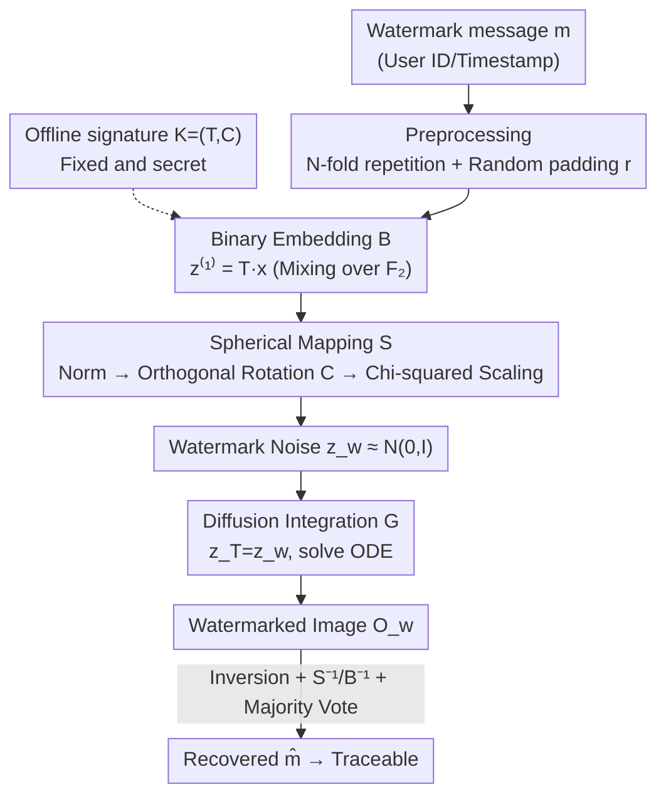

# Spherical Watermark: Encryption-Free, Lossless Watermarking for Diffusion Models

**Conference**: ICLR 2026  
**OpenReview**: [https://openreview.net/forum?id=2eAGrunxVz](https://openreview.net/forum?id=2eAGrunxVz)  
**Code**: None  
**Area**: AIGC Detection / Diffusion Model Watermarking / Content Provenance  
**Keywords**: Lossless Watermarking, Diffusion Models, Spherical Mapping, Content Provenance, Encryption-Free  

## TL;DR
This paper proposes Spherical Watermark: an encryption-free, lossless watermarking framework for diffusion models. It mixes binary watermarks into high-entropy codes, which are then precisely transformed into standard Gaussian noise via "projection to the unit sphere → orthogonal rotation → Chi-squared radius scaling" to serve as the initial noise. This method requires no weight modification or per-image key storage, outperforming both lossy and lossless baselines in fidelity, provenance accuracy, computational efficiency, and robustness against attacks.

## Background & Motivation

**Background**: The proliferation of AIGC images highlights the need for provenance and copyright protection. Digital watermarking is a primary solution. While traditional spatial/frequency domain methods or decoder fine-tuning can embed identifiers, they often alter the generative distribution and degrade image quality. Recent "lossless watermarking" approaches avoid modifying pre-trained models by reversibly mapping watermark bits to standard Gaussian noise in the latent space as the source.

**Limitations of Prior Work**: Existing lossless schemes have significant drawbacks. Gaussian Shading uses repetition codes with stream cipher sampling but requires storing a unique key and nonce for **every image**, making key management prohibitive in real-world deployments; using a fixed key sacrifices true losslessness. PRC Watermark employs fixed-key pseudo-random error-correcting codes, eliminating per-image keys but introducing heavy cryptographic components: the encoding and belief propagation decoding stages are computationally expensive (extracting is ~$10^4$ times slower), require fine-tuning for code rates and error correction, and hit an irreducible error floor under strong attacks or distribution shifts.

**Key Challenge**: Achieving losslessness (indistinguishability between watermark noise and standard Gaussian noise), key-free management, and strong robustness simultaneously. Existing methods sacrifice efficiency or robustness for one of the others.

**Goal**: Design a pair of latent space Embed/Extract functions such that the watermark noise $z_w$ is computationally indistinguishable from standard Gaussian noise $z\sim\mathcal{N}(0,I_{l_x})$ (lossless/undetectable), while ensuring the watermark can be recovered from the inspected image via inversion with negligible error (traceable), without relying on per-image keys or heavy cryptography.

**Key Insight**: The authors leverage a geometric fact: a standard multivariate Gaussian vector can be decomposed as $n = r\cdot u$, where the radius squared $r^2\sim\chi^2(l_x)$ and the direction $u$ is uniformly distributed on the unit sphere, with the two being independent. If discrete watermark bits can be constructed into directions that are "approximately uniform on the sphere" and then scaled by the Chi-squared radius, they can be **precisely** transformed into Gaussian noise. This process is purely linear algebraic, reversible, and requires no cryptography.

**Core Idea**: Use "Binary Mixing + Spherical Mapping" instead of "Keys/Error-Correcting Codes" to transform watermark bits into Gaussian noise. Undetectability is guaranteed by the statistical properties of spherical 3-designs, while per-image keys are eliminated by a fixed signature matrix $(T,C)$.

## Method

### Overall Architecture
The workflow establishes a provenance mechanism from the model developer's perspective, divided into an **offline construction phase** and an **online execution phase**. Offline, the developer generates a fixed and secret "signature" $\mathcal{K}=(T,C)$—a set of reversible transformations to encode any binary watermark into diffusion model noise. Online, when the API receives a generation request, it embeds the user-bound watermark $m$ (e.g., user ID) into the latent code using the same signature before feeding it into the model. For detection, the developer performs inversion on the suspicious image to extract the watermark.

Embedding is completed via three serial reversible modules: **Binary Embedding Module $\mathcal{B}$** (performing $z^{(1)}=Tx$ over $\mathbb{F}_2$) → **Spherical Mapping Module $\mathcal{S}$** (Normalization → Rotation → Chi-squared scaling to restore Gaussian noise $z_w$) → **Diffusion Integration Module $\mathcal{G}$** (using $z_w$ as initial noise $z_T$ to generate images via ODE). Extraction reverses the order as $\mathcal{G}^{-1}, \mathcal{S}^{-1}, \mathcal{B}^{-1}$, followed by a majority vote over $N$ repeated bits.

### Key Designs

**1. Binary Embedding & Offline Signature: Mixing watermarks with padding via fixed matrices for key-free high-entropy codes**
To be lossless, watermark noise must be statistically similar to random Gaussian noise. Since watermarks have structure, direct mapping would expose correlations. The authors preprocess the watermark into $x=[m\,m\cdots m\,r]^\top\in\{0,1\}^{l_x}$, repeating blocks $N$ times and appending random padding $r\sim\text{Bernoulli}(1/2)$. The developer constructs a fixed signature $\mathcal{K}=(T,C)$. The embedding matrix $T=\begin{pmatrix}I_{l_{Nm}} & R\\ 0 & I_{l_r}\end{pmatrix}$ uses a sparse binary block $R$ to inject padding randomness into watermark bits. Algorithm 1 ensures each watermark bit is mixed with **disjoint** padding subsets; row sparsity $s$ controls the intensity. The result (Theorem 3.1) is that each bit of $z^{(1)}=Tx$ is $\text{Bernoulli}(1/2)$ and achieves **2-wise and 3-wise independence**. $T$ is self-inverse over $\mathbb{F}_2$ ($T^{-1}=T$).

**2. Spherical Mapping: Mapping discrete binary codes to Gaussian noise via spherical 3-designs**
This is the core of the paper. Given $z^{(1)}\in\{0,1\}^{l_x}$, it is first mapped to $\pm1$ as $v=2z^{(1)}-1$, normalized to the unit sphere as $z^{(2)}=v/\|v\|_2$, then multiplied by an orthogonal rotation matrix $z^{(3)}=Cz^{(2)}$, and finally scaled by radius $r$ ($r^2\sim\chi^2(l_x)$) to get $z_w=r\,z^{(3)}$. Since $z^{(1)}$ is 3-wise independent, each coordinate of $z^{(2)}$ is equiprobably $\pm1/\sqrt{l_x}$, forming a **spherical 3-design** (Theorem 3.2)—meaning its polynomial moments match the uniform spherical distribution up to degree 3. Orthogonal rotation preserves this property, and coordinates converge to $\mathcal{N}(0,1/l_x)$ as $l_x\to\infty$ (Lemma 3.3). By Gaussian polar decomposition $n=r\cdot u$, the resulting $z_w\approx\mathcal{N}(0,I_{l_x})$.

**3. Diffusion Integration & Extraction: Noise-as-noise with majority voting**
$z_w$ is treated as the initial noise $z_T=z_w$. The image is generated by solving the probability flow ODE from $t=T$ to $t=0$. Extraction uses the VAE encoder to estimate $\hat z_0$, then DDIM inversion with a null prompt from $t=0$ to $t=T$ to get $\hat z_T$. Following the inverse steps $\hat z^{(2)}=C^{-1}\hat z_T$, $\hat z^{(1)}=\text{round}((\hat z^{(2)}+1)/2)$, and $\hat x=T^{-1}\hat z^{(1)}$, **majority voting** is applied to the $N$ bit copies to recover the final $\hat m$, suppressing inversion and attack errors.

### Loss & Training
The method requires no network training and does not modify diffusion weights—there is no loss function. The signature $(T,C)$ is constructed once offline. Default configuration: $N=31$, $l_m=512$, $l_r=512$, $s=1$, matching the $4\times64\times64$ latent dimension of SD.

## Key Experimental Results

### Main Results
Tested on Stable Diffusion v1.5 / v2.1 with 512-bit watermarks.

**Fidelity (FID, lower is better, COCO/SDP context)**:

| Method | COCO·v1.5 | COCO·v2.1 | SDP·v1.5 | SDP·v2.1 |
|------|-----------|-----------|----------|----------|
| Original | 48.13 | 46.81 | 49.70 | 46.41 |
| Gaussian Shading | 50.70 | 49.44 | 51.52 | 48.25 |
| PRC Watermark | 48.13 | 46.75 | 49.53 | 46.42 |
| **Ours** | **48.12** | **46.81** | **49.39** | **46.43** |

Only PRC and Ours closely match the Original FID; other methods introduce measurable distribution shifts.

**Accuracy (COCO, SD v2.1, ACC / TPR@1%FPR)**:

| Method | ACC(Clean) | ACC(Post.) | ACC(Adv.) | TPR(Adv.) |
|------|-----------|-----------|-----------|-----------|
| Gaussian Shading | 100.00 | 98.43 | 88.06 | 99.23 |
| PRC Watermark | 100.00 | 93.52 | 97.69 | 95.38 |
| **Ours** | 99.99 | 95.02 | **98.12** | **99.83** |

Ours achieves >95% accuracy in clean/post-processing scenarios and significantly outperforms lossy methods (Gaussian Shading) under adversarial attacks by >10%.

### Ablation Study

| Configuration | Phenomenon | Explanation |
|------|------|------|
| Full ($\mathcal{B}$+$\mathcal{S}$) | Latent detection ~50%, robust to brightness attacks | Complete model |
| w/o $\mathcal{B}$ | Latent noise becomes **trivially separable** | Binary mixing provides independence |
| w/o $\mathcal{S}$ | Robustness to brightness adjustments **plummets** | Spherical mapping is key to restoration robustness |

### Key Findings
- **Undetectability**: Detectors (MLP on latents, ResNet-18 on images) easily identify Tree-Ring (100%) and fixed-key Gaussian Shading (97%), while Ours and PRC remain near 50% (random guess).
- **Efficiency**: Extraction is ~$10^4$ times faster than PRC due to the lack of belief propagation decoding.
- **Capacity**: Ours maintains high detection rates across the full capacity range, unlike PRC which fails for $l_m > 2000$.

## Highlights & Insights
- **Geometry over Cryptography**: Reframing the "watermark-to-noise" problem as creating uniform directions on a sphere using spherical $t$-designs.
- **3-wise Independence is the Bridge**: Algorithm 1 perfectly aligns the repetition code with the requirements of spherical 3-designs to achieve provable indistinguishability.
- **Transferable Insight**: The "direction × radius" polar decomposition can be extended to hide metadata in any generative model with Gaussian/spherical latent priors.

## Limitations & Future Work
- **Robustness Trade-off with $s$**: Compared to Gaussian Shading, the parameter $s$ necessitates a trade-off between undetectability and attack resistance in some post-processing scenarios.
- **Dependency on Inversion Quality**: Accuracy depends on DDIM inversion fidelity; strong distribution shifts or non-linear samplers may be a bottleneck.
- **Signature Security**: Secrecy of $\mathcal{K}=(T,C)$ is a prerequisite; defense against signature leakage or spatial geometric attacks (cropping/rotation) remains unexplored.

## Related Work & Insights
- **vs. Gaussian Shading**: Both are lossless. However, Gaussian Shading requires per-image keys; Ours uses a fixed signature matrix that maintains losslessness even when fixed, with higher adversarial robustness.
- **vs. PRC Watermark**: Both use fixed keys. PRC relies on heavy cryptographic decoding (slow, capacity-limited); Ours uses linear algebra (fast, high capacity).
- **vs. Tree-Ring/RingID**: These embed frequency patterns limited to "presence" detection; Ours supports 512-bit user-level provenance and is statistically undetectable.

## Rating
- Novelty: ⭐⭐⭐⭐⭐ Uses spherical $t$-designs and polar decomposition to reframe lossless watermarking as geometry.
- Experimental Thoroughness: ⭐⭐⭐⭐ Covers fidelity, undetectability, and efficiency, though some geometric attacks are less emphasized.
- Writing Quality: ⭐⭐⭐⭐ Clear theoretical chain and modular description.
- Value: ⭐⭐⭐⭐⭐ Achieves losslessness, high efficiency, and robustness simultaneously—highly valuable for AIGC provenance.

<!-- RELATED:START -->

## Related Papers

- [\[ICLR 2026\] Attack-Resistant Watermarking for AIGC Image Forensics via Diffusion-based Semantic Deflection](attack-resistant_watermarking_for_aigc_image_forensics_via_diffusion-based_seman.md)
- [\[ICML 2026\] Generating Robust Portfolios of Optimization Models using Large Language Models](../../ICML2026/aigc_detection/generating_robust_portfolios_of_optimization_models_using_large_language_models.md)
- [\[CVPR 2026\] NOWA: Null-space Optical Watermark for Invisible Capture Fingerprinting and Tamper Localization](../../CVPR2026/aigc_detection/nowa_null-space_optical_watermark_for_invisible_capture_fingerprinting_and_tampe.md)
- [\[ICML 2026\] Deep Residual Injection for Full-Spectrum Forensic Signal Perception in Multimodal Large Language Models](../../ICML2026/aigc_detection/deep_residual_injection_for_full-spectrum_forensic_signal_perception_in_multimod.md)
- [\[CVPR 2025\] Enhancing Few-Shot Class-Incremental Learning via Training-Free Bi-Level Modality Calibration](../../CVPR2025/aigc_detection/enhancing_few-shot_class-incremental_learning_via_training-free_bi-level_modalit.md)

<!-- RELATED:END -->
