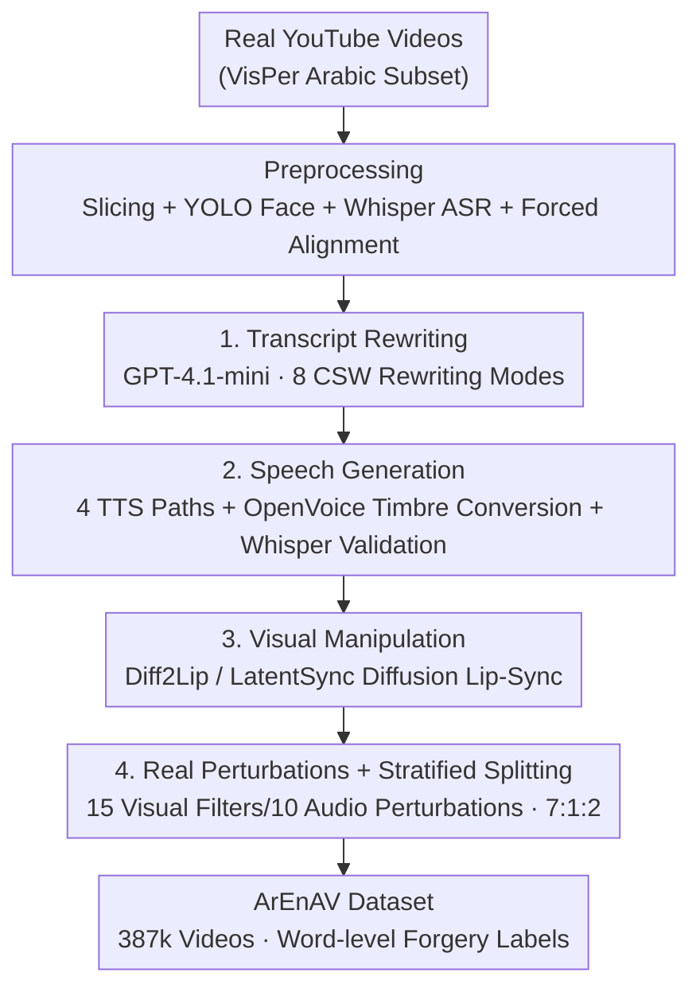

# Tell me Habibi, is it Real or Fake?

**Conference**: ICLR 2026  
**OpenReview**: [https://openreview.net/forum?id=EbrPXZTVJ9](https://openreview.net/forum?id=EbrPXZTVJ9)  
**Code**: Dataset public (as stated in the paper; refer to the original text for specific links)  
**Area**: AIGC Detection / Audio-Visual Deepfake / Dataset & Benchmark  
**Keywords**: Deepfake Detection, Arabic-English Code-Switching, Audio-Visual Dataset, Temporal Localization, Multilingual

## TL;DR
This paper introduces **ArEnAV**, the first large-scale audio-visual deepfake dataset targeting "Arabic-English intra-sentential code-switching (CSW)" (387k videos, 765+ hours). Utilizing an integrated generation pipeline with 4 TTS paths and 2 lip-sync models, the authors perform "content-driven" semantic manipulation of real YouTube videos. They systematically demonstrate that existing SOTA detection/localization models and human evaluators almost entirely fail in these multilingual, code-switching scenarios.

## Background & Motivation

**Background**: The vast majority of datasets and methods in deepfake detection are "monolingual + monomodal"—either modifying only video (FaceSwap/Face2Face, e.g., FaceForensics++, DFDC) or only audio (TTS/VC, e.g., ASVspoof, WaveFake). More recently, joint audio-visual manipulation datasets like FakeAVCeleb and AV-Deepfake1M have emerged. While multilingual datasets have appeared (PolyGlotFake covering 7 languages, Illusion covering 26), their non-English data volume remains small, and **each individual sample remains monolingual**.

**Limitations of Prior Work**: In the real world, bilingual speakers frequently switch languages **within the same sentence** (intra-sentential code-switching). This is particularly prevalent in the Arabic-speaking world—ZAEBUC-Spoken corpora show approximately 19% of spoken sentences contain CSW, with an average of 44% being English words; in the ArzEn corpus, 63% of sentences involve CSW. This is further compounded by "diglossia" in Arabic, where Modern Standard Arabic (MSA) coexists with national dialects (Egyptian, Levantine, Gulf). Existing detection models are trained almost exclusively on monolingual data and misinterpret "natural prosodic shifts during language switching" as fake artifacts.

**Key Challenge**: Code-switching serves as both a "noise source" for detection (natural language/prosody jumps mimicking forgeries) and a "hiding spot" for attackers (manipulations on English words are harder to detect). However, **no dataset characterizes audio-visual deepfakes with intra-sentential code-switching**, leaving this real-world threat completely unstudied and unbenchmarked.

**Goal**: Construct the first Arabic-English intra-sentential CSW audio-visual deepfake dataset, covering both bilingual switching and diglossic switching (MSA $\leftrightarrow$ Dialect), and systematically characterize the difficulty it poses for existing models and humans.

**Key Insight**: Rather than generating fake faces from scratch, it is more effective to **retain the identity and environment of the original video and only manipulate "what was said"**. This involves using LLMs for content-driven transcript rewriting, followed by audio and lip-sync adjustments to match the new text. This ensures the forgery points are precisely aligned with words and naturally incorporate code-switching, closely mimicking real-world abuse scenarios (misinformation, taking quotes out of context).

**Core Idea**: Utilize a three-stage pipeline consisting of "Transcript Rewriting $\rightarrow$ Speech Synthesis $\rightarrow$ Lip Re-rendering" to transform real videos into **word-level, code-switched, audio-visually consistent** fake samples, thereby constructing a dataset and benchmark.

## Method

### Overall Architecture
The core of ArEnAV is a **content-driven data generation pipeline**: the input is real YouTube Arabic video, and the output is an audio-visual deepfake sample with word-level forgery interval annotations. Following data collection and preprocessing (slicing, face detection, ASR transcription, and forced alignment for word-level timestamps), the process enters three generation stages: ① Using GPT-4.1-mini to rewrite transcripts according to 8 rules (injecting semantic changes + code-switching); ② Synthesizing audio for the new text while preserving the original speaker's timbre; ③ Re-rendering lip movements using diffusion lip-sync models to match the new audio. Finally, real-world scene perturbations are added, and the data is split into train/val/test using a 7:1:2 stratified ratio.

Forgeries follow three strategies: **Fake Audio + Fake Video** (both synthesized), **Fake Audio + Real Video** (audio modified to inject anti-semantic/CSW content), and **Real Audio + Fake Video** (original audio kept, only lips re-rendered).

### Key Designs

**1. Eight-Mode Transcript Rewriting: Using LLMs to Precisely Inject "Semantic Manipulation + Code-Switching" at the Word Level**

This step addresses the difficulty of making forgeries both "meaning-altering" and "naturally code-switched" while remaining controllable and scalable. The authors defined **8 transcript rewriting modes** using GPT-4.1-mini, covering both code-switched and monolingual Arabic contexts, categorized into three main operations: *meaning only* (changing word meaning, language remains same), *meaning + dialect* (changing meaning and switching to another Arabic variant, e.g., MSA or Dialect), and *meaning + translation* (changing meaning and translating to English, i.e., creating CSW). For example, changing "We create hope" to "We create fun." Using 15-shot prompting, the model spontaneously generated 94.6% substitutions, 5.1% insertions, and 0.3% deletions.

To ensure rewriting **truly changes semantics without breaking fluency**, the authors quantified quality using two metrics: **Bidirectional Entailment Quality Mean**, which averages NLI entailment scores for Real $\rightarrow$ Fake and Fake $\rightarrow$ Real directions ($1.0$ indicates total entailment, $0.0$ indicates direct contradiction). Results showed many samples fell below the $0.5$ threshold or even into the contradiction zone, confirming semantic shifts. **Perplexity** was evaluated using Jais-3B and Qwen-2.5-7B; the minimal difference between real and fake transcript perplexity indicates that the generated text remains natural. This balance of "significant content change, surface fluency" is a prerequisite for high-quality audio-visual forgeries.

**2. Four-Path TTS + Timbre Conversion + ASR Loopback Validation: Cross-Lingual Zero-Shot Voice Cloning**

This addresses the weakness of common zero-shot voice cloning (like YourTTS) in Arabic phonology and cross-lingual synthesis. The authors designed **four targeted cloning strategies**: (a) XTTS-v2 for native multilingual zero-shot TTS supporting Arabic/English/CSW; (b) XTTS-v2 + OpenVoice-v2, where synthesis is followed by speaker conversion to improve fidelity when reference samples are limited; (c) Fairseq Arabic TTS + OpenVoice-v2, specialized for monolingual Arabic; (d) GPT-TTS + OpenVoice-v2, where a voice is randomly sampled from 29 timbres and converted to the target speaker.

The critical quality gate is the **Generation-Validation Loop**: for insertions/substitutions, the entire sentence is re-synthesized and transcribed using Whisper-Turbo to require a **word-for-word match** with the target text; for deletions, audio segments are removed, leaving only background noise. After editing, the loudness of the manipulated segment is normalized and recombined with environmental noise. This ensures intelligibility and accurate timestamp alignment—audio metrics achieved SECS $0.990$ and FAD $0.140$, nearing AV-Deepfake1M quality.

**3. Diffusion Lip Re-rendering + Real Perturbations: Making Visual Forgeries High-Quality and Resistant to "Splicing Artifact" Cheating**

On the visual side, the authors address the weakness of early lip-sync models, which allowed detectors to "cheat" by identifying low-level splice artifacts rather than understanding content. After repeated experiments, the authors selected two **diffusion-based zero-shot lip-sync models, Diff2Lip and LatentSync**, to re-render faces matching the new audio. Replacement/insertion operations generate fake frames for new words, while deletions generate closed-lip (silent) frames. Visual metrics reached PSNR $37.70$, SSIM $0.971$, and FID $0.68$, close to the strongest AV-Deepfake1M results. Spectral analysis (BA-TFD+) confirmed **no energy spikes or discontinuities** at edit boundaries, proving the forgery difficulty stems from the content itself rather than splicing artifacts.

Furthermore, to mimic real streaming media, the authors added **local perturbations** to both real and fake videos: 15 visual filters (e.g., salt-and-pepper noise, lens shake) and 10 audio treatments (e.g., time stretching, random loudness, pitch shift). Each video randomly samples 1–3 visual and 1–2 audio perturbations. This prevents detectors from distinguishing real from fake based on "image quality differences," forcing them to address content-level manipulation.

### A Complete Example
Using an Arabic-English code-switching video as an example: The original sentence "...the topic of deepfake detection is very important" is sliced, faces are detected by YOLO, an Arabic transcript is generated via Whisper-v2, and wav2vec2 forced alignment provides timestamps for each word (including the English "deepfake detection"). GPT-4.1-mini, using Mode 7 (monolingual Arabic $\rightarrow$ meaning change + translate to English), changes an Arabic word and replaces it with an English word, creating a CSW point and a semantic flip. XTTS-v2 synthesizes this segment using the original speaker's voice, Whisper-Turbo validates the word-for-word match, and it is spliced back into the original track with loudness normalization. LatentSync re-renders the lip movements for those frames. Finally, a lens shake filter is applied. The result is a sample with **real audio background + local fake audio and lips, with the forgery interval precisely labeled on that specific English word**—exactly the type of forgery humans find most difficult to identify (85% miss rate on English words).

## Key Experimental Results

### Main Results: Existing SOTA Nearly Collapse on ArEnAV
Dataset scale and quality (compared with multilingual datasets):

| Dataset | Total Videos | Arabic Videos | CSW Videos | Multilingual | Code-Switching |
| :--- | :--- | :--- | :--- | :--- | :--- |
| PolyGlotFake | 15,238 | 1,403 | 0 | ✓ | ✗ |
| Illusion | 1,376,371 | Minimal | 0 | ✓ | ✗ |
| **ArEnAV (Ours)** | **387,072** | **287,280** | **99,792** | ✓ | **✓** |

Audio-Visual Temporal Localization (AP@0.5, higher is better)—cross-dataset comparisons highlight generalization collapse:

| Method | LAV-DF | AV-1M | **ArEnAV** |
| :--- | :--- | :--- | :--- |
| BA-TFD | 79.15 | 37.37 | **2.42** |
| BA-TFD+ | 96.30 | 44.42 | **3.74** |

Deepfake Detection (AUC, higher is better); image-based models relying only on video-level labels perform close to random guessing ($\approx$50%):

| Setting | Method | Modality | Fullset AUC |
| :--- | :--- | :--- | :--- |
| Zero-Shot (AV-1M) | BA-TFD | AV | 61.73 |
| Trained on ArEnAV | Xception (frame) | V | 74.21 |
| Trained on ArEnAV | XLSR-Mamba | A | 73.00 |
| AV-1M + ArEnAV Fine-tuning | BA-TFD | AV | 75.91 |
| **AV-1M + ArEnAV Fine-tuning** | **BA-TFD+** | **AV** | **79.97 (Best)** |

Cross-dataset detection (AUC): SOTA detectors performing excellently on FF++/CelebDF/DFDC collapse to $\approx$ 50% random guessing on ArEnAV:

| Method | Conference | ArEnAV | DFDC | FF++ |
| :--- | :--- | :--- | :--- | :--- |
| Face-X-Ray | CVPR-20 | 55.56 | 80.92 | 98.52 |
| LipForensics | CVPR-21 | 49.76 | 73.50 | 97.10 |
| LAA-Net | CVPR-24 | 50.04 | 86.94 | 99.96 |
| ForensicsAdaptor | CVPR-25 | 50.58 | 88.70 | – |

### Human Study
19 participants (15 native Arabic speakers) judged 20 videos. **Human detection accuracy was only 60%**, and localization was even harder (AP@0.5 of only $0.79$). When manipulation occurred on **English words**, **85% of humans missed it**—attributed to higher-quality English voice cloning and the fact that prosody naturally fluctuates during code-switching. Reasons given for "fake" judgments: Intelligibility issues (36.5%), Lip-audio desync (25.1%), Audio sounding fake (24.7%), while "Video looks fake" accounted for only 8.7% (indicating high-quality diffusion lip-sync).

### Key Findings
- **Root Cause of Collapse is Content, Not Artifacts**: Moving BA-TFD/BA-TFD+ from AV-1M to ArEnAV caused AP@0.5 to plummet by 35%+; qualitative analysis shows no spectral discontinuities at boundaries, proving difficulty stems from "linguistically precise" intra-sentential CSW manipulation rather than splicing marks.
- **Models Misidentify Real CSW as Fake**: BA-TFD+ frequently predicted real Arabic/English switching intervals as fake, indicating it cannot distinguish "natural language switching" from "synthetic inconsistency."
- **Longer Forgery Intervals are Harder**: The average length of fake segments in ArEnAV is 2.1x that of AV-1M (relative length), corroborating that performance drops are due to intrinsic difficulty.
- **Modality Specificity**: XLSR-Mamba performs better on the audio-only subset (A) but significantly worse on code-switched audio compared to pure Arabic; image-based models are stronger on the video-only subset (V).

## Highlights & Insights
- **Turning "Code-Switching" from a Linguistic Phenomenon to a Deepfake Attack Surface**: The authors astutely point out that intra-sentential switching is both detection noise and an attack hiding spot, proving that human miss rates reach 85% on English-word manipulations—a perspective previously overlooked.
- **Reusable Generation Paradigm of Content-Driven + ASR Word-Loop Validation**: Rewriting transcripts with LLMs, re-synthesizing with TTS, and using Whisper for word-for-word validation provides a "generate-verify" closed loop that ensures precise word-level timestamps, transferable to any language.
- **Proactively Eliminating "Cheating Shortcuts" via Diffusion Lips + Perturbations**: Deliberately adding perturbations to both real/fake videos and ensuring no splicing artifacts forces detectors to confront content rather than low-level features—a design philosophy other benchmarks should adopt.
- **Dual-Metric Quantification of Generation Quality**: Using NLI bidirectional entailment to prove "meaning truly changed" and perplexity to prove "text remains fluent" transforms the vague concept of "high-quality fake text" into two measurable dimensions.

## Limitations & Future Work
- The authors acknowledge an **imbalance between real and fake videos** (fakes outnumber reals), necessitating sub-sampling during training to address class imbalance.
- Arabic ASR (Whisper-v2) and Voice Activity Detection (VAD) performance lags behind English, leading to **some noisy transcriptions**; LLM instruction-following in CSW scenarios is limited, particularly in *meaning + translation* mode where GPT sometimes fails to truly alter semantics, making real and fake transcripts too similar.
- **Limited to two languages** (Arabic/English), not yet covering more languages or multi-directional code-switching; other language pairs and trilingual switching are open directions.
- Self-identified limitation: The paper primarily provides a dataset and benchmark but **does not propose a new detection method**—it identifies the problem but leaves the solution to the community. Furthermore, even the "best" model AUC of 80% is far from practical utility.

## Related Work & Insights
- **vs. FakeAVCeleb / AV-Deepfake1M (AV-1M)**: These are monolingual English AV deepfake datasets. While AV-1M introduced content-driven transcript manipulation, this paper **first introduces intra-sentential code-switching and Arabic diglossic variants**, proving that models trained on AV-1M collapse by 35%+ when migrated to ArEnAV.
- **vs. PolyGlotFake / Illusion**: These involve multilingual datasets, but samples remain monolingual, and Arabic data is scarce (e.g., PolyGlotFake has only 1,403 samples). ArEnAV’s scale and CSW coverage significantly exceed both (99,792 CSW videos).
- **vs. LipForensics / Face-X-Ray / ForensicsAdaptor**: These methods achieve 90%+ AUC on FF++/CelebDF/DFDC but drop to $\approx$ 50% random guessing on ArEnAV. This paper argues that the demographic and linguistic homogeneity of existing datasets limits model robustness, calling for architectures designed to bypass these biases.

## Rating
- Novelty: ⭐⭐⭐⭐⭐ First Arabic-English intra-sentential code-switching AV deepfake dataset, turning an overlooked linguistic phenomenon into a researchable attack surface.
- Experimental Thoroughness: ⭐⭐⭐⭐⭐ Covers temporal localization, detection, cross-dataset transfer, human studies, and four-dimensional quality quantification; complete evidence chain.
- Writing Quality: ⭐⭐⭐⭐ Pipeline and benchmark descriptions are clear, and tables are information-dense; some acronyms and table layouts require reference to the original text.
- Value: ⭐⭐⭐⭐⭐ Reveals the total failure of SOTA in multilingual/CSW scenarios, providing a critical benchmark for the next generation of multilingual deepfake detection.

<!-- RELATED:START -->

## Related Papers

- [\[ICLR 2026\] Enabling Your Forensic Detector Know How Well It Performs on Distorted Samples](enabling_your_forensic_detector_know_how_well_it_performs_on_distorted_samples.md)
- [\[ICLR 2026\] TSM-Bench: Detecting LLM-Generated Text in Real-World Wikipedia Editing Practices](tsm-bench_detecting_llm-generated_text_in_real-world_wikipedia_editing_practices.md)
- [\[ACL 2026\] DetectRL-X: Towards Reliable Multilingual and Real-World LLM-Generated Text Detection](../../ACL2026/aigc_detection/detectrl-x_towards_reliable_multilingual_and_real-world_llm-generated_text_detec.md)
- [\[ACL 2026\] C-ReD: A Comprehensive Chinese Benchmark for AI-Generated Text Detection Derived from Real-World Prompts](../../ACL2026/aigc_detection/c-red_a_comprehensive_chinese_benchmark_for_ai-generated_text_detection_derived_.md)
- [\[ICLR 2026\] Exploring Specular Reflection Inconsistency for Generalizable Face Forgery Detection](exploring_specular_reflection_inconsistency_for_generalizable_face_forgery_detec.md)

<!-- RELATED:END -->
