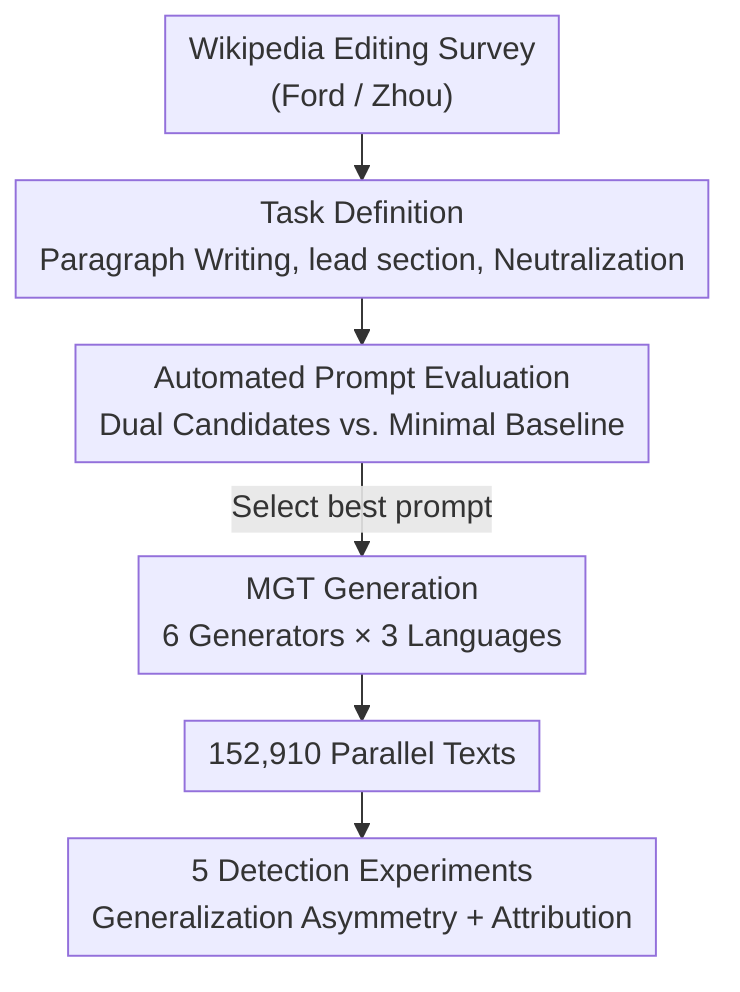

# TSM-Bench: Detecting LLM-Generated Text in Real-World Wikipedia Editing Practices

**Conference**: ICLR 2026  
**OpenReview**: [https://openreview.net/forum?id=zimuL7ZmIi](https://openreview.net/forum?id=zimuL7ZmIi)  
**Code**: https://github.com (The paper states it is open-sourced; see text for repository)  
**Area**: AIGC Detection / Machine-Generated Text Detection / NLP Understanding  
**Keywords**: MGT Detection, Wikipedia, Task-Specific Generation, Multilingual Benchmark, Generalization Asymmetry

## TL;DR
The authors argue that existing Machine-Generated Text (MGT) detection benchmarks rely on free-form prompts like "write an article about machine learning." In contrast, real Wikipedia editing involves **constrained task-specific generation** such as summarization, continuation, and neutralization. Such texts are more similar to human-written text. The authors constructed TSM-Bench, covering 3 languages, 4 tasks, 6 generators, and 12 detectors with 152,910 parallel texts. Results show that SOTA detectors experience a 10–40% accuracy drop on task-specific data compared to generic data, revealing a "generalization asymmetry" where task-specific data generalizes to generic data, but not vice-versa.

## Background & Motivation
**Background**: Wikipedia is one of the most critical high-quality multilingual human-written corpora for the AI community, included in the training sets of almost all LLMs. However, the Wikimedia Foundation warns that the proliferation of MGT on Wikipedia could erode knowledge integrity and potentially lead to "model collapse" as models train on polluted data. Consequently, distinguishing MGT from Human-Written Text (HWT) has become an active research area, with benchmarks like TuringBench, MULTITuDE, MAGE, and M4/M4GT.

**Limitations of Prior Work**: These benchmarks almost exclusively use **generic generation** prompts, involving open-ended, unconstrained instructions like "write an article about neural networks." Real-world editing scenarios differ significantly; editors use LLMs for specific tasks such as summarizing, completing paragraphs, or neutralizing biased sentences based on **clear task definitions and contextual conditions**.

**Key Challenge**: The nature of text produced by generic versus task-specific generation differs. Generic generation often deviates from human text in wording and semantics, while task-specific generation is **closer to human text in style and meaning** due to constraints and context. The paper confirms via Levenshtein distance, cosine similarity, unigram overlap, and perplexity that task-specific MGT distributions are significantly closer to HWT than generic MGT. Detection theory dictates that performance inevitably declines as the total variation distance between human and machine distributions narrows. In other words, existing benchmarks evaluate in "easy mode," systematically overestimating the real-world utility of detectors.

**Goal**: To shift MGT detection evaluation from "generic generation" to "task-specific generation mirroring real editing practices." The study seeks to answer: (1) How much does SOTA detector performance drop on task-specific MGT? (2) Can detectors trained on generic data generalize to task-specific data (and vice versa)? (3) What different features do models learn from generic vs. task-specific training?

**Key Insight**: Drawing from empirical surveys by Ford et al. (2023) and Zhou et al. (2025) on LLM usage in Wikipedia editing, the authors categorize real editing behaviors into three types (four sub-tasks) to generate realistic MGT, rather than creating difficult samples through adversarial perturbations.

**Core Idea**: Generate MGT using constrained tasks actually performed by editors. Build TSM-Bench, a multilingual/multi-generator/multi-task detection benchmark, to expose the unreliability of existing detectors in real scenarios and reveal how training data distribution determines the direction of generalization.

## Method

### Overall Architecture
TSM-Bench is a pipeline for **benchmark construction and systematic evaluation**, aiming to produce 152,910 "human/machine" parallel texts and rigorously test 12 detectors. The pipeline consists of four steps: ① Define editing tasks based on surveys; ② Select the best prompt from two candidates per task using automated metrics and a baseline; ③ Use the optimal prompts to generate MGT across 6 generators and 3 languages; ④ Conduct five experimental groups targeting off-the-shelf detectors, zero-shot/supervised detectors, cross-domain generalization, feature attribution, and cross-task generalization.

A key distinction throughout the paper is the **task definition**. Given a language model $f_\theta$, generic generation is $o_{gt} = f_\theta(g_t)$ where $g_t$ is an unconstrained prompt. Task-specific generation is $o_{ts} = f_\theta(i_t, C_t)$, where $i_t$ is a detailed instruction and $C_t$ is the context (e.g., evidence paragraphs or biased sentences). MGT detection is modeled as binary classification where a detector learns a scoring function $f: X \to \mathbb{R}$ and outputs $\hat{y} = 1$ when $f(x) \ge \tau$.

### Key Designs

**1. Three Types (Four Sub-tasks) of Real Editing Tasks: Making MGT Realistic**

To address the gap between MGT and human text, the authors defined realistic tasks. **Paragraph Writing** is split into "Introductory Paragraph" (writing the start of a new section, fully machine-generated) and "Paragraph Continuation" (extending an incomplete human paragraph, resulting in **mixed text**). **Summarization** requires the model to generate a lead section based on the article body, mimicking Wikipedia's abstractive summarization style. **Text Style Transfer (TST)** involves neutralizing sentences that violate Neutral Point of View (NPOV) policies by rewriting biased input based on guidelines. These tasks replicate real workflows, making the resulting MGT inherently more human-like.

**2. Automated Prompt Evaluation: Selecting the "Most Human" Prompts**

Prompt quality determines MGT difficulty. The authors selected two effective prompts from NLG literature per task, plus a minimal baseline. Candidates included: Minimal (article/section title only), Content Prompts (adding content-related questions), and Naive RAG (adding retrieved content). Summarization and TST used Minimal, Instruction (detailed policy definitions), and Few-shot setups. Evaluation metrics included BLEU/ROUGE for n-gram overlap, BERTScore for semantics, QAFactEval for factuality, and a fine-tuned classifier for TST style accuracy. Using GPT-4o mini on a 10% sample, the final selections were: Paragraph Writing $\to$ RAG, Summarization $\to$ One-shot, TST $\to$ Five-shot. The conclusion is clear: richer context and detailed instructions produce higher-quality, more human-like text, which is harder to detect.

**3. Multilingual / Multi-generator Parallel Corpus: Systemic Coverage**

The benchmark spans two dimensions. **Language**: English, Portuguese, and Vietnamese were chosen based on active user count and Common Crawl representation to study diverse communities. Human corpora used WikiPS and mWNC. 2,700 HWT samples were randomly drawn per task/language, balanced by length tertiles. **Generators**: 6 models were used, including LLMs (GPT-4o, GPT-4o mini, Gemini 2.0 Flash, DeepSeek) and SLMs (Qwen2.5-7B, Mistral-7B). The resulting 152,910 parallel texts enable controlled cross-task and cross-domain comparisons.

### Loss & Training
As a benchmark paper, no new model objectives are proposed. For evaluation: supervised detectors (XLM-RoBERTa, mDeBERTa) underwent hyperparameter search and fine-tuning per "task-language-generator" configuration. Zero-shot methods used Youden's J to calibrate optimal thresholds. 12 detectors in total were evaluated, including off-the-shelf (RADAR, Binoculars, etc.) and zero-shot white-box/black-box methods (FastDetectGPT, Revise-Detect, etc.).

## Key Experimental Results

### Main Results
SOTA detectors are nearly perfect (>93%) on generic data but fail on task-specific data.

| Detector | Generic ACC | Intro Para | Para Cont | Summarization | Neutralize |
|----------|-------------|------------|-----------|---------------|------------|
| Binoculars| 0.97        | 0.56       | 0.47      | 0.58          | 0.53       |
| Desklib   | 0.93        | 0.73       | 0.67      | 0.72          | 0.55       |
| RADAR     | 0.92        | 0.61       | 0.58      | 0.54          | 0.55       |
| e5-small  | 0.98        | 0.68       | 0.68      | 0.70          | 0.56       |

Accuracy for these four detectors drops from 0.92–0.98 to 0.47–0.73 on task-specific data. Neutralization (TST) results are closest to random (approx. 0.55).

By detector family (Exp 2, average ACC across 6 generators):

| Task | Supervised Mean ACC | Best Zero-shot |
|------|---------------------|----------------|
| Intro Para | 85.9% | Binoculars 61.8% / GECScore 69.7% |
| Para Cont | ~86% | Most dropped to near-random (except BiScope) |
| Summarization | 89.8–91.8% | BiScope 69.7% / Binoculars 64.8% |
| Sentence TST | 65.1% | GECScore 64.2% (rarely close to supervised) |

Supervised models generally score between 79.7–91.8% (except TST), while zero-shot averages rarely exceed 64.7%. Summarization is the "easiest" due to distinct Wikipedia lead styles. Sentence-level TST is the hardest but improves by 15.7% when performed at the paragraph level.

### Generalization and Attribution

| Experiment | Key Finding | Representative Metric |
|------------|-------------|-----------------------|
| Exp 3 Cross-domain | **Generalization Asymmetry**: Task-specific training $\to$ generalizes to generic; Generic training $\to$ fails on task-specific. | Task-specific mean: 89.7%; Generic mean: max 73.3% |
| Exp 4 SHAP Attribution | Generic-trained models overfit to surface format cues (e.g., "==", "#"); Task-specific models rely on semantic tokens. | Top SHAP for Generic: "==" (4.7), "#" (3.6) |
| Exp 5 Cross-task | Cross-task generalization is generally low; different tasks leave different MGT traces. | English cross-task mean: Summarization 72.1%, others near random. |

### Key Findings
- **Generalization Asymmetry**: This is the most significant finding. mDeBERTa fine-tuned on task-specific data generalizes well to generic MGT (both in-domain and out-of-domain). However, models fine-tuned on generic data fail to recognize task-specific MGT even within the same domain. This indicates current benchmarks (generic data) produce unreliable detectors.
- **Overfitting to Surface Artifacts**: SHAP analysis reveals generic-trained models rely on "==" or "#" section markers rather than semantics. This explains why they appear strong in-domain but fail elsewhere, confirming that generic benchmarks overestimate performance via "shortcuts."
- **Task Difficulty Gradient**: Summarization is easiest to detect (unique style). Paragraph continuation disrupts zero-shot statistical signals due to human-machine mixing. Sentence-level TST is the hardest due to granularity.

## Highlights & Insights
- **Shifting Difficulty to Real-world Constraints**: Unlike previous work using adversarial noise, this paper demonstrates that "natural" difficulty arises from realistic constraints. This offers a more convincing "realist" approach to benchmarking.
- **Actionable Generalization Insights**: Since task-specific data covers generic data but not vice-versa, future detectors should be trained on a mixture of realistic writing tasks rather than mass-produced generic prompts.
- **SHAP Reveals Formatting Shortcuts**: By proving detectors "cheat" using Wikipedia formatting, the authors warn the field to be wary of surface-level shortcuts during evaluation.

## Limitations & Future Work
- **Limited Task Coverage**: Only three categories of tasks were selected. Other important tasks, like translation, were omitted.
- **Weak TST Style Classifiers**: The style classifiers used for prompt evaluation performed poorly even after fine-tuning, reflecting the inherent difficulty of NPOV classification.
- **Text Length**: While length tertiles were used to mitigate bias, the specific impact of length on task-specific MGT detection requires further study.
- **Maintenance**: The 12 detectors represent a snapshot in time; newer detectors need evaluation. Extension to other UGC platforms like forums or social media is also necessary.

## Related Work & Insights
- **vs. Generic MGT Benchmarks (MAGE, M4, etc.)**: These report near-perfect accuracy using free-form prompts. This paper shows a 10–40% drop when switching to task-specific scenarios.
- **vs. Adversarial Attack Work (He et al., Wu et al.)**: While they use post-generation perturbations, TSM-Bench samples are difficult due to task constraints, which is more representative of actual misuse.
- **vs. Previous Work (Quaremba et al. 2025)**: This paper extends the scope with more tasks, more detectors, more LLMs, and deeper analysis into generalization asymmetry and feature attribution.

## Rating
- Novelty: ⭐⭐⭐⭐ Shifting from generic to realistic task-specific generation and revealing generalization asymmetry is a robust and meaningful perspective.
- Experimental Thoroughness: ⭐⭐⭐⭐⭐ 3 languages × 4 tasks × 6 generators × 12 detectors plus five experimental groups provide exceptional coverage.
- Writing Quality: ⭐⭐⭐⭐ Clear task definitions and logical flow, though charts are dense.
- Value: ⭐⭐⭐⭐⭐ Directly warns UGC platforms and provides practical advice for training future detectors using task-specific data.

<!-- RELATED:START -->

## Related Papers

- [\[ACL 2026\] DetectRL-X: Towards Reliable Multilingual and Real-World LLM-Generated Text Detection](../../ACL2026/aigc_detection/detectrl-x_towards_reliable_multilingual_and_real-world_llm-generated_text_detec.md)
- [\[ICLR 2026\] Learn-to-Distance: Distance Learning for Detecting LLM-Generated Text](learn-to-distance_distance_learning_for_detecting_llm-generated_text.md)
- [\[ACL 2026\] C-ReD: A Comprehensive Chinese Benchmark for AI-Generated Text Detection Derived from Real-World Prompts](../../ACL2026/aigc_detection/c-red_a_comprehensive_chinese_benchmark_for_ai-generated_text_detection_derived_.md)
- [\[ICLR 2026\] EditLens: Quantifying the Extent of AI Editing in Text](editlens_quantifying_the_extent_of_ai_editing_in_text.md)
- [\[ICLR 2026\] HLD: Approximate Hierarchical Linguistic Distribution Modeling for LLM-Generated Text Detection](hld_approximate_hierarchical_linguistic_distribution_modeling_for_llm-generated_.md)

<!-- RELATED:END -->
