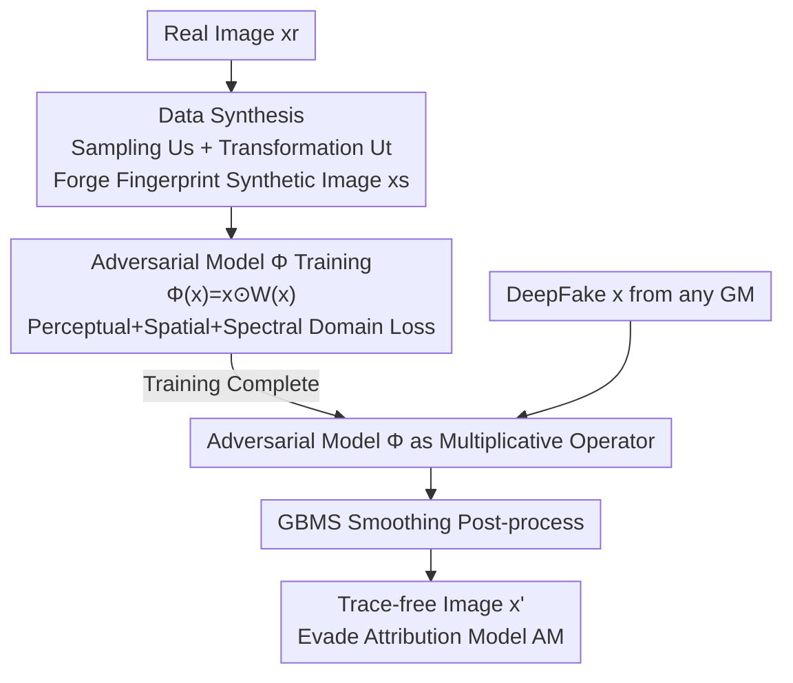

# Untraceable DeepFakes via Traceable Fingerprint Elimination

**Conference**: ICLR 2026  
**OpenReview**: [https://openreview.net/forum?id=LkWsQ3Tawx](https://openreview.net/forum?id=LkWsQ3Tawx)  
**Area**: AIGC Detection / DeepFake Attribution / Adversarial Attacks  
**Keywords**: DeepFake attribution, model fingerprint, multiplicative attack, anti-forensics, black-box attack

## TL;DR
This paper points out that existing attacks to evade attribution are "additive"—they only obscure but cannot eliminate the model fingerprints left by generative models in images, making them vulnerable to adversarial training. The authors propose a "multiplicative attack" that uses an adversarial network trained solely on real data to eliminate fingerprints at the source. It achieves an average Attack Success Rate (ASR) of 97.08% across 12 generative models and 6 attribution models, exceeding 72.39% even when facing defenses.

## Background & Motivation

**Background**: DeepFake attribution goes a step further than simple forgery detection—it extracts the "model fingerprint" left by a generative model (GM) to determine which model or architecture generated the fake image. This technology is valuable for accountability and copyright protection, which has in turn catalyzed "attribution attacks" specifically designed to probe the vulnerabilities of attribution models (AM).

**Limitations of Prior Work**: Through analysis and pilot experiments, the authors observed that existing attacks (e.g., PGD, TraceEvader, FakePolisher) are essentially **additive attacks**—adding a perturbation $p$ to the image, i.e., $T_{add}(x)=x+p$. This approach merely "muddies" the fingerprint and increases extraction difficulty, but the fingerprint itself remains fully preserved in the image. Consequently, they are extremely fragile: if the defender enhances the attribution model with adversarial training, the attacks fail—for instance, TraceEvader's ASR drops sharply from 98.28% to 25.10%. Frequency domain analysis also shows that attacked images remain highly spectral-similar to the originals.

**Key Challenge**: True "untraceability" requires **eliminating** rather than obscuring fingerprints. However, elimination faces a triple dilemma: ① the trade-off between fingerprint elimination and visual imperceptibility (more changes aid the attack but collapse image quality); ② the diversity of generative models and fingerprints, making it impossible to customize methods for each; ③ in practice, attackers do not know which attribution model the defender uses, necessitating a black-box, model-agnostic approach.

**Key Insight**: Drawing from camera fingerprint research, the authors model generated images as $x = x_0 + x_0 f_M + \Theta$, where $x_0$ is visual content, $f_M$ is the fingerprint of model $M$, and $\Theta$ is other noise. The key observation is: **the fingerprint of a generative model is not independent noise, but a content-coupled structured modulation**—it originates from content-dependent operations like up/down-sampling and manifests as grid-like periodic textures. Since the fingerprint is a modulation "multiplied" onto the content, it should be disrupted in a "multiplicative" manner.

**Core Idea**: Use an adversarial matrix $W$ for a **multiplicative attack** $T_{mul}(x)=x\odot W$ to directly disrupt the content-coupled modulation mechanism, altering the original fingerprint $f_M$ to $f'_M=f_M\odot W\neq f_M$, thereby eliminating traceable information at the source. $W$ is parameterized as a neural network trained only on real data to achieve universal, black-box, and provably irreversible fingerprint elimination.

## Method

### Overall Architecture

The method consists of two layers: a **theoretical layer** that proves multiplicative attacks can provably eliminate fingerprints and are statistically irreversible, laying the foundation for effectiveness and robustness; and a **framework layer** that utilizes an end-to-end pipeline relying only on real data to learn the multiplicative matrix $W$ via an adversarial network $\Phi$.

The pipeline consists of three tightly coupled modules: ① **Data Synthesis**—applying sampling and transformation operations to real images to forge "fingerprint-like" synthetic images $x_s$, simulating various fingerprints without any access to generative models; ② **Model Construction**—training the adversarial network $\Phi$ on real/synthetic pairs $(x_r, x_s)$ to learn to eliminate artificial fingerprints from synthetic images while maintaining visual fidelity, driven by joint losses in perceptual, spatial, and spectral domains; ③ **Fingerprint Elimination (Inference)**—the trained $\Phi$ acts as a parameterized multiplicative operator, performing a forward pass on a DeepFake $x$ from any GM, followed by a smoothing post-process to output the trace-free image $x'$. The core principle throughout is "eliminate rather than obscure."

### Key Designs

**1. Multiplicative Attack: Eliminating Fingerprints via Content-Coupled Structural Priors**

This design addresses the fundamental flaw where additive attacks only obscure but do not eliminate, making them easy to defend. The authors theoretically categorize attacks: in additive attacks $T_{add}(x)=x_0+f_M+p+\Theta$, the fingerprint $f_M$ remains intact, so adversarial training can easily identify it. In contrast, the multiplicative attack $T_{mul}(x)=x\odot W$ expands to $x_0\odot W + f_M\odot W + \Theta$, where the fingerprint term is rewritten as $f'_M=f_M\odot W$. By optimizing $W$ such that $f'_M\neq f_M$, the source model can no longer be matched because the traceable residual information has been erased.

This holds true precisely because fingerprints are **content-coupled modulations** (grid textures from content-related operations like upsampling); multiplication directly acts on this modulation mechanism. The authors provide two theoretical guarantees: first, proving such an adversarial matrix $W$ exists (satisfying both AM evasion and quality preservation, see Theorem 1 in the paper); second, proving the multiplicative attack is **statistically irreversible**—inverting $x$ without paired data is unidentifiable, and even with $N$ paired samples, according to a pixel-wise Gaussian model, any unbiased estimator satisfies $\mathrm{Var}(\hat{W}_j)\geq \sigma^2/(N\,\mathbb{E}[x_j^2])$. Reducing MSE to $\varepsilon^2$ would require an impractical sample size $N\gtrsim \sigma^2/(\varepsilon^2\mathbb{E}[x_j^2])$, explaining its inherent robustness against defense.

**2. Synthesis of Fingerprint Mimic Samples Using Only Real Data**

The most direct way to train an elimination network is using "real + fake" pairs, but this requires access to various GMs and target AMs—violating universal and black-box goals. The authors' breakthrough is: **since GM fingerprints are primarily artifacts of sampling and transformation operations**, similar fingerprints can be artificially created on real images using those same operations, bypassing reliance on GMs.

The synthesis module passes through two units. The **Sampling Unit $U_s$** uses nearest-neighbor, bilinear, and bicubic interpolations: real images $x_r$ are downsampled to half size $x_{down}$ then upsampled back to original size $x_{up}$, applied randomly with probability $p_1$ and random $s_{down},s_{up}$ to introduce diverse grid-like spatial artifacts. The **Transformation Unit $U_t$** then selects an operation from a set with probability $p_2$: Gaussian noise ($\sigma^2\in[5,20]$), Gaussian filtering (kernels $\{1,3,5\}$), random cropping (5–20% offset), JPEG compression (quality $[10,75]$), relighting (brightness/contrast/saturation $[0.5,1.5]$), and sequential combinations. These kernel operations are mathematically similar to convolutions/sampling in GMs, thus leaving similar fingerprint traces. These $x_s$ serve as "fingerprinted samples" for training $\Phi$.

**3. Parameterized Multiplicative Matrix and Multi-domain Elimination Loss**

Theory guarantees $W$ exists, but optimizing a matrix directly has two flaws: ① storing a $W$ for every input is computationally infeasible, especially since the AM is inaccessible; ② a fixed $W$ optimized on a single image won't generalize. The authors parameterize $W$ as an **input-dependent function** $W(x)$ using a compact encoder-decoder network $\Phi$ such that $\Phi(x)=x\odot W(x)$ (Encoder: 3 conv layers + 5 residual blocks; Decoder: 2 upsampling layers + 1 conv layer). This requires storing only fixed parameters, generalizes across models via input-dependency, and preserves multiplicative structure and stability.

Training on $(x_r, x_s)$ pairs uses losses split into fidelity and elimination. **Fidelity** uses a pre-trained VGG-16 perceptual loss $L_{perceptual}=\sum_i w_i\|f^i_{\Phi(x_s)}-f^i_{x_r}\|^2$ to maintain semantics. **Fingerprint Elimination** is two-pronged: a spatial loss $L_{spatial}=\|\Phi(x_s)-x_r\|^2$ removes low-level pixel-domain artifacts, and a multi-scale spectral loss compares Fourier transforms at scales $s\in\{1,0.5,0.25\}$ using log-magnitudes $L_{spectral}=\sum_{s_i} w_i\|L(\Phi(x_s),s_i)-L(x_r,s_i)\|_1$ (where $L(x,s_i)=\log(|\mathrm{fft}(x_{s_i})|+\varepsilon)$, weights $\{0.5,0.3,0.2\}$), specifically targeting grid fingerprints in the frequency domain. Total loss $L_{total}=\beta_1 L_{perceptual}+\beta_2 L_{spatial}+\beta_3 L_{spectral}$. During inference, **GBMS smoothing** (Gaussian Blur + Mean Shift Filtering) $G(\cdot)$ is applied to remove residual flaws, resulting in $x'=G(\Phi(x))$.

### Loss & Training
Total loss: $L_{total}=\beta_1 L_{perceptual}+\beta_2 L_{spatial}+\beta_3 L_{spectral}$. Optimal weights are set to $(\beta_1,\beta_2,\beta_3)=(0.5,0.1,0.4)$. The entire training **uses only real data**, without exposure to any DeepFakes, GMs, or AMs, ensuring universality and black-box capability.

## Key Experimental Results

Experiments cover 7 GANs, 5 Diffusion Models (12 GMs total), 4 datasets, against 6 advanced attribution models (DNA-Det, AttNet, DCT, Reverse, POSE, LTracer). Comparisons are made against 8 attack methods (including transfer attacks like PGD/BIM and black-box methods like TraceEvader).

### Main Results

| Attack Method | Avg. ASR(%) | SSIM | LPIPS |
|---------------|-------------|------|-------|
| DiffAttack    | 62.24       | 0.962| 0.095 |
| Transformation| 67.60       | 0.941| 0.151 |
| FakePolisher  | 71.17       | 0.994| 0.067 |
| Regeneration  | 78.60       | 0.912| 0.210 |
| TraceEvader (Prev. SOTA) | 87.11       | **0.995**| **0.038** |
| **Ours**      | **97.08**   | 0.963| 0.093 |

Ours achieves the highest average ASR of 97.08% across 6 AMs, nearly 10 points higher than TraceEvader, reaching 100% ASR on DCT and AttNet; image quality is comparable to TraceEvader (SSIM 0.963 / LPIPS 0.093). On specific diffusion model tests (DNA-Det-DMs), it nears 100% ASR, validating its ability to eliminate DM fingerprints.

### Anti-defense Experiment

| Defense Scenario | Ours ASR(%) | Baseline (same scenario) |
|------------------|-------------|--------------------------|
| Adv. Training (Black-box) | >72.39 | Additive attacks drop significantly |
| Adv. Training (White-box, enhanced with ours) | **100.0** | TraceEvader remains at 25.1 |
| Approximate Inversion (using NN to restore) | 97.68 / 99.97 | —— |

The most counter-intuitive result is in the white-box scenario: even if the defender uses the adversarial images generated by this method to enhance DNA-Det, the ASR reaches 100%. This is because the adversarial images no longer contain any source model information; the adversarial training finds no discriminative cues to learn.

### Ablation Study

| Configuration | Avg. ASR(%) | Description |
|---------------|-------------|-------------|
| Full          | 97.08       | Full model |
| w/o $U_s$     | 95.32       | Remove sampling synthesis |
| w/o $U_t$     | 93.80       | Remove transformation synthesis |
| w/o GBMS      | 89.82       | Still SOTA, but drops ~7.3 points |
| w/o $L_{spatial}$ | 94.21   | Remove spatial loss |
| w/o $L_{spectral}$| 80.31   | Drops to 50.04% on Reverse |

### Key Findings
- **Spectral Loss is Crucial**: Removing $L_{spectral}$ drops the average ASR from 97.08% to 80.31%, falling to just 50.04% for the Reverse model—confirming that fingerprints hide in the frequency domain and must be eliminated there.
- **Empirical Proof of Multiplicative Nature**: Analysis of the residual $\Delta=T(x)-x$ shows high variance (L2 distance mainly [10,30]) and a high Pearson Correlation Coefficient |PCC| with the original image (mainly [0.5,1]), consistent with the multiplicative feature $\Delta=x\odot(W-1)$. TraceEvader’s residuals are stable with PCC in [0, 0.25], typical of additive attacks.
- **Efficiency**: A single forward pass evades all attribution models simultaneously, generating 20,000 adversarial images in 60.6s, much faster than TraceEvader's 732.7s.
- **Weight Sensitivity**: $(\beta_1,\beta_2,\beta_3)=(0.5,0.1,0.4)$ is optimal, yielding 97.1% ASR while keeping SSIM/LPIPS stable at 0.963–0.964 / 0.092–0.097.

## Highlights & Insights
- **Shifting the Attack Paradigm from "Additive" to "Multiplicative"**: The paper identifies a fundamental flaw in existing attacks (obscuring vs. eliminating) and provides a precise multiplicative operator based on content-coupled priors, effectively "redefining the problem."
- **Theoretical + Empirical Irreversibility**: It provides both a statistical lower bound for irreversibility and empirical validation via residual variance and PCC distributions—giving the attack success an explainable foundation.
- **Training on Real Data Only**: Forging "fingerprint-like" signals using sampling/transformations to break dependence on GMs and AMs is a strategy transferable to other black-box, cross-model anti-forensics/adversarial tasks.
- **White-box Defense Failure**: When an attack truly eliminates source information, defenses relying on "learnable cues" (like adversarial training) fail completely—a significant warning for defenders.

## Limitations & Future Work
- The authors acknowledge that completely eliminating fingerprints requires more structural changes than additive perturbations, so image quality is slightly lower than TraceEvader (though still superior to most methods); future work aims for distortion-reduced elimination mechanisms.
- Self-identified limitations: The method is essentially an "anti-forensics tool" with significant ethical risks (addressed in an Ethics Statement); effectiveness depends on the prior that fingerprints are content-coupled modulations—if GM fingerprint characteristics evolve (e.g., non-sampling sources), the multiplicative assumption might not fully hold.
- Future directions: Explore co-evolutionary defense mechanisms; for defenders, new attribution paradigms beyond "inversion/adversarial training" may be needed to handle multiplicative attacks.

## Related Work & Insights
- **vs. TraceEvader**: Both are universal black-box attacks, but TraceEvader adds high-frequency noise and blurs low frequencies. It remains additive and only obscures fingerprints, so ASR collapses from 98.28% to 25.10% after adversarial training. Ours eliminates fingerprints at the source, maintaining ASR >72.39%.
- **vs. FakePolisher / StealthDiffusion**: These also aim to reduce artifacts rather than add noise, but primarily target forgery detectors and don't guarantee elimination of attribution fingerprints; ours explicitly targets AMs with specific spectral elimination.
- **vs. Regeneration**: Regeneration has decent ASR on some AMs but drops to 39.71%/0.0% on POSE/LTracer because it imprints the reconstruction network's own fingerprint onto the image; ours does not introduce a new traceable fingerprint.

## Rating
- Novelty: ⭐⭐⭐⭐⭐ Establishes "additive vs. multiplicative" as a paradigm shift, backed by existence and irreversibility theories.
- Experimental Thoroughness: ⭐⭐⭐⭐⭐ 12 GMs × 6 AMs × multiple defense scenarios + quantitative residual/spectral analysis.
- Writing Quality: ⭐⭐⭐⭐ Clear logic, progressing through motivation, theory, and framework, though some details require the appendix.
- Value: ⭐⭐⭐⭐ Reveals the threat of multiplicative attacks and warns attribution defenders; however, as an attack tool, its positive value depends on subsequent defense research.

<!-- RELATED:START -->

## Related Papers

- [\[ICLR 2026\] RelayFormer: A Unified Local-Global Attention Framework for Scalable Image and Video Manipulation Localization](relayformer_a_unified_local-global_attention_framework_for_scalable_image_and_vi.md)
- [\[ICLR 2026\] Enabling Your Forensic Detector Know How Well It Performs on Distorted Samples](enabling_your_forensic_detector_know_how_well_it_performs_on_distorted_samples.md)
- [\[ICLR 2026\] DMAP: A Distribution Map for Text](dmap_a_distribution_map_for_text.md)
- [\[ICLR 2026\] Unveiling Perceptual Artifacts: A Fine-Grained Benchmark for Interpretable AI-Generated Image Detection](unveiling_perceptual_artifacts_a_fine-grained_benchmark_for_interpretable_ai-gen.md)
- [\[ICLR 2026\] Omni-IML: Towards Unified Interpretable Image Manipulation Localization](omni-iml_towards_unified_interpretable_image_manipulation_localization.md)

<!-- RELATED:END -->
