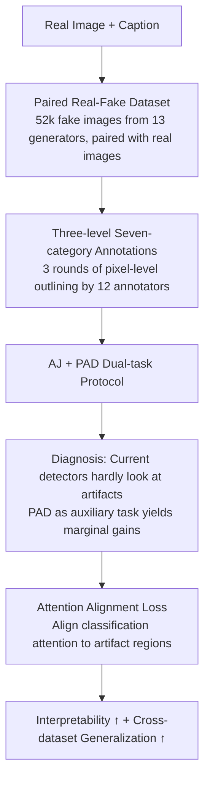

# Unveiling Perceptual Artifacts: A Fine-Grained Benchmark for Interpretable AI-Generated Image Detection

**Conference**: ICLR 2026  
**OpenReview**: [https://openreview.net/forum?id=Tk8ujiOgHM](https://openreview.net/forum?id=Tk8ujiOgHM)  
**Code**: https://github.com/Coxy7/X-AIGD  
**Area**: AIGC Detection / Interpretability / Benchmark  
**Keywords**: AI-generated image detection, perceptual artifacts, pixel-level annotation, attention alignment, interpretability

## TL;DR
Aiming at the issue that existing AI-generated image (AIGI) detectors only output binary "real/fake" labels without providing a basis, this paper constructs X-AIGD, a benchmark of paired real-fake images with pixel-level annotations across three levels and seven categories of artifacts. It systematically diagnoses that current detectors "hardly look at perceptual artifacts" and proposes a training method to explicitly align classification attention with artifact regions, resulting in significant gains in cross-dataset generalization.

## Background & Motivation

**Background**: Mainstream AIGI detection treats "real vs. generated" as a binary classification task, relying on manual or learned low-level fingerprint features (upsampling traces, frequency domain features). Recent works have begun to use Multimodal Large Language Models (MLLMs) to generate textual explanations for detection results in an attempt to increase interpretability.

**Limitations of Prior Work**: Although binary detectors achieve high accuracy on specific datasets, they only provide a 0/1 label and cannot explain "which artifact justifies the fake decision," leading to poor generalization and vulnerability to structural or content perturbations. Explanations from the MLLM route are mostly trained using automatic labeling from stronger models like GPT-4o, which are both unreliable and lack spatial localization—their textual explanations often do not match the actual problematic regions in the image. A few datasets providing manual localization annotations (LOKI, SynthScars) treat "artifact localization" and "real/fake judgment" as two separate tasks, and most lack paired real images and have coarse artifact categories.

**Key Challenge**: To evaluate "whether the detector is looking at human-understandable visual evidence," a benchmark is needed that possesses both **paired real-fake images** (to control semantics and exclude "guessing based on global semantics") and **fine-grained, pixel-level, categorized** artifact annotations. Such a dataset did not exist previously, causing research on interpretable AIGI detection to be stalled.

**Goal**: (1) Construct a benchmark for fine-grained interpretability evaluation; (2) Use it to diagnose whether and how existing detectors utilize perceptual artifacts; (3) Explore training methods that truly ground decisions on artifacts.

**Key Insight**: The authors argue that "perceptual artifacts" are the most natural and transferable cues for humans to distinguish fake images. They systematize these into a **three-level (low-level distortion / high-level semantics / cognitive-level counterfactual) seven-category** classification system and employ human annotators to draw pixel-wise outlines. With this ground truth, it becomes possible to quantitatively answer "how well model attention aligns with human-perceived artifacts."

**Core Idea**: First expose the fact that "detectors are not actually looking at artifacts" using fine-grained artifact annotations, then use an **attention alignment loss** to pull classification attention directly to the annotated artifact regions, thereby improving both interpretability and generalization.

## Method

### Overall Architecture
This paper is not a single model but a three-stage progressive study: "Build Benchmark → Diagnosis → Improvement." First, paired real-fake images are collected and manually annotated at the pixel level with three levels and seven categories, resulting in X-AIGD. Two sub-tasks are defined: Artifact Judgment (AJ) and Perceptual Artifact Detection (PAD). These are used to diagnose existing detectors, revealing that they hardly rely on artifacts. The study then explores PAD as an auxiliary task (transfer/multi-task), finding marginal gains. Finally, explicit attention alignment is proposed to constrain classification attention directly to artifact regions.

### Key Designs

**1. Paired Real-Fake + Pixel-level Artifact Annotation Dataset: Quantifying "Looking at Evidence"**

To diagnose whether a detector truly looks at artifacts, a reliable ground truth of "where humans perceive artifacts" is required, and real-fake images must be semantically aligned to exclude the shortcut of the model "guessing real/fake based on global semantics." To this end, the authors sampled real images from MSCOCO, LAION-Aesthetic, Conceptual Captions, and SA-1B, extracted captions as generation prompts, and used 13 advanced text-to-image models (PixArt-α, FLUX.1-dev, SD 3.5, etc., including realistic models fine-tuned in the Civitai community) with prompt engineering to suppress non-realistic styles. This resulted in 4,000 real images + 4,000 fake images per generator (52,000 fake images total), each paired with a real image. For annotation, 12 annotators used pixel-level polygon masks to outline artifacts and assign categories. Each image was processed by **three rounds of different annotators** to improve completeness. Images judged as low-quality or unrealistic were removed, leaving 3,035 valid annotated samples (200 images per generator for the test set, and a subset of 5 generators for the training set). Annotation quality was reviewed by 3 independent annotators with confidence scores {0, 0.5, 1}, showing high overall quality (as shown in Table 1, X-AIGD is one of the few datasets featuring paired real images, pixel masks, and category labels).

**2. Three-level Seven-category Perceptual Artifact Taxonomy: From Vague Feeling to Structured Labels**

Previous datasets either lacked classification or used coarse categories, failing to support fine-grained interpretability analysis. This paper organizes perceptual artifacts into 3 levels and 7 specific categories: **Low-level Distortion** (Textures, Edges & Shapes, Symbols, Color) captures basic visual anomalies; **High-level Semantics** (Semantics) targets structural errors destroying object integrity and logical arrangement; **Cognitive Counterfactual** (Commonsense, Physics) covers logical/physical contradictions requiring real-world knowledge (e.g., impossible object relationships, incorrect reflections). This top-down hierarchy covers both obvious distortions and deep semantic inconsistencies, allowing for category-wise evaluation of detectors—experiments later reveal that "models are good at low-level edges/symbols but capture almost no cognitive-level artifacts."

**3. AJ / PAD Dual-task Protocol and Diagnosis of "Detectors Ignoring Artifacts": Exposing the Problem**

X-AIGD splits interpretable AIGI detection into two sub-tasks: **Artifact Judgment (AJ)** predicts a binary label $y \in \{0,1\}$, evaluated by Balanced Accuracy and P/R/F1; **Perceptual Artifact Detection (PAD)** detects regional instances $r_i$ and categories $c_i \in C$ ($|C|=7$) when judged fake, evaluated by IoU and pixel-level PixP/PixR/PixF1. A **category-agnostic PAD** is also proposed (merging all categories into a binary mask) for models that are not category-aware. Based on this protocol, the authors diagnosed existing end-to-end detectors (CNNSpot, UnivFD, FatFormer, DRCT, CoDE, etc.): using Grad-CAM / Relevance Map to binarize (threshold 0.5) the "fake class" explanation heatmaps and comparing them with artifact masks, they found that **the alignment between heatmaps and human perception is extremely weak**. More counterintuitively, detector accuracy has **almost no correlation** with image fidelity (NIQE, MDFS, Artifact Proportion PAR)—fake images with more artifacts (PAR > 0) are not easier to recognize than those without obvious artifacts (PAR = 0), indicating they do not use artifacts as cues. Further using PAD as an auxiliary task (transfer learning / multi-task) yields non-trivial artifact segmentation capability, but the AJ improvement is marginal, and classification heatmaps still highlight background regions not covered by segmentation, proving the decision basis remains uninterpretable features.

**4. Explicit Attention Alignment Loss: Anchoring Classification Attention to Artifact Regions**

Since adding a PAD task is insufficient for models to truly look at artifacts, this paper turns to a more direct approach—regularizing the spatial distribution of classification attention. For ViT-based detectors, **Gradient Attention Rollout** is used to calculate the aggregated attention map $A_{cls} \in [0,1]^{h \times w}$ of the classification logit relative to all $h \times w$ patches. Simultaneously, pixel-level artifact annotations are downsampled into a patch-level artifact map $A_{art} \in [0,1]^{h \times w}$ (each patch takes the proportion of pixels within it belonging to artifacts; real images use a zero matrix). Since $A_{cls}$ is differentiable, the Mean Squared Error between the two maps is used as an auxiliary loss. However, restricting attention **only** to artifact regions might prevent the model from learning useful features in benign regions. Thus, a weight $\lambda \in [0,1]$ for benign regions is introduced to adjust the penalty strength on non-artifact areas:

$$\mathcal{L}_{align}=\frac{1}{hw}\sum_{i=1}^{h}\sum_{j=1}^{w}W^{(i,j)}\big(A_{cls}^{(i,j)}-A_{art}^{(i,j)}\big)^2,\quad W^{(i,j)}=\begin{cases}1,& A_{art}^{(i,j)}>0\\ \lambda,& A_{art}^{(i,j)}=0\end{cases}$$

The final training objective adds this weighted term to the standard binary BCE: $\mathcal{L}=\mathcal{L}_{BCE}+\beta\,\mathcal{L}_{align}$ ($\beta>0$). The effect is to expand attention to truly interpretable areas such as limbs, complex structures, and textures, significantly improving cross-dataset generalization. The weight $\lambda$ controls the trade-off between "relying on artifact cues" and "retaining low-level fingerprints/global features"—a moderate $\lambda$ (e.g., 0.4/0.6) narrows the imbalance where precision is much higher than recall, achieving the best generalization F1.

## Key Experimental Results

### Main Results
Comparison between existing detectors and models trained on this data (AJ uses Balanced Accuracy, category-agnostic PAD uses IoU/PixF1):

| Model | AJ Acc | AJ F1 | PAD IoU | PAD PixF1 |
|-------|--------|-------|---------|-----------|
| CNNSpot | 48.6 | 9.8 | 0.9 | 1.8 |
| FatFormer | 52.1 | 25.4 | 0.5 | 0.9 |
| DRCT-ConvB (Best Existing) | 82.5 | 81.0 | 9.0 | 16.6 |
| CoDE | 76.5 | 70.9 | 2.9 | 5.7 |
| AJ-only (Ours) | 89.3 | 90.2 | / | / |
| PAD-only | / | / | 27.2 | 42.7 |
| Transfer Learning (Fine-tune) | 89.9 | 92.5 | / | / |
| Multi-task Learning | 89.1 | 92.3 | 27.3 | 42.8 |

Key takeaway: Existing detectors generally have IoU < 10 on category-agnostic PAD (the highest, DRCT-ConvB, is only 9.0), confirming they "hardly look at artifacts." After training on this data, PAD IoU jumps to 27+, but treating PAD as an auxiliary task yields marginal gains for AJ (Multi-task/Fine-tune F1 is only slightly higher than AJ-only's 90.2 at 92+).

Ablation of attention alignment on 4 cross-source datasets (AJ F1):

| Alignment Type | X-AIGD | Synthbuster | Chameleon | CommFor |
|----------------|--------|-------------|-----------|---------|
| No Alignment ($\beta=0$) | 84.3 | 55.9 | 62.7 | 58.2 |
| Saliency Alignment | 86.4 | 60.7 | 58.3 | 59.7 |
| Artifact Alignment (Ours) | **87.4** | **63.2** | **63.5** | **61.4** |

Using artifact mask alignment is comprehensively superior to the no-alignment baseline and better than aligning attention to salient objects—indicating that the gain comes from "alignment to artifacts" rather than "alignment to any salient region."

### Ablation Study

| Configuration | Key Metric | Description |
|---------------|------------|-------------|
| Complete (Artifact alignment, med $\lambda$) | Highest cross-dataset F1 | Balances artifact cues with other useful features |
| Saliency mask instead of artifact mask | Lower cross-dataset F1 | Aligning to salient objects ≠ artifacts; gains disappear |
| No Alignment $\beta=0$ | Baseline | Precision much higher than recall; weak generalization |
| Increasing $\lambda$ (Heavier artifact focus) | Recall drops, F1 lowers | Over-reliance on hard-to-detect high-level artifacts hinders performance |

PAD by artifact category (Table 3): Models achieve up to 50%+ PixR on low-level Edges & Shapes and Symbols, but PixR is nearly 0 on cognitive-level Physics, and structural errors in High-level Semantics can only be "coarsely associated with the whole object," making it difficult to distinguish semantic correctness.

### Key Findings
- **No significant correlation between detector accuracy and image fidelity**: Fake images with more artifacts are not necessarily easier for existing detectors to identify, debunking the assumption that they rely on artifacts.
- **PAD as an auxiliary task yields marginal gains**: While it can train segmentation capability, classification heatmaps still highlight the background, meaning the decision basis has not truly transferred to artifacts—interpretability and accuracy are separate matters.
- **Difficulty increases with hierarchy**: Low-level distortions (edges/symbols) are detectable, high-level semantics are marginal, and cognitive counterfactuals (commonsense/physics) are almost undetectable, reflecting the lack of reasoning ability in traditional vision models.
- **A "sweet spot" for $\lambda$ exists**: A moderate $\lambda$ (0.4/0.6) balances "looking at artifacts" with "looking at fingerprints/global features," narrowing the precision-recall gap and leading to the best generalization.

## Highlights & Insights
- **Quantifying interpretability using paired real-fake images + pixel annotations**: While previous work compared textual explanations at the image level, this paper grounds evaluation on pixel-level alignment between "attention vs. artifact regions," enabling for the first time the verification of whether model explanations are based on real visual evidence.
- **A solid "falsify then improve" research paradigm**: First using the benchmark to reveal that "detectors don't look at artifacts" and "PAD as an auxiliary task is useless," then naturally introducing attention alignment, makes the argument chain complete and convincing.
- **Transferable attention alignment + $\lambda$ mechanism**: Using "manually localized key regions" as attention supervision and a weight to balance "looking at key regions" vs. "preserving other cues" is a mechanism that can be applied to other detection/forensics tasks requiring grounded decisions.
- **The three-level seven-category taxonomy is a reusable asset**: The hierarchy from low-level distortion to cognitive counterfactuals provides a unified scale and dimension for difficulty and evaluation in future work.

## Limitations & Future Work
- Detection of cognitive-level artifacts (commonsense/physics violations) almost fails, indicating a lack of reasoning in pure vision models. This fundamental shortcoming is not solved by the proposed method and may require MLLMs/world knowledge in the future.
- Attention alignment primarily applies to ViT-based architectures (relying on Attention Rollout); its transferability to CNN or patch-based detectors has not been fully verified.
- Although PAD annotations underwent three rounds and confidence score reviews, artifact perception is subjective, and a small proportion of controversial instances remains; consistency for high-level/cognitive categories may be harder to ensure.
- The AJ gains from attention alignment are mainly in F1 and generalization; the improvement within X-AIGD itself is limited. $\lambda$ and $\beta$ require tuning per data, lacking an adaptive scheme.

## Related Work & Insights
- **vs. LOKI / SynthScars (benchmarks with localization)**: These provide manual bbox/mask localization but treat artifact detection and real/fake judgment as separate tasks and mostly lack paired real images. This paper provides paired real images + pixel masks + seven categories, explicitly studying task synergy and decision grounding.
- **vs. FakeBench / MMFR (MLLM textual explanation benchmarks)**: These compare textual explanations at the image level and lack spatial grounding, making it impossible to verify if explanations are based on true evidence. This paper makes interpretability evaluation concrete via pixel-level alignment.
- **vs. PAL4VST / SynArtifact (perceptual artifact localization)**: Their annotations serve "image restoration/generation model tuning," covering only specific artifacts that degrade image quality, and lack real images. This work focuses on "full-spectrum artifacts as detection cues + interpretability analysis."

## Rating
- Novelty: ⭐⭐⭐⭐ Three-level seven-category paired pixel benchmark + attention alignment; the "falsify then improve" perspective is solid, though individual components have precursors.
- Experimental Thoroughness: ⭐⭐⭐⭐ Covers 7 existing detectors, multiple settings (transfer/multi-task/alignment), 4 cross-dataset evaluations, and category-wise analysis.
- Writing Quality: ⭐⭐⭐⭐ Clear logical progression; findings are stated directly; some metric definitions require referring to the appendix.
- Value: ⭐⭐⭐⭐ Establishes a pixel-level evaluation standard for interpretable AIGI detection; and the open-sourced data and code have high potential impact.

<!-- RELATED:START -->

## Related Papers

- [\[ICLR 2026\] Preserving Forgery Artifacts: AI-Generated Video Detection at Native Scale](preserving_forgery_artifacts_ai-generated_video_detection_at_native_scale.md)
- [\[ICLR 2026\] Omni-IML: Towards Unified Interpretable Image Manipulation Localization](omni-iml_towards_unified_interpretable_image_manipulation_localization.md)
- [\[CVPR 2026\] Fine-grained Image Aesthetic Assessment: Learning Discriminative Scores from Relative Ranks](../../CVPR2026/aigc_detection/fine-grained_image_aesthetic_assessment_learning_discriminative_scores_from_rela.md)
- [\[ICLR 2026\] FakeXplain: AI-Generated Image Detection via Human-Aligned Grounded Reasoning](fakexplain_ai-generated_image_detection_via_human-aligned_grounded_reasoning.md)
- [\[ACL 2025\] HACo-Det: A Study Towards Fine-Grained Machine-Generated Text Detection under Human-AI Coauthoring](../../ACL2025/aigc_detection/haco-det_a_study_towards_fine-grained_machine-generated_text_detection_under_hum.md)

<!-- RELATED:END -->
