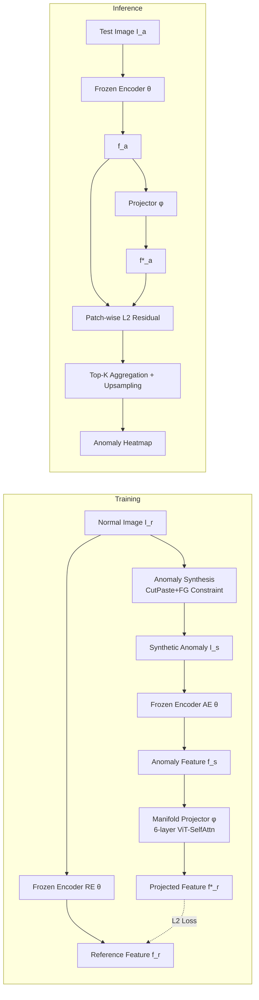

# Foundation Visual Encoders Are Secretly Few-Shot Anomaly Detectors

**Conference**: ICLR 2026  
**OpenReview**: [https://openreview.net/forum?id=YRrlJ8oVEH](https://openreview.net/forum?id=YRrlJ8oVEH)  
**Code**: [https://github.com/ymxlzgy/FoundAD](https://github.com/ymxlzgy/FoundAD)  
**Area**: Anomaly Detection / Industrial Quality Inspection / Representation Learning  
**Keywords**: Few-shot Anomaly Detection, Foundation Visual Encoders, DINOv3, Natural Image Manifold, Manifold Projection  

## TL;DR
The authors discovered that frozen foundation visual encoders "secretly" possess the ability to distinguish anomalies—the area of an anomalous region in an image is positively correlated with the distance of its features to the natural image manifold. By training a lightweight non-linear projection operator (FOUNDAD) atop the encoder to pull anomalous features back to the normal manifold and scoring based on the difference before and after projection, SOTA performance is achieved in few-shot, category-agnostic industrial anomaly detection.

## Background & Motivation
- **Background**: Few-shot anomaly detection (FSAD) uses minimal normal samples for training, which is highly attractive for industrial quality inspection where collecting defect samples is expensive and types are often unknown before mass production. Recent mainstream methods (WinCLIP, PromptAD, AnomalyCLIP, IIPAD, etc.) mostly rely on vision-language models like CLIP, using carefully designed **text prompts** to assist in distinguishing normal from abnormal.
- **Limitations of Prior Work**: Sample scarcity makes it difficult to learn subtle "normal vs. abnormal" differences, especially in category-agnostic settings. Introducing text prompts adds design complexity and ties anomaly detection capabilities to "language alignment."
- **Key Challenge**: Foundation visual encoders are pre-trained on massive natural images, and their feature spaces naturally capture the **general distribution of normal images**. However, the community has largely treated them as generic feature extractors for downstream tasks, without systematically exploiting their inherent sensitivity to "deviations from the normal distribution."
- **Key Insight**: The authors found an interesting property—**the larger the pixel area of an anomalous region in an image, the larger the L2 distance between its embedded features and normal features** (this holds for both SigLIP and DINOv2 in Figure 2). This indicates that foundation encoders are "secretly" already detecting defect regions.
- **Goal**: To build a lightweight and powerful category-agnostic few-shot anomaly detector using pure visual features and minimal normal samples, without fine-tuning the encoder or relying on text prompts.
- **Core Idea**: **[Manifold Projection]** Formalize "anomaly = deviation from the natural image manifold." Freeze the foundation encoder to reuse its semantic/geometric priors, and only train a lightweight non-linear projection operator $\phi$ to map anomalous features back to their corresponding normal features on the manifold. Localization and scoring are then performed using the feature difference before and after projection.

## Method

### Overall Architecture
FOUNDAD reformulates anomaly detection as the "projection residual from features to the natural image manifold." During training, given a normal image $I_r$, a CutPaste-style synthesis module generates structural anomalies to obtain $I_s$. Two **parameter-shared** frozen encoders encode the anomalous image (Anomaly-Aware Encoder, AE) and the original image (Reference Encoder, RE). The only trainable manifold projector $\phi$ maps the anomalous feature $f_s$ back to the normal reference feature $f_r$, with the loss defined as the L2 distance between them. During inference, for any image $I_a$, the patch-wise difference between its feature $f_a$ and the projected feature $f_a^*=\phi(f_a)$ serves as the anomaly score, which is then Top-K aggregated for image-level scores and upsampled for pixel-level heatmaps.

### Key Designs

**1. Correlation between Anomaly Area and Feature Distance: Turning anomaly detection into "measuring manifold deviation."** This is the foundation of the work. The authors conducted controlled experiments on two foundation encoders (SigLIP, DINOv2): by pasting increasingly large synthetic anomalies onto real normal images, they measured the L2 distance from the anomalous embedding to the original normal embedding. They found that distance increases monotonically with the number of anomalous pixels. Intuition: Foundation models learn a "natural image manifold"; normal images are embedded on this manifold, while anomalous images are pushed away, with the degree of deviation tied to the anomaly ratio. This property equates "detecting anomalies" to "measuring feature deviation from the natural image manifold," eliminating the need for defect labels or text priors.

**2. Dual Shared Frozen Encoders + CutPaste Synthesis: Driving training with simple perturbations while preventing false positives on normal regions.** The framework uses two **identical** frozen encoders $\theta$ (AE for the synthetic image, RE for the original image). Shared parameters ensure both features fall into the same latent space and can be aligned patch-wise. Consequently, normal patches in the synthetic image remain close to their corresponding patches in the original image, while only modified anomalous regions show differences. CutPaste is used for synthesis, but the authors emphasize a key observation: while synthetic anomalies differ significantly from real ones at the **pixel level**, this difference is smoothed out in the **latent space**. Thus, "simple synthesis is sufficient to push anomalous features off the manifold." To improve realism, anomalies are **constrained to foreground regions** using adaptive thresholding. A Bernoulli gate with threshold $\sigma$ decides whether to synthesize: $z\sim\text{Bernoulli}(1-\sigma)$, $I_s=(1-z)\,I_r+z\,\text{Syn}(I_r)$, exposing the network to both "synthesized" and "original" cases.

**3. Lightweight Non-linear Manifold Projector: Training only one module to pull features back.** The projector $\phi$ is the only trainable component, implemented as a ViT with depth 6. Each block uses residual connections $x_{out}=\text{Attn}(x_{in})+x_{in}$ to stabilize training. Since features are tokenized, self-attention naturally supports patch interaction and captures fine-grained anomalies better than an MLP. The training objective is simple—minimizing the patch-wise L2 distance between the projected feature and the reference normal feature:

$$\mathcal{L}=D(f_r^*,f_r)=\frac{1}{N}\sum_{i=1}^{N}\left(f_{r,i}^*-f_{r,i}\right)^2,\quad f_r^*=\phi(f_s)$$

The method operates entirely in the latent space, avoiding the computational cost of pixel-space reconstruction. The projector has only 11.8M parameters, with a total model size (including DINOv3) of 97.8M.

**4. Top-K Residual Scoring and Multi-level Output: Aggregating patch residuals for image-level and pixel-level detection.** Inference does not rely on reference banks; it uses self-comparison before and after projection. The patch-wise anomaly score is the projection residual $S_{patch}=D(f_a^*,f_a)$. The image-level score is the **average of the Top-K highest patch scores** $S_{image}=\frac{1}{K}\sum_{i=1}^{K}S_{patch,i}$ (focusing on the most suspicious regions to avoid dilution by normal patches; K=10 for MVTec-AD, K=6 for VisA). Pixel-level heatmaps are generated by upsampling patch scores. This "residual-is-anomaly" scoring makes the pipeline fast, lightweight, and easy to train.

## Key Experimental Results

### Main Results (Category-Agnostic, Few-Shot, Image/Pixel-level % AUROC/PRO)
FOUNDAD leads on two major industrial datasets in the 1-shot setting (✓ indicates no text required):

| Shot | Method | w/o Texts | MVTec I-AUROC | MVTec PRO | VisA I-AUROC | VisA PRO |
|------|------|:---:|:---:|:---:|:---:|:---:|
| 1 | PatchCore | ✓ | 63.7 | 72.7 | 58.9 | 64.3 |
| 1 | WinCLIP | ✗ | 92.8 | 83.5 | 83.1 | 80.9 |
| 1 | AnomalySD | ✗ | 93.6 | 89.2 | 86.1 | 93.9 |
| 1 | IIPAD | ✗ | 94.2 | 89.8 | 85.4 | 87.3 |
| 1 | **Ours** | ✓ | **96.1** | **92.8** | **92.6** | **98.0** |
| 2 | **Ours** | ✓ | **96.8** | **93.3** | **93.5** | **98.0** |

The improvement on VisA is particularly significant (I-AUROC +6.2 over the second best), showing robustness in complex, multi-instance scenarios. SOTA results are also maintained on BTAD/DTD.

### Ablation Study

**Encoder Comparison (1-shot, MVTec-AD)** — DINOv3 is optimal; pure vision-supervised encoders generally outperform text-aligned CLIP:

| Encoder | Pure Vision | I-AUROC | P-AUROC | PRO |
|------|:---:|:---:|:---:|:---:|
| DINOv3 | ✓ | **96.1** | **96.8** | **92.8** |
| DINOv2 | ✓ | 95.2 | 96.4 | 92.5 |
| DINOSigLIP | ✗ | 92.5 | 93.1 | 87.2 |
| DINO | ✓ | 88.3 | 96.2 | 87.8 |
| SigLIP | ✗ | 87.8 | 86.0 | 71.1 |
| CLIP | ✗ | 79.0 | 90.9 | 70.9 |

**Projector Architecture (1-shot, MVTec-AD)** — ViT significantly outperforms MLP at the same depth; depth 6 is optimal:

| Type | Depth | I-AUROC | PRO |
|------|:---:|:---:|:---:|
| ViT | 4 | 95.5 | 92.6 |
| ViT | **6** | **96.1** | **92.8** |
| ViT | 8 | 95.8 | 92.5 |
| MLP | 6 | 92.1 | 90.7 |

### Key Findings
- **Significant Efficiency**: The projector has only 11.8M trainable parameters. Inference takes 128.7ms/image (~7.8 FPS) on an RTX 3090, using 1386 MiB VRAM. It has ~13.3× fewer parameters than LogSAD while achieving higher accuracy.
- **Text is Not Required**: Pure visual features (DINO series) can outperform strong baselines relying on CLIP+text. CLIP's lack of pixel-level info leads to poor localization (PRO).
- **Simple Synthesis Suffices**: The difference between synthetic and real anomalies is minimized in latent space, proving realistic defect generation is unnecessary.

## Highlights & Insights
- **"Reinterpreting Existing Capabilities" over New Modules**: The core contribution is uncovering the hidden "anomaly area ↔ manifold distance" property of foundation encoders. Implementing it with minimal cost (one projector + L2 loss) is an elegant "observation-driven design."
- **De-textualization**: While CLIP/text prompts are nearly standard for FSAD, this work argues that visual features are sufficient, reducing complexity and broadening the perspective.
- **Latent Space Operation**: Unlike reconstruction methods returning to pixel space, pure latent projection reduces computation, fitting industrial needs for lightweight, real-time deployment.
- **Plug-and-Play with New Foundation Models**: Replacing the encoder with DINOv3 directly improves results, showing the method benefits naturally from foundation model progress.

## Limitations & Future Work
- **Dependency on Encoder Quality**: The performance ceiling is set by the frozen encoder (e.g., performance drops with WideResNet/CLIP).
- **Limited Synthesis Paradigm**: Only CutPaste-style structural anomalies were tested; coverage for logical anomalies or subtle texture defects remains unverified.
- **Industrial Domain Focus**: Evaluation is concentrated on industrial inspection (MVTec-AD, etc.). Transferability to medical or video domains needs investigation.
- **Top-K and Layer Selection**: Values for K and specific encoder layers are dataset-sensitive and may require re-tuning for new domains.

## Related Work & Insights
- **Foundation Visual Encoders**: DINOv2/v3, SigLIP, etc., provide transferable features; this work treats them as "natural image manifold" providers.
- **Predictive Representation Learning**: Influenced by JEPA/SimSiam—pure latent space prediction without pixel reconstruction. However, this work freezes the encoder and trains the projector to leverage existing manifolds.
- **Few-shot/Multi-category AD**: Compared against PatchCore/FastRecon (no-text) and WinCLIP/IIPAD (text-based). This work surpasses text-based SOTA via a no-text route.
- **Insight**: When facing label-scarce discriminative tasks, check if foundation models already contain the signal before designing complex modules.

## Rating
- **Novelty**: ⭐⭐⭐⭐ The observation of "anomaly area ↔ manifold distance" is novel. Reformulating FSAD as manifold projection and demonstrating de-textualization provides a clear perspective.
- **Experimental Thoroughness**: ⭐⭐⭐⭐ Covers 4 datasets, multiple shots, 7 encoders, and extensive ablations on architecture, layers, and Top-K.
- **Writing Quality**: ⭐⭐⭐⭐ Coherent storyline (observation → method → verification) with clear diagrams and formulas.
- **Value**: ⭐⭐⭐⭐ Lightweight, easy to train, and SOTA. High value for industrial deployment and a new paradigm for reusing foundation model capabilities.

<!-- RELATED:START -->

## Related Papers

- [\[CVPR 2026\] Defect Cue-Preserved Structural Feature Refinement for Few-Shot Anomaly Detection](../../CVPR2026/anomaly_detection/defect_cue-preserved_structural_feature_refinement_for_few-shot_anomaly_detectio.md)
- [\[ICLR 2026\] LLM as an Algorithmist: Enhancing Anomaly Detectors via Programmatic Synthesis](llm_as_an_algorithmist_enhancing_anomaly_detectors_via_programmatic_synthesis.md)
- [\[ICLR 2026\] Adaptive Conformal Anomaly Detection with Time Series Foundation Models for Signal Monitoring](adaptive_conformal_anomaly_detection_with_time_series_foundation_models_for_sign.md)
- [\[ICLR 2026\] MRAD: Zero-Shot Anomaly Detection with Memory-Driven Retrieval](mrad_zero-shot_anomaly_detection_with_memory-driven_retrieval.md)
- [\[ICLR 2026\] ReTabAD: A Benchmark for Restoring Semantic Context in Tabular Anomaly Detection](retabad_a_benchmark_for_restoring_semantic_context_in_tabular_anomaly_detection.md)

<!-- RELATED:END -->
