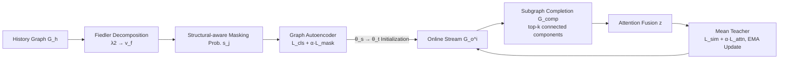

# Healthcare Insurance Fraud Detection via Continual Fiedler Vector Graph Model

**Conference**: ICLR 2026  
**OpenReview**: [https://openreview.net/forum?id=ZWDvIKMkMG](https://openreview.net/forum?id=ZWDvIKMkMG)  
**Code**: [https://github.com/yhzhang1309/ConFVG](https://github.com/yhzhang1309/ConFVG)  
**Area**: Graph Anomaly Detection / Continual Learning / Healthcare Fraud  
**Keywords**: Fraud Detection, Spectral Graph Theory, Fiedler Vector, Graph Autoencoder, Online Continual Learning, Mean Teacher  

## TL;DR
ConFVG utilizes the second smallest eigenvector of the graph Laplacian (Fiedler vector) to guide the masking strategy of a Graph Autoencoder (GAE) for structural-aware representation learning under label scarcity. It then employs subgraph attention fusion and a Mean Teacher framework to continuously adapt to evolving fraud patterns in unlabeled online streams, achieving real-time healthcare fraud detection.

## Background & Motivation
**Background**: Healthcare fraud causes massive annual losses (e.g., U.S. federal Medicare fraud is approximately $\$61$ billion, accounting for about $7\%$ of federal healthcare spending). Due to the complex relational structures between fraud entities (patients, doctors, claims), Graph Neural Network (GNN)-based methods (such as CARE-GNN, PC-GNN) have become mainstream for modeling these relational dependencies.

**Limitations of Prior Work**: Real-world deployment faces two challenges typically handled separately. First, **extreme label scarcity in the pre-training phase**: manual verification is costly and time-consuming, with some systems having only $0.062\%$ of samples labeled as fraud. Fully supervised methods experience sharp performance drops under insufficient labeling, while standard self-supervised GAEs fail to capture structural fraud signals like "collusion groups" or "community anomalies." Second, **non-stationary online streams**: fraud patterns evolve over time and manifest in new relational structures, while almost no labels are available during the online testing phase, making models dependent on ground-truth updates unable to adapt.

**Key Challenge**: Extreme label scarcity and fraud pattern drift **occur simultaneously** in real-world healthcare streams, yet prior works focus either only on "label-efficient pre-training" or "adaptation in evolving environments," lacking a unified solution.

**Goal**: Propose a unified framework for "label-scarce + non-stationary" scenarios that generalizes from limited supervision and continuously adapts in unlabeled online streams.

**Core Idea**: **Utilize spectral graph signals as unlabeled "fraud priors"**. Fraud nodes often manifest as non-smooth signals (isolated points or abnormally dense subgraphs that disrupt global graph homophily). Since the Fiedler vector encodes global topology such as community boundaries and connectivity bottlenecks, injecting it into the GAE's masking probability allows the model to highlight fraud-related structures without labels. In the online phase, **subgraph completion + attention fusion + Mean Teacher** are used for unsupervised continual updates.

## Method

### Overall Architecture
ConFVG consists of two phases. In the **pre-training phase**, the model accesses a historical graph $G_h$ to learn structural-aware representations $\theta_{history}$ using a Fiedler-vector-guided GAE. In the **online phase**, tasks arrive as a long sequence $G_o$, and the model only sees the current task $G_o^i$ (with no history or labels). Parameters are updated using a Subgraph Attention Fusion (SAF) module and a Mean Teacher framework. The problem is simplified into a challenging setting: "labels available for pre-training, zero labels online."

### Key Designs
**1. Fiedler Vector Guided Masking Strategy: Letting spectral signals decide "which features to mask."** Standard random masking (e.g., GraphMAE) may mask useful features or omit critical ones, leading to information loss. Based on spectral graph theory, the smoothness $q_i$ of each node forms a vector $q$, and global smoothness is defined as $\text{Graph}_{smooth}=\sum_{(i,j)\in E}(q_i-q_j)^2$. Minimizing this is equivalent to $\min q^T L q = \min \sum_i \lambda_i z_i^2$ (where $L=D-A$ is the Laplacian). Constraining the projection such that $q^T L q = \lambda_2$ results in the optimal $q$ being the eigenvector corresponding to the second smallest eigenvalue, known as the **Fiedler vector $v_f=u_2$**. It naturally indicates fraud probability (non-smooth nodes at community boundaries or bottlenecks). By linearly projecting $v_f$ and normalized node features into masking probabilities $s_j = \left| \sum_{i=1}^n v_{f,i} \cdot X_{norm,ij} \right|$, the reconstruction task focuses on fraud-related features. The total pre-training loss is $L_{pretrain}=L_{cls}+\alpha_{mask}L_{mask}$.

**2. Fully Connected Perturbation for Multi-components: Rescuing degraded Fiedler vectors.** Healthcare graphs are often disconnected or contain multiple connected components, causing the Laplacian spectral decomposition to degrade (multiple zero eigenvalues) and the Fiedler vector to lose its anomaly detection capability. A weak fully connected perturbation $A'=A+\epsilon\cdot(J-I)$ (where $J$ is the all-ones matrix and $I$ is the identity matrix) is added to the original adjacency matrix to weakly connect components into a single graph, restoring the discriminative meaning of $\lambda_2$.

**3. Subgraph Attention Fusion (SAF): Completing ignored cross-component fraud associations.** Models like GraphSAGE/GAT propagate information only within top-k neighbors in original connected subgraphs, making them highly dependent on initial connectivity and blind to similar fraud patterns across components. SAF extracts the top-$k$ largest connected components to construct a **complementary graph** $G_{comp}$ (connecting nodes not previously linked). These are encoded as $z_{orig}=E(G)$ and $z_{comp}=E(G_{comp})$, then fused via attention: $z=\sigma(W_2\,\text{ReLU}(W_1[z_{orig};z_{comp}]+b_1)+b_2)$. An attention loss $L_{attn}=\text{ReLU}\big(\frac{1}{|V\setminus V_G|}\sum_{i\in V\setminus V_G}a_i-\frac{1}{|V_G|}\sum_{i\in V_G}a_i\big)$ regulates the weights, forcing the model to adaptively amplify newly emerging high-risk structures.

**4. Mean Teacher Unsupervised Online Update: Preventing forgetting in label-less streams.** Since labels are unavailable online, a teacher-student structure is used: the teacher $M_t$ provides predictions for new tasks, while the student $M_s$ aligns using KL divergence $L_{sim}=\text{KL}(\text{Softmax}(z_s)\|\text{Softmax}(z_t))$. The total online loss $L_{online}=L_{sim}+\alpha_{attn}L_{attn}$ updates the student. The teacher is updated via Exponential Moving Average (EMA) $\theta_t^{(i)}=\alpha\theta_t^{(i-1)}+(1-\alpha)\theta_s^{(i)}$ to ensure stable updates and prevent catastrophic forgetting.

## Key Experimental Results

### Main Results (Medical Dataset, Various Label Rates, AUC / F1)
A real-world large-scale healthcare dataset (>100k beneficiaries, 517,737 claims) was used. The first 15 days serve as the history set; the rest form the online stream. The history set retains 1%/10% of labels, while the online stream is entirely unlabeled. $100\%^*$ denotes the traditional full-label online scenario.

| Model | Type | 1% AUC | 1% F1 | 10% AUC | 10% F1 | 100%* AUC | 100%* F1 |
|------|------|--------|-------|---------|--------|-----------|----------|
| PC-GNN | Offline | 63.75 | 50.16 | 69.38 | 54.25 | 78.11 | 60.10 |
| GAD | Semi-supervised | 73.29 | 56.81 | 76.54 | 61.73 | 77.56 | 62.35 |
| POCL | Online | 70.64 | 52.45 | 74.76 | 60.31 | 80.32 | 63.56 |
| **ConFVG (Ours)** | — | **76.13** | **62.24** | **80.48** | **64.48** | **80.61** | 63.24 |

ConFVG leads in AUC/F1 at 1% and 10% label rates. It shows minimal degradation when labels drop from 10% to 1%, highlighting robustness under scarcity. It maintains SOTA AUC even in the $100\%^*$ full-label scenario.

### Cross-dataset Generalization (10% Label Rate, AUC / F1)

| Model | Medical | YelpChi | Amazon |
|------|---------|---------|--------|
| GAD | 76.54 / 61.73 | 75.22 / 62.61 | 89.56 / 85.05 |
| POCL | 74.76 / 60.31 | 73.18 / 61.60 | 87.57 / 80.12 |
| **ConFVG** | **80.48 / 64.48** | **76.85 / 64.53** | **91.07 / 87.32** |

Consistent performance across YelpChi and Amazon demonstrates that the method is not limited to healthcare.

### Ablation Study (Medical, AUC / F1 / Acc)

| Autoencoder | Graph Comp. | Mean-Teacher | AUC | F1 | Acc |
|:---:|:---:|:---:|---|---|---|
| × | × | × | 67.21 | 39.13 | 63.43 |
| ✓ | × | × | 76.13 | 61.56 | 74.29 |
| ✓ | ✓ | × | 78.21 | 63.11 | 74.12 |
| ✓ | × | ✓ | 77.35 | 64.25 | 73.81 |
| **✓** | **✓** | **✓** | **80.48** | **64.48** | **76.45** |

### Key Findings
- **Fiedler GAE is the performance foundation**: Adding only the GAE increases AUC from $67 \to 76$ and F1 from $39 \to 62$, representing the most significant single component Gain.
- **Complementary Components**: Graph completion mainly improves AUC/F1, while Mean Teacher stabilizes accuracy and prevents forgetting. Without the GAE, accuracy drops significantly, proving that structural-aware pre-training is indispensable.
- **Stable Online Curve**: In terms of monthly average accuracy, ConFVG shows almost no decay during online learning, whereas traditional models fluctuate and decline over time.

## Highlights & Insights
- **Fiedler vectors from spectral theory as "unlabeled fraud priors"**: The logical chain (collusion $\to$ disrupted homophily $\to$ non-smooth signal $\to$ $\lambda_2$ eigenvector $\to$ mask probability) is theoretically sound and well-implemented.
- **Addressing deployment dilemmas**: The model tackles both label scarcity and stream drift within a unified framework.
- **Engineering for graph degradation**: Using weak fully connected perturbations to restore the utility of Fiedler vectors is a practical fix for sparse real-world graphs.
- **Unlabeled online updates**: Combining Mean Teacher with attention loss bypasses the hard constraint of unavailable online labels.

## Limitations & Future Work
- **Scalability of spectral decomposition**: Eigen-decomposition is expensive for massive graphs. While daily graph construction mitigates this, scaling Fiedler calculations to millions of dynamic nodes needs further discussion.
- **Hyperparameter sensitivity**: The perturbation $\epsilon$ and top-$k$ components are manually tuned; an adaptive selection mechanism is missing.
- **Assumption of dominant community structure**: Whether the Fiedler vector remains optimal for multi-scale or hierarchical collusion remains to be verified.
- **F1 in full-label scenarios**: The F1 score $100\%^*$ scenario does not exceed specialized online SOTA models, suggesting the spectral advantage is most pronounced in label-scarce regimes.

## Related Work & Insights
- **Graph Fraud Detection**: Divided into full supervision (CARE-GNN, PC-GNN), semi-supervision (SemiGNN, GAD), and online learning (POCL, ContinualGNN). ConFVG differs by **unifying spectral self-supervision with label-free online adaptation**.
- **Continual Learning**: Common approaches include parameter regularization (EWC), replay (iCaRL), and dynamic structures. Most assume available ground-truth labels; this work uses Mean Teacher to move beyond that assumption.
- **Inspiration**: Using spectral quantities (Fiedler vectors) as "structural priors" to guide self-supervised masking/sampling is a generalizable idea for graph anomaly detection and community discovery.

## Rating
- **Novelty**: ⭐⭐⭐⭐ — The combination of Fiedler-guided masking, subgraph completion, and label-free Mean Teacher is novel in graph fraud detection.
- **Experimental Thoroughness**: ⭐⭐⭐⭐ — Covers three datasets, various label rates, a complete $2^3$ ablation, and monthly online curves. Lacks systematic scalability analysis.
- **Writing Quality**: ⭐⭐⭐⭐ — Rationales and methodology derivations are clear, especially the link between spectral theory and masking.
- **Value**: ⭐⭐⭐⭐ — Directly addresses real-world deployment pain points; the method is applicable to general graph anomaly detection.

<!-- RELATED:START -->

## Related Papers

- [\[ICLR 2026\] UniOD: A Universal Model for Outlier Detection across Diverse Domains](uniod_a_universal_model_for_outlier_detection_across_diverse_domains.md)
- [\[ICLR 2026\] MRAD: Zero-Shot Anomaly Detection with Memory-Driven Retrieval](mrad_zero-shot_anomaly_detection_with_memory-driven_retrieval.md)
- [\[ICLR 2026\] ReTabAD: A Benchmark for Restoring Semantic Context in Tabular Anomaly Detection](retabad_a_benchmark_for_restoring_semantic_context_in_tabular_anomaly_detection.md)
- [\[ICLR 2026\] Low Rank Transformer for Multivariate Time Series Anomaly Detection and Localization](low_rank_transformer_for_multivariate_time_series_anomaly_detection_and_localiza.md)
- [\[ICLR 2026\] Adaptive Conformal Anomaly Detection with Time Series Foundation Models for Signal Monitoring](adaptive_conformal_anomaly_detection_with_time_series_foundation_models_for_sign.md)

<!-- RELATED:END -->
