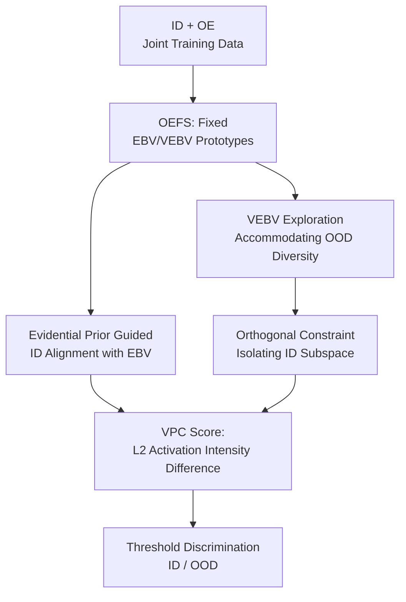

# Let OOD Feature Exploring Vast Predefined Classifiers

**Conference**: ICLR 2026  
**OpenReview**: [https://openreview.net/forum?id=DtkIH5TKe6](https://openreview.net/forum?id=DtkIH5TKe6)  
**Code**: Yes (The paper states it is open-sourced)  
**Area**: Out-of-Distribution Detection  
**Keywords**: OOD Detection, Outlier Exposure, Neural Collapse, Predefined Classifiers, Evidential Learning

## TL;DR
This paper proposes VPC, which utilizes a set of fixed equiangular prototypes to map ID classes and OOD samples into two distinct predefined subspaces. By using the difference in $L_2$ activation intensity between these two subspaces as an OOD score, it consistently reduces FPR95 in Outlier Exposure (OE) training scenarios on CIFAR and ImageNet-1k.

## Background & Motivation
**Background**: The core objective of OOD detection is to identify samples outside the training distribution while maintaining ID classification accuracy. Early methods largely relied on the outputs of trained classifiers, such as maximum softmax probability, energy, Mahalanobis distance, or kNN distance. Recent strong baselines often introduce auxiliary OOD data, known as Outlier Exposure (OE), to jointly train the model on ID data and external anomalies.

**Limitations of Prior Work**: The intuition behind OE is straightforward: classify ID samples normally and ensure the model is not overconfident about OE samples. Classic OE thus pushes OOD outputs toward a uniform distribution, and methods like Energy-OE apply regularization on logits or posterior scores. However, these approaches do not explicitly define the structure of the feature space. The model must use the same set of ID classifiers to distinguish fine-grained ID categories while simultaneously rejecting diverse OOD samples, leading to naturally entangled optimization objectives.

**Key Challenge**: The true distribution of OOD is extremely broad and continuously changing. Requiring only "low confidence" for OE samples does not guarantee they are assigned a sufficiently rich representation space. Consequently, ID features may be disturbed by OE gradients, making it difficult to converge stably to a compact and separable Neural Collapse geometry. OOD features might also merely be compressed near classification boundaries rather than forming a controllable, interpretable, and high-capacity anomaly subspace.

**Goal**: The authors aim to solve two sub-problems. First, how to maintain stable intra-class collapse and inter-class equiangular separation for ID features without interference from OE data. Second, how to provide a dedicated, scalable geometric space for diverse OOD samples instead of merely imposing low-confidence constraints on the ID classification head.

**Key Insight**: The paper builds on Neural Collapse and Equiangular Tight Frame (ETF). Since classification models tend toward a set of equiangular-separated class prototypes in the ideal final stage, it is better to fix this geometric structure in advance: the first set of prototypes serves ID classes, while a much larger second set accommodates OOD features. In this way, OOD detection is no longer just about "how unconfident the model is about ID classes," but "which subspace—ID or OOD—the features actually activate."

**Core Idea**: Replace the purely learnable classification head with a fixed Orthogonal Equiangular Feature Space (OEFS), where ID features align with EBV prototypes and OE features explore the VEBV subspace. The VPC Score is derived from the difference in activation intensity across these two types of predefined classifiers.

## Method

### Overall Architecture
The input to VPC consists of ID classification data and auxiliary OE data, and the output remains a feature model usable for both classification and OOD discrimination. The key change lies not in the data but in the classifier geometry: the model removes the standard learnable classification head and adopts a fixed set of predefined prototypes. The first $K$ EBVs correspond to $K$ ID classes, and the subsequent $V$ VEBVs form the OOD subspace. During training, ID samples are pulled toward their respective EBVs, while OE samples are pushed away from ID EBVs and attracted to the VEBV subspace. During testing, the VPC Score compares the activation intensities of the features in both subspaces.

### Key Designs
**1. OEFS: Pre-arranging ID and OOD Geometric Positions**

Traditional OE methods process OOD samples using the ID classification head, which forces the same set of weights to handle both "classification" and "rejection." VPC instead constructs a fixed set of prototypes $W=\{w_i\}_{i=1}^{K+V}$. These prototypes reside on a unit hypersphere and satisfy the equiangular relationship of a simplex ETF:

$$
w_{k_1}^\top w_{k_2}=\frac{K+V}{K+V-1}\delta_{k_1,k_2}-\frac{1}{K+V-1}.
$$

The first $K$ vectors are Equiangular Basic Vectors (EBV), serving as fixed prototypes for ID classes. The remaining $V$ vectors are Vast EBVs (VEBV), serving as geometric anchors for OOD features. This design decouples the requirements for ID (intra-class compactness and inter-class separation) and OOD (sufficient directional diversity) into two distinct spatial problems.

**2. Evidential Prior Guided ID Alignment: Stabilizing ID Convergence**

If only standard cross-entropy or Neural Collapse loss is used, gradients from OE samples may still interfere with ID feature convergence. The authors introduce concepts from Evidential Deep Learning into feature-prototype alignment. Evidence is derived from the cosine similarity between the normalized ID feature $\hat m_i^{id}$ and the fixed EBV $\hat w_j^{ebv}$:

$$
e^*_{i,j}=\exp\left(\hat m_i^{id\top}\hat w_j^{ebv}/\tau\right),\quad \alpha^*_{i,j}=e^*_{i,j}+1.
$$

The $+1$ uniform prior acts as a buffer for geometric evidence, preventing any class direction from being pushed to extremes too quickly due to short-term gradients. The corresponding ENC loss is defined as $L_{ENC}(x_i^{id})=\sum_{j=1}^K y_{i,j}(\log S_i^* - \log \alpha_{i,j}^*)$, where $S_i^*=\sum_k \alpha^*_{i,k}$. Intuitively, ID samples accumulate strong evidence only when they are angularly aligned with the correct EBV, which is more compatible with the predefined geometry than directly maximizing classification logits.

**3. VEBV Exploration and Orthogonal Constraint: Assigning OOD to a Dedicated Anomaly Subspace**

The value of OE data lies in covering potential anomaly patterns, but classic OE compresses these into "unconfidence across all ID classes," losing directional information. VPC uses a VEBV loss to maximize the $L_2$ projection intensity of OE features within the VEBV subspace:

$$
L_{VEBV}(x_i^{oe})=-\sqrt{\sum_{j=1}^V\left(\hat m_i^{oe\top}\hat w_j^{vebv}\right)^2}.
$$

By minimizing this negative value, the model encourages OE features to activate the VEBV subspace. Crucially, it does not require an OOD sample to stay close to a single OOD prototype; rather, it looks at the norm of the entire VEBV subspace, which better suits the multi-modal and non-exhaustive nature of OOD. Simultaneously, the paper includes an orthogonal constraint $L_{OC}$ to ensure the softmax distribution of OE features over ID EBVs remains uniform, protecting ID decision boundaries.

**4. VPC Score: Assessing Activation across Subspaces**

After training, VPC does not rely on ID class confidence (like MSP). Instead, it calculates the $L_2$ activation intensity of features in the EBV and VEBV subspaces:

$$
\ell^{ebv}_2(x_i)=\left\|[\hat m_i^\top \hat w_1^{ebv},\ldots,\hat m_i^\top \hat w_K^{ebv}]\right\|_2,
\quad
\ell^{vebv}_2(x_i)=\left\|[\hat m_i^\top \hat w_1^{vebv},\ldots,\hat m_i^\top \hat w_V^{vebv}]\right\|_2.
$$

The final score is $S_{VPC}(x_i)=-\alpha\ell^{ebv}_2(x_i)+\beta\ell^{vebv}_2(x_i)$. The paper uses $\alpha=-1,\beta=100$ by default; the more a score leans toward VEBV activation, the more likely the sample is OOD. This score is highly interpretable: ID samples should "light up" the EBV subspace, and OOD samples should "light up" the VEBV subspace.

### Mechanism
Assume training on CIFAR-10 where the number of ID classes is $K=10$. The authors construct $10+1000$ fixed prototypes: the first 10 EBVs correspond to ID classes like airplane and automobile, while the 1000 VEBVs are reserved for OE samples. During training, an airplane image will gradually approach its corresponding EBV via the ENC loss. Meanwhile, an auxiliary anomaly image from 80 Million Tiny Images is not forced to "look like a CIFAR class" but is pushed by $L_{VEBV}$ towards the OOD subspace spanned by VEBVs, with $L_{OC}$ preventing strong bias toward any ID EBV.

During inference, if a sample is correctly from CIFAR-10, the projection norm on the 10 EBVs will be larger, and VEBV activation will be weaker. If it comes from SVHN or Textures, the features will more easily activate the VEBV subspace. The VPC Score combines these intensities into a continuous OOD likelihood.

### Loss & Training
The overall training objective consists of three types of losses: $L_{ENC}$ for ID alignment with EBVs, $L_{VEBV}$ to attract OE features to the VEBV subspace, and $L_{OC}$ to maintain a uniform low bias toward ID EBVs. On CIFAR, WideResNet-40-2, ResNet-18, and DenseNet-121 are used, first with standard pre-training and then fine-tuned with ID/OE data for 50 epochs. On ImageNet-1k, ResNet-50 and ViT-B-16 are used, with auxiliary OOD data from the ImageNet-21k-p validation subset, fine-tuned for 5 epochs. The temperature $\tau$ in all losses is set to 0.1.

The authors also compare different scoring functions: MSP, EDL Prob, Uncertainty, and VPC Score, as well as single-subspace variants.

## Key Experimental Results

### Main Results
The paper covers CIFAR-10/100 and ImageNet-1k, using FPR95, AUROC, and AUPR as metrics. The following table summarizes the average results: VPC is more stable compared to OE, Energy-OE, DAL, and PFS in auxiliary OE settings, particularly in reducing FPR95.

| Setup | Backbone | Method | Avg FPR95↓ | Avg AUROC↑ | ID Acc↑ |
|-------|----------|--------|------------|------------|---------|
| ImageNet-1k | ResNet50 | PFS | 57.85 | 84.13 | 76.02 |
| ImageNet-1k | ResNet50 | VPC | 56.50 | 84.70 | 76.11 |
| ImageNet-1k | ViT-B-16 | DAL | 56.78 | 85.04 | 80.09 |
| ImageNet-1k | ViT-B-16 | VPC | 56.20 | 85.20 | 80.32 |
| CIFAR-10 | WideResNet-40-2 | PFS | 2.68 | 98.66 | - |
| CIFAR-10 | WideResNet-40-2 | VPC | 2.27 | 99.18 | - |
| CIFAR-100 | WideResNet-40-2 | DAL | 32.89 | 93.21 | - |
| CIFAR-100 | WideResNet-40-2 | VPC | 32.04 | 93.65 | - |

In two-stage training, VPC remains stable across different backbones. It performs best overall on WideResNet-40-2 and DenseNet-121 for CIFAR-10 and achieves the lowest FPR95 on ResNet-18. For CIFAR-100, the FPR95 on DenseNet-121 drops from 43.80 (PFS) to 31.17.

| Dataset | Backbone | Strongest Baseline | Baseline FPR95/AUROC/AUPR | VPC FPR95/AUROC/AUPR | Main Change |
|---------|----------|--------------------|---------------------------|-----------------------|-------------|
| CIFAR-10 | WideResNet-40-2 | PFS | 2.68 / 98.66 / 99.65 | 2.27 / 99.18 / 99.81 | Lower FPR95, Higher AUROC/AUPR |
| CIFAR-10 | DenseNet-121 | DAL | 2.58 / 98.72 / 99.71 | 2.10 / 98.86 / 99.77 | Overall improvement on DenseNet |
| CIFAR-100 | WideResNet-40-2 | DAL/PFS | 32.89 / 93.21 / 98.44 or 34.35 / 93.33 / 98.53 | 32.04 / 93.65 / 98.53 | Best FPR95 and AUROC |
| CIFAR-100 | DenseNet-121 | OE | 36.46 / 93.23 / 98.53 | 31.17 / 94.01 / 98.71 | Synchronous improvement across metrics |

### Ablation Study
The authors conducted two key ablations: one on the scale of the VEBV subspace $V$, and one on the loss combinations.

| Config | CIFAR-10 FPR95/AUROC/AUPR | CIFAR-100 FPR95/AUROC/AUPR | Description |
|--------|---------------------------|----------------------------|-------------|
| V=10 / V=100 | 2.68 / 98.96 / 99.75 | 34.89 / 92.78 / 98.39 | Small OOD subspace, limited capacity |
| V=500 | 2.61 / 99.11 / 99.79 | 34.65 / 93.01 / 98.41 | Improvements found by increasing V |
| V=1000 | 2.27 / 99.18 / 99.81 | 32.04 / 93.65 / 98.53 | Optimal for CIFAR-100, default config |
| V=2000 | 2.21 / 99.21 / 99.85 | 32.56 / 93.31 / 98.49 | Continued gain for C10, light decay for C100 |

| Training Loss | CIFAR-10 FPR95/AUROC/AUPR | CIFAR-100 FPR95/AUROC/AUPR | Description |
|---------------|---------------------------|----------------------------|-------------|
| $L_{CE}+L_{OE}$ | 3.44 / 99.05 / 99.79 | 36.14 / 92.76 / 98.38 | Classic OE baseline |
| $L_{NC}+L_{OC}$ | 2.71 / 98.97 / 99.74 | 34.65 / 93.05 / 98.41 | Gains from NC logic and orthogonal constraint |
| $L_{ENC}+L_{OC}$ | 2.68 / 98.96 / 99.75 | 34.89 / 92.78 / 98.39 | Evidential prior alone is insufficient |
| $L_{ENC}+L_{OC}+L_{VEBV}$ | 2.27 / 99.18 / 99.81 | 32.04 / 93.65 / 98.53 | Strongest with VEBV exploration |

### Key Findings
- The benefits of VPC are mainly reflected in the reduction of FPR95, indicating that it excel at reducing "false alarms" where OOD is accepted as ID.
- The scale of the VEBV subspace $V$ is not simply "the larger the better." CIFAR-100 peaks at $V=1000$, as a subspace that is too broad may disperse optimization gradients.
- Loss ablations show $L_{VEBV}$ is the breakthrough. While ID-side NC/ENC and orthogonal constraints improve the baseline, the significant reduction in FPR95 comes from active exploration of the VEBV subspace.
- The VPC Score achieves the highest AUROC and AUPR across three backbones on CIFAR-100, proving the L2 activation difference is more stable than MSP.

## Highlights & Insights
- The major highlight is reframing OOD detection from an "output confidence problem" to a "feature geometric allocation problem."
- The VPC Score is simple yet highly consistent with the training objectives.
- Applying Evidential Learning to feature-prototype alignment rather than just as a tool for output-layer uncertainty calibration is a valuable perspective for tasks like open-set recognition or class-incremental learning.
- The ablation of VEBV quantity provides insight: OOD subspace capacity is a real hyperparameter.

## Limitations & Future Work
- VPC relies on auxiliary OE data. Whether the VEBV subspace can learn useful anomaly patterns without high-quality OE data needs further verification.
- The method requires constructing $K+V$ fixed prototypes, demanding high feature dimensionality. For scenarios with massive categories, this may incur overhead.
- The scale of the VEBV subspace requires tuning. Future work could consider adaptive allocation or hierarchical VEBVs.
- The paper validates primarily on image classification OOD detection. Its efficacy in tasks with complex semantic structures, like NLP or open-vocabulary recognition, remains to be seen.

## Related Work & Insights
- **vs OE**: OE forces OOD outputs to a uniform distribution; VPC assigns OOD to a VEBV subspace. The former is output-layer regularization, whereas the latter is structural separation in feature space.
- **vs Energy-OE**: Energy-OE improves discrimination via energy scores but still relies on logit statistics. VPC Score directly uses $L_2$ activation intensity from predefined subspaces.
- **vs PFS**: PFS also uses Neural Collapse for separation but focuses on ID weights. VPC expands this to $V$ prototypes, explicitly including OOD representation capacity in the geometric design.

## Rating
- Novelty: ⭐⭐⭐⭐ 
- Experimental Thoroughness: ⭐⭐⭐⭐ 
- Writing Quality: ⭐⭐⭐⭐ 
- Value: ⭐⭐⭐⭐ 

<!-- RELATED:START -->

## Related Papers

- [\[CVPR 2026\] Defect Cue-Preserved Structural Feature Refinement for Few-Shot Anomaly Detection](../../CVPR2026/anomaly_detection/defect_cue-preserved_structural_feature_refinement_for_few-shot_anomaly_detectio.md)
- [\[CVPR 2026\] LayoutAD: Exploring Semantic-Geometric Misalignment Reasoning for Scene Layout Anomaly Detection](../../CVPR2026/anomaly_detection/layoutad_exploring_semantic-geometric_misalignment_reasoning_for_scene_layout_an.md)
- [\[ICLR 2026\] PIRN: Prototypical-based Intra-modal Reconstruction with Normality Communication for Multi-modal Anomaly Detection.](pirn_prototypical-based_intra-modal_reconstruction_with_normality_communication_.md)
- [\[ICLR 2026\] Foundation Visual Encoders Are Secretly Few-Shot Anomaly Detectors](foundation_visual_encoders_are_secretly_few-shot_anomaly_detectors.md)
- [\[ICLR 2026\] Adaptive Conformal Anomaly Detection with Time Series Foundation Models for Signal Monitoring](adaptive_conformal_anomaly_detection_with_time_series_foundation_models_for_sign.md)

<!-- RELATED:END -->
