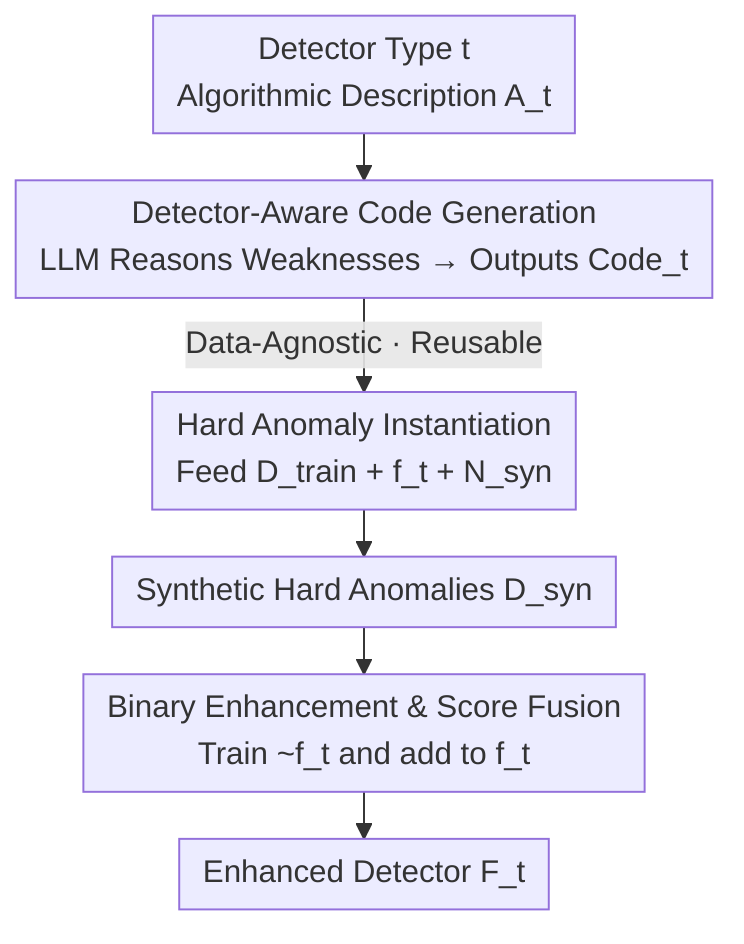

# LLM as an Algorithmist: Enhancing Anomaly Detectors via Programmatic Synthesis

**Conference**: ICLR 2026  
**OpenReview**: [https://openreview.net/forum?id=5rV8ML7Q3r](https://openreview.net/forum?id=5rV8ML7Q3r)  
**Code**: https://github.com/HangtingYe/LLM_DAS  
**Area**: Anomaly Detection / Tabular Data / LLM Code Generation  
**Keywords**: Tabular Anomaly Detection, Hard Anomaly Synthesis, LLM Algorithmic Reasoning, Data-agnostic, Detector Enhancement

## TL;DR
This work repositions the LLM from a "data processor" to an "algorithmic strategist"—it analyzes the algorithmic description of a detector without touching real data, reasons about its logical blind spots, and generates a reusable Python synthesis code. This code creates "hard anomalies" specifically designed to deceive that detector, upgrading the original one-class problem into a more separable two-class problem. It consistently enhances five mainstream detectors across 36 tabular anomaly detection benchmarks.

## Background & Motivation
**Background**: The mainstream paradigm for Tabular Anomaly Detection (TAD) is one-class classification—the training set contains only normal samples, and the model learns a scoring function $f:\mathcal{X}\to\mathbb{R}$ where higher scores represent a higher likelihood of being anomalous. Different methods model this based on specific "how anomalies look" assumptions: reconstruction-based methods like PCA assume anomalies have large reconstruction errors, density-based methods assume anomalies fall into low-density areas, OCSVM draws boundaries around normal data, and IForest assumes anomalies are easily isolated.

**Limitations of Prior Work**: These assumptions are fragile. If an anomaly happens to lie close to the normal manifold (small reconstruction error), hides inside a dense cluster (local anomaly), or forms a small cluster near normal points (isolation paths are no longer short), the corresponding methods fail. Since heterogeneous tabular data is diverse, no fixed assumption is universal, leading to inconsistent performance across scenarios.

**Key Challenge**: Instead of designing "yet another detector with a new assumption"—which would have its own vulnerabilities—a better approach is to systematically make existing detectors more robust by addressing their core logical weaknesses. The key is to generate truly "hard" anomaly samples to fill these blind spots, but the difficulty lies in "how to make them hard enough": data-level approaches like adding small feature perturbations do not fundamentally challenge the detector's algorithmic logic.

**Key Insight**: Using LLMs directly as data processors on tables faces two main issues: LLMs struggle with heterogeneous numerical features, and feeding raw data to LLMs poses significant privacy risks. However, the authors found that the true strength of LLMs lies in **reasoning about abstract algorithmic mechanisms and code generation**. Analyzing high-level logic, such as "IForest relies on axis-aligned splitting to isolate points," to find weaknesses is far more reliable for an LLM than reading rows of feature values.

**Core Idea**: Use the LLM as an "algorithmic strategist"—inputting only the detector's algorithmic description (without any data), letting it reason which types of anomalies the detector is most vulnerable to, and generating **data-agnostic, cross-dataset reusable** Python code for synthesizing hard anomalies. This code is then instantiated on specific datasets to synthesize anomalies and enhance the detector.

## Method

### Overall Architecture
LLM-DAS (LLM-Guided Detector-Aware Anomaly Synthesis) is a two-stage framework that completely **decouples "data-agnostic reasoning" from "data-dependent synthesis."**

- **Stage 1 (Data-agnostic)**: Given a detector type $t$ (e.g., IForest, with an abstract, parameter-free algorithm description $A_t$), a prompt is constructed for Gemini-2.5-Pro to reason about the inherent weaknesses of $A_t$ and output a generic Python synthesis code $\text{Code}_t$. Since the LLM never touches real data or model parameters, privacy is naturally protected, and the code can be reused for any dataset.
- **Stage 2 (Data-dependent)**: The $\text{Code}_t$ is instantiated on a specific dataset by providing the training set $D_{\text{train}}$, the scoring function $f_t$ fitted on that dataset, and the number of anomalies to synthesize $N_{\text{syn}}$. Execution yields a batch of hard anomalies $D_{\text{syn}}^t$. These are merged into the training set to train a binary classification enhancer $\tilde f_t$, which is finally fused with the original detector $f_t$ into an enhanced detector $F_t$.

The key takeaway is that Stage 1 is run only once for each detector type (two LLM calls, see Eq.2 and Eq.3), making the LLM cost negligible when amortized across datasets.

### Key Designs

**1. Algorithmist Positioning: LLM Reads Algorithms, Not Data**

This design directly addresses the two main pain points of using LLMs as data processors: heterogeneous features and privacy. The input to LLM-DAS is the high-level logic of the detector rather than feature values. The prompt $p^t_{\text{code}}=p^t_{\text{description}}+p^t_{\text{objective}}+p^t_{\text{requirements}}$ consists of three parts: (i) $p^t_{\text{description}}$ is first self-generated by the LLM ($p^t_{\text{description}}=\text{LLM}(p^t_{\text{initial}})$, including an algorithm summary and pseudocode) to provide a basis for reasoning; (ii) $p^t_{\text{objective}}$ requires it to synthesize "hard" anomalies, with the **core mechanism being a symbolic interface**. The prompt describes interactions using placeholders (e.g., "The user will provide a trained model `model` exposing `predict_score()` and training samples `X_train`"). Thus, the LLM programs against a standard API, writing generic programs that can query statistics and call the detector without ever seeing real data; (iii) $p^t_{\text{requirements}}$ constrains the code format and functionality. The output $\text{Code}_t=\text{LLM}(p^t_{\text{code}})$ is structured into three parts: synthesis policy $S^t_{\text{policy}}$, executable program $S^t_{\text{program}}$, and explanatory comments $S^t_{\text{explanation}}$.

**2. Boundary Seeds + Controlled Extrapolation: Designing "Hardness"**

The key to synthesizing hard anomalies is not creating an obvious outlier, but creating a sample that is "factually anomalous but looks normal to the detector." The generation requirements encourage the LLM to adopt a heuristic: identify "boundary normal samples" near the decision boundary in the training set as seeds, then mutate them into anomalies. Taking the IForest policy $S^{\text{IForest}}_{\text{policy}}$ as an example: the weakness of IForest is its reliance on axis-aligned splitting; anomalies are isolated quickly. The policy has two steps: first, score all training samples using the fitted $f_t$ and take those with the highest scores (closest to the boundary, where the model is least certain) as seeds; second, perform "controlled extrapolation" to push seeds into sparser regions to make them truly anomalous, while **algorithmically ensuring this move does not significantly shorten their isolation path in IForest**. Anomalies generated this way "disguise" themselves as normal samples to IForest. Simply increasing random noise would create simple anomalies with short paths, failing to address the blind spots.

**3. Binary Enhancement & Score Fusion: Upgrading the Problem Without Loss**

Once hard anomalies are synthesized, they are merged into the training set $D^t_{\text{aug}}=D_{\text{train}}\cup D^t_{\text{syn}}$. A binary classifier $\tilde f_t$ (e.g., a decision tree) is trained to distinguish between normal and anomalous samples. This converts the one-class problem into a more separable binary classification task, forcing the classifier to learn finer discriminative patterns. The original detector is not discarded; instead, the two scores are min-max normalized and summed:

$$F_t(x)=\text{Norm}_{\text{min-max}}(f_t(x))+\text{Norm}_{\text{min-max}}(\tilde f_t(x)).$$

This preserves the original detector's modeling preference for the normal distribution while adding refined boundaries learned from synthetic hard samples. The workflow strictly follows the one-class paradigm since $D_{\text{train}}$ contains only real normal data, and anomalies are entirely synthesized.

### Mechanism: A Walkthrough with IForest
Using IForest: in Stage 1, the LLM is asked how IForest works and what anomalies it struggles with. It writes the `generate_hard_anomalies(n_samples, model, X_train)` code, which embeds the logic of "selecting top-score seeds → controlled extrapolation to maintain path length." Stage 2 fits $f_t$ on the Thyroid dataset, passes the real `model`, `X_train`, and $N_{\text{syn}}$ (default 10% of $D_{\text{train}}$), and executes the code. T-SNE visualization shows these synthetic anomalies (green stars) lie exactly on the boundary of the normal manifold, avoiding obviously sparse outlier regions. KDE shows their original score distributions heavily overlap with normal samples and true anomalies (proving they are "hard"), while scores from the enhanced detector shift the synthetic anomalies far to the right and push the true anomaly distribution further from normal samples, making boundaries tighter and more robust. This IForest code is reused across 35 other datasets without modification.

## Key Experimental Results

### Main Results
On 36 datasets selected from ODDS and ADBench, five source detectors with different assumptions were enhanced (training on 50% normal samples, testing on the rest). Table 1 shows the average Gain of $F_t$ relative to the source detector $f_t$:

| Detector | AUC-PR Baseline | AUC-PR Gain (Abs) | AUC-PR Gain (Rel) | Win Count | p-value |
|----------|-----------------|-------------------|-------------------|-----------|---------|
| PCA      | .5975           | +.0402            | 21.50%            | 30/36     | .0271   |
| IForest  | .5724           | +.0617            | 23.60%            | 26/36     | .0010   |
| OCSVM    | .5295           | +.0723            | 84.49%            | 25/36     | .0239   |
| ECOD     | .5376           | +.0512            | 23.05%            | 28/36     | .0014   |
| DRL      | .7437           | +.0412            | 15.81%            | 25/36     | .0238   |

All five detectors were consistently improved on both metrics, with paired one-tailed t-test p-values mostly < 0.05, indicating statistical significance. Compared to conventional and advanced TAD baselines, LLM-DAS(DRL) achieved the highest average AUC-PR; notably, compared to AnoLLM (which fine-tunes small LLMs on each dataset), Ours achieved better performance with significantly lower computational costs.

### Ablation Study
Three weakened variants were constructed by modifying the prompts (Fig. 4b, AUC-PR):

| Config  | IForest | PCA  | DRL  | Description |
|---------|---------|------|------|-------------|
| Base    | .572    | .597 | .744 | Source Detector |
| Generic | .579    | .593 | .644 | Removed detector principles from prompt |
| Simple  | .604    | .573 | .681 | Disabled `predict_score()`; LLM cannot evaluate difficulty |
| Random  | .481    | .608 | .649 | Mutated random normal samples instead of boundary ones |
| LLM-DAS | .634    | .638 | .785 | Full Method |

All variants performed significantly worse than the full method, proving that detector-awareness, the ability to generate hard anomalies, and focusing on boundary samples are all indispensable. 

Additionally, compared to naive synthesis methods like Gauss, Random outlier, and SMOTE (Fig. 4a), naive methods are unstable: random synthesis occasionally provides small gains for simpler models like IForest but drastically drops DRL (from .744 to .615), indicating that generic strategies can conflict with internal detector logic. LLM-DAS provides stable, significant gains for all three detectors.

### Key Findings
- **Detector-awareness is the winning factor**: Cross-detector experiments (Table 2) showed that using IForest/PCA synthesis code to enhance OCSVM yielded unstable results (dropping 0.1899 on Vowels), while OCSVM enhanced by its own code was most stable (+6.53%). Gain comes from precise utilization of the target detector's mechanism, not generic data augmentation.
- **Hardness is quantitatively verified**: On the Thyroid dataset, the score distribution of synthetic anomalies heavily overlapped with normal/true anomalies, proving they successfully deceived the source detector. After enhancement, the true anomaly distribution was pushed further from the normal distribution.
- **Minimal Cost**: Only two Gemini-2.5-Pro calls per detector type are needed. Code is reused across all datasets, resulting in zero additional monetary cost for instantiation and training.

## Highlights & Insights
- **Repositioning as Innovation**: The approach bypasses the dilemma of "should LLMs read tabular data" by having them read algorithms instead. This simultaneously solves feature heterogeneity, privacy, and reusability. This "strategist over laborer" mindset is transferable to any scenario where models have known algorithmic weaknesses but data cannot be externalized.
- **Symbolic Interface as Engineering Ingenuity**: Using placeholders like `predict_score()` and `X_train` as standard APIs allows the LLM to write generic programs capable of accessing statistics without seeing the data.
- **Perspective Shift**: Converting a one-class problem to binary classification is a classic yet effective maneuver. Hard anomalies serve as the missing negative samples, upgrading the detector from "modeling normal" to "discriminating subtle normal-anomalous differences."

## Limitations & Future Work
- The quality of synthesis policies depends on the LLM's accuracy in reasoning about detector mechanisms; for complex deep detectors with less explainable logic, the effectiveness of LLM-derived weaknesses is uncertain.
- Experiments focused primarily on traditional/medium-scale detectors (PCA/IForest/OCSVM/ECOD/DRL); more evidence is needed for large-scale deep anomaly detection models.
- The synthesis relies on the "boundary seed + controlled extrapolation" heuristic. While the LLM can discover better strategies, the robustness for extremely high-dimensional or strongly categorical features and the sensitivity to $N_{\text{syn}}$ (default 10%) require further systematic analysis.

## Related Work & Insights
- **vs. AnoLLM (Fine-tuning LLM-TAD)**: AnoLLM fine-tunes a small open-source LLM for each target dataset, limited by data access and compute costs. Ours uses the LLM as a data-agnostic algorithmic analyst, generating code once for all datasets with lower cost and better performance.
- **vs. Traditional TAD Detectors**: Traditional detectors rely on fragile assumptions. Ours does not replace them but acts as a plug-and-play module to **enhance** them by targeting their respective blind spots.
- **vs. Naive Anomaly Synthesis (Gauss/Random/SMOTE)**: Naive methods perturb data at the feature level without logic-awareness, which can be harmful to complex detectors. Ours is customized at the logic level, ensuring synthetic anomalies remain informative.

## Rating
- Novelty: ⭐⭐⭐⭐⭐ "LLM as an algorithmic strategist reading algorithms, not data" is a clean and rare paradigm shift.
- Experimental Thoroughness: ⭐⭐⭐⭐⭐ 36 datasets × 5 detectors, including ablation, cross-detector analysis, visualization, and significance testing.
- Writing Quality: ⭐⭐⭐⭐ The framework and symbolic interfaces are well-explained, and the formulas align well with the cases.
- Value: ⭐⭐⭐⭐⭐ Plug-and-play, privacy-friendly, and low cost, making it highly practical for industrial tabular anomaly detection.

<!-- RELATED:START -->

## Related Papers

- [\[ICLR 2026\] Foundation Visual Encoders Are Secretly Few-Shot Anomaly Detectors](foundation_visual_encoders_are_secretly_few-shot_anomaly_detectors.md)
- [\[CVPR 2026\] Multi-Prototype Compactness and Boundary-Aware Synthesis for Unsupervised Anomaly Detection](../../CVPR2026/anomaly_detection/multi-prototype_compactness_and_boundary-aware_synthesis_for_unsupervised_anomal.md)
- [\[ICLR 2026\] ReTabAD: A Benchmark for Restoring Semantic Context in Tabular Anomaly Detection](retabad_a_benchmark_for_restoring_semantic_context_in_tabular_anomaly_detection.md)
- [\[ICLR 2026\] MRAD: Zero-Shot Anomaly Detection with Memory-Driven Retrieval](mrad_zero-shot_anomaly_detection_with_memory-driven_retrieval.md)
- [\[ICLR 2026\] Low Rank Transformer for Multivariate Time Series Anomaly Detection and Localization](low_rank_transformer_for_multivariate_time_series_anomaly_detection_and_localiza.md)

<!-- RELATED:END -->
