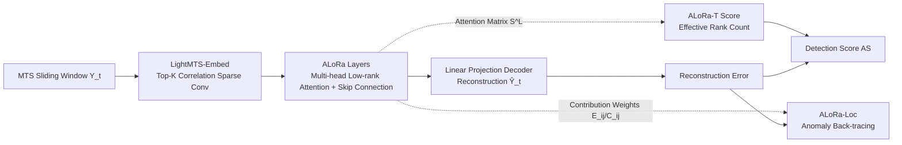

# Low Rank Transformer for Multivariate Time Series Anomaly Detection and Localization

**Conference**: ICLR 2026  
**OpenReview**: [https://openreview.net/forum?id=ZtPIBpVojC](https://openreview.net/forum?id=ZtPIBpVojC)  
**Code**: [https://github.com/CharisShimillas/ALoRa](https://github.com/CharisShimillas/ALoRa)  
**Area**: Time Series / Multivariate Anomaly Detection and Localization  
**Keywords**: Multivariate time series, anomaly detection, anomaly localization, low-rank regularization, self-attention, interpretability  

## TL;DR
This paper theoretically maps the learning process of Transformer encoders on multivariate time series to the classical STAR statistical model. It proposes ALoRa-T, which applies low-rank regularization to self-attention, using the "rank" of the attention matrix as an anomaly signal for detection and tracing anomalies back to specific variables for localization using interpretable contribution weights.

## Background & Motivation
- **Background**: Multivariate Time Series (MTS) anomaly diagnosis is critical for the safety and reliability of large-scale systems such as industrial control, IT monitoring, and aerospace telemetry. It involves two sub-tasks: anomaly detection (identifying when anomalies occur) and anomaly localization (identifying which variables caused the anomaly). Reconstruction-based deep models (LSTM-VAE, OmniAnomaly, MEMTO, etc.) and Transformer-based methods (Anomaly-Transformer, SARAD) have become mainstream.
- **Limitations of Prior Work**: (1) What Transformers "learn" on MTS is largely a black box, lacking theoretical characterization, which hinders trust in safety-critical scenarios; (2) Anomaly localization is a high-value but long-neglected direction; most methods directly rank variables by reconstruction error, but **anomalies propagate across variables**, contaminating the true anomaly source; (3) The widely used point-adjustment evaluation in the industry inflates metrics, making even random scores look "strong."
- **Key Challenge**: To achieve accurate, **interpretable, and localizable** anomaly diagnosis, one must first understand the learning dynamics of Transformers. Existing methods suffer from a disconnect between "theoretical explanation ↔ detection score ↔ localization attribution."
- **Goal**: Establish a theoretical analysis of Transformer encoders on MTS and design a unified anomaly diagnosis method that supports both detection and localization with inherent interpretability.
- **Key Insight**: **[Theory-driven]** Prove that the latent space of self-attention (with or without skip connections) is equivalent to the classical **STAR (Spatio-Temporal AutoRegressive)** structure; **[Low-rank signal]** Observe that the rank of the self-attention matrix increases during anomalies, prompting the explicit use of low-rank regularization to amplify this difference as an anomaly signal; **[Propagation attribution]** Use analytically derived contribution weights $E_{ij}, C_{ij}$ to back-trace anomalies along the propagation chain to the source variables.

## Method

### Overall Architecture
The method consists of two modules: **ALoRa-Det** (Detection) = LightMTS-Embed + Multi-head Low-Rank Attention layers (ALoRa layers) + Linear Reconstruction Decoder. The training objective is "reconstruction error + low-rank regularization," and the inference uses the effective rank of the attention matrix to construct the anomaly score. **ALoRa-Loc** (Localization) reuses the contribution weights (input → latent space → reconstruction) analyzed from the same model to weight and aggregate reconstruction errors into localization scores. Both share the same theoretical foundation (STAR equivalence in Section 4).

### Key Designs

**1. STAR Equivalence: Giving Transformer Latent Space a Statistical Identity.** The paper proves that the 1D convolution in the embedding layer is equivalent to a learnable Vector Moving Average (VMA) filter. By expanding the residual attention, the latent representation is derived as $Z_t = A_t \tilde Y_{[t]} B$ (without skip connections), where $A_t = S^{(L)}_{t,:}S^{(L-1)}\cdots S^{(1)}$ is the input-dependent attention multiplication and $B=W^{(V,1)}\cdots W^{(V,L)}$ is a data-independent learnable parameter. Proposition 1 proves that each latent sequence $z^{(j)}_t=\sum_k b_{kj}\sum_q a_{tq}\tilde y^{(k)}_q$ matches the STAR model form, with the difference being that STAR uses fixed lag weights while Transformers estimate these weights dynamically via Q/K. With skip connections, it becomes a linear combination of multiple STAR processes. The feed-forward layer does not change this structure, providing the theoretical basis for **omitting the feed-forward layer** to reduce complexity.

**2. Low-Rank Regularization & "Rank as Anomaly" Score: Turning Spectral Properties into Alarms.** Since the self-attention matrix in $A_t$ is the only input-dependent learnable component, its spectral properties reflect anomalies. The authors empirically observed that the rank of the attention matrix increases in anomalous windows. Thus, the truncated Geman nuclear norm is used as the ALoRa loss to penalize redundant singular values: $L_{\text{ALoRa}}(S^{(l)})=\sum_{i=r+1}^{T}\frac{\sigma^{(l)}_i}{\sigma^{(l)}_i+1}$. Since $S^{(l)}$ is row-stochastic and its largest singular value is always 1, $r=1$ is used to avoid penalizing the first singular value. In multi-head cases, the average attention $S^{(l)}=\frac1H\sum_h S^{(l)}_h$ is used. The total loss $L_{\text{Total}}=\|Y-\hat Y\|_F^2+\lambda_{\text{reg}}\sum_l L_{\text{ALoRa}}(S^{(l)})$ compresses normal windows into low-rank representations while highlighting the high rank of anomalous windows. During inference, the detection score is $AS(y_t)=\|y_t-\hat y_t\|_2^2\cdot \text{ALoRa-T}(y_t;S^{(L)})$, where $\text{ALoRa-T}=\sum_i \mathbb{1}\{\sigma^{(L)}_i>h_1\}$ counts the number of effective singular values. This score reflects time-domain anomaly characteristics earlier and more reliably.

**3. Propagation-Aware Localization via Contribution Weights: Tracing Anomalies to the Source.** Localization is difficult because anomalies propagate from source variables to others; ranking by reconstruction error often leads to misattribution. This paper derives two sets of weights from the STAR equivalence: Input → Latent space $E_{ij}=\sum_k(\sum_l w^{(k)}_{i,l})b_{kj}$ characterizes the influence of input sequence $i$ on latent feature $j$; Latent space → Reconstruction $C_{ij}=\sum_k w^{out}_{kj}E_{ik}$ extends this to the output. The localization score is defined as $LAS^{(i)}_t=\sum_j C_{ij}\|y^{(j)}_t-\hat y^{(j)}_t\|_2^2$, measuring the magnitude of variable $i$'s anomaly propagating to variable $j$'s reconstruction. In practice, summing over the top-k dimensions with the largest $C_{ij}$ focuses on key propagation paths. These weights also provide interpretability for model decisions.

**4. LightMTS-Embed Sparse Embedding: Trading Correlation Structure for Efficiency.** Standard 1D convolutions use dense filters to mix all sequences, which is expensive and uninterpretable. The authors limit each convolutional kernel to aggregate **exactly two** input sequences (only two non-zero weights per kernel) and keep only the top-K pairs based on Spearman correlation in the training set (usually $K=512$). This design maintains performance while significantly reducing the number of parameters and enhancing sparsity—on the HAI dataset, parameters were reduced from 108M to 3.2M.

## Key Experimental Results

### Main Results (Detection, affiliation-based F1)

| Method | SMD | PSM | MSL | SWaT | HAI |
|------|-----|-----|-----|------|-----|
| Anomaly Transformer | 0.70 | 0.66 | 0.67 | 0.45 | 0.56 |
| MEMTO | 0.79 | 0.68 | 0.67 | 0.60 | 0.64 |
| NPSR | 0.87 | 0.76 | 0.68 | 0.28 | 0.79 |
| D3R | 0.87 | 0.76 | 0.64 | 0.71 | 0.79 |
| SARAD | 0.78 | 0.56 | 0.67 | 0.41 | 0.66 |
| **Ours (ALoRa-Det)** | **0.97** | **0.82** | **0.72** | 0.68 | **0.86** |

Ours achieves SOTA on four out of five datasets. On SWaT, it is second but still significantly leads most methods. Compared to the second best, F1 absolute gains on SMD/PSM/MSL/HAI are 11.5%/7.8%/5.9%/8.9% respectively.

### Localization Table (HR/NDCG/IPS @100, 150)

| Method | SMD HR@100 | SMD IPS@100 | MSDS NDCG@100 | SWaT IPS@100 |
|------|-----------|-------------|---------------|--------------|
| SARAD | 0.44 | 0.55 | 0.31 | 0.11 |
| DAEMON | 0.26 | 0.24 | 0.27 | 0.06 |
| AERCA | 0.21 | 0.13 | 0.31 | 0.028 |
| **Ours (ALoRa-Loc)** | **0.56** | **0.60** | **0.32** | **0.16** |

Ours generally leads existing methods on localization tasks (including AERCA, which specializes in localization).

### Ablation Study

| Configuration | SMD | PSM | MSL | SWaT | HAI |
|------|-----|-----|-----|------|-----|
| Full (Loss✓ + Score✓) | 0.97 | 0.82 | 0.72 | 0.68 | 0.86 |
| w/o ALoRa-Loss | 0.95 | 0.74 | 0.69 | 0.61 | 0.82 |
| w/o ALoRa-Score | 0.944| 0.69 | 0.69 | 0.55 | 0.67 |

LightMTS-Embed on HAI: Top-K config (3.2M parameters) / F1 0.86 vs. All-pairs (108M parameters) / F1 0.85—Top-K uses 30x fewer parameters with almost no performance drop.

### Key Findings
- Low-rank regularization significantly amplifies the attention rank difference between normal and anomalous windows, serving as the main source of detection gain. Removing the Score results in a larger drop than removing the Loss, indicating the importance of the "rank count" score.
- ALoRa-T scores trigger alarms earlier (shorter waiting time), whereas scores from MEMTO/Anomaly Transformer are closer to random guessing.
- Top-K Spearman correlation selection is more efficient and accurate than Pearson or all-pairs, validating the sparse embedding design.

## Highlights & Insights
- **Theory-Method Loop**: This is not a "trick followed by an explanation" but rather a derivation from STAR equivalence to determine "why attention rank serves as an anomaly signal," "why FF layers can be omitted," and "how to analytically obtain contribution weights."
- **Turning Interpretability into Localizability**: $E_{ij}/C_{ij}$ are not just post-hoc explanations but directly constitute the propagation-aware localization score, addressing the "anomaly propagation contaminating attribution" pain point.
- **Honest Evaluation**: Explicitly rejects point-adjustment which inflates metrics, using affiliation-based/range-based F1 for more credible conclusions.

## Limitations & Future Work
- The empirical observation "rank increase = anomaly" lacks a rigorous necessary and sufficient characterization; whether certain anomaly types (e.g., slow drift) manifest as rank changes is not fully discussed.
- LightMTS-Embed limits each kernel to two sequences and relies on the correlation structure of the training set, which may lose information in high-dimensional strongly coupled systems or non-stationary correlations.
- Hyperparameters like thresholds $h_1, h_2$, preserved singular value count $r$, and top-K need tuning; robustness during cross-domain transfer requires verification. Localization was only evaluated on 3 datasets.

## Related Work & Insights
- **Reconstruction-based Anomaly Detection**: OmniAnomaly, InterFusion, and MSCRED use encoder-decoders to learn normal patterns and judge anomalies by reconstruction error. Ours belongs to this category but introduces an additional spectral signal.
- **Transformer Detection Scores**: Anomaly-Transformer's AssDis, MEMTO's LSD, and SARAD's SAR represent mining attention/memory statistics. The "effective rank of attention" is a new path backed by STAR theory.
- **Localization Methods**: OmniAnomaly/SARAD rank reconstruction errors, InterFusion uses MCMC correction, DAEMON uses integrated gradients, and AERCA specializes in localization. Ours unifies detection and localization via parsed contribution weights with explicit propagation modeling.
- **Insight**: Mapping deep model latent spaces back to classical statistical models (STAR/VMA) is a cost-effective route to obtain interpretability and new detection signals, generalizable to other sequence modeling tasks.

## Rating
- **Novelty**: ⭐⭐⭐⭐ — STAR equivalence + attention rank as an anomaly signal + analytical contribution weights for localization. Both theory and method are novel; the spectral perspective is rare.
- **Experimental Thoroughness**: ⭐⭐⭐⭐ — 6 datasets, rich baselines, dual tasks (detection/localization), honest metrics, and efficiency analysis. Localization datasets are somewhat limited, and hyperparameter sensitivity analysis is slightly lacking.
- **Writing Quality**: ⭐⭐⭐⭐ — Motivation-Theory-Method-Experiment logic is tight; diagrams are clear. The theory section is dense and requires a statistical background.
- **Value**: ⭐⭐⭐⭐ — Provides accuracy, interpretability, and localizability simultaneously in safety-critical MTS diagnosis, offering practical significance for industrial deployment.

<!-- RELATED:START -->

## Related Papers

- [\[ICLR 2026\] Adaptive Conformal Anomaly Detection with Time Series Foundation Models for Signal Monitoring](adaptive_conformal_anomaly_detection_with_time_series_foundation_models_for_sign.md)
- [\[ICLR 2026\] ReTabAD: A Benchmark for Restoring Semantic Context in Tabular Anomaly Detection](retabad_a_benchmark_for_restoring_semantic_context_in_tabular_anomaly_detection.md)
- [\[ICLR 2026\] MRAD: Zero-Shot Anomaly Detection with Memory-Driven Retrieval](mrad_zero-shot_anomaly_detection_with_memory-driven_retrieval.md)
- [\[ICLR 2026\] Foundation Visual Encoders Are Secretly Few-Shot Anomaly Detectors](foundation_visual_encoders_are_secretly_few-shot_anomaly_detectors.md)
- [\[ICLR 2026\] UniOD: A Universal Model for Outlier Detection across Diverse Domains](uniod_a_universal_model_for_outlier_detection_across_diverse_domains.md)

<!-- RELATED:END -->
