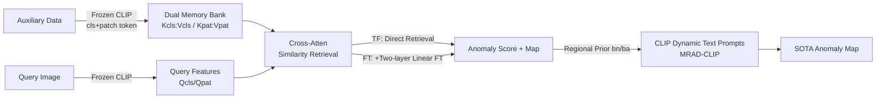

# MRAD: Zero-Shot Anomaly Detection with Memory-Driven Retrieval

**Conference**: ICLR 2026  
**OpenReview**: [https://openreview.net/forum?id=TQkFiW3AEX](https://openreview.net/forum?id=TQkFiW3AEX)  
**Code**: [https://github.com/CROVO1026/MRAD](https://github.com/CROVO1026/MRAD)  
**Area**: Anomaly Detection / Zero-Shot / Vision-Language Models  
**Keywords**: Zero-Shot Anomaly Detection, Memory Bank, Feature Retrieval, CLIP, Prompt Learning  

## TL;DR
MRAD replaces the parametric fitting of $p(y|x)$ in mainstream ZSAD with "similarity retrieval from a feature-label memory bank." The training-free version suppresses WinCLIP, and combined with two linear fine-tuning layers and dynamic prompts injected with regional priors, it achieves SOTA across 16 industrial and medical datasets.

## Background & Motivation
**Background**: Zero-Shot Anomaly Detection (ZSAD) aims to align general features from pre-trained VLMs like CLIP to "normal/anomaly" semantics without target domain supervision. Mainstream approaches follow two paths: manual prompt-ensemble (e.g., WinCLIP, CLIP-AD) and learning-based prompt-optimization for domain adaptation (e.g., AnomalyCLIP, AdaCLIP, FAPrompt).

**Limitations of Prior Work**: These methods essentially **use a newly trained component to fit the conditional distribution $p(y|x)$**, leading to three issues: (1) Prompt learning, feature engineering, and visual branch fine-tuning increase architectural complexity, which weakens generalization and raises computational costs; (2) Relying solely on auxiliary learners to fit the distribution results in **information loss from the original data**; (3) Dynamic prompts are highly sensitive to the source of dynamic information, directly affecting pixel-level segmentation and text-vision alignment.

**Key Challenge**: Parametric fitting is a form of lossy compression—it compresses the empirical distribution of training data into model weights, where subtle differences between normal and anomalous states are smoothed out. Conversely, ZSAD requires preserving these minor variations for cross-domain discrimination.

**Goal**: Instead of "fitting" the distribution, Ours **directly accesses the empirical distribution of auxiliary data** for anomaly detection while maintaining low training/inference costs and cross-domain stability.

**Key Insight**: Cross-dataset analysis reveals that when using patch features from dataset A as queries and features from dataset B as keys, the similarity under a frozen CLIP consistently satisfies $\text{NqNk} > \text{AqNk}$ and $\text{AqAk} > \text{NqAk}$ (normal queries are more similar to normal keys, and anomalous queries to anomalous keys). This suggests that **the similarity to normal/anomalous feature sets is itself a stable discriminative signal**. Based on this, **similarity retrieval replaces parametric fitting**: feature-label pairs are explicitly stored in a memory bank as key/values, and anomaly scores are retrieved directly during inference.

## Method

### Overall Architecture
MRAD is a progressive framework ranging from "training-free" to "lightweight fine-tuning" and "prompt enhancement": MRAD-TF freezes CLIP and constructs a dual-level feature-label memory bank (image-level and pixel-level) from auxiliary data, relying purely on similarity retrieval for anomaly scores and maps. MRAD-FT inserts two linear layers into the retrieval metric for lightweight fine-tuning to enlarge the normal/anomaly margin. Finally, MRAD-CLIP injects regional priors generated by MRAD-FT into CLIP's learnable text prompts as dynamic biases to strengthen generalization and localization for unseen categories.

### Key Designs

**1. Dual-level Feature-Label Memory Bank: Replacing "Classifier" with "Retrievable Original Distribution"**. MRAD deconstructs the frozen CLIP image encoder into a global branch $\phi_{cls}$ (outputting class tokens) and a local branch $\phi_{vv}$ (V-V attention outputting patch tokens), sharing pre-trained weights. For each image in the auxiliary set: image-level memory stores global features $k_i^{cls}$ paired with one-hot labels $e_{norm}/e_{anom}$; pixel-level memory averages patch features inside and outside anomalous regions into two regional prototypes, $\mu_i^{anom}$ (patches with mask=1) and $\mu_i^{norm}$ (patches with mask=0), which are then stored with labels. All features undergo $\ell_2$ normalization to stabilize retrieval. The essence is **using regional prototypes instead of whole-image features as pixel-level keys**, which both compresses storage (e.g., VisA only requires 2162/3093 entries) and makes local normal/anomalous semantics explicitly searchable.

**2. Retrieval-based Discrimination in MRAD-TF: Softmax Attention as a Classifier**. Given query global/patch features $Q_{cls}, Q_{pat}$, classification and segmentation logits are obtained using a unified retrieval formula: $Y_{cls}^{n/a}=[\text{softmax}(Q_{cls}K_{cls}^\top/\tau)V_{cls}]_{n/a}$ and $Y_{seg}^{n/a}=[\text{softmax}(Q_{pat}K_{pat}^\top/\tau)V_{pat}]_{n/a}$. The anomaly channel $Y_{seg}^a$ serves as the stable anomaly similarity signal $s_{anom}(q)$, which becomes the anomaly map $\hat{M}$ after upsampling. The final image-level score combines global retrieval with high-confidence regional aggregation: $S(I)=Y_{cls}^a+\text{TopKMean}(\hat{M})$, using the top-k mean to highlight anomalous regions and suppress noise. This process involves zero training and zero fitting.

**3. Lightweight Metric Fine-tuning in MRAD-FT + Similarity Dropout**: Because the margin between normal/anomaly in TF is small, two linear mappings $W_q, W_k \in \mathbb{R}^{d \times d}$ are inserted to replace $QK^\top$ with $(QW_q)(KW_k)^\top$ to calibrate the retrieval metric. A clever addition is **similarity dropout** $M_\rho(\cdot)$ during training—setting the top-$\rho\%$ logits of each query's similarity to $-\infty$ (while keeping all during inference). This prevents trivial self-matching within a single dataset and forces the model to learn robust discrimination from less similar features. The loss is a joint classification and segmentation term: $\mathcal{L}=\text{BCE}(Y_{cls},y)+\text{Dice}(Y_{seg},M)+\text{Focal}(Y_{seg},M)$, trained for only 1 epoch.

**4. Regional Prior Dynamic Prompts in MRAD-CLIP: Ensuring Reliable "Dynamic" Sources**. After adding $E$ learnable context tokens before "good object"/"damaged object" templates to form class-agnostic static prompts, MRAD-FT's anomaly map thresholds are used to segment normal/anomalous regions of the query image. Patch features from each region are averaged into prototypes and projected via lightweight linear layers as biases $b_n/b_a$, which are added to each context token to generate image-specific dynamic prompts $P_{dyn}^{n/a}$. After text encoding, prompt-conditioned cosine classification is performed: $Y_{seg}^{n/a}=\text{softmax}(\frac{1}{\tau}[\cos(t_{norm},Q_{pat}),\cos(t_{anom},Q_{pat})])$. Only the text side is trained. Compared to CoCoOp's use of global class tokens, MRAD-CLIP uses **explicit regional priors** as biases, which ablation proves is key to localization accuracy and generalization.

## Key Experimental Results

### Main Results (Average across 16 datasets; A/B are P-AUROC/PRO and I-AUROC/I-AP)

| Method | Setting | Pixel-level (P-AUROC/PRO) | Image-level (I-AUROC/I-AP) |
|---|---|---|---|
| WinCLIP (CVPR'23) | train-free | 73.0 / 42.9 | 75.1 / 73.2 |
| **MRAD-TF (Ours)** | train-free | **85.5 / 64.6** | **81.0 / 83.2** |
| AdaCLIP (ECCV'24) | train-based | 85.6 / 26.2 | 87.8 / 86.3 |
| AnomalyCLIP (ICLR'24) | train-based | 91.0 / 75.7 | 90.1 / 88.9 |
| FAPrompt (ICCV'25) | train-based | 90.7 / 75.6 | 91.3 / 91.2 |
| **MRAD-FT (Ours)** | train-based | 91.9 / 78.3 | 92.0 / 91.9 |
| **MRAD-CLIP (Ours)** | train-based | **92.7 / 80.1** | **92.7 / 92.5** |

Note: Image-level metrics for the medical domain are partially averaged due to incomplete tables; trends remain consistent.

### Ablation Study (Source of Dynamic Prompt Bias, Selected from 4 Datasets)

| Bias Source (bn/a) | MVTec Pixel | MVTec Image | Kvasir Pixel | HeadCT Image |
|---|---|---|---|---|
| static (=AnomalyCLIP baseline) | 91.5/82.9 | 92.0/96.3 | 83.5/49.5 | 96.1/97.0 |
| + class token (like CoCoOp) | 86.2/54.9 | 89.6/95.1 | 79.0/45.2 | 90.4/90.8 |
| + cross-patch | 92.5/85.7 | 93.0/96.9 | 83.0/50.0 | 97.4/97.6 |
| + anomaly prior | 92.8/85.2 | 93.6/97.3 | 83.7/51.8 | 96.5/96.7 |
| **+ dual prior (Final)** | **93.0/86.8** | **94.0/97.4** | **84.3/52.7** | 97.1/97.6 |

### Key Findings
- **Strength of Training-Free**: MRAD-TF improves pixel-level performance from WinCLIP's 73.0/42.9 to 85.5/64.6, proving that "directly accessing empirical distributions" is more effective than fitting, even approaching some trained methods.
- **Monotonic Improvement**: The TF→FT→CLIP progression shows outward expansion on radar charts across six industrial datasets. FT mainly improves discrimination, while CLIP enhances pixel-level localization.
- **Global Features as Counter-examples**: Using class tokens as dynamic biases actually dropped MVTec pixel performance from 91.5 to 86.2, indicating that ZSAD requires local regional priors rather than global features.
- **Memory Efficiency**: Reducing patch memory from Full to $n=100$ only reduces pixel-AUROC by decimals; MRAD-CLIP is more stable with small memory sizes.
- **Low Cost**: CLIP ViT-L/14-336 is frozen throughout. MRAD-FT requires only 1 epoch and MRAD-CLIP 5 epochs, both runnable on a single RTX 3090.

## Highlights & Insights
- **Paradigm Shift**: Reconceptualizes ZSAD from "fitting $p(y|x)$" to "retrieving empirical distributions," philosophically similar to Tip-Adapter's cache retrieval but extended from closed-set classification to open-set anomaly detection.
- **Empirically Supported Motivation**: Quantitatively proves "retrievability" via cross-dataset similarity statistics ($\text{AqAk}>\text{NqAk}$ stability) before designing the method.
- **Extensibility of a Unified Framework**: Offers users choices based on computational budgets—from pure table lookups to SOTA performance—in an engineering-friendly manner.
- **Similarity Dropout**: A simple but crucial training trick to prevent trivial self-matching when training on a single auxiliary dataset.

## Limitations & Future Work
- Retrieval quality depends on the coverage and diversity of the auxiliary dataset. The empirical distribution of a single set may be insufficient given extreme cross-domain differences; future work may expand to larger datasets and incremental settings.
- While the memory bank is small, it still requires storing raw features. Retrieval and storage costs will scale linearly with larger auxiliary datasets, and the paper lacks discussion on approximate nearest neighbor (ANN) search.
- Regional priors in MRAD-CLIP come from MRAD-FT anomaly maps, leading to potential error propagation.
- Based entirely on CLIP ViT-L/14; the validity of the paradigm on smaller backbones or non-CLIP VLMs remains unverified.

## Related Work & Insights
- **Lineage**: Follows prompt adaptation (CLIP/CoOp/CoCoOp) and cache retrieval (Tip-Adapter), paralleling dynamic prompt routes (AnomalyCLIP/AdaCLIP), but takes a unique path via "training-free retrieval."
- **Inspiration**: In tasks with sparse supervision and a need for cross-domain stability, "preserving and retrieving original empirical distributions" may be more robust and efficient than "compressing distributions into parameters."
- **Transferable Strategy**: Using a strong training-free baseline, followed by lightweight fine-tuning to pull margins and prior injection for prompt enhancement, constitutes a generic recipe for approaching SOTA at low cost.

## Rating
- **Novelty**: ⭐⭐⭐⭐ — Reframes ZSAD as memory retrieval with empirical motivation. Similarities to Tip-Adapter prevent a full score.
- **Experimental Thoroughness**: ⭐⭐⭐⭐⭐ — 16 datasets (industrial + medical), four metrics, full ablation of TF/FT/CLIP, bias sources, and memory scale.
- **Writing Quality**: ⭐⭐⭐⭐ — Logical flow from motivation to experiments; however, memory bank and cross-attention details are dense.
- **Value**: ⭐⭐⭐⭐ — Strong training-free baseline, reproducible on a single GPU, and open-source. Provides a scalable new baseline for "retrieval-based anomaly detection."

<!-- RELATED:START -->

## Related Papers

- [\[CVPR 2026\] RAID: Retrieval-Augmented Anomaly Detection](../../CVPR2026/anomaly_detection/raid_retrieval-augmented_anomaly_detection.md)
- [\[ICLR 2026\] Foundation Visual Encoders Are Secretly Few-Shot Anomaly Detectors](foundation_visual_encoders_are_secretly_few-shot_anomaly_detectors.md)
- [\[CVPR 2026\] Defect Cue-Preserved Structural Feature Refinement for Few-Shot Anomaly Detection](../../CVPR2026/anomaly_detection/defect_cue-preserved_structural_feature_refinement_for_few-shot_anomaly_detectio.md)
- [\[ICLR 2026\] ReTabAD: A Benchmark for Restoring Semantic Context in Tabular Anomaly Detection](retabad_a_benchmark_for_restoring_semantic_context_in_tabular_anomaly_detection.md)
- [\[ICLR 2026\] Low Rank Transformer for Multivariate Time Series Anomaly Detection and Localization](low_rank_transformer_for_multivariate_time_series_anomaly_detection_and_localiza.md)

<!-- RELATED:END -->
