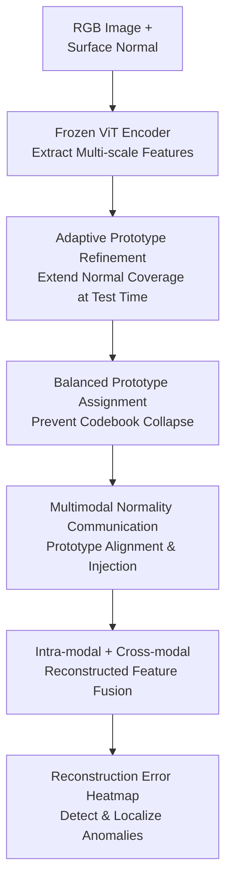

# PIRN: Prototypical-based Intra-modal Reconstruction with Normality Communication for Multi-modal Anomaly Detection.

**Conference**: ICLR 2026  
**OpenReview**: [https://openreview.net/forum?id=7L7kmHHfgf](https://openreview.net/forum?id=7L7kmHHfgf)  
**Code**: Not public (Code link not provided in the cached content)  
**Area**: Multimodal Anomaly Detection / Few-shot Industrial Inspection / 3D Vision  
**Keywords**: Multimodal anomaly detection, few-shot learning, prototypical reconstruction, optimal transport, RGB-3D fusion

## TL;DR
PIRN targets few-shot multimodal industrial anomaly detection for RGB images and 3D surface normals. It reconstructs normal features of each modality using adaptive prototype codebooks and enhances texture and geometric cues through cross-modal normality communication, achieving superior detection and localization performance on MVTec 3D-AD, Eyecandies, and Real-IAD D3.

## Background & Motivation
**Background**: Multimodal anomaly detection (MAD) typically utilizes both RGB appearance and 3D geometric information. Industrial defects may manifest as textural changes (e.g., stains, scratches) or geometric deformations (e.g., dents, bumps, or broken edges). Combining 2D and 3D modalities provides better coverage of these complementary signals than single-modality approaches.

**Limitations of Prior Work**: Existing MAD methods generally follow two paths. One learns dense cross-modal mappings between RGB and 3D; at test time, discrepancies in cross-modal prediction indicate anomalies. The other stores a memory bank of normal samples and scores anomalies based on the distance from test features to the nearest neighbors. While effective with full training data, these methods are fragile in few-shot scenarios: cross-modal mappings may overfit narrow correlations in limited samples, and memory banks struggle to cover the natural appearance and geometric variations of normal samples, often causing false positives for unseen but normal patterns.

**Key Challenge**: Few-shot MAD requires two seemingly conflicting capabilities. On one hand, the model must be conservative, only allowing normal patterns to be reconstructed (otherwise, anomalies would be perfectly restored, rendering reconstruction error useless). On the other hand, the model cannot simply memorize training samples because real test objects exhibit normal textural and geometric variations not covered in the training set. The key is not just "how many samples to store," but how to learn a normality representation that is both compact and appropriately extensible.

**Goal**: Ours aims to solve RGB+3D anomaly detection and localization with limited normal samples. It needs to filter anomalous information within each modality using a limited number of prototypes to cover diverse normal patterns, while allowing RGB and 3D to assist each other at the "normality" level rather than relying on hard-to-learn patch-to-patch dense correspondences.

**Key Insight**: The authors abstract normal patterns into a set of learnable prototype codebooks. Prototypes are more compact than memory banks and provide a more effective information bottleneck than standard autoencoders: input features must be projected into combinations of finite prototypes before reconstruction. If anomalous regions do not belong to the normal prototype space, they leave large reconstruction errors. In few-shot scenarios, the authors utilize Optimal Transport (OT) to prevent prototype collapse and employ gated updates during testing to extend normal coverage, performing RGB-3D communication at the prototype level.

**Core Idea**: Replace dense cross-modal alignment and large-scale memory banks with "prototypical intra-modal normal reconstruction + prototype-level cross-modal normality communication," maintaining the normality bottleneck required for anomaly detection under few-shot data constraints.

## Method
### Overall Architecture
The input to PIRN consists of an RGB image and a surface normal map generated from point clouds. Patch features are extracted from each modality using frozen DINOv2 ViT encoders. Subsequently, a cascaded prototype-aware decoder executes adaptive prototype refinement, balanced prototype assignment, and cross-modal normality communication in each layer to output reconstructed features. During testing, the cosine distance between the original encoded features and reconstructed features generates anomaly heatmaps, and the scores from the RGB and surface normal branches are summed for the final result.

Specifically, the RGB and surface-normal branches each maintain $K$ prototypes (default $K=10$). The input to the first decoder layer is the encoder outputs $E_{rgb}$ and $E_{sn}$, while subsequent layers take the reconstructed tokens from the previous layer. Each layer refines prototypes using confident normal contexts from the current sample, reconstructs tokens within the modality, and uses "normal prototypes" from one modality as high-level prompts for the other.

### Key Designs
**1. Adaptive Prototype Refinement (APR): Absorbing Unseen Normal Variations via Gated Updates**

Prototype codebooks trained on few samples naturally suffer from insufficient coverage. Static prototypes will treat unseen but normal textures or geometries as anomalies, leading to false positives. APR treats prototypes as lightweight-updateable normal memories. In each decoder layer, patch tokens are matched with prototypes via Optimal Transport (OT), and a small set of context tokens corresponding to each prototype is aggregated.

Instead of simple averaging, OT weights provide the context for each prototype: $c_k = \sum_n \bar{\Gamma}^{*}_{nk} z_n$. Since anomalous tokens tend not to match any normal prototype, OT distributes them across multiple prototypes, weakening their specific contribution. APR then fuses the old prototype $p_k$ with context $c_k$ into a new prototype $p'_k$ using a GRU. The GRU gate acts as a safety valve: allowing updates when the context is consistent with the prototype, but retaining the old prototype when the context is suspicious.

**2. Balanced Prototype Assignment (BPA): Leveraging Optimal Transport for Effective Reconstruction**

Directly using softmax attention to let patch tokens choose prototypes causes "codebook collapse," where a few common normal patterns attract most tokens while other prototypes remain unused. This narrows the coverage of normal variations. BPA formulates token-to-prototype matching as a balanced Optimal Transport problem. With a cost matrix of cosine distances $C_{nk}=1-\frac{z_n\cdot p_k}{\|z_n\|\|p_k\|}$, it solves for a transport plan $T^*$ that assigns tokens to similar prototypes while ensuring every prototype receives an approximately equal allocation.

Formally, BPA solves $T^*=\arg\min_T \sum_{n,k}T_{nk}C_{nk}$ subject to $T\mathbf{1}_K=a$ and $T^\top\mathbf{1}_N=b$, using the Sinkhorn algorithm. After obtaining $T^*$, the intra-modal reconstruction for each patch is $z^{bpa}_n=\sum_k T^*_{nk}p_k$. This projects input tokens back into the normal prototype space: normal tokens find close combinations, while anomalous tokens are forced toward normal prototypes, creating a significant discrepancy.

**3. Multimodal Normality Communication (MNC): Aligning RGB and 3D at the Prototype Level**

RGB and 3D are highly complementary, but dense patch alignment is unstable in few-shot settings. MNC exchanges normality knowledge at the prototype level instead. It treats RGB and surface-normal prototypes as a graph with $2K$ nodes, connects similar prototypes via cross-modal KNN, and uses a Graph Attention Network (GAT) for message passing to bring prototypes representing similar normal structures closer.

Following alignment, MNC performs cross-modal normality injection. Each modality first purifies its original tokens using $Z^{bpa}$ at the channel level: $Z'=Z\cdot\sigma(Z^{bpa})$. Then, the purified tokens of one modality act as queries to attend to the aligned prototypes (keys/values) of the other via cross-attention. For example, the RGB branch reads geometric normality cues from surface-normal prototypes: $Z^{mnc}_{rgb}=Z'_{rgb}+g_{rgb}\cdot CA(Z'_{rgb},P'_{sn})$, where $g_{rgb}=\tanh(\gamma_{rgb})$ is a learnable gate.

**4. Reconstruction-based Anomaly Scoring: Mapping Bottlenecks to Error Maps**

PIRN does not classify anomalies directly but compares encoded and reconstructed features. In each decoder layer, the intra-modal reconstruction $Z^{bpa}$ and cross-modal purified reconstruction $Z^{mnc}$ are summed to form $Z^{rec}$. Training involves only normal samples to minimize the cosine distance between patch embeddings and reconstructed embeddings. 

During inference, for modality $m\in\{rgb,sn\}$, the $i$-th patch score is $d_i^{(m)}=1-\cos(E_i^{(m)}, Z_{i}^{rec,(m)})$. The patch-level scores from both branches are upsampled and summed to obtain the fused anomaly heatmap. The image-level score is the maximum value in the heatmap.

### Loss & Training
During the training phase, only normal samples are used. The implementation employs two frozen DINOv2 ViT-B/14 encoders. Patch tokens from layers 2 to 10 are aggregated for multi-scale features. The decoder consists of $L=2$ cascaded layers with $K=10$ prototypes per modality. Few-shot experiments run for 60 epochs, while all-shot experiments run for 8 epochs using the Adam optimizer with a learning rate of $1\times10^{-4}$.

The loss is primarily an intra-modal feature reconstruction loss. The implementation uses a soft mining loss similar to INP-Former, minimizing the spatial cosine distance between encoded features $E$ and reconstructed features $Z^{rec}$.

## Key Experimental Results

### Main Results
Evaluations were conducted on MVTec 3D-AD, Eyecandies, and Real-IAD D3. PIRN shows significant advantages in few-shot scenarios.

| Dataset / Setting | Metric | Ours | Prev. SOTA | Gain |
|--------|------|------|----------|------|
| MVTec 3D-AD / 5-shot | AUROCI | 0.890 | 0.851 (INP-Former) | +0.039 |
| MVTec 3D-AD / 10-shot | AUROCI | 0.922 | 0.885 (INP-Former) | +0.037 |
| MVTec 3D-AD / 50-shot | AUROCI | 0.945 | 0.921 (INP-Former) | +0.024 |
| MVTec 3D-AD / all-shot | AUROCI | 0.963 | 0.954 (CFM) | +0.009 |
| Eyecandies / 5-shot | AUROCI | 0.895 | 0.859 (INP-Former) | +0.036 |
| Eyecandies / 10-shot | AUROCI | 0.912 | 0.872 (INP-Former) | +0.040 |

On Real-IAD D3 (full-data), PIRN achieves an average AUROCI of 0.873 and a top AUROCP of 0.961, indicating superior localization.

### Ablation Study
Ablations on MVTec 3D-AD (10-shot) show that MNC is the most critical module.

| Configuration | AUROCI | AUROCP | AUPRO | Note |
|------|---------|---------|-------|------|
| w/o BPA / APR / MNC | 0.828 | 0.976 | 0.952 | Base reconstruction only |
| w/o BPA | 0.883 | 0.990 | 0.956 | Insufficient coverage |
| w/o APR | 0.916 | 0.990 | 0.961 | Lower test-time adaptation |
| w/o MNC | 0.867 | 0.988 | 0.947 | No cross-modal complementarity |
| Full PIRN | 0.922 | 0.991 | 0.966 | All modules active |

### Key Findings
- **MNC is crucial**: Removing MNC leads to the largest performance drop, highlighting that simple dual-stream summation is insufficient without prototype-level communication.
- **Balanced OT is superior**: Compared to softmax attention (0.832 AUROCI), balanced OT (0.922) effectively prevents codebook collapse.
- **High Efficiency**: On MVTec 3D-AD, PIRN's latency is 17.49ms, significantly lower than FIND (76.09ms), with higher accuracy.

## Highlights & Insights
- **From Patch Alignment to Prototype Communication**: PIRN avoids the risks of dense cross-modal alignment in few-shot settings by exchanging high-level normal concepts.
- **BPA addresses prototype failure modes**: Using OT to force balanced utilization of prototypes ensures that each prototype represents a distinct normal pattern.
- **Cautious Adaptation via APR**: The mechanism handles normal variations (lighting, pose) during testing without unconstrained training, reducing the risk of absorbing anomalies into the codebook.

## Limitations & Future Work
- **Dependency on Surface Normals**: High-quality 3D data is required; performance may degrade in scenarios with high depth noise.
- **Defect-Free Training**: The method does not explore incorporating few-shot anomalous labels or semi-supervised settings.
- **Scalability**: MNC currently handles two modalities. Extending this to more sensors might require a more generalized prototype-graph communication mechanism.

## Related Work & Insights
- **vs CFM / LSFA**: These methods learn cross-modal mappings. PIRN focuses on normal reconstruction, which is more robust when dense correspondences are unreliable.
- **vs M3DM / SG-DM**: Memory-bank methods suffer from low coverage in few-shot settings. PIRN uses prototypes and test-time refinement to mitigate this.
- **vs INP-Former**: While borrowing the prototypical reconstruction idea, PIRN extends it to multimodal RGB-3D scenarios with specific modules for balance and communication.

## Rating
- Novelty: ⭐⭐⭐⭐☆ Combines OT, test-time refinement, and prototype communication effectively for few-shot MAD.
- Experimental Thoroughness: ⭐⭐⭐⭐⭐ Comprehensive evaluation across three major datasets with detailed efficiency and ablation analysis.
- Writing Quality: ⭐⭐⭐⭐☆ Clear motivation, though the multiple components require careful reading to grasp the full workflow.
- Value: ⭐⭐⭐⭐⭐ High practical value for industrial settings where few normal samples are available.

<!-- RELATED:START -->

- INP-Former: Intrinsic Normal Prototype Transformer for Anomaly Detection (2023)
- M3DM: Multi-modal Memory-based Discrete Matching for Anomaly Detection (CVPR 2023)
- FIND: Feature Interpolation and Normalization for Multimodal Anomaly Detection (2024)

<!-- RELATED:END -->

## Related Papers

- [\[CVPR 2026\] Hunting Normality from Query Sample via Residual Learning for Generalist Anomaly Detection](../../CVPR2026/anomaly_detection/hunting_normality_from_query_sample_via_residual_learning_for_generalist_anomaly.md)
- [\[CVPR 2026\] Multi-Prototype Compactness and Boundary-Aware Synthesis for Unsupervised Anomaly Detection](../../CVPR2026/anomaly_detection/multi-prototype_compactness_and_boundary-aware_synthesis_for_unsupervised_anomal.md)
- [\[CVPR 2026\] Dual-Prototype-Guided Multi-task Learning for Unsupervised Anomaly Detection and Classification](../../CVPR2026/anomaly_detection/dual-prototype-guided_multi-task_learning_for_unsupervised_anomaly_detection_and.md)
- [\[ICLR 2026\] ReTabAD: A Benchmark for Restoring Semantic Context in Tabular Anomaly Detection](retabad_a_benchmark_for_restoring_semantic_context_in_tabular_anomaly_detection.md)
- [\[ICLR 2026\] MRAD: Zero-Shot Anomaly Detection with Memory-Driven Retrieval](mrad_zero-shot_anomaly_detection_with_memory-driven_retrieval.md)

<!-- RELATED:END -->
