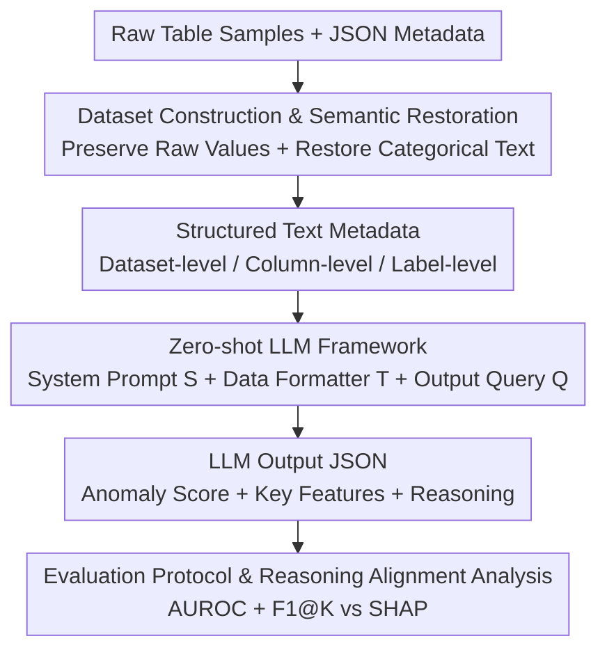

# ReTabAD: A Benchmark for Restoring Semantic Context in Tabular Anomaly Detection

**Conference**: ICLR 2026  
**OpenReview**: [https://openreview.net/forum?id=UFwgg44VZq](https://openreview.net/forum?id=UFwgg44VZq)  
**Code**: https://yoonsanghyu.github.io/ReTabAD/  
**Area**: Tabular Anomaly Detection / Benchmark / Large Language Models  
**Keywords**: Tabular Anomaly Detection, Semantic Context, Text Metadata, Zero-shot LLM, Explainability

## TL;DR
ReTabAD is the first "context-aware" tabular anomaly detection benchmark. It restores discarded textual semantics (feature descriptions, domain knowledge, original categorical values) into 20 curated datasets, provides implementations for 20 classic/deep/LLM-based algorithms, and proposes a training-free zero-shot LLM framework. Experiments demonstrate that semantic context improves detection AUROC by an average of 7.6 percentage points, allowing zero-shot LLMs to approach Prev. SOTAs.

## Background & Motivation

**Background**: Tabular anomaly detection (AD) is a fundamental task in fields such as finance, cybersecurity, manufacturing, and healthcare. Mainstream evaluations rely on benchmarks like DAMI Repository and ADBench, along with algorithm libraries like PyOD and DeepOD, which provide standardized numerical datasets and algorithm comparisons.

**Limitations of Prior Work**: These benchmarks were born under the old "numerical-only" paradigm—they force categorical features into arbitrary integer encodings or discard non-numerical fields. More critically, they **completely remove text metadata**: feature meanings, units of measurement, domain constraints, and original categorical semantics. In reality, expert judgment of anomalies relies heavily on this information. A resting heart rate of 200 bpm in an adult is immediately recognizable as a critical medical anomaly, but after normalization, it only retains the meaning of being "statistically rare," losing all clinical significance.

**Key Challenge**: The definition of an anomaly is inherently **context-dependent**. Without understanding feature semantics and domain constraints, models may misjudge benign deviations as anomalies or miss subtle but fatal ones. Existing benchmarks provide only numerical data points without semantics, preventing the "context-aware" research direction from even having a measurable foundation. Even LLM-based methods like AnoLLM, which attempt to utilize semantics, can only access column names because richer text annotations are missing in benchmarks.

**Goal**: The authors address three sub-problems: (1) How to construct a high-quality tabular AD benchmark that preserves and structures semantics; (2) How to enable models to truly utilize these semantics; (3) To what extent semantics contribute to detection performance and reasoning explainability, and which type of semantics is most useful.

**Key Insight**: The authors observe that LLMs have recently gained significant capabilities in the "textual representation of numerical values" and contextual reasoning. They argue that instead of continuing to compete on model architectures in purely numerical settings, it is better to **restore semantics to the data** and use LLMs to upgrade anomaly detection from "statistical pattern matching" to "high-level contextual understanding."

**Core Idea**: Replace "discarding semantics + numerical-only modeling" with "restoring text semantics + zero-shot LLM reasoning," allowing models to define anomalies based on semantics like domain experts.

## Method

### Overall Architecture

ReTabAD is essentially a benchmark plus a corresponding baseline, consisting of four components: (1) 20 curated tabular datasets, each restored with original numerical values, categorical text, and structured metadata; (2) 20 unsupervised AD algorithm implementations covering classic, deep, and LLM categories; (3) A training-free zero-shot LLM framework serving as a strong baseline for "context-aware AD"; (4) A unified evaluation protocol (one-class setting + AUROC + reasoning alignment analysis). The pipeline input consists of raw tables with semantics + JSON metadata, and the output includes anomaly scores, key features, and textual reasoning for each sample.

The zero-shot LLM framework is the primary contribution of this work, converting samples into prompts for LLM inference. The pipeline is as follows:

### Key Designs

**1. Dataset Construction & Semantic Restoration: Bringing Raw Values and Categorical Text Back to Life**

To address the loss of semantics in benchmarks, ReTabAD selects 20 datasets based on the ADBench scope. Selection criteria include: clear domain with ground truth labels, moderate scale reflecting real-world class imbalance, sufficient documentation to restore reliable descriptions, and avoiding trivial datasets where performance is saturated. Two principles are followed: **Raw Numerical Preservation**—no unexplained normalization/standardization to keep values like "heart rate 200 bpm" readable; **Categorical Text Restoration**—restoring categorical features to original text values rather than integer encodings or embeddings, allowing models to reason based on human-understandable categories.

**2. Structured Text Metadata: Coding Domain Knowledge into Verifiable JSON**

Each dataset is paired with a JSON metadata file organized in three levels: **Dataset-level** provides name, purpose, source, and collection method with original links; **Column-level** provides human-readable descriptions, logical types (numerical/categorical/ordinal/binary), and units, all cross-verified with documentation; **Label-level** defines normal and anomalous classes based directly on original documents. This structured metadata is the information missing in old benchmarks but used daily by practitioners, serving as the prerequisite for "context-aware AD."

**3. Zero-shot LLM Framework: Prompting with "Role + Semantic Context + Guidelines"**

This baseline aims to let LLMs perform AD using semantics without any task-specific training. For each sample $x_i$, the prompt consists of: **System Prompt $S$** (Role definition $S_{role}$ + Semantic context $C$ + Analysis guidelines $S_{guideline}$), where $C$ includes domain knowledge $C_{domain}$, feature descriptions $C_{feature}$, and normal statistics $C_{statistic}$ (ranges derived from normal training data); **Data Formatter $T(x_i)$** serializes samples into readable text like "Record i: [feature\_name\_1=value\_1], ..."; **Structured Output Query $Q$** requires a JSON return: $\{\text{anomaly\_score}: s,\ \text{key\_features}: F,\ \text{reasoning}: e\}$, where $s \in [0, 1]$ is the score, $F$ is a list of key features, and $e$ is the explanation. This formalizes detection as a metadata-aware scoring function $f(x, M)$.

**4. Evaluation Protocol & Reasoning Alignment Analysis: Measuring Performance and Reasoning Quality**

ReTabAD uses a one-class setting: the training set contains 50% normal samples, and the test set contains the remaining normal samples + all anomalies. The main metric is AUROC. **Reasoning Alignment Analysis** is designed to evaluate if LLM-identified key features are truly driving the anomaly: an XGBoost model is trained on ground truth labels to calculate SHAP values for each anomaly. The top-$K$ SHAP features $R_i^{(K)}$ are compared with the LLM's top-$K$ predicted features $\hat{F}_i^{(K)}$ using $\text{F1@}K$ as a proxy for "domain-informed reasoning."

## Key Experimental Results

### Main Results

Comparison of training-based methods and Zero-shot LLM (Gemini-2.5-pro) on 20 datasets. Full Desc includes full metadata; No Desc removes metadata descriptions:

| Method | Type | Average AUROC | Average Rank |
|------|------|---------------|--------------|
| MCM | Deep (Prev. SOTA) | 0.825 | 3.95 |
| NeuTraL | Deep | 0.818 | 4.30 |
| SLAD | Deep | 0.817 | 5.50 |
| OCSVM | Classic | 0.803 | 5.35 |
| AnoLLM | LLM (Column names only) | 0.769 | 7.35 |
| **Zero-shot LLM (Full Desc)** | LLM | **0.847** | **4.10** |
| Zero-shot LLM (No Desc) | LLM | 0.691 | 10.80 |

The zero-shot LLM achieves an average AUROC of 0.847 without any training, approaching or slightly exceeding the training-based Prev. SOTA (MCM). Improvements are particularly significant in datasets like "glioma" where most features are binary; LLMs can understand the clinical significance of "ATRX mutation present" versus a raw value of 1.

### Ablation Study

**Overall effect of metadata** (Average AUROC across 20 datasets for 5 LLMs):

| Evaluator LLM | No Desc | Full Desc | Gain |
|---------------|---------|-----------|------|
| GPT-4o-mini | 0.692 | 0.726 | +3.4 |
| GPT-4.1 | 0.696 | 0.735 | +3.9 |
| Claude-3.7-sonnet | 0.725 | 0.777 | +5.2 |
| Qwen3-235B | 0.665 | 0.747 | +8.2 |
| Gemini-2.5-pro | 0.691 | 0.847 | +15.6 |

Adding semantic context consistently brings gains across all models (+7.6 avg). Reasoning-heavy models (Qwen3, Gemini) show the largest relative gains.

**Context type ablation** (Win Rate based on AUROC):

| Configuration | $C_{statistic}$ | $C_{feature}$ | $C_{domain}$ | Win Rate (Gemini-2.5-pro) |
|------|------|------|------|------|
| Type A (No Desc) | ✓ | ✗ | ✗ | 0.05 |
| Type B | ✓ | ✓ | ✗ | 0.00 |
| Type C | ✗ | ✓ | ✓ | 0.15 |
| Type D (Full Desc) | ✓ | ✓ | ✓ | 0.80 |

Full semantics (Type D) yields the highest win rate. Providing only domain knowledge (Type C) results in inconsistent performance, suggesting statistical context is essential for stable reasoning.

### Key Findings
- **Statistical context is the foundation, semantics are the amplifier**: Features alone (A→B) usually provide gains, but domain knowledge alone (Type C) is unstable. The explosion in synergy occurs when combined with normal statistics (Type D).
- **Reasoning alignment increases with semantics**: On F1@K, the "glioma" F1@1 jumps from 0.009 (Type A) to 0.551 (Type D), proving semantics help LLMs capture actual biomarkers/business factors driving anomalies.
- **Reasoning quality can be utilized**: Feeding Type D reasoning from high-confidence anomalies as few-shot examples further improves AUROC, showing that high-quality, domain-relevant reasoning self-corrects the detection.
- **Semantics allow "extrapolation" of knowledge**: In the "cirrhosis" example, metadata only provided "Prothrombin time," but the LLM inferred that prolonged time indicates impaired liver synthesis—a diagnostic step from the model's internal prior, not the metadata.

## Highlights & Insights
- **Redefining "discarded semantics" as a research resource**: While prior works treated tabular AD as a purely numerical problem, this paper argues that "anomaly is context" and restores metadata systematically.
- **Compelling Zero-shot performance**: A non-trained LLM baseline matching training-based SOTAs suggests that information richness may be more critical than model architecture in certain AD scenarios.
- **Quantifiable reasoning evaluation**: Using XGBoost+SHAP as "ground truth attribution" and F1@K to quantify LLM feature alignment is a clever trick to make explainability scorable.
- **Metadata hierarchy + traceability**: The three-level JSON with direct links to sources ensures credibility and facilitates reproducibility.

## Limitations & Future Work
- **Dependency on metadata quality**: Selection and verification of the 20 datasets relied on manual effort, limiting the scale compared to ADBench (57 datasets).
- **LLM cost and reproducibility**: Dependency on closed-source models (GPT-4/Gemini) involves high costs and potential version drift.
- **Caveat in comparisons**: The comparison between zero-shot LLMs and trained models is not perfectly equal since LLMs use external semantic information.
- **Potential data leakage**: Many datasets are from public repositories (e.g., UCI). The extent to which performance stems from "memory" versus "reasoning" remains partially unclear.
- **Future directions**: Automating metadata construction; using open-source models; designing protocols to isolate memory effects.

## Related Work & Insights
- **vs ADBench / DAMI**: Prior benchmarks pushed numerical AD through scale but discarded text metadata. ReTabAD focuses on "quality over quantity," restoring semantics to enable "context-aware" evaluation.
- **vs PyOD / DeepOD**: These are algorithm libraries without semantic data. ReTabAD provides a combined resource of data, algorithms, metadata, and LLM pipelines.
- **vs AnoLLM**: AnoLLM explored LLMs for tabular AD but was limited to column names. ReTabAD demonstrates that richer semantics (domain knowledge/statistics) further unlock LLM potential.

## Rating
- Novelty: ⭐⭐⭐⭐⭐ First context-aware tabular AD benchmark; solid perspective shift.
- Experimental Thoroughness: ⭐⭐⭐⭐ Extensive cross-comparison; strong ablation and alignment analysis.
- Writing Quality: ⭐⭐⭐⭐ Clear motivation and compelling case studies.
- Value: ⭐⭐⭐⭐⭐ Opens a new measurable research direction with public resources.

<!-- RELATED:START -->

## Related Papers

- [\[CVPR 2026\] LayoutAD: Exploring Semantic-Geometric Misalignment Reasoning for Scene Layout Anomaly Detection](../../CVPR2026/anomaly_detection/layoutad_exploring_semantic-geometric_misalignment_reasoning_for_scene_layout_an.md)
- [\[ICLR 2026\] LLM as an Algorithmist: Enhancing Anomaly Detectors via Programmatic Synthesis](llm_as_an_algorithmist_enhancing_anomaly_detectors_via_programmatic_synthesis.md)
- [\[ICLR 2026\] MRAD: Zero-Shot Anomaly Detection with Memory-Driven Retrieval](mrad_zero-shot_anomaly_detection_with_memory-driven_retrieval.md)
- [\[ICLR 2026\] Low Rank Transformer for Multivariate Time Series Anomaly Detection and Localization](low_rank_transformer_for_multivariate_time_series_anomaly_detection_and_localiza.md)
- [\[ICLR 2026\] Adaptive Conformal Anomaly Detection with Time Series Foundation Models for Signal Monitoring](adaptive_conformal_anomaly_detection_with_time_series_foundation_models_for_sign.md)

<!-- RELATED:END -->
## Related Papers

- [\[CVPR 2026\] LayoutAD: Exploring Semantic-Geometric Misalignment Reasoning for Scene Layout Anomaly Detection](../../CVPR2026/anomaly_detection/layoutad_exploring_semantic-geometric_misalignment_reasoning_for_scene_layout_an.md)
- [\[ICLR 2026\] Low Rank Transformer for Multivariate Time Series Anomaly Detection and Localization](low_rank_transformer_for_multivariate_time_series_anomaly_detection_and_localiza.md)
- [\[ICLR 2026\] MRAD: Zero-Shot Anomaly Detection with Memory-Driven Retrieval](mrad_zero-shot_anomaly_detection_with_memory-driven_retrieval.md)
- [\[ICLR 2026\] Adaptive Conformal Anomaly Detection with Time Series Foundation Models for Signal Monitoring](adaptive_conformal_anomaly_detection_with_time_series_foundation_models_for_sign.md)
- [\[ICLR 2026\] Foundation Visual Encoders Are Secretly Few-Shot Anomaly Detectors](foundation_visual_encoders_are_secretly_few-shot_anomaly_detectors.md)

<!-- RELATED:END -->
