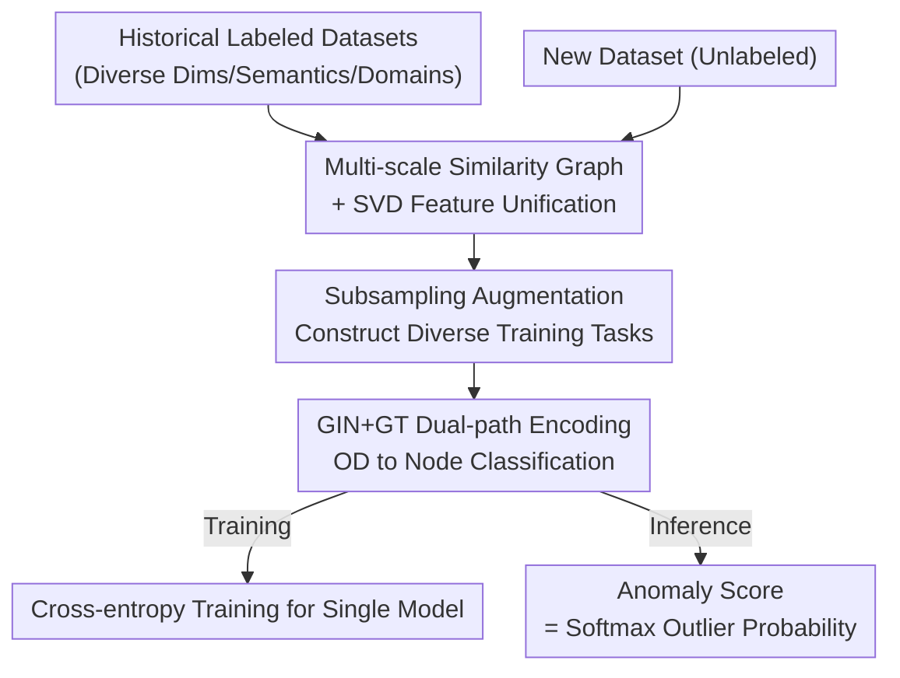

# UniOD: A Universal Model for Outlier Detection across Diverse Domains

**Conference**: ICLR 2026  
**OpenReview**: [https://openreview.net/forum?id=Eu25AOvORb](https://openreview.net/forum?id=Eu25AOvORb)  
**Code**: https://github.com/fudazhiaka/UniOD  
**Area**: Anomaly Detection / Outlier Detection / Tabular Data / Graph Neural Networks  
**Keywords**: Universal Outlier Detection, Similarity Graph, SVD Feature Unification, Node Classification, Generalization Bound  

## TL;DR
UniOD trains **one** universal outlier detection model using a batch of historical labeled datasets. It first unifies tabular datasets of any dimension or semantics into "multi-scale similarity graphs + SVD features," then transforms outlier detection into node binary classification using a GIN+GT dual-path graph network. Once trained, the model performs **training-free and parameter-tuning-free** inference for any unseen new dataset, achieving average AUROC/AUPRC scores that outperform 17 baselines across 30 benchmarks with lower latency.

## Background & Motivation
**Background**: Outlier Detection (OD / Anomaly Detection) is a fundamental task in science and engineering. Mainstream methods are divided into traditional approaches (LOF, Isolation Forest, KDE, kNN, OC-SVM, etc.) and deep approaches (DeepSVDD, NeutralAD, PLAD, DPAD, ICL, etc.). Their common paradigm is **dataset-specific**: for every new dataset, a new model must be trained or fitted from scratch.

**Limitations of Prior Work**: This "one-model-per-dataset" paradigm has three major flaws. First, **parameter tuning is extremely difficult**—in unsupervised scenarios without validation labels, the optimal combination of network depth, width, learning rate, and method-specific hyperparameters varies wildly across datasets (Figure 2 shows a method's AUROC dropping from 90% to 30% on a different dataset). Second, **deployment costs are high**—re-training or re-fitting every dataset is slow for large-scale data. Third, **historical knowledge is wasted**—patterns of "what constitutes an inlier vs. an outlier" hidden in massive historical datasets are completely ignored by traditional paradigms.

**Key Challenge**: Current methods treat each dataset as an island, failing to reuse knowledge across datasets while incurring re-training costs for each. The fundamental obstacle to building a "universal model" is that different datasets have **different feature dimensions, semantics, and sample sizes** (e.g., healthcare features do not align with finance features), making it impossible to feed them directly into the same network. Existing transfer learning methods (like LOCIT) require high similarity between source and target domains and matched feature spaces, which is rarely satisfied in practice.

**Goal**: To train a cross-domain universal OD model that provides results for any new tabular dataset without re-training or parameter tuning. This requires solving two sub-problems: (1) How to unify datasets with heterogeneous dimensions/semantics into comparable inputs; (2) How to enable a single model to learn universal outlier patterns across datasets.

**Key Insight**: The authors observe that **similarity graphs eliminate original feature dimensions and semantics**. Converting a dataset into a point-to-point similarity matrix leaves only the "relative structure between samples," which is comparable across datasets of different dimensions. Using SVD to extract unified-dimensional embeddings then yields features aligned across datasets. Consequently, outlier detection naturally becomes a node binary classification problem on a graph.

**Core Idea**: Use "multi-scale similarity graphs + SVD" to unify heterogeneous datasets into common-dimensional node features. Use GIN+GT to reformulate OD as node classification, training a single model on historical labeled data to perform direct inference on unseen datasets.

## Method

### Overall Architecture
The goal of UniOD is to train a universal model that is **completely decoupled** from specific test datasets. Given a set of historical labeled datasets $D_H=\{D_{H_1},\dots,D_{H_M}\}$ (each with inlier/outlier labels) and unlabeled test datasets $D_T$, the pipeline consists of three steps: **Feature Unification → Graph Encoding and Node Classification → Training/Inference**.

Training Phase: For each historical dataset, multi-scale Gaussian similarity matrices are constructed using $K$ different bandwidths $\sigma$. SVD is applied to each matrix to obtain node features of a unified dimension $d$. Simultaneously, subsampling augmentation is applied to each dataset to expand the variety of training tasks. Each dataset is then treated as a graph structure and fed into $K$ GINs (using the similarity matrix as the adjacency) and $K$ Graph Transformers (GT). These are concatenated into node embeddings and passed through an MLP+softmax to predict whether each node is an inlier or outlier, trained via cross-entropy.

Inference Phase: A new dataset undergoes the **exact same** graph construction process (same multi-scale similarity matrices + SVD) and is fed directly into the pre-trained GIN/GT/MLP. The "outlier probability" from the softmax output serves as the anomaly score—no parameter optimization or hyperparameter selection is needed for the new dataset.

### Key Designs

**1. Multi-scale Similarity Graph + SVD Feature Unification: Eliminating dimension and semantic discrepancies**

This is the foundation for universality, addressing the obstacle where heterogeneous datasets cannot be fed into the same model. For each dataset $D_{H_i}$, a similarity matrix is constructed using a Gaussian kernel $A^{(a,b)}_{H_i,\sigma}=\exp\!\big(-\|x^{(a)}-x^{(b)}\|^2/2\sigma^2\big)$. Two issues arise: bandwidth $\sigma$ selection is difficult, and compressing the dataset into a single matrix loses information. The solution is **multi-scale**: $K$ bandwidths $\sigma_k=\beta_k\bar\sigma$ are used (where $\bar\sigma$ is the mean distance between points and $\beta_k \approx 1$) to generate $K$ similarity matrices. SVD is then applied to each to extract the top $d$ dimensions:

$$A_{H_i,\sigma_k}=U\,\mathrm{diag}(\lambda_1,\dots,\lambda_{n})\,V^\top,\quad X_{H_i,\sigma_k}=[u_1,\dots,u_d]\,\mathrm{diag}(\lambda_1^{1/2},\dots,\lambda_d^{1/2})$$

Concatenating these yields unified node features $\tilde X_{H_i}\in\mathbb{R}^{n_{H_i}\times Kd}$. Efficiency: The similarity matrix preserves "relative structure," naturally decoupling from original dimensions and semantics. Thus, healthcare and finance datasets become comparable in the SVD embedding space. Multi-bandwidth captures both local (small $\sigma$) and global (large $\sigma$) structures, reducing information loss—theoretically supported (see below) by the fact that larger $K$ reduces training error within the generalization bound.

**2. Subsampling Augmentation: Creating diverse training tasks from limited historical data**

The generalization of a universal model depends on the diversity of training tasks, but available labeled historical datasets are limited. The authors use a simple yet effective augmentation: randomly sampling 60% of each historical dataset $D_{H_i}$ while **maintaining the anomaly ratio** to create 5 synthetic datasets (denoted as $\mathrm{Subsampling}(D_{H_i})$). This expands each historical dataset into a family of structurally similar but distinct "tasks" without additional labeling costs, significantly increasing training distribution coverage. This works synergistically with Design 1—because the data is unified as a graph, subsampling can cheaply produce diverse graph-structured samples.

**3. GIN+GT Dual Encoding, Formulating OD as Node Classification: Exploiting similarity information**

While node features $\tilde X$ could be classified via MLP, that would discard the structural information in the similarity matrix $A$. Instead, each dataset is viewed as graph data: $\{A_{H_i,\sigma_k}\}$ as adjacency matrices and $\{X_{H_i,\sigma_k}\}$ as node features. OD thus becomes **binary node classification**. The model utilizes two parallel paths—$K$ GINs (level $L_1$, explicitly utilizing adjacency) and $K$ GT Graph Transformers (level $L_2$, capturing global dependencies):

$$Z^{GIN}_{H_i}=\mathrm{GIN}_{\theta_1}(\tilde X_{H_i},A_{H_i}),\quad Z^{GT}_{H_i}=\mathrm{GT}_{\theta_2}(\tilde X_{H_i}),\quad Z_{H_i}=[Z^{GIN}_{H_i},Z^{GT}_{H_i}]$$

Concatenated embeddings pass through an $L_3$-layer MLP + softmax to get $\hat Y_{H_i}=\mathrm{softmax}(\mathrm{MLP}_{\theta_3}(Z_{H_i}))$. The outlier score is the second dimension (outlier probability): $\text{Score}(x^{(j)})=[\hat y^{(j)}]_2$. Training uses mean cross-entropy across datasets: $L(\theta)=-\frac1M\sum_i\frac{1}{n_{H_i}}\sum_j\langle y^{(j)}_{H_i},\log\hat y^{(j)}_{H_i}\rangle$. GIN encodes local neighborhood density differences (outliers have sparse neighborhoods), while GT adds a global perspective; the dual-path complementarity allows a single model to learn universal structural patterns and transfer across domains.

### Loss & Training
The training objective is the mean cross-entropy of node classification across $M$ historical datasets (including augmented ones). Theoretical analysis suggests MSE, MAE, or hinge loss would also suffice. To control the generalization bound (spectral norm term), spectral normalization can be applied to weights to ensure a small $b_W$. Since training is decoupled from the test set $D_T$, UniOD enables "online" outlier detection: once trained, inference on any new dataset requires only a single forward pass.

## Key Experimental Results

### Main Results
Evaluation was conducted on 30 real-world datasets from ADBench (covering healthcare, audio, language, finance, etc.), split into Group I / Group II for cross-validation. Comparison involved 17 baselines (Traditional: KDE/kNN/LOF/OC-SVM/IF/LODA/ECOD; Deep: AE/DSVDD/NeutralAD/ICL/SLAD/DTE-NP/DPAD/KPCA+MLP/MLP+TF; Model Selection: MetaOD). Metrics included threshold-independent AUROC and AUPRC (average of 5 runs).

| Setting | Metric | UniOD | Best Baseline |
|--------|------|--------|----------|
| Group I (15 sets) | Avg AUROC | **78.93** | kNN 76.00 |
| Group I | Avg AUPRC | **45.43** | kNN 44.31 |
| Group II (15 sets) | Avg AUROC | **78.52** | kNN 78.45 |
| Group II | Avg AUPRC | **36.69** | KDE 32.24 |

UniOD achieved the highest average metrics across all four settings, with AUROC leading the second-best by ~3 percentage points. It significantly outperformed others on datasets like satellite, satimage-2, http, cover, and shuttle. The fact that it notably beat KPCA+MLP and MLP+TF (which also use historical data) indicates that the advantage stems from graph unification and dual-GNN modeling rather than just the use of historical data.

| Method | AE | DSVDD | NeutralAD | ICL | SLAD | DPAD | UniOD |
|------|----|-------|-----------|-----|------|------|-------|
| Detection Time (15 sets) (s) | 384 | 511 | 664 | 1391 | 485 | 788 | **240** |

By eliminating re-training, UniOD processed 15 datasets in just 240s, faster than all dataset-specific deep methods (excluding the additional time baselines would require for hyperparameter tuning).

### Ablation Study

| Configuration | Trend | Description |
|------|------|------|
| History Datasets $M$: 1→3→5→10→15 | Monotonic Increase | Performance improves as $M$ increases (Figure 4a). |
| Bandwidths $K$ | Monotonic Increase | Larger $K$ reduces info loss and improves generalization (Figure 4b). |

### Key Findings
- **Empirical trends for $M$ and $K$ align with the Generalization Bound (Theorem 4.1)**: The bound tightens as $M$ increases; the $\sqrt K$ term suggests that increasing $K$ has a minimal negative impact on the gap while reducing training error, thus improving test accuracy.
- **Simple traditional methods excel on low-dimensional tables**: kNN and KDE occasionally outperform deep methods on certain datasets, likely because Euclidean distance suffices for semantic differences in low dimensions; however, deep methods (including UniOD) gain an advantage as dimensions increase.
- **Learned representations are interpretable**: t-SNE shows most outliers cluster into small, dense groups or appear as isolated nodes, validating the node classification perspective.

## Highlights & Insights
- **"Similarity Graph + SVD" as a Universal Cross-domain Interface**: This solves the fundamental problem of heterogeneous dimensions/semantics by using a relative structure representation that does not depend on original features. This trick of unifying tabular data into graphs could be applied to any cross-dataset tabular task (e.g., universal classification, Tabular Foundation Models).
- **Universal OD with Theoretical Guarantees**: The paper derives a generalization bound for a complex setting where training data comprises multiple datasets and graph construction makes samples non-independent. The alignment of the $M$ and $K$ ablations with theory proves that "multi-dataset + multi-bandwidth" is more than just heuristic.
- **Zero Training, Zero Tuning = True Plug-and-Play**: The most painful part of unsupervised OD—hyperparameter tuning—is completely bypassed. Inference on a new dataset requires only one forward pass, offering a "result-on-upload" industrial deployment experience.

## Limitations & Future Work
- UniOD is primarily designed for **transductive** outlier detection; while it can perform inductive detection by transforming training sets and test points into a graph, this is not the primary setting.
- **Dependency on Similarity Graph Construction Quality**: Constructing Gaussian kernels + multi-bandwidth for large datasets requires $O(n^2)$ similarity calculations. The paper resorts to subsampling datasets with >6000 samples, indicating scalability is limited by the size of the similarity matrix.
- **Strong Theoretical Assumptions**: The generalization bound relies on spectral norms and Lipschitz assumptions. Some constants (e.g., $b_Z^{(i-1)}$) are complex, making the bound more a qualitative validation than a quantitative guide.
- Traditional methods like kNN/KDE still outperform UniOD on certain low-dimensional datasets (e.g., optdigits, letter), suggesting UniOD's relative advantage is strongest in medium-to-high dimensions and cross-domain transfer.

## Related Work & Insights
- **vs. Traditional/Deep Dataset-specific OD (LOF, IF, DeepSVDD, DPAD, ICL)**: These require one model per dataset and individual tuning; UniOD is a single model for all, avoiding re-training/tuning while detecting faster.
- **vs. Model/Hyperparameter Selection (MetaOD, HPOD, PyOD2, MetaOOD)**: These still require exhaustive evaluation of hyperparameter combinations on historical sets; UniOD directly learns a universal model, skipping the selection phase.
- **vs. Transfer Learning OD (LOCIT)**: Transfer methods require strong domain similarity and matched dimensions; UniOD uses similarity graphs + SVD to eliminate these requirements, supporting heterogeneous dimensions and domains.

## Rating
- Novelty: ⭐⭐⭐⭐⭐ "Similarity Graph+SVD for unification + Single Universal Model" is a substantial paradigm shift in OD.
- Experimental Thoroughness: ⭐⭐⭐⭐ 30 datasets, 17 baselines, dual metrics + cross-validation + latency + ablation. Only limitation is subsampling for large datasets.
- Writing Quality: ⭐⭐⭐⭐ Clear motivation-method-theory-experiment loop, though the theoretical section is dense.
- Value: ⭐⭐⭐⭐⭐ Training-free plug-and-play with theoretical guarantees provides high value for industrial deployment.

<!-- RELATED:START -->

## Related Papers

- [\[ICLR 2026\] Healthcare Insurance Fraud Detection via Continual Fiedler Vector Graph Model](healthcare_insurance_fraud_detection_via_continual_fiedler_vector_graph_model.md)
- [\[ICLR 2026\] ReTabAD: A Benchmark for Restoring Semantic Context in Tabular Anomaly Detection](retabad_a_benchmark_for_restoring_semantic_context_in_tabular_anomaly_detection.md)
- [\[ICLR 2026\] MRAD: Zero-Shot Anomaly Detection with Memory-Driven Retrieval](mrad_zero-shot_anomaly_detection_with_memory-driven_retrieval.md)
- [\[ICLR 2026\] Low Rank Transformer for Multivariate Time Series Anomaly Detection and Localization](low_rank_transformer_for_multivariate_time_series_anomaly_detection_and_localiza.md)
- [\[ICLR 2026\] Adaptive Conformal Anomaly Detection with Time Series Foundation Models for Signal Monitoring](adaptive_conformal_anomaly_detection_with_time_series_foundation_models_for_sign.md)

<!-- RELATED:END -->
