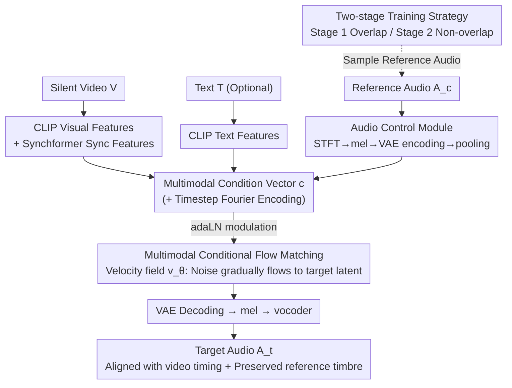

# AC-Foley: Reference-Audio-Guided Video-to-Audio Synthesis with Acoustic Transfer

**Conference**: ICLR 2026  
**arXiv**: [2603.15597](https://arxiv.org/abs/2603.15597)  
**Code**: None  
**Area**: Audio Generation  
**Keywords**: Video-to-Audio, Foley Synthesis, Reference Audio Control, Timbre Transfer, Flow Matching  

## TL;DR
AC-Foley is proposed as a reference-audio-guided video-to-audio synthesis framework. Through two-stage training (acoustic feature learning and temporal adaptation) and multimodal conditional flow matching, it achieves fine-grained timbre control, timbre transfer, and zero-shot sound effect generation, significantly outperforming existing methods in audio quality and acoustic fidelity.

## Background & Motivation

**Background**: Existing V2A methods primarily synthesize audio through text prompts and visual information, achieving audio-visual synchronization at the semantic level.

**Limitations of Prior Work**: (a) Dataset granularity gap—training labels categorize acoustically distinct sounds (e.g., barking of different dog breeds) into coarse labels; (b) Textual description limitations—language cannot encode micro-acoustic features (e.g., "metallic impact" cannot distinguish the time-frequency characteristics of a hammer hitting an anvil versus a steel chain falling). Consequently, text control fails to achieve fine-grained sound synthesis.

**Key Challenge**: Foley artists need to synthesize multiple acoustic variants for the same visual action (e.g., footsteps on different material surfaces), but text cannot precisely describe timbre differences, and training data lacks such fine-grained annotations.

**Goal**: Use reference audio to directly control acoustic characteristics, bypassing the semantic ambiguity of text.

**Key Insight**: Utilize a VAE to encode reference audio to preserve the complete acoustic signature (instead of using encoders like CLAP that only extract semantic information), and learn to adapt the reference timbre to the video's temporal structure through two-stage training.

**Core Idea**: Use the audio signal directly as a control condition instead of text. Timbre features are preserved via a VAE, and the adaptive transfer from reference audio to video timing is realized through a two-stage training strategy.

## Method

### Overall Architecture
AC-Foley addresses the problem where text cannot specify the "exact type of sound" desired when dubbing a silent video; instead, a piece of reference audio is used to specify the timbre. The pipeline feeds silent video, reference audio, and optional text into a multimodal Transformer. Under a conditional flow matching framework, the target audio is synthesized from noise. The result must be temporally aligned with the video and retain the acoustic signature of the reference. The three modalities are not simply concatenated; they are separately encoded and then merged into a shared multimodal condition vector $\mathbf{c}$, which modulates the Transformer via adaLN. The video dictates "when the sound occurs and alignment with action," the reference audio (encoded by the **Audio Control Module** using a VAE) dictates the "timbre," and the text provides "semantic grounding." The model "transfers" rather than "copies" timbre due to the **two-stage training strategy** used during reference audio sampling.

### Key Designs

**1. Multimodal Conditional Flow Matching: Unifying Three Control Signals into One Velocity Field**

To allow video, audio, and text to guide generation simultaneously, AC-Foley integrates them into a condition vector $\mathbf{c}$ for the flow matching model. The velocity field is defined as $v_\theta(t, \mathcal{C}, x_t)$, using multimodal conditions $\mathcal{C} = \{V, A, T\}$ to predict the direction of $x_t$. The vector $\mathbf{c}$ concatenates CLIP visual/text features, Synchformer sync features, VAE audio features, and timestep encodings to modulate the Transformer input via adaLN. Flow matching is chosen over diffusion for faster inference (solving an ODE requires fewer steps than iterative denoising) and because multimodal joint training naturally allows components to complement each other—if one modality is missing, others provide a fallback.

**2. Audio Control Module: Using VAE Instead of CLAP to Preserve Waveform-level Timbre**

The root cause of text control failure is coarse semantic granularity; thus, "audio is used to describe audio." Reference audio is compressed into a latent space via a pre-trained VAE encoder, followed by mean pooling to obtain an acoustic feature vector. The choice of encoder is critical: existing methods typically use CLAP, which is trained for semantic retrieval and only retains label-level information (e.g., "dog barking"), discarding spectral details. VAEs preserve low-level waveform features, enabling differentiation between timbres of the same label, such as a Chihuahua versus a large dog. In short, CLAP captures semantics, while VAE captures acoustics—exactly what fine-grained Foley requires.

**3. Two-Stage Training Strategy: Leveraging Intra-video Audio Self-similarity to Learn "Transfer" Over "Copying"**

Directly feeding reference audio during training may lead the model to "cheat" by copying the reference waveform to the output, resulting in temporal misalignment. AC-Foley uses two stages to avoid this. Stage 1 (Acoustic Feature Learning) uses **overlapping** audio-visual segments to let the model learn to extract acoustic features. Stage 2 (Temporal Adaptation) uses **non-overlapping** audio segments from the same video as conditions. This exploits the fact that sounds within the same video share acoustic properties (e.g., consistent footstep timbre in one scene) but occur at different times. Since the condition and target are no longer temporally aligned, the model must learn to "transfer the reference timbre to the temporal structure indicated by the video." This non-overlapping design is the cornerstone of the strategy.

### Loss & Training
The training objective is the standard conditional flow matching loss (regression on the velocity field). Multimodal conditions are subjected to random dropout during training, allowing for flexible combinations during inference—the model functions correctly whether or not reference audio or text is provided. This also allows the model to degrade gracefully into a competitive standard V2A model when no reference is given.

## Key Experimental Results

### Main Results

| Method | FD↓ | KL↓ | MCD↓ | Timbre Fidelity |
|------|-----|-----|------|---------|
| MMAudio (Text only) | Baseline | Baseline | Baseline | No Control |
| CondFoley | Medium | Medium | Medium | Limited |
| **AC-Foley (Audio Cond)** | **-20%** | **-28%** | **-22%** | **Precise** |
| AC-Foley (No Audio Cond) | Competitive | Competitive | Competitive | — |

### Ablation Study

| Configuration | Audio Quality | Timbre Fidelity | Description |
|------|---------|---------|------|
| Full Model | Best | Best | Two-stage training + VAE encoding |
| Stage 1 Only | Medium | Temporal Mismatch | Lacks temporal adaptation |
| CLAP instead of VAE | Poor | Loss of detail | CLAP only captures semantics |
| No Audio Cond | Competitive | — | Degrades to standard V2A |

### Key Findings
- Providing different reference audio for the same video (e.g., Chihuahua bark vs. large dog bark) generates distinct sounds, verifying fine-grained control.
- Timbre transfer experiments were successful (e.g., transferring a donkey's bray to a lion video), demonstrating cross-category acoustic transfer.
- Zero-shot capability: Generating suppressed gunshot effects using a silencer reference with a standard gunshot video, which text prompts cannot adequately describe.
- Even without reference audio, AC-Foley remains competitive with SOTA V2A methods, indicating that multimodal joint training improves base capabilities.

## Highlights & Insights
- **Bypassing Text Limitations**: Instead of refining text descriptions, using audio as a control signal is fundamentally more effective—"describing sound with sound" is superior to "describing sound with words."
- **Clever Two-Stage Training**: Leveraging intra-video self-similarity to force the model to learn "transfer" instead of "copying" is an ingenious training design.
- **VAE vs. CLAP Choice**: While CLAP is the default for many, its semantic nature makes it unsuitable for timbre preservation; VAEs provide the necessary low-level features.

## Limitations & Future Work
- Acquiring reference audio requires input from creators, increasing the barrier to use.
- Generation quality may decrease when the reference audio and video content are semantically mismatched.
- Two-stage training increases training complexity.
- Flexibility regarding reference audio length may be constrained by the VAE's processing capacity.

## Related Work & Insights
- **vs. MMAudio**: MMAudio jointly trains video and text modalities but lacks audio conditional control; AC-Foley extends this to three modalities.
- **vs. CondFoley**: CondFoley requires equal-length reference audio-video pairs, limiting flexibility; AC-Foley supports variable lengths.
- **vs. MultiFoley**: MultiFoley performs audio continuation/expansion; AC-Foley enables timbre transfer across different semantic categories.

## Rating
- Novelty: ⭐⭐⭐⭐ Audio-based control is intuitive yet highly effective; the two-stage training is well-designed.
- Experimental Thoroughness: ⭐⭐⭐⭐ Covers fine-grained control, timbre transfer, and zero-shot generation.
- Writing Quality: ⭐⭐⭐⭐ Clear motivation and vivid application examples.
- Value: ⭐⭐⭐⭐⭐ Provides a much-needed tool for fine-grained control in practical Foley production.

<!-- RELATED:START -->

## Related Papers

- [\[CVPR 2025\] MultiFoley: Video-Guided Foley Sound Generation with Multimodal Controls](../../CVPR2025/audio_speech/video-guided_foley_sound_generation_with_multimodal_controls.md)
- [\[CVPR 2026\] PAVAS: Physics-Aware Video-to-Audio Synthesis](../../CVPR2026/audio_speech/pavas_physics-aware_video-to-audio_synthesis.md)
- [\[NeurIPS 2025\] MGAudio: Model-Guided Dual-Role Alignment for High-Fidelity Open-Domain Video-to-Audio Generation](../../NeurIPS2025/audio_speech/model-guided_dual-role_alignment_for_high-fidelity_open-domain_video-to-audio_ge.md)
- [\[ICLR 2026\] Query-Guided Spatial-Temporal-Frequency Interaction for Music Audio-Visual Question Answering](query-guided_spatial-temporal-frequency_interaction_for_music_audio-visual_quest.md)
- [\[ICLR 2026\] Hierarchical Semantic-Acoustic Modeling via Semi-Discrete Residual Representations for Expressive End-to-End Speech Synthesis](hierarchical_semantic-acoustic_modeling_via_semi-discrete_residual_representatio.md)

<!-- RELATED:END -->
