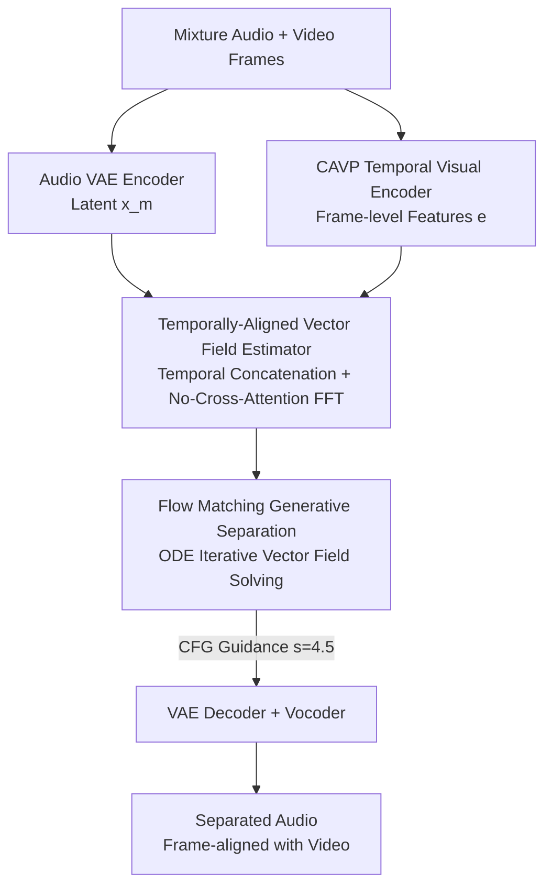

# AlignSep: Temporally-Aligned Video-Queried Sound Separation with Flow Matching

**Conference**: ICLR2026  
**OpenReview**: [https://openreview.net/forum?id=DVDkFcxU1D](https://openreview.net/forum?id=DVDkFcxU1D)  
**Code**: https://AlignSep.github.io (Project page, promised to be open-sourced after acceptance)  
**Area**: Audio/Speech · Audio-Visual Separation · Flow Matching Generation  
**Keywords**: Video-Queried Sound Separation, flow matching, temporal alignment, generative separation, audio-visual consistency

## TL;DR
AlignSep shifts "Video-Queried Sound Separation (VQSS)" from the mainstream time-frequency masking discriminative paradigm to a flow matching-based generative paradigm. By employing a temporally-aligned vector field estimator implemented with "temporal concatenation + non-cross-attention Transformer," it enforces frame-by-frame synchronization between audio and video. This allows for clean extraction of on-screen target sounds in difficult scenarios with intra-class interference and overlapping tracks, achieving a temporal alignment score $T_{A\text{-}V}$ of 95.76% on the self-constructed VGGSound-Hard benchmark.

## Background & Motivation
**Background**: The goal of Video-Queried Sound Separation (VQSS) is to extract "sounds emitted by objects in the frame" while suppressing off-screen interference, given a mixed audio clip and corresponding video. As a core task in audio-visual understanding, it is used in video editing, accessibility enhancement, and content analysis. Mainstream methods (CLIPSep, i-Query, OmniSep) follow a two-pronged approach: using pre-trained visual models to extract semantic features as conditions, and then using time–frequency masking to "multiply" out the target frequency bands from the mixture spectrum.

**Limitations of Prior Work**: This paradigm fails in two types of real-world scenarios. First is **intra-class interference**—where a dog barks in the frame and another dog barks off-screen. Since the semantic categories are identical, semantic conditions like "this is a dog barking" cannot distinguish the on-screen source. Second is **track overlap**—when multiple sound sources overlap in both time and frequency, masking methods cannot separate them cleanly, resulting in "spectral holes" and artifacts from incomplete separation.

**Key Challenge**: The fundamental reason is that existing methods **only model spatial semantics and ignore temporal alignment**. Distinguishing on-screen/off-screen sources of the same class relies not on "what the sound is," but on "whether the rhythm of visual actions matches the audio energy frame-by-frame"—for example, the target sound should stop when a drumming action in the video stops. Semantic conditions inherently lack such frame-level temporal information. Furthermore, discriminative modeling via masking is mathematically unable to recover clean independent signals when frequency bands overlap.

**Goal**: (1) To explicitly utilize **fine-grained temporal alignment** between audio and video for separation, rather than just semantics; (2) To circumvent the spectral hole issue of masking methods using generative modeling; (3) To provide an evaluation benchmark that truly tests temporal alignment capabilities.

**Key Insight**: The authors observe that generative models (diffusion / flow matching) can perform iterative refinement with cross-modal conditions at each inference step, naturally suited for "routing ambiguous energy to the correct source." They can directly generate complete waveforms without leaving spectral holes. However, VQSS differs fundamentally from traditional single-condition flow matching (e.g., text-to-audio): it is a **multi-condition** task constrained by both "original mixture audio" and "video sequences."

**Core Idea**: Reformulate VQSS as a **conditional flow matching** problem—learning a visually-conditioned probability flow from the "mixture audio distribution" to the "clean audio distribution." A **temporally-aligned vector field estimator** is designed to attach video features frame-by-frame to audio latents via simple temporal dimension concatenation, ensuring the generation process remains anchored to the visual timeline.

## Method

### Overall Architecture
AlignSep is the first generative VQSS model based on flow matching. It transports the "latent distribution of mixture audio" to the "latent distribution of clean target audio" along a probability flow conditioned on vision.

The pipeline functions as follows: The mixture audio $A^m$ is compressed into Mel-spectrogram latents $x^m$ (dimension 20) via a pre-trained Audio VAE encoder. Video frame sequences are processed by a CAVP temporal visual encoder to extract features $e$ (dimension 512) containing temporal synchronization information. During inference, starting from the mixture audio latents perturbed with Gaussian noise, a **temporally-aligned vector field estimator** predicts the vector field $v(x,t,e;\theta)$. An ODE solver (Euler method) iteratively integrates along time $t\in[0,1]$, gradually denoising the "noisy mixture audio latents" into "clean audio latents temporally aligned with the video." Finally, the VAE decoder restores the Mel-spectrogram, and a BigVGAN vocoder synthesizes the final waveform.

The entire generation process is driven by the visual condition $e$, resulting in separated audio that strictly follows the driving video along the time axis.

> VGGSound-Hard is a difficult benchmark specifically constructed to evaluate this framework; it is discussed separately at the end of the Key Designs section.

### Key Designs

**1. CAVP Temporal Visual Encoding: Replacing "Category-Only" Semantic Encoders with "Action Rhythm" Encoders**

The limitation is straightforward: Global semantic representations like ImageBind are useless for distinguishing intra-class on-screen/off-screen sounds, as they only indicate "a dog is in the frame" without specifying "which frame the dog barks in." AlignSep instead uses the pre-trained CAVP (Contrastive Audio-Visual Pretraining) encoder from Video-to-Audio (V2A) research. CAVP introduces **temporal synchronization supervision** during pre-training, allowing extracted features $e$ to capture dynamic temporal correlations across frames rather than static semantics. This is the source of all subsequent "temporal alignment" capabilities—only if the visual features themselves contain temporal information can the downstream vector field estimator align anything. Video is downsampled to 4 FPS for 8-second segments, with a feature dimension of 512.

**2. Temporally-Aligned Vector Field Estimator: Anchoring Visual Timing to Audio via "Temporal Concatenation"**

This is the core of the model. The challenge in multi-condition generation is ensuring the generated audio matches the video frames **frame-by-frame**, rather than just being "roughly related" semantically. The authors intentionally avoid cross-attention, opting for a **non-cross-attention feed-forward Transformer (4 layers, hidden dim 576)** paired with a simple **temporal concatenation** strategy. The 512-dimensional CAVP video features are **expanded** along the temporal dimension to match the length of the 20-dimensional audio latents, ensuring a one-to-one frame correspondence. Then, the aligned video and audio features are **concatenated**, and the time-step encoding vector $t$ is appended to the sequence before being fed into the Transformer to predict the vector field.

Why avoid cross-attention? Cross-attention provides "soft alignment," allowing the model to choose which frames to attend to, which often leads to the loss of strict frame-level correspondence. In contrast, hard temporal concatenation forces the $i$-th frame of visual features to be adjacent to the $i$-th segment of audio latents, making the temporal relationship a structural prior. This design is why AlignSep significantly outperforms baselines in $T_{A\text{-}V}$.

**3. Flow Matching Generative Separation Paradigm + Analysis of Multi-Condition Flows: Why Rectified Flow Fails**

The authors formalize VQSS as Conditional Flow Matching (CFM): the source distribution $x^m\sim p_m(x)$ is the mixture audio latent, and the target distribution $x^c\sim p_c(x)$ is the clean audio latent. The transport between them is described by the ODE $\mathrm{d}x=u(x,t,e)\,\mathrm{d}t$. Since the true target distribution is unknown, making $u$ difficult to calculate directly, the CFM objective is used for training:

$$\mathcal{L}_{\text{CFM}}(\theta)=\mathbb{E}_{t,\,p_c(x^c),\,p_t(x,x^c)}\big\|v(x,t,e;\theta)-u(x,t,x^c,e)\big\|^2$$

This circumvents dependence on the marginal distribution by designing a samplable conditional probability path $p_t(x\mid x^c)$. Compared to masking methods, the generative paradigm performs iterative refinement with cross-modal conditions at each step, "routing" ambiguous energy to the correct source and enforcing mixture and phase consistency, thereby **eliminating spectral holes**.

The analysis of "multi-condition flows" is particularly valuable: VQSS is simultaneously constrained by mixture audio $m$ and video sequences $v_{1:T}$, requiring "time-frequency-object" triple routing. This makes the posterior $p(s\mid m,v_{1:T})$ **highly multi-modal and piecewise non-smooth**, often resulting in discrete bifurcations and high-curvature transport paths. In this context, **Rectified Flow (RF) acceleration fails**, as its attempt to straighten trajectories into deterministic ODEs biases the path toward high-density regions, "averaging" between modes. Furthermore, RF lacks the iterative "denoising-consistency projection" error-correction loop of diffusion models. Experiments confirm that even with 100 steps, RF achieves only 57.36 in $S_{A\text{-}V}$, far below the 73.64 of diffusion-based AlignSep.

**4. VGGSound-Hard Benchmark: A Metric for "Temporal Alignment Under Intra-Class Interference"**

Existing benchmarks (VGGSound-Clean, MUSIC-Clean) involve target and interference sounds from **different categories**, which can be distinguished by semantics alone, failing to test temporal alignment. The authors constructed a hard benchmark from the VGGSound test set: they grouped samples by category, calculated pairwise cosine similarity using CLAP audio encoders, and selected pairs with the highest scores, yielding ~2000 intra-class candidates. These were mixed following the CLIPSep synthesis pipeline. Finally, **manual verification** was performed based on two criteria: (1) The video must contain actions with discernible rhythmic/temporal structures (excluding horn sounds without visual cues) so annotators can infer timing; (2) The target source must be on-screen. This resulted in 118 high-quality pairs with homogeneous semantics but distinct temporal patterns, forming VGGSound-Hard.

### Loss & Training
The training objective is the conditional flow matching loss $\mathcal{L}_{\text{CFM}}$. At inference, **classifier-free guidance (CFG)** is used: the visual condition $e$ is randomly replaced with a "null" embedding during training. Sampling follows: $\hat{v}(x,t,e;\theta)=s\cdot v(x,t,e;\theta)+(1-s)\cdot v(x,t,\varnothing;\theta)$, with a guidance scale $s=4.5$ to balance quality and diversity. Calculations use the Euler method with 25 steps by default. Audio is standardized to 16 kHz, 80-bin Mel-spectrograms, hop size 256, and 8-second segments.

## Key Experimental Results

### Main Results
Evaluation is performed across semantic alignment (CLAP for audio-audio $S_{A\text{-}A}$, ImageBind for audio-video $S_{A\text{-}V}$) and temporal synchronization (alignment accuracy $T_{A\text{-}V}$).

| Dataset | Metric | AlignSep | OmniSep | CLIPSep |
|---------|--------|----------|---------|---------|
| VGGSound-Clean | $S_{A\text{-}A}\uparrow$ | **73.38** | 70.83 | 66.74 |
| VGGSound-Clean | $T_{A\text{-}V}\uparrow$ | **96.88** | 81.25 | 79.17 |
| Music-Clean | $T_{A\text{-}V}\uparrow$ | 66.67 | **68.89** | 51.11 |
| VGGSound-Hard | $T_{A\text{-}V}\uparrow$ | **95.76** | 76.27 | 85.59 |

The critical comparison is temporal alignment on VGGSound-Hard: AlignSep 95.76% vs OmniSep 76.27%. OmniSep performs decently on simple VGGSound-Clean via strong semantics but drops significantly on the hard benchmark, proving "semantics alone are insufficient." Subjective MOS also shows AlignSep leading in almost all dimensions.

### Ablation Study
The number of denoising steps (ODE steps) represents the core efficiency-quality tradeoff:

| Configuration | VGGSound-Clean $T_{A\text{-}V}$ | VGGSound-Hard $T_{A\text{-}V}$ | FPS (Throughput) |
|---------------|--------------------------------|-------------------------------|------------------|
| AlignSep (Step=5) | 85.42 | 88.14 | 5.56 |
| AlignSep (Step=10) | 92.71 | 94.07 | 4.00 |
| **AlignSep (Step=25)** | **96.88** | **95.76** | 2.17 |
| AlignSep (Step=50) | 95.83 | 93.22 | 1.35 |
| AlignSep (Step=100) | 96.88 | 93.22 | 0.72 |
| Rectified Flow (Step=100) | 84.38 | 92.37 | 0.77 |

### Key Findings
- **25 steps is the sweet spot**: $S_{A\text{-}V}$ increases from steps 5 to 25 (64.47→73.38) and saturates thereafter. $T_{A\text{-}V}$ reaches 96.88 at 25 steps; further steps do not provide meaningful gains. 25 steps achieve 2.17 FPS, about 3x faster than 100 steps.
- **VQSS requires fewer steps than general generation**: Because the mixture audio already contains most of the target content and the video provides frame-level constraints, it does not require as many steps as text-to-audio. 10 steps still maintain $T_{A\text{-}V}\approx 92\text{--}94$, suitable for real-time scenarios.
- **Rectified Flow significantly degrades in VQSS**: At 100 steps, RF $S_{A\text{-}V}$ is only 57.36 (vs 73.64 for diffusion), confirming that deterministic trajectories "average" results in multi-modal posteriors.
- **More temporal information is better**: As the reference frame rate (FPS) increases, AlignSep's alignment accuracy rises from ~0.76 at 0.25 FPS to ~0.95 at 4 FPS. Conversely, the semantic-only CLIPSep stays flat at 0.81, showing no sensitivity to visual temporal resolution.

## Highlights & Insights
- **"Temporal Concatenation" as a structural prior**: Directly concatenation video features expanded in the time dimension to audio latents locks in frame-level correspondence, avoiding the risk of "soft" alignment in cross-attention.
- **Analysis of non-smooth multi-condition flows**: Attributing the failure of Rectified Flow to the multi-modality and lack of error correction in posteriors applies to any "strongly conditioned, multi-modal" generative task.
- **Generative paradigm eliminates spectral holes**: Generating the full waveform instead of applying a mask to the spectrum bypasses artifacts typically found in masking methods when frequency bands overlap.
- **Construction of VGGSound-Hard**: Using intra-group similarity to select intra-class pairs and manually verifying temporal cues is a generalizable recipe for creating hard samples that test temporal alignment.

## Limitations & Future Work
- **Dependency on external encoders**: The alignment ceiling is limited by the quality of CAVP; domain shift (e.g., non-natural sounds) might cause CAVP to fail, degrading separation.
- **Inference speed**: Even at 25 steps (2.17 FPS), it is approximately 5x slower than masking methods (OmniSep 11.2 FPS), and not yet fully real-time.
- **Scale of VGGSound-Hard**: With only 118 pairs after verification, the evaluation statistics are limited and may not reflect the full long-tail distribution.
- **Multi-source (>2) separation**: Experiments only involved two-source mixtures (target + one interference); performance on more complex mixtures remains unverified.

## Related Work & Insights
- **vs OmniSep / CLIPSep (Semantic Masking)**: AlignSep swaps semantic conditions and spectral masking for CAVP temporal conditions and flow matching generation. The advantage is superior performance in hard scenarios without spectral holes, while the disadvantage is slower inference.
- **vs i-Query**: i-Query uses cross-attention to detect sounding objects but relies on pre-extracted bounding boxes. AlignSep is box-free and uses temporal concatenation for hard alignment.
- **vs V2A (Video-to-Audio)**: While V2A generates audio from scratch, VQSS uses the mixture as a strong prior, requiring significantly fewer sampling steps to achieve high quality.

## Rating
- Novelty: ⭐⭐⭐⭐⭐ First flow-matching generative VQSS; robust analysis of multi-condition flow.
- Experimental Thoroughness: ⭐⭐⭐⭐ Three benchmarks plus MOS; however, the hard benchmark is small.
- Writing Quality: ⭐⭐⭐⭐ Clear logic; excellent analysis of Rectified Flow failure.
- Value: ⭐⭐⭐⭐ Advances audio-visual separation to the level of temporal alignment; provides useful benchmark and insights for the community.

<!-- RELATED:START -->

## Related Papers

- [\[ICLR 2026\] Flow2GAN: Hybrid Flow Matching and GAN with Multi-Resolution Network for Few-step High-Fidelity Audio Generation](flow2gan_hybrid_flow_matching_and_gan_with_multi-resolution_network_for_few-step.md)
- [\[NeurIPS 2025\] Shallow Flow Matching for Coarse-to-Fine Text-to-Speech Synthesis](../../NeurIPS2025/audio_speech/shallow_flow_matching_for_coarse-to-fine_text-to-speech_synthesis.md)
- [\[ACL 2026\] ZipVoice-Dialog: Non-Autoregressive Spoken Dialogue Generation with Flow Matching](../../ACL2026/audio_speech/zipvoice-dialog_non-autoregressive_spoken_dialogue_generation_with_flow_matching.md)
- [\[AAAI 2026\] USE: A Unified Model for Universal Sound Separation and Extraction](../../AAAI2026/audio_speech/use_a_unified_model_for_universal_sound_separation_and_extraction.md)
- [\[ICML 2026\] A Semantically Consistent Dataset for Data-Efficient Query-Based Universal Sound Separation](../../ICML2026/audio_speech/a_semantically_consistent_dataset_for_data-efficient_query-based_universal_sound.md)

<!-- RELATED:END -->
