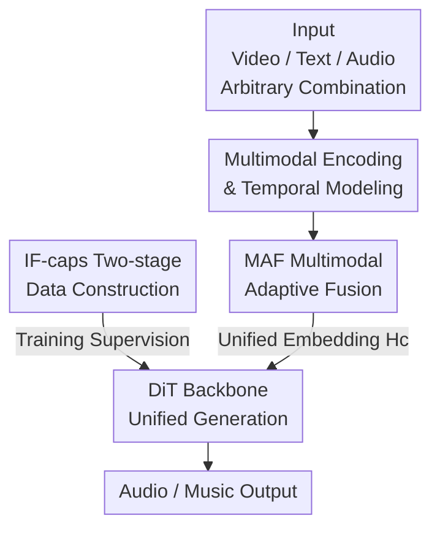

# AudioX: A Unified Framework for Anything-to-Audio Generation

**Conference**: ICLR2026  
**OpenReview**: [https://openreview.net/forum?id=qjJWxK3yWo](https://openreview.net/forum?id=qjJWxK3yWo)  
**Code**: https://zeyuet.github.io/AudioX/  
**Area**: Audio Generation / Multimodal Diffusion  
**Keywords**: Anything-to-Audio Generation, Multimodal Fusion, Diffusion Transformer, Instruction Following, Data Construction

## TL;DR
AudioX utilizes a unified framework based on a Diffusion Transformer (DiT), integrated with a lightweight "Multimodal Adaptive Fusion (MAF)" module and a self-constructed 7-million-sample multimodal dataset, IF-caps. This allows a single set of model weights to generate high-fidelity sound effects and music from arbitrary combinations of text, video, and audio, significantly outperforming specialized models in fine-grained instruction following.

## Background & Motivation
**Background**: Sound effect and music generation have rapidly developed with generative models, proving practical value in film, gaming, and social media. However, the mainstream approach remains "one model per task"—where text-to-audio and video-to-audio are handled by separate models, often locked into either sound effects or music.

**Limitations of Prior Work**: A few attempts at unification exist, but they generally lack flexible support for "arbitrary modality combinations" and exhibit weak instruction-following capabilities (e.g., failing to handle sequence or counting controls like "footsteps followed by a door closing").

**Key Challenge**: The authors attribute the root cause to data—high-quality multimodal data for training unified models is extremely scarce. Most existing datasets are task-specific, providing supervision for only a single condition (either text-audio pairs or video-music pairs), which is neither multimodal nor compositional.

**Goal**: To address this through two sub-problems: (1) Designing a unified modeling framework that accommodates text/video/audio conditions and fuses them cleanly; (2) Generating large-scale, fine-grained, and compositional multimodal supervised data.

**Key Insight**: Transformers excel at cross-modal alignment, while diffusion models (especially DiT) surpass auto-regressive next-token prediction in audio fidelity. By combining these, DiT serves as the generation backbone, supplemented by a fusion module on the conditioning side to extract useful signals and suppress cross-modal noise.

**Core Idea**: A "Unified Backbone + Adaptive Fusion + High-quality Multimodal Data" trio—using a single DiT weight set to cover anything-to-audio, a MAF module to resolve multimodal interference, and a two-stage labeling pipeline for mass data construction.

## Method

### Overall Architecture
The input to AudioX is an arbitrary subset of video $X_v$, text $X_t$, and audio $X_a$ (missing modalities are padded with zeros or default text), and the output is a high-fidelity audio/music waveform aligned with the conditions. The pipeline involves: three-way dedicated encoders for temporal modeling to obtain modality embeddings $H_v, H_t, H_a$; these are fed into the MAF module for adaptive fusion to form a unified condition embedding $H_c$; finally, $H_c$ and the diffusion timestep $t$ guide the DiT backbone via cross-attention for denoising in the latent space. The supervision for training comes from the self-built IF-caps dataset (7 million samples), generated offline via a two-stage labeling pipeline.

### Key Designs

**1. IF-caps Two-stage Data Construction: Solving Data Scarcity with Model Collaboration**

The bottleneck for unified models is data—existing datasets often feature coarse labels or single modalities. The authors designed a labeling pipeline for video datasets: first, a strong multimodal LLM (Gemini 2.5 Pro) processes 10-second clips to produce a global caption and structured fields (audio tags like "event + count", music tags like "genre + instrument"). To manage costs, the second stage uses the open-source Qwen2-Audio to expand various captions based on initial labels and raw audio. This resulted in fine-grained labels for 1.3M video-audio clips and 5.7M video-music clips, decoupling quality and cost.

**2. Multimodal Encoding and Temporal Modeling: Aligning Heterogeneous Conditions**

Text, video, and audio are naturally heterogeneous. AudioX uses dedicated encoders: CLIP-ViT-B/32 for frame-level semantics (5 fps) and Synchformer for synchronization features (25 fps) for video; T5-base for text; and an audio autoencoder. Video and audio features pass through a temporal Transformer to capture dynamics before being projected into a common embedding space $H_v, H_t, H_a$. Missing modalities are padded with zeros or generic natural language templates, providing the engineering foundation for the unified framework.

**3. MAF Multimodal Adaptive Fusion: Gating + Expert Queries + Self-Attention**

This is the core module designed to prevent modality "clashing." MAF passes initial embeddings through a gate to filter and re-weight signals; then, a set of learnable queries (divided into modality-specific "experts")聚合 (aggregate) evidence from different data streams via cross-attention; finally, self-attention integrates context and refined information is written back via residuals:

$$\tilde{H}_v, \tilde{H}_t, \tilde{H}_a = \mathrm{MAF}(H_v, H_t, H_a), \qquad H_c = \mathrm{Concat}\left(\tilde{H}_v, \tilde{H}_t, \tilde{H}_a\right).$$

MAF is lightweight, accounting for only 60M of the total 2.4B parameters (1.1B trainable). Ablation shows that removing MAF, or its gating/query components, leads to significant performance drops, proving its necessity for reducing interference and improving instruction following.

**4. Unified Generation with DiT Backbone: Single Weights for All Tasks**

The DiT backbone (24 layers, initialized from Stable Audio Open) performs denoising in the latent space. Ground truth audio $A$ is encoded to $z = E(A)$, and noise is added via a Markov chain $q(z_t|z_{t-1}) = \mathcal{N}(z_t; \sqrt{1-\beta_t}\,z_{t-1}, \beta_t I)$. The network $\epsilon_\theta$ predicts noise at each step conditioned on $z_t, t, H_c$:

$$\min_\theta \ \mathbb{E}_{t, z_t, \epsilon}\ \left\| \epsilon - \epsilon_\theta(z_t, t, H_c) \right\|_2^2.$$

By unifying all tasks (T2A, V2A, TV2A, T2M, V2M, TV2M, audio inpainting, music continuation) as conditional denoising given $H_c$, the same weights cover the full spectrum of tasks.

### Loss & Training
The objective is the noise prediction MSE mentioned above. Optimization uses AdamW (LR 1e-5, weight decay 0.001) with exponential ramp-up/decay and weight EMA. Training took approximately 4k GPU hours on NVIDIA H800 clusters with a batch size of 48. Inference uses 250 steps and a classifier-free guidance scale of 7.0.

## Key Experimental Results

### Main Results
A single AudioX model vs. specialized SOTAs (Table 1 excerpt, IS Higher is better, FAD/FD/KL Lower is better):

| Dataset | Task | Method | IS ↑ | FAD ↓ | FD ↓ |
|--------|------|------|------|-------|------|
| VGGSound | T2A | MMAudio | 17.83 | 2.50 | 11.52 |
| VGGSound | T2A | **AudioX** | **19.58** | **1.33** | **9.01** |
| MusicCaps | T2M | TangoMusic | 2.86 | 1.88 | 15.00 |
| MusicCaps | T2M | **AudioX** | **3.55** | **1.53** | **9.76** |
| AudioCaps | T2A | Tango 2 | 10.37 | 3.20 | 12.22 |
| AudioCaps | T2A | **AudioX** | **12.48** | **1.59** | **11.51** |

AudioX achieves SOTA in T2A and T2M. In V2A, it is competitive with MMAudio on VGGSound and out-of-distribution AVVP, demonstrating strong generalization.

Instruction Following (Table 2, T2A-bench accuracy labels higher is better, AudioTime lower is better):

| Method | Cat-acc ↑ | Cnt-acc ↑ | Ord-acc ↑ | TS-acc ↑ | AudioTime Ordering ↓ |
|------|-----------|-----------|-----------|----------|----------------------|
| Stable Audio Open | 31.20 | 9.80 | 6.00 | 21.80 | 0.98 |
| Make-An-Audio2 | 32.40 | 4.00 | 19.80 | 18.80 | 0.76 |
| MMAudio | 26.60 | 4.80 | 2.40 | 21.40 | 0.98 |
| **AudioX** | **34.20** | **12.40** | **23.60** | **28.20** | **0.34** |

AudioX leads across all fine-grained control dimensions, reducing the Ordering error significantly.

### Ablation Study

Data construction strategy (Table 3, progressive text supervision quality):

| Caption Source | Cat-acc ↑ | T2A IS ↑ | V2A FAD ↓ |
|--------------|-----------|----------|-----------|
| Labels (Original labels) | 17.35 | 7.59 | 1.81 |
| AudioSetCaps | 27.85 | 10.08 | 1.33 |
| QwenCap (Qwen only) | 24.60 | 9.74 | 1.67 |
| GeminiCap (Gemini initial) | 28.05 | 10.81 | 1.31 |
| **GeminiCap-aug (Full pipeline)** | **28.91** | **10.93** | **1.15** |

MAF Architecture (Table 4):

| Configuration | IS ↑ | FAD ↓ | Ordering ↓ |
|------|------|-------|-----------|
| w/o MAF | 10.70 | 2.67 | 0.912 |
| w/o Gate | 11.66 | 2.00 | 0.876 |
| w/o Query | 11.72 | 2.08 | 0.912 |
| **Full MAF** | **11.84** | **1.98** | 0.888 |

### Key Findings
- Both gating and expert queries in MAF are essential; their removal causes the most significant degradation.
- **Cross-modal Regularization Effect**: Improving text supervision quality benefits not only T2A but also V2A significantly (FAD dropped from 1.81 to 1.15). High-quality text data acts as a strategy for building robust multimodal models.
- High fidelity does not equal strong instruction following: Some SOTAs like Tango 2 have high fidelity but moderate control, indicating these are independent dimensions.

## Highlights & Insights
- **"Data + Architecture" Duo**: The logic is clear—attribute model failure to data scarcity and interference, then solve them with IF-caps and MAF.
- **MAF as a Transferable Fusion Paradigm**: The "Gating → Expert Query → Self-attention → Residual" flow is applicable to any scenario feeding heterogeneous conditions into a single backbone.
- **Cross-modal Regularization Insight**: Using text quality as a lever for non-text tasks (V2A) is an insightful departure from the intuition that video tasks only require more video data.
- **New Benchmark T2A-bench**: Addresses the gap in evaluating fine-grained control (category, count, order, timestamps).

## Limitations & Future Work
- **Dependency on External LLMs**: The quality of IF-caps is capped by Gemini and Qwen; systematic biases or hallucinations might be inherited.
- **Parity in Some Tasks**: performance in V2A/TV2A is "at par" with MMAudio rather than dominant; the unified advantage lies primarily in text-related and instruction-following tasks.
- **High Cost**: 2.4B parameters and 250 diffusion steps limit real-time or edge deployment.
- **Future Directions**: Exploring efficient sampling (distillation), self-labeling loops, and finer temporal alignment.

## Related Work & Insights
- **vs. Specialists (AudioGen/MusicGen/Tango)**: Specialists lock into single conditions; AudioX covers all combinations with one weight set and outperforms them on T2A/T2M.
- **vs. Video-to-Audio Specialists (MMAudio/Diff-Foley)**: While these specialize in V2A, AudioX matches their performance while unlocking music generation and continuation.
- **vs. Prior Unified Efforts**: Previous works had weak flexibility and instruction following. AudioX bridges this gap with compositional data (IF-caps) and adaptive fusion (MAF).

## Rating
- Novelty: ⭐⭐⭐⭐ The MAF module and cross-modal regularization findings are innovative.
- Experimental Thoroughness: ⭐⭐⭐⭐⭐ Covers 6 tasks, multiple datasets, dual benchmarks, user studies, and complete ablations.
- Writing Quality: ⭐⭐⭐⭐ Clear logic, though some MAF internal dimensions require the appendix.
- Value: ⭐⭐⭐⭐⭐ A unified framework + 7M open-source samples + new benchmarks represent a solid infrastructure for the community.

<!-- RELATED:START -->

## Related Papers

- [\[ICML 2026\] Attend to Anything: Foundation Model for Unified Human Attention Modeling](../../ICML2026/audio_speech/attend_to_anything_foundation_model_for_unified_human_attention_modeling.md)
- [\[ICLR 2026\] UALM: Unified Audio Language Model for Understanding, Generation and Reasoning](ualm_unified_audio_language_model_for_understanding_generation_and_reasoning.md)
- [\[AAAI 2026\] Cross-Space Synergy: A Unified Framework for Multimodal Emotion Recognition in Conversation](../../AAAI2026/audio_speech/cross-space_synergy_a_unified_framework_for_multimodal_emotion_recognition_in_co.md)
- [\[ICLR 2026\] Aurelius: Relation Aware Text-to-Audio Generation At Scale](aurelius_relation_aware_text-to-audio_generation_at_scale.md)
- [\[AAAI 2026\] DualSpeechLM: Towards Unified Speech Understanding and Generation via Dual Speech Token Modeling](../../AAAI2026/audio_speech/dualspeechlm_towards_unified_speech_understanding_and_generation_via_dual_speech.md)

<!-- RELATED:END -->
