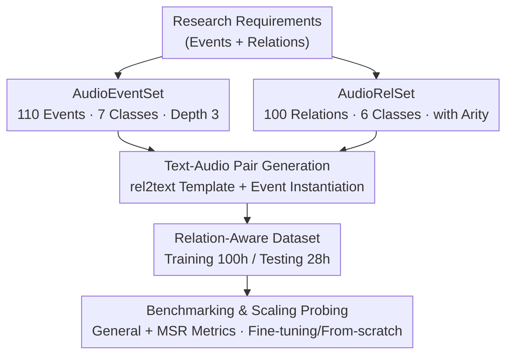

# Aurelius: Relation Aware Text-to-Audio Generation At Scale

**Conference**: ICLR2026  
**OpenReview**: [https://openreview.net/forum?id=LAYCYiIgZ1](https://openreview.net/forum?id=LAYCYiIgZ1)  
**Code**: https://github.com/yuhanghe01/Aurelius  
**Area**: Text-to-Audio Generation / Datasets & Benchmarks  
**Keywords**: Text-to-Audio, Relation-Aware Generation, Audio Event Corpus, Benchmark Evaluation, Compositional Reasoning

## TL;DR
Aurelius constructs two large-scale decoupled corpora (AudioEventSet with 110 categories of audio events + AudioRelSet with 100 types of relations) and a text-audio pair generation strategy. This pushes "relation-aware text-to-audio generation" from small-scale exploration to a scalable research level. The authors systematically benchmark 9 mainstream TTA models, revealing that they almost entirely fail at modeling multi-event relations (with relation accuracy generally <10%).

## Background & Motivation
**Background**: Text-to-Audio (TTA) generation has achieved high-fidelity results for single audio events by leveraging generative modeling such as diffusion, score-based, and flow-matching methods, combined with large-scale `<text, audio>` paired data like AudioCaps and AudioSet.

**Limitations of Prior Work**: Human auditory understanding relies on two fundamental elements: the audio events themselves and the relations between them (temporal order, spatial distance, counting, compositional logic, etc.). However, existing TTA models excel only at "generating a single sound." When prompts require multiple events satisfying specific relations (e.g., "clapping moving from far to near, then overlapping with another identical clapping sound"), they struggle. Previous works like RiTTA and CompA identified this issue, but their relation/event corpora were too small (RiTTA has only 11 relations) to support in-depth research under scalable conditions.

**Key Challenge**: Relation-aware TTA requires both "event generation" and "relation modeling" capabilities. Existing datasets (such as AudioSet), which are crawled directly from web video/audio platforms, suffer from common issues like missing labels, noise, polyphonic overlap, and semantic ambiguity. They are neither clean nor organized by relations, making it impossible to support controllable relation research.

**Goal**: The problem is decomposed into three sub-problems: (1) creating a clean, unique, and hierarchical audio event corpus; (2) creating an extensible relation corpus covering various real-world relations; (3) combining the two into near-infinite `<text, audio>` pairs for systematic evaluation and training.

**Key Insight**: The authors observe that "events" and "relations" are essentially two orthogonal dimensions that should be **explicitly decoupled**. They should be treated as independent corpora to be refined separately and then dynamically combined using a pairing strategy. This ensures the quality of each component while allowing for an explosion of near-infinite, customizable data through combination.

**Core Idea**: Use "decoupled event corpus × relation corpus + templated pairing" to replace "mixed crawled data," providing a scalable benchmark and training ground for relation-aware TTA.

## Method

### Overall Architecture
Aurelius is not a new generative model but a **benchmark and data production framework for relation-aware TTA**. Its input is "what relations/events to study," and its output consists of massive annotated `<text, audio>` pairs, along with systematic evaluation conclusions of existing models on this data. The pipeline consists of three parts: first, independently refining two tree-structured corpora, AudioEventSet (events) and AudioRelSet (relations); second, using a "relation $\rightarrow$ text template + event instantiation" pairing strategy to cartesianly combine them into training/test data; and finally, benchmarking 9 TTA models on this data while exploring scaling paths via fine-tuning and training-from-scratch strategies.

### Key Designs

**1. AudioEventSet: Creating a Clean, Unique, and Discernible Audio Event Corpus with a Tree Hierarchy**

This addresses the issue of "dirty" existing event datasets—noise, polyphony, missing labels, and semantic ambiguity—which prevent reliable relation research. AudioEventSet is a **tree with a depth of 3**: organized from root to leaf in a "coarse-to-fine" manner. The top layer consists of 7 main categories (five single-source classes: Animal / Human / Machinery / Music / Nature, plus two interaction classes: Human-Object / Object-Object Interaction). Each main category leads to sub-categories and then to fine-grained leaf events, totaling **110 leaf events** (4x more than RiTTA). During construction, it is strictly ensured that each event is "unique and discernable by the human ear." Any event easily confused with others is removed (e.g., "engine idling" in AudioSet, which varies greatly across engines and is easily confused with fans/hairdryers, was entirely excluded). Additionally, sound production mechanisms are explicitly considered (the Object-Object class exhausts four mechanisms: impact / friction / dropping / explosion). Each leaf event is paired with approximately 75 real recordings of 1–5 seconds, sourced from copyright-friendly freesound.org and FSD50K, with manual labels verified for consistency. This approach of "building the skeleton via an ontology tree, then filtering for uniqueness by ear" allows the corpus to achieve both **inter-class discrimination** and **intra-class diversity**.

**2. AudioRelSet: Formalizing Physical World Relations into 100 Extensible Relations with Arity**

This targets the "small scale of relation corpora"—previous works had only a dozen relations, which cannot support scalable research. AudioRelSet is a **tree with a depth of 2**, with 6 main relation classes under the root, totaling **100 relations**. Each relation is **mathematically formalized**:

- **Temporality**: Precedence $E_1 \prec E_2$, Succession $E_1 \succ E_2$, Simultaneity $E_1 \parallel E_2$, Repetition $\sim E_1$;
- **Spatiality**: Proximity $d(E_1,E_2)\le\tau$, Nearer $d(E_1)<d(E_2)$, Farther, Approaching $\frac{d}{dt}d_{E_1}(t)<0$, Receding $\frac{d}{dt}d_{E_1}(t)>0$;
- **Count**: $|E|=N,\ N\in\mathbb{Z}^+$;
- **Perceptuality**: 6 acoustic effects including Balance, Blend, Reverb, Speed Change, Amplify, and Decay, e.g., Blend $R_{blend}(E_1,E_2,\theta)$;
- **Compositionality**: Conjunction $E_1\wedge E_2$, Disjunction $E_1\vee E_2$, Negation $\neg E_1$, XOR $(E_1\vee E_2)\wedge\neg(E_1\wedge E_2)$, Implication $E_1\Rightarrow E_2,\ \neg E_1\Rightarrow E_3$;
- **Nested Combination**: Nesting multiple basic relations in a directed acyclic structure, $R_{nested}(E)=R_n(R_{n-1}(\dots R_2(R_1(E))\dots))$. The authors combined 5 basic relations into 79 nested relations (constrained in this paper to a maximum of 5 events, i.e., Quinary).

Each relation also carries an **"arity"** attribute, indicating how many audio events are required to express it (from unary to quinary), used for subsequent mapping between relations and events. During nesting, internal logic/feasibility checks are performed to exclude illegal combinations (e.g., nesting Count with Conjunction is internally equivalent to Count). Formalizing relations via symbolic definitions rather than ambiguous natural language descriptions is fundamental to the corpus's "extensibility and verifiability."

**3. `<text, audio>` Pair Generation: Templated Relations + Instantiated Events to Generate Near-Infinite Data**

After decoupling the event and relation corpora, the next step is reassembling them into training data. The process is: first, **manually/GPT-4o authoring 5 text templates** for each of the 100 relations (rel2text templatization). These templates contain placeholders for audio event names to absorb the diversity of natural language. Then, the templates are **instantiated** with real event names (event instantiation) to obtain text prompts, while corresponding event waveforms are retrieved and synthesized according to the relations to form target audio. To handle synonym variations of event names, a synonym list is maintained for each event (e.g., "hammer nailing" can be replaced by hitting/slapping/smacking/punching), and one is randomly selected during instantiation. Text descriptions standardized on a **"Head-Modifier + Present Participle"** structure: using the sound-emitting subject as the head and the action in the progressive tense as the modifier ("food frying audio" instead of "frying food"), emphasizing that the event is ongoing and aligned with the audio timeline. Since events and relations are orthogonally decoupled, this strategy can generate **near-infinite, highly diverse, and customizable** pairs, ensuring that training and test texts do not overlap.

**4. Evaluation Protocol & Scaling Probing: Dual Perspective of General + Relation-Aware, with Fine-tuning/From-scratch Comparisons**

Data alone is insufficient; metrics are needed to measure if "relations are correct." Aurelius uses two sets of metrics: General metrics FAD / FD / KL (measuring overall similarity between generated and reference audio in embedding space, using VGGish and PANNs for feature extraction); and relation-aware metrics following RiTTA's **MSR (multi-stage relation aware) protocol**. This protocol first extracts events and relations $(E',R')$ from generated audio and then compares them with the reference $(E,R)$, providing scores for Presence (mAPre, whether events appear), Relation correctness (mARel, whether relations are correct), and Parsimony (mAPar, whether extra sounds were generated), summarized as mAMSR. To support MSR, the authors fine-tuned an event detector with mAP 0.91 and a 7-class acoustic effect classifier with 95% accuracy on PANNs using millions of samples. Using this evaluation suite, the authors perform a scaling probe on Tango / Tango2 / TangoFlux using **fine-tuning** and **from-scratch** training strategies to investigate if general TTA knowledge can be transferred to relation tasks.

## Key Experimental Results

### Main Results: Zero-shot Benchmarking of Existing TTA Models
Benchmarking 9 general TTA models + 2 agentic workflows on data with 100 relations, 100h training / 28h testing (10s, 16kHz). Relation-aware metrics ($\times10^{-2}$, higher is better) are almost entirely <10%:

| Model | #Param | FAD↓ | mAPre↑ | mARel↑ | mAPar↑ | mAMSR↑ |
|---|-|---|---|---|---|---|
| AudioLDM2 (l-full) | 844M | 4.54 | 0.35 | 0.04 | 0.31 | 0.03 |
| Tango2 | 866M | 9.59 | 9.68 | 2.48 | 5.49 | 1.29 |
| **AudioGen** | 1.5B | 7.97 | 11.3 | 2.84 | **9.13** | **2.22** |
| **TangoFlux** | 576M | 6.01 | **12.38** | **3.34** | 7.28 | 1.77 |
| Qwen2.5-32B+TangoFlux (agentic) | - | 9.70 | 3.79 | 0.96 | 2.41 | 0.60 |

AudioGen achieved the best mAPar and mAMSR, while TangoFlux performed best on mAPre/mARel, though both remain in the single-digit percentages. **Agentic workflows (using Qwen as an agent to decompose events for TTA) performed worse than direct generation**, suggesting that simply stacking existing methods cannot solve relation modeling.

### Ablation Study: Fine-tuning vs. Training From-scratch (100h Dataset)

| Strategy | Model | mAPre↑ | mARel↑ | mAPar↑ | mAMSR↑ |
|---|---|---|---|---|---|
| Fine-tune | TangoFlux | 28.57 | 8.02 | 20.84 | 5.58 |
| From-scratch | TangoFlux | 16.68 | 3.82 | 12.01 | 2.58 |
| Fine-tune | Tango | 14.58 | 4.18 | 10.16 | 2.73 |
| From-scratch | Tango | 14.89 | 3.69 | 10.98 | 2.64 |

Both fine-tuning and training from-scratch significantly improve relation-aware performance, validating the benchmark's utility. TangoFlux benefited most from fine-tuning (mAMSR 1.77 $\rightarrow$ 5.58), indicating that cross-domain TTA knowledge is transferable, whereas Tango showed little difference between the two strategies, suggesting that architecture/inductive biases affect the extent of knowledge transfer.

### Key Findings
- **Capability Cliff**: SOTA general models like TangoFlux achieve 75% accuracy on single-event prompts, but multi-event accuracy plunges to 12%, and relation fidelity is only 3%—relation modeling is almost a blind spot.
- **Divergent Scaling Behavior**: When scaling to 200h or 300h, fine-tuning improves rapidly in the early stages but saturates near 300h; training from-scratch shows continuous significant improvements with data—implying that scalable relation TTA ultimately requires massive data, and fine-tuning alone is insufficient.
- **Difficulty Concentrated in Nesting/High Arity**: All models perform poorly on Nested Combination and relations with arity > 1, which are precisely the "hard cases" the benchmark is designed to expose.

## Highlights & Insights
- **Orthogonal Decoupling of Events and Relations**: Splitting "what the sound is" from "what the relation between sounds is" into two independent corpora before cartesian combination ensures individual quality and enables near-infinite data scale—this is the root of the framework's scalability.
- **Complete Symbolization of Relations + Arity Attribute**: Using formal definitions ($\prec, \parallel, \wedge, \Rightarrow$) instead of natural language makes relations verifiable, nestable, and automatically pairable. Arity explicitly defines "how many events are needed," facilitating bucketed evaluation by complexity.
- **Diagnostic Value of "Contradictory Metrics"**: General metrics (low FAD) and relation metrics (low mAMSR) often conflict, which precisely proves that relation fidelity is not a byproduct of general quality but an independent capability—this insight is a warning for future evaluators.
- **Transferability**: A clean, hierarchical event library like AudioEventSet can serve tasks like acoustic scene understanding and sound event detection/localization; the relation ontology of AudioRelSet can also migrate to CV / NLP / Multimodal relation modeling.

## Limitations & Future Work
- **Nature as a Benchmark, Not a New Model**: The proposed AudioRelGen is only a prototype for "decoupling event modeling and relation modeling" and does not provide a strong method to truly solve relation generation; the relation accuracy ceiling remains low.
- **Limited Nesting Complexity**: This paper constrains nested combinations to a maximum of 5 events (Quinary). Writing "concise and precise" text descriptions for more complex high-arity nestings remains an open challenge.
- **Pairing Generation Relies on Templates and Synonym Lists**: The rel2text process uses 5 templates authored by GPT-4o/humans; linguistic diversity is limited by template coverage. Synthesized audio via relation-based splicing may differ from real complex soundscapes.
- **Evaluator-Induced Error**: MSR relies on an event detector (mAP 0.91) and effect classifier (95%) fine-tuned on PANNs; evaluation scores are affected by error propagation from these upstream models.

## Related Work & Insights
- **vs RiTTA**: This work adopts its MSR evaluation protocol and 7 main categories but expands events from ~27 to 110 and relations from 11 to 100, while introducing explicit formalization, arity, and nested combinations, upgrading small-scale exploration into a scalable research bed.
- **vs CompA / AudioTime**: These cover only single relation dimensions like temporal or compositional logic at a small scale; AudioRelSet systematically covers Temporality / Spatiality / Count / Perceptuality / Logic / Nesting with 100 relations in 6 categories.
- **vs AudioSet / FSD50K / AudioCaps**: These datasets are directly crawled and suffer from noise, polyphony, and missing labels; AudioEventSet utilizes "manual refinement + tree ontology + uniqueness filtering" to provide a clean, discernible event library for multi-granularity research.

## Rating
- Novelty: ⭐⭐⭐⭐ Orthogonal decoupling + arity formalization + large-scale pairing generation makes this the first truly scalable benchmark for relation-aware TTA.
- Experimental Thoroughness: ⭐⭐⭐⭐ Benchmarking 9+2 models, dual-perspective metrics, fine-tuning/from-scratch comparisons, and 100 $\rightarrow$ 300h scaling curves provide solid diagnostics.
- Writing Quality: ⭐⭐⭐⭐ Relations are clearly defined and charts are complete; however, there is less focus on the AudioRelGen framework itself.
- Value: ⭐⭐⭐⭐ It exposes the systemic failure of existing TTA in relation modeling and provides reusable data/evaluation infrastructure for future research.

<!-- RELATED:START -->

## Related Papers

- [\[CVPR 2026\] OmniSonic: Towards Universal and Holistic Audio Generation from Video and Text](../../CVPR2026/audio_speech/omnisonic_towards_universal_and_holistic_audio_generation_from_video_and_text.md)
- [\[CVPR 2026\] SAVE: Speech-Aware Video Representation Learning for Video-Text Retrieval](../../CVPR2026/audio_speech/save_speech-aware_video_representation_learning_for_video-text_retrieval.md)
- [\[ICML 2025\] Sounding that Object: Interactive Object-Aware Image to Audio Generation](../../ICML2025/audio_speech/sounding_that_object_interactive_object-aware_image_to_audio_generation.md)
- [\[ICLR 2026\] AudioX: A Unified Framework for Anything-to-Audio Generation](audiox_a_unified_framework_for_anything-to-audio_generation.md)
- [\[ACL 2026\] ControlAudio: Tackling Text-Guided, Timing-Indicated and Intelligible Audio Generation via Progressive Diffusion Modeling](../../ACL2026/audio_speech/controlaudio_tackling_text-guided_timing-indicated_and_intelligible_audio_genera.md)

<!-- RELATED:END -->
