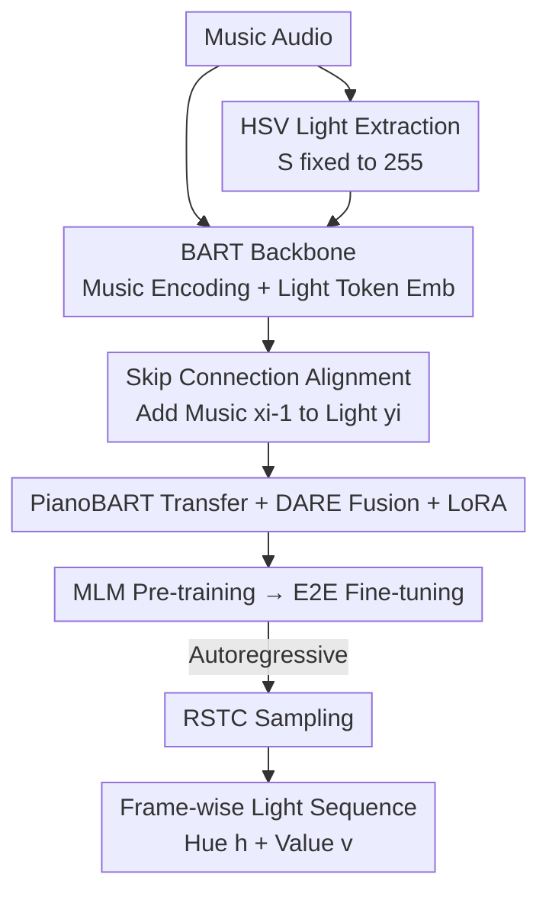

# Automatic Stage Lighting Control: Is it a Rule-Driven Process or Generative Task?

**Conference**: ICLR2026  
**OpenReview**: [https://openreview.net/forum?id=a4Got6azjF](https://openreview.net/forum?id=a4Got6azjF)  
**Code**: https://github.com/RS2002/Skip-BART  
**Area**: Audio / Music Information Retrieval / Sequence Generation  
**Keywords**: Stage Lighting Control, Music-to-Light Generation, BART, Skip Connection, Transfer Learning

## TL;DR
This paper redefines "Automatic Stage Lighting Control (ASLC)" from the long-standing paradigm of "music classification → table lookup" to a **generative task**. It proposes Skip-BART, an end-to-end model that takes music audio as input and autoregressively generates hue and value for lighting frame-by-frame. A novel skip connection explicitly aligns music and lighting frames. Supported by a self-built dataset, pre-training, and transfer learning, the model outperforms rule-based methods across quantitative metrics and a 38-person subjective evaluation, showing no significant difference from professional lighting designers (p=0.72).

## Background & Motivation

**Background**: In live music performances, stage lighting is essential for creating atmosphere and evokes audience emotion. However, hiring and training professional lighting designers (LDs) is costly, leading to the development of ASLC. Current mainstream approaches almost exclusively follow a single pattern: classify music into finite categories (by style, emotion, or chords) and pre-define a lighting pattern for each category, triggering the corresponding pattern during performance.

**Limitations of Prior Work**: This "classification → lookup" paradigm suffers from two major flaws. First, **granularity is too coarse and classification is inaccurate**: data scarcity and labeling difficulties keep classifier accuracy often below 80%. Furthermore, category definitions are imprecise—for instance, Black Metal and Folk Black Metal have entirely different atmospheres but might be grouped under Metal or even Rock, where misclassification and coarse labeling directly degrade quality. Second, the **"category → lighting" mapping lacks theoretical support**: lighting is a hybrid of technique and art; whether it can be defined by fixed patterns is questionable. Existing research (McDonald et al.) suggests the relationship between hue and emotion is limited—the paper's own data observed Groove Metal paired with green instead of the red predicted by emotional theories.

**Key Challenge**: Rule-based methods forcibly reduce an **artistic creative process** into a **mechanical discrete mapping**. Human LDs do not simply "identify emotion → look up color"; they light creatively and continuously based on the musical flow. Approximating this process with classification + lookup losses continuity and creativity by design.

**Goal**: To abandon the classification paradigm and directly learn from the outputs of professional human LDs. Specifically, this focuses on an actionable sub-problem—**offline main lighting generation**: predicting the hue and value of a single main beam frame-by-frame for a given music sequence.

**Key Insight**: Given the success of generative methods in Music Information Retrieval (MIR) for tasks like video background music, MV generation, and lyric generation, treating ASLC as "content generation" is promising—allowing the network to train end-to-end on real data from human LDs rather than fitting a human-defined mapping table.

**Core Idea**: To use a generative sequence model (a modified BART) to **directly generate lighting sequences from music**, employing skip connections to force the model to recognize the critical alignment of "music frame $i$ corresponds to lighting frame $i$."

## Method

### Overall Architecture
Skip-BART utilizes BART as its backbone: a bidirectional encoder processes the entire music segment to extract context, while a unidirectional decoder autoregressively outputs lighting tokens. On the input side, OpenL3 extracts music audio features, followed by an MLP for dimension alignment with BART. For lighting, Hue/Value are pre-processed in HSV space, discretized into tokens, and encoded via embedding layers. Training follows three steps: **MLM pre-training** on music (without lighting to prevent leakage, allowing the decoder to learn musical structure), **end-to-end fine-tuning** (predicting the next lighting token from music), and **RSTC sampling** during inference to ensure diversity and stability. Two key "adhesives" are the skip connections that explicitly inject frame alignment and pre-trained parameters transferred from PianoBART to aid cold-start.

### Key Designs

**1. Redefining ASLC as a Generative Task + RPMC-L2 Dataset: Data Before Generation**

Rule-based methods prevail primarily because of the lack of paired "music-lighting" data. The first step of this paper is to shift the task paradigm from classification to generation while solving the data scarcity. The authors constructed the first stage lighting dataset, **RPMC-L2** (Rock/Punk/Metal/Core - Livehouse Lighting), using an automated method to extract lighting labels from videos. Collected over five years from various bands and venues using four types of equipment, it covers styles like metalcore, alternative rock, and post-punk, totaling 699 samples (20s to 5 mins each). Extraction is performed in HSV space with saturation $S$ fixed at 255 (100%) to counteract color decay from air scattering and smoke, ensuring primary colors remain vivid even at extreme intensities. Each frame is recorded as $y_t=[h_t, v_t]$.

**2. Skip Connection: Explicitly Informing the Model of Frame Alignment**

Applying vanilla BART directly often leads to a failure in **learning rhythm**, where lighting changes and patterns fail to synchronize with the music. Decoders struggle to determine which lighting frame corresponds to which music frame solely through attention. While humans recognize that music $x$ and lighting $y$ are of equal length and aligned frame-by-frame, learning this end-to-end from complex, noisy data is difficult. Skip-BART's solution is straightforward: **directly add** music embeddings and lighting embeddings before they enter the decoder. The embedding of lighting token $y_i$ is added to music token $x_{i-1}$ (shifted right by one for the decoder input). This provides the model with a "lookup table" at every time step, bypassing the need for alignment guessing. Ablations show that removing skip connections increases Value RMSE from 60.74 to 68.33 and drops subjective Overall scores from 4.35 to 4.11.

**3. Transfer Learning + DARE Parameter Fusion + LoRA: Extracting External Knowledge**

With only 699 samples, training a generative model from scratch is insufficient. The paper uses the backbone of PianoBART (a large-scale symbolic music pre-trained model) for cold-starts and employs **DARE (Drop And Rescale)** to **fuse** parameters fine-tuned on multiple downstream tasks (priming, melody extraction, velocity prediction, etc.):

$$\theta = \theta_{pre} + \lambda \sum_i (\theta^i_{DARE} - \theta_{pre}), \quad \theta^i_{DARE} = \theta_{pre} + \frac{(\theta^i - \theta_{pre}) \odot m_i}{1-p}, \quad m_i \sim \text{Bernoulli}(p)$$

where $p$ is the drop rate, $\lambda$ is the scale, and $m_i$ is a random mask. After fusion, **LoRA** is used for efficient fine-tuned to prevent overfitting on the small dataset. Additionally, Hue is processed via an embedding layer rather than an MLP because Hue is a **circular variable** (0° and 359° are nearly identical). While MLPs struggle with periodicity, embedding layers naturally learn relationships between tokens. Ablations show Hue RMSE worsening from 36.13 to 51.04 without light embeddings.

**4. Three-stage Workflow: MLM Pre-training + Adaptive Weight Fine-tuning + RSTC Sampling**

The pipeline is split into three phases to solve specific issues. **MLM Pre-training** uses music only (no lighting) to recover tokens where k% are [MASK]ed. Since music tokens are continuous, [MASK] is designed as a random variable sampled from a normal distribution $M_i \sim N(\mu_i, \sigma_i)$. A GAN discriminator is added to improve realism, with $L_{pre}=\alpha_1 l_1 + \alpha_2 l_2 + \alpha_3 l_3$ covering reconstruction, mask recovery, and authenticity. **End-to-end fine-tuning** treats lighting generation as frame-wise classification, using $L_{stf}=\beta_1\text{CE}(\hat h, h)+\beta_2\text{CE}(\hat v, v)$. Because Hue and Value learn at different rates, $\beta$ is **adaptively weighted** based on the inverse of the previous epoch's validation accuracy. **RSTC Inference** adds an "anti-overshoot" constraint to temperature sampling: the Hue/Value delta between adjacent frames cannot exceed threshold $d_t$ (circular distance for Hue). Probabilities for categories exceeding the threshold are zeroed, ensuring diversity without violent flickering.

### Loss & Training
Pre-training uses $L_{pre}=\alpha_1 l_1 + \alpha_2 l_2 + \alpha_3 l_3$ (reconstruction + recovery + discriminator authenticity), with the discriminator optimized separately via $L_{dis}$. Fine-tuning uses the sum of cross-entropy for Hue/Value with adaptive $\beta$ weights. Implementation is in PyTorch on 2×4090 + 1×A100.

## Key Experimental Results

### Main Results (Quantitative)
Assuming that generative results closer to the human ground truth (GT) are better, the study calculates RMSE, MAE (circular for Hue), and corr(|Δ|) (Pearson correlation of first-order difference magnitudes, ×100).

| Method | RMSE↓ (Hue) | RMSE↓ (Value) | MAE↓ (Hue) | MAE↓ (Value) | corr(\|Δ\|) (Hue) | corr(\|Δ\|) (Value) |
|------|------|------|------|------|------|------|
| Rule-based | 48.67 | 93.39 | 43.43 | 86.55 | 0.50 | 0.58 |
| **Skip-BART** | **36.13** | **60.74** | **28.72** | **51.27** | **0.88** | **2.94** |

Skip-BART shows significantly lower error than rule-based methods in both Hue and Value, with Value RMSE dropping from 93.39 to 60.74.

### Ablation Study

| Configuration | RMSE (Hue) | RMSE (Value) | Description |
|------|------|------|------|
| Full (Skip-BART) | 36.13 | 60.74 | Full Model |
| w/o skip connection | 36.89 | 68.33 | Removing skip connection significantly degrades Value |
| w/o light embedding | 51.04 | 67.25 | Using MLP instead of embedding for Hue breaks Hue accuracy |
| train from scratch | 36.63 | 67.49 | No transfer learning cold-start |
| pre-train w/o random [MASK] | 49.97 | 64.45 | Removing random mask in pre-training |
| pre-train w/o discriminator | 50.40 | 68.09 | Removing GAN discriminator in pre-training |

### Subjective Evaluation
38 participants (including 9 professionals in lighting/music/stage design) rated 3 music segments across 4 sources (GT / Skip-BART / Ablation / Rule-based) on 6 dimensions (1–7 scale), analyzed using repeated-measures ANOVA + Bonferroni correction.

| Method | Overall (M±SD) |
|------|------|
| Ground Truth | 4.51±0.88 |
| **Skip-BART** | 4.35±0.87 |
| Ablation (w/o skip) | 4.11±0.84 |
| Rule-based | 2.67±1.29 |

Skip-BART closely trails GT. All learning methods significantly outperform the rule-based approach (p<0.05). Statistically, Skip-BART shows **no significant difference from human GT (p=0.72)** but is significantly better than rule-based methods (p<0.001). In cross-domain (other music styles) tests, Skip-BART maintained an Overall score of 4.34.

### Key Findings
- **Skip connections are vital for rhythm alignment**: Their removal caused Value RMSE to increase by 7.6 and Overall scores to drop by 0.24, confirming that explicit frame alignment helps synchronize lighting with music.
- **Hue requires embedding layers over MLPs**: Due to its circular nature, switching to MLP caused Hue RMSE to spike from 36 to 51, the most severe degradation in the ablation study.
- **Random [MASK] and Discriminators are essential for pre-training**: Removing either resulted in Hue RMSE regressing to ~50, showing that self-supervised details are critical under data scarcity.
- **Emotion was the only dimension where GT did not dominate**, and rule-based methods performed relatively better here—supporting the argument that the relationship between emotion and lighting is limited.

## Highlights & Insights
- **The paradigm shift is the primary contribution**: This is the first work to reframe ASLC as an end-to-end generative task and prove it can approximate human performance—a fresh perspective in a niche task.
- **Skip connections serve as a simple yet precise "alignment prior"**: Instead of letting attention struggle to learn a 1:1 mapping, adding $x_{i-1}$ and $y_i$ embeddings encodes the structural prior directly. This "domain-structure over learning" approach is transferable to any cross-modal generation with strict frame alignment.
- **Fixing S to 255 in HSV is a practical engineering trick**: Real-world lighting in videos fades due to smoke/diffusion; fixing saturation allows stable extraction of intended colors, useful for any work extracting color labels from performance footage.
- **DARE + LoRA combo for small-data MIR**: Fusing knowledge from multiple fine-tuned models into one set of weights before low-rank adaptation offers a replicable path for scenarios with scarce data but available pre-trained models.

## Limitations & Future Work
- **Scope limited to offline, single main light**: Real performances are real-time, involve multiple fixtures, stroboscopy, and beam shaping. The paper's current scope is far from a production-ready multi-light system.
- **Narrow dataset breadth**: RPMC-L2 only covers heavy music (Rock/Punk/Metal/Core). While 699 samples are decent for MIR, generalization to Electronic, Classical, or Pop remains to be fully verified.
- **Assumptive evaluation metrics**: Quantitative analysis assumes "closer to GT is better," but lighting is creative and lacks a single "correct" answer. While subjective tests mitigate this, the 38-person sample (mostly heavy music fans) has limited universality.
- **Future directions**: Expanding to real-time online generation, multi-light coordination, incorporating explicit beat/segment structural conditions, and evaluating "creative diversity" rather than just GT proximity.

## Related Work & Insights
- **vs. Style/Emotion Rule-based Methods (Stanescu et al. 2018; Hsiao et al. 2017)**: These categorize first, then look up lighting. This paper uses end-to-end generation. Rule methods are limited by classification accuracy ($<80\%$) and arbitrary mappings, while generation fits real human data, improving subjective scores from 2.67 to 4.35.
- **vs. Autoencoder Mapping (Tyroll et al. 2020)**: They use autoencoders to extract features and map embeddings to lights. This paper uses BART for end-to-end autoregressive generation, offering stronger backbone capabilities and avoiding vague embedding-to-lighting mappings through explicit alignment.
- **vs. PianoBART (Liang et al. 2024)**: While PianoBART is a symbolic music backbone, this paper uses it as a transfer source. The innovation lies in cross-modal transfer of symbolic music knowledge to the "audio → lighting" task.

## Rating
- Novelty: ⭐⭐⭐⭐⭐ First to redefine ASLC as generation with the first stage lighting dataset.
- Experimental Thoroughness: ⭐⭐⭐⭐ Solid quantitative + 6-dimension subjective + ablation, though style coverage is narrow.
- Writing Quality: ⭐⭐⭐⭐ Clear motivation, well-explained methodology, and good integration of formulas/figures.
- Value: ⭐⭐⭐⭐ Clear practical value in reducing lighting costs; reusable methodology and dataset.

<!-- RELATED:START -->

## Related Papers

- [\[ICLR 2026\] Confident and Adaptive Generative Speech Recognition via Risk Control](confident_and_adaptive_generative_speech_recognition_via_risk_control.md)
- [\[ICLR 2026\] SpeechOp: Inference-Time Task Composition for Generative Speech Processing](speechop_inference-time_task_composition_for_generative_speech_processing.md)
- [\[ACL 2026\] Pseudo2Real: Task Arithmetic for Pseudo-Label Correction in Automatic Speech Recognition](../../ACL2026/audio_speech/pseudo2real_task_arithmetic_for_pseudo-label_correction_in_automatic_speech_reco.md)
- [\[ICLR 2026\] Discovering and Steering Interpretable Concepts in Large Generative Music Models](discovering_and_steering_interpretable_concepts_in_large_generative_music_models.md)
- [\[ICLR 2026\] Improving Black-Box Generative Attacks via Generator Semantic Consistency](improving_black-box_generative_attacks_via_generator_semantic_consistency.md)

<!-- RELATED:END -->
