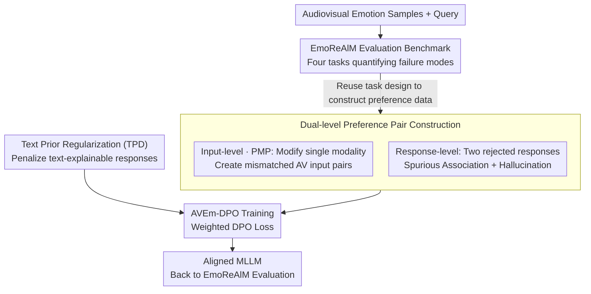

# AVERE: Improving Audiovisual Emotion Reasoning with Preference Optimization

**Conference**: ICLR 2026  
**arXiv**: [2602.07054](https://arxiv.org/abs/2602.07054)  
**Code**: [https://github.com/ihp-lab/AVERE](https://github.com/ihp-lab/AVERE)  
**Area**: Alignment RLHF  
**Keywords**: Multimodal emotion understanding, preference optimization, DPO, hallucination mitigation, audiovisual reasoning

## TL;DR
Addressing the issues of spurious associations and hallucinations in multimodal large language models (MLLMs) during emotion reasoning, this work proposes the EmoReAlM evaluation benchmark and the AVEm-DPO preference optimization method. By constructing targeted preference pairs and text prior regularization, it achieves a zero-shot relative performance gain of 6-19% on DFEW, RAVDESS, and EMER.

## Background & Motivation
Emotion understanding is a core capability for building social agents. While MLLMs have made significant progress in emotion recognition, two key challenges remain:

**Challenge One: Spurious Associations**. Models often incorrectly associate emotions with irrelevant audiovisual cues, such as linking a yellow turtleneck in the frame to "happiness" instead of focusing on facial expressions. This is a reasoning-level error.

**Challenge Two: Hallucinations**. The text priors of the language model backbone drive the model to "fabricate" audiovisual cues, such as claiming a video contains "clenched fists" to support a determination of "anger" when the action does not exist. This is a perception-level error.

Existing multimodal preference optimization methods (e.g., Vista-DPO) are mainly oriented toward general video understanding and are not designed for the specific problems in emotion reasoning. Furthermore, there is a lack of specialized evaluation tools to systematically quantify spurious associations and hallucinations in MLLMs within emotional contexts.

**Core Idea**: Simultaneously construct an evaluation benchmark (EmoReAlM) and an alignment method (AVEm-DPO), introducing preference pair construction strategies for spurious associations and hallucinations alongside text prior regularization to align the model's audiovisual perception with its emotion reasoning capabilities from the source.

## Method

### Overall Architecture
This paper addresses the risk of MLLMs "getting the right answer for the wrong reason"—where models may rely on irrelevant cues (spurious associations) or fabricated evidence (hallucinations). The authors employ a two-pronged approach: first, creating EmoReAlM solely for testing to quantify these failure modes; second, proposing AVEm-DPO to perform emotion-specific alignment within a preference optimization framework. The effectiveness of AVEm-DPO lies not in the DPO algorithm itself, but in **how preference data is constructed**. It creates chosen/rejected pairs at both the input and response levels, teaching the model "which modality to look at" and "how to state the correct reason." Additionally, a text prior regularization term is added to cut off the source of language backbones fabricating audiovisual cues based on common sense. Aligned models are then evaluated on EmoReAlM.

### Key Designs

**1. EmoReAlM Evaluation Benchmark: Distinguishing "Right Answer, Wrong Reason"**

Traditional emotion recognition only checks the final label, failing to expose if the model guessed correctly based on irrelevant or fabricated evidence. EmoReAlM uses 4000 human-verified Multiple Choice Questions (MCQA) to decompose emotion reasoning into four task categories for systematic diagnosis: Reasoning Basic checks if the model truly relies on correct audiovisual cues; Stress Test specifically probes whether the model hallucinates cues that do not exist; Modality Agreement tests if it can distinguish whether visual and auditory cues truly align; the remaining dimensions confirm the model does not miss cues that are actually present. Together, these tasks pinpoint "spurious associations" (reasoning errors) and "hallucinations" (perceptual errors). Note that this is used only as a test set and not for training.

**2. Dual-level Preference Pair Construction: Targeting Emotion-Specific Errors**

The core efficacy of AVEm-DPO over general DPO lies in preference pair construction, targeting both input and response levels. The input level utilizes Prompt-based Modality Preference (PMP): when a query targets a specific modality (e.g., "How does the character's body language support his anger?"), only the **corresponding modality in the rejected pair is modified**. This forces the model to anchor its response to that modality, mitigating cross-modality hallucinations where visual questions are biased by audio, corresponding to the objective $L^{avprompt}_{DPO}$. At the response level, two rejected answers are constructed for the same input: $y^{vr}_l$ uses cues relevant to the video but irrelevant to the emotion (spurious association), while $y^{er}_l$ introduces cues relevant to the emotion but absent from the video (hallucination). These are integrated into the DPO loss with weights $\beta_{vr}+\beta_{er}=1$ to create a strong contrast between the "correct reason" and both types of "incorrect reasons." Input-level handles "where to look," while response-level handles "how to reason," together refining the alignment.

**3. Text Prior Regularization: Cutting Hallucinations at the Root**

The root of hallucination lies in the inherent text bias of language backbones—the tendency to fabricate audiovisual descriptions based on textual common sense (e.g., "crying is often accompanied by sobbing") even without audiovisual evidence. Text Prior Debiasing (TPD) modifies the reward: the probability of generating the response based solely on text input is subtracted as a penalty term: $r(a,v,x,y)=\log\frac{\pi_\theta(y\mid a,v,x)}{\pi_{ref}(y\mid a,v,x)}-\lambda_{TPD}\log\pi_{text}(y\mid x)$. Consequently, responses explainable purely by text priors are penalized, while those supported by real audiovisual content receive a relative boost. During training, gradients are stopped for $\pi_{text}$ (used only to identify text bias), and LoRA is applied to the backbone to preserve its original text capabilities.

### Loss & Training
The final objective combines the components: $L_{AVEm\text{-}DPO}=L^{y}_{DPO\text{-}TPD}+\lambda_{av}L^{avprompt}_{DPO}$, representing the "TPD-regularized weighted response-level DPO" plus "input-level modality preference DPO." Preference data is derived from subsets of MAFW and MER2025, using Gemini-2.5 to generate response variants (following a pipeline similar to EmoReAlM but strictly separate). The process is evaluated in a zero-shot setting without fine-tuning on target datasets. For generalization, training is conducted on two backbones: Our base (based on VITA-1.5) and the emotion-specifically tuned EmotionLLaMA, with final testing on DFEW, RAVDESS, and EMER.

## Key Experimental Results

### Main Results

| Dataset | Metric | AVEm-DPO (Ours) | Naive-DPO | Vista-DPO | Base | Gain (vs Base) |
| :--- | :--- | :--- | :--- | :--- | :--- | :--- |
| DFEW | WAR | 58.54 | 55.67 | 56.42 | 56.78 | +3.1% |
| DFEW | UAR | 64.24 | 59.90 | 62.33 | 60.14 | +6.8% |
| RAVDESS | WAR | 58.66 | 53.63 | 56.94 | 53.59 | +9.5% |
| EmoReAlM | Avg | 83.3 | 68.1 | 76.9 | 65.1 | +28.0% |

### Ablation Study

| Configuration | EmoReAlM Avg | Description |
| :--- | :--- | :--- |
| Our base | 65.1 | No preference optimization |
| + Naive-DPO | 68.1 | Standard DPO, limited improvement |
| + Vista-DPO | 76.9 | General video DPO |
| + AVEm-DPO | 83.3 | Emotion-specific design, best result |

### Key Findings
- AVEm-DPO even outperforms closed-source Gemini 2.5 Pro on EmoReAlM (70.3 $\rightarrow$ 83.3), indicating that targeted alignment is highly effective.
- The method remains effective for the EmotionLLaMA backbone, demonstrating generalizability.
- The most significant improvement occurs in the Stress Test (hallucination detection) sub-task (51.4 $\rightarrow$ 68.9), validating the effect of text prior regularization.
- Performance on the Modality Agreement task rose from 66.4 to 94.6, showing the model learned to genuinely utilize cross-modal information.

## Highlights & Insights
- **Key Insight**: The first preference optimization method specifically targeting multimodal emotion reasoning with a highly precise angle.
- EmoReAlM benchmark is cleverly designed; the four task categories provide a comprehensive analysis of MLLM emotion reasoning weaknesses.
- Dual-level preference pair construction (response-level + input-level) serves as a valuable general paradigm that can be extended to other multimodal tasks requiring fine-grained alignment.
- Text prior regularization is a lightweight yet effective solution for mitigating MLLM hallucinations.
- Leaderboards show AVEm-DPO allows open-source models to outperform closed-source Gemini 2.5 Pro in emotional understanding.
- Qualitative examples clearly demonstrate how AVEm-DPO helps the model focus on real facial expressions and vocal tones rather than fabricating non-existent visual cues.

## Limitations & Future Work
- Although code/models are promised for release, they are still being prepared (HuggingFace checkpoint released: chaubeyG/AVERE-7B).
- The scale and emotion category coverage of the evaluation set could be further expanded beyond basic emotions.
- Evaluation was conducted only in zero-shot settings; few-shot and fine-tuning settings warrant exploration.
- The strength of text prior regularization requires manual tuning; adaptive strategies could be an improvement.
- Evaluation of audio cues in the benchmark depends on the model's audio understanding capability, which is a challenge in itself.
- The automation of preference pair construction could be enhanced, as it currently requires some manual design.

## Related Work & Insights
- **vs Vista-DPO**: Vista-DPO is a general video DPO not designed for emotional contexts; AVEm-DPO constructs specific preference pairs for spurious associations and hallucinations.
- **vs EmotionLLaMA**: EmotionLLaMA fine-tunes on emotion data but still suffers from hallucinations; AVEm-DPO provides further alignment, making them complementary.
- **vs Qwen 2.5 Omni**: While the closed-source model is powerful in general audiovisual understanding, it still lags behind AVEm-DPO in specialized emotion tasks.
- **vs Naive-DPO**: Using standard DPO for preference optimization yields limited results (+3%), indicating that the quality of preference pairs is more important than the algorithm itself.

## Rating
- Novelty: ⭐⭐⭐⭐ Dual contribution of benchmark + alignment; novel preference pair construction.
- Experimental Thoroughness: ⭐⭐⭐⭐ Verified across multiple datasets and backbones with complete ablations.
- Writing Quality: ⭐⭐⭐⭐ Clear problem definition and logical flow.
- Value: ⭐⭐⭐⭐ Directly advances the field of multimodal emotional AI.

<!-- RELATED:START -->

## Related Papers

- [\[ICLR 2026\] EmotionThinker: Prosody-Aware Reinforcement Learning for Explainable Speech Emotion Reasoning](emotionthinker_prosody-aware_reinforcement_learning_for_explainable_speech_emoti.md)
- [\[ACL 2026\] Data-efficient Targeted Token-level Preference Optimization for LLM-based Text-to-Speech](../../ACL2026/audio_speech/data-efficient_targeted_token-level_preference_optimization_for_llm-based_text-t.md)
- [\[ICLR 2026\] Learnable Fractional Superlets with a Spectro-Temporal Emotion Encoder for Speech Emotion Recognition](learnable_fractional_superlets_with_a_spectro-temporal_emotion_encoder_for_speec.md)
- [\[AAAI 2026\] Improving Multimodal Sentiment Analysis via Modality Optimization and Dynamic Primary Modality Selection](../../AAAI2026/audio_speech/improving_multimodal_sentiment_analysis_via_modality_optimization_and_dynamic_pr.md)
- [\[ICLR 2026\] Improving Black-Box Generative Attacks via Generator Semantic Consistency](improving_black-box_generative_attacks_via_generator_semantic_consistency.md)

<!-- RELATED:END -->
