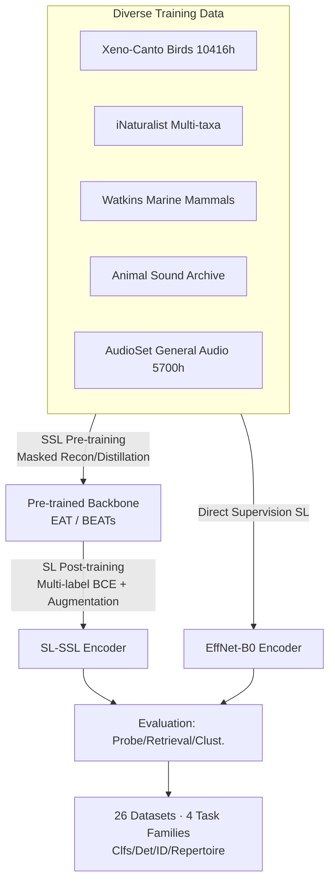

# AVEX: What Matters for Animal Vocalization Encoding

**Conference**: ICLR 2026  
**OpenReview**: [https://openreview.net/forum?id=MFuM9KAEYc](https://openreview.net/forum?id=MFuM9KAEYc)  
**Code**: [https://github.com/earthspecies/avex](https://github.com/earthspecies/avex)  
**Area**: Audio and Speech / Bioacoustic Representation Learning  
**Keywords**: Bioacoustics, animal vocalization, self-supervised pre-training, supervised post-training, general audio encoder, cross-species generalization  

## TL;DR
This is a large-scale empirical study: the authors systematically disassemble "what matters most in training a generalizable bioacoustic encoder." The conclusion is that a **two-stage recipe—self-supervised pre-training on a mixture of diverse bioacoustic and general audio data, followed by supervised post-training**—is the most effective for both in-distribution and out-of-distribution performance. This approach achieves new SOTA across 26 datasets and four task categories.

## Background & Motivation
**Background**: Bioacoustics (the study of animal vocalization) is critical for biodiversity monitoring, species conservation, and animal communication modeling. Tasks such as species/individual/behavior classification and detection are naturally suited for machine learning. Passive Acoustic Monitoring (PAM) and citizen science platforms like Xeno-Canto and iNaturalist have accumulated vast amounts of weakly labeled data, leading to "bioacoustic encoders" like BirdNet and Perch—which learn a general representation on large-scale data for downstream linear probing or fine-tuning.

**Limitations of Prior Work**: Existing encoders generally suffer from three limitations: (1) **Narrow species range**, with the vast majority focusing only on birds; (2) **Single paradigm**, being either purely supervised (BirdNet/Perch) or purely self-supervised (AVES/Animal2Vec/BirdMAE), without systematic comparison of both or their combination; (3) **Narrow evaluation**, focusing almost exclusively on species classification while facing implicit distribution shifts (training on focal recordings, testing on soundscapes). Tasks truly critical to animal communication research, such as individual identification and vocal repertoire discovery, are rarely covered.

**Key Challenge**: Real-world conservation applications require encoders that can **generalize across species, tasks, and recording conditions** (identifying unseen species, recognizing individuals from limited samples, characterizing repertoires without labels). However, current research lacks a systematic understanding of what factors determine generalization and lacks benchmarks to measure it.

**Goal**: Rather than inventing a new architecture, the authors conduct a "what matters" control experiment—bringing **model architecture, data composition, training paradigm, and evaluation methods** into a unified pipeline to identify a reusable training recipe that scales with data and architectural progress.

**Core Idea**: **A two-stage recipe = self-supervised pre-training (SSL) on diverse mixed data + supervised post-training (SL) on the same mixed data.** Supervision excels in-distribution, while self-supervision excels out-of-distribution; combining them into a curriculum of "SSL then SL" captures the benefits of both.

## Method

### Overall Architecture
The paper follows a controlled empirical research framework (Figure 1): fixing a nearly identical training/evaluation pipeline while varying three variables: (1) **Model Architecture**: CNN-based (EfficientNet-B0) vs. Transformer-based (BEATs, EAT); (2) **Data Composition**: Pure bioacoustic (bio), pure general audio (AudioSet), or a mixture (all); (3) **Training Paradigm**: Pure supervised (SL), pure self-supervised (SSL), or SSL followed by SL (SL-SSL). Each combination is tested on a significantly broadened evaluation protocol (26 datasets + 4 task families + probe/retrieval/clustering metrics) to isolate the contribution of each variable to generalization.

### Key Designs

**1. Data Recipe—The mixture of "Bioacoustic + General Audio" is key to generalization.** The authors compiled a bioacoustic corpus with higher species diversity than previous work (Xeno-Canto birds, iNaturalist multi-taxa, Watkins marine mammals, etc.) and added general audio from AudioSet (5700 hours). To align heterogeneous datasets, they mapped all Latin species names to the GBIF taxonomic backbone. Experiments repeatedly show: **incorporating general audio (all) into bioacoustic training consistently brings gains** in focal classification, soundscape detection, repertoire discovery, and individual ID. Conversely, training purely on general audio transfers poorly, indicating that bioacoustic data is the indispensable core while general audio acts as a "generalization lubricant."

**2. Two-stage Curriculum Training (SL-SSL)—Bridging the OOD advantages of SSL and the ID advantages of SL.** Supervised models are strong on tasks close to the training distribution, whereas SSL models are more robust out-of-distribution (focal → soundscape). When migrating from BEANS classification to BEANS detection, SSL models only lose an average of $0.01$ in retrieval ROC AUC, while SL models lose $0.09$. Based on this, the authors propose an "SSL pre-training followed by SL post-training" recipe on the same mixed data (equivalent to a two-step curriculum or BEATs-style iterative training). Post-training uses multi-label BCE loss to predict species labels. The resulting `sl-BEATS-all` is strongest both in and out of distribution, retaining the OOD generalization of the SSL backbone while gaining the discriminative power of SL.

**3. Robustness Enhancement—Noise Injection + In-batch Mixup.** To improve robustness against real-world field noise, 0.5 probability environmental noise injection is used in both pre-training and post-training, with SNR uniformly sampled from $\text{SNR}\sim\mathcal{U}(-10\text{dB}, 20\text{dB})$. In the post-training phase, in-batch mixup is applied (0.5 probability) by linearly mixing two segments and taking the element-wise OR of their labels to simulate overlapping sound sources in soundscapes. This augmentation is crucial for benchmarks with high covariate shift like BirdSet.

**4. Broadened Evaluation Protocol—From "Bird Species Classification Only" to "Multi-task × Multi-metric."** The authors expanded evaluation to three complementary perspectives: **Linear Probe** (training a linear classifier on frozen embeddings), **Retrieval** (using test samples as queries to rank by cosine similarity, measured by ROC AUC or R-AUC, requiring no training), and **Clustering** (K-means with a known number of clusters, measured by Normalized Mutual Information or NMI). They also added two neglected tasks—**Individual Identification** and **Vocal Repertoire Discovery** (treated as a structure recovery problem when K is known)—and organized 8 new public datasets, expanding the evaluation scale from 2 to 26 datasets.

## Key Experimental Results

### Main Results (Aggregated across benchmarks; Probes are Acc/mAP, R-auc is ROC AUC, C-nmi is NMI)

| Model | Paradigm | BEANS Clfs Probe | BEANS Clfs R-auc | BEANS Det Probe | BirdSet Probe | Individual ID Probe | Repertoire R-auc |
|------|------|------|------|------|------|------|------|
| BEATs (pretrained) | SSL | 0.774 | 0.734 | 0.339 | 0.129 | 0.380 | 0.775 |
| Perch | SL | 0.768 | 0.759 | 0.368 | 0.233 | 0.530 | 0.758 |
| BirdNet | SL | 0.796 | 0.772 | 0.392 | N/A | 0.472 | 0.795 |
| NatureBEATs | SL-SSL | 0.804 | 0.774 | 0.385 | 0.223 | 0.410 | 0.811 |
| EffNetB0-all | SL | 0.800 | 0.809 | 0.362 | 0.279 | **0.531** | **0.830** |
| **sl-BEATS-all** | SL-SSL | **0.832** | **0.813** | **0.408** | **0.294** | 0.511 | 0.798 |
| sl-BEATS-bio | SL-SSL | 0.840 | 0.811 | 0.390 | 0.288 | 0.484 | 0.789 |

> Models below the line are newly trained in this work. `sl-BEATS-all` (SSL then SL, mixed data) achieves overall SOTA on BEANS and BirdSet, while the new `EffNetB0-all` is strongest in Individual ID and Repertoire Discovery.

### Ablation Study (Impact of Data Composition on EffNet Post-training)

| Data Composition | BEANS Clfs Probe | BEANS Clfs R-auc | BirdSet Probe | Individual ID Probe | Repertoire C-nmi |
|------|------|------|------|------|------|
| AudioSet only | 0.651 | 0.721 | 0.098 | 0.397 | 0.481 |
| Bio only | 0.786 | 0.799 | 0.279 | 0.457 | 0.568 |
| all (Bio + AudioSet) | **0.800** | **0.809** | 0.279 | **0.531** | **0.582** |

> Supervised transfer using only general audio is very poor (0.098 on BirdSet). Adding general audio to bioacoustic data (all) consistently outperforms pure bio across almost all tasks, confirming the "mixed data" recipe is key to generalization.

### Key Findings
- **SSL brings OOD advantages**: In focal → soundscape transfer, the strongest pure SSL model (pre-trained BEATs) even outperforms pure SL models on BEANS detection; SSL loses only 0.01 R-AUC on average, while SL loses 0.09.
- **Two-stage is "the best of both worlds"**: Post-training allows SSL backbones to gain SL-level discriminative power while retaining OOD generalization; `sl-BEATS-all` is robust both in and out of distribution.
- **Stronger SSL backbones → Better post-trained models**: BEATs post-training achieves SOTA more effectively than EAT, suggesting that post-training performance is capped by the strength of the pre-trained backbone.
- **Large-scale species prediction transfers to non-classification tasks**: Supervised training on species classification unexpectedly transfers to individual identification and repertoire discovery—tasks typically studied independently.

## Highlights & Insights
- **The "What Matters" empirical paradigm**: Instead of stacking new modules, it provides a comprehensive comparison of architecture/data/paradigm/evaluation. The conclusions are reusable and extendable with data/architectural progress.
- **Suturing SSL and SL**: The paper clearly quantifies the OOD advantages of SSL and the ID advantages of SL, capturing both via a two-stage recipe. This provides a simple yet effective upgrade path for the bioacoustics community.
- **Evaluation infrastructure as a long-term contribution**: Adding individual ID and repertoire discovery, 8 new datasets, and retrieval/clustering metrics broadens evaluation from bird classification to a multi-perspective view. Open-sourcing the AVEX library and checkpoints lowers the barrier for future research.

## Limitations & Future Work
- **Sampling rate limited to 16kHz**: Data was unified at 16kHz for fair comparison, but critical information for many species resides above 8kHz, potentially underestimating performance for high-frequency species.
- **Segment-based detection**: Detection is treated as segment-level multi-class classification, lacking finer frame-based or event-based temporal detection.
- **Lack of controlled OOD datasets**: Analyzing R-AUC on large datasets trades control for scale; confounding factors like species distribution and noise were not strictly isolated.
- **Last-layer embeddings + linear probe only**: No layer-wise analysis or full fine-tuning was performed, meaning the optimal performance for each model might not have been fully exploited.

## Related Work & Insights
- **Bioacoustic Encoder Lineage**: This work provides the first unified evaluation of CNN-based (BirdNet/Perch) and Transformer-based (AVES, Animal2Vec, BirdMAE, TweetyBert) models.
- **General Audio SSL**: Frameworks like Wav2vec, HuBERT, and BEATs provide the foundation; EAT was selected for its open-source status and training efficiency.
- **Text-Audio Bioacoustic Models**: Models like BioLingual (CLAP-style) and NatureLM-audio (Llama3 + BEATs) are complementary. NatureLM's BEATs component was used as a baseline, confirming that text-audio training also yields strong encoders.
- **Inspiration**: The recipe of "SSL on mixed data, then SL on the same distribution + multi-task evaluation" can be transferred to other low-resource, high-shift audio domains (e.g., underwater acoustics, industrial anomaly detection).

## Rating
- **Novelty**: ⭐⭐⭐⭐ — Not a new architecture, but the first systematic empirical answer to "what matters" for bioacoustic encoders, with a validated two-stage recipe.
- **Experimental Thoroughness**: ⭐⭐⭐⭐⭐ — Large-scale comparison across 19 models, 26 datasets, and multiple dimensions.
- **Writing Quality**: ⭐⭐⭐⭐ — Variables are clearly disassembled, and conclusions are well-supported by figures and tables.
- **Value**: ⭐⭐⭐⭐⭐ — Open-sourced encoders, library, and new benchmarks provide direct and long-term value for animal communication and ecological conservation research.

<!-- RELATED:START -->

## Related Papers

- [\[ICLR 2026\] When and Where to Reset Matters for Long-Term Test-Time Adaptation](when_and_where_to_reset_matters_for_long-term_test-time_adaptation.md)
- [\[NeurIPS 2025\] WhAM: Towards A Translative Model of Sperm Whale Vocalization](../../NeurIPS2025/audio_speech/wham_towards_a_translative_model_of_sperm_whale_vocalization.md)
- [\[ICML 2026\] Few-Shot Synthetic Accented Speech for ASR Fine-Tuning: What Helps and When?](../../ICML2026/audio_speech/few-shot_synthetic_accented_speech_for_asr_fine-tuning_what_helps_and_when.md)
- [\[CVPR 2026\] Hear What You See: Video-to-Audio Generation with Diffusion Transformer and Semantic-Temporal Alignment-Ranked Direct Preference Optimization](../../CVPR2026/audio_speech/hear_what_you_see_video-to-audio_generation_with_diffusion_transformer_and_seman.md)
- [\[ICLR 2026\] OWL: Geometry-Aware Spatial Reasoning for Audio Large Language Models](owl_geometry-aware_spatial_reasoning_for_audio_large_language_models.md)

<!-- RELATED:END -->
