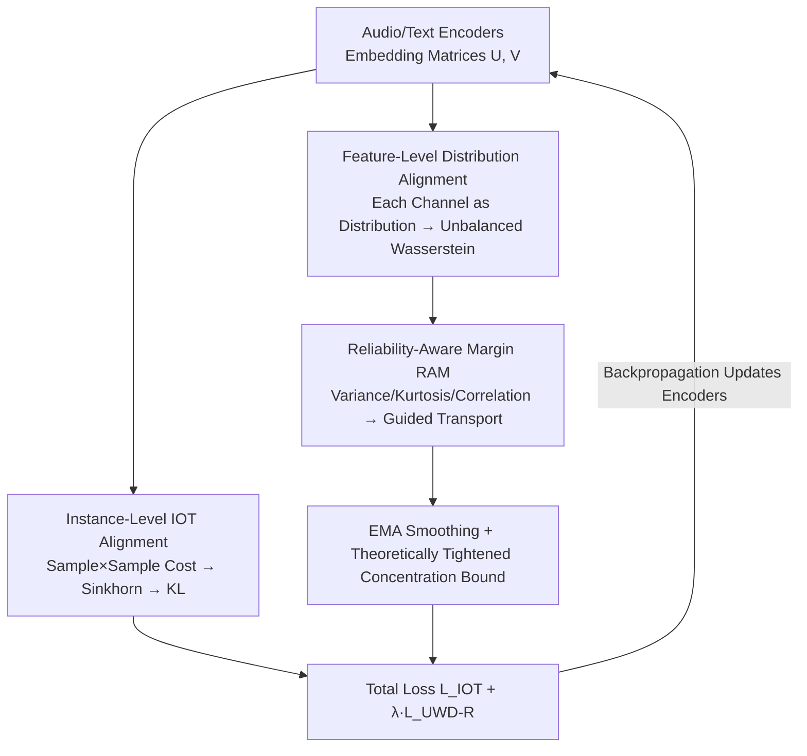

# Beyond Instance-Level Alignment: Dual-Level Optimal Transport for Audio-Text Retrieval

**Conference**: ICLR2026  
**OpenReview**: [https://openreview.net/forum?id=cFhcd4WGjO](https://openreview.net/forum?id=cFhcd4WGjO)  
**Code**: To be confirmed  
**Area**: Audio Retrieval / Cross-modal Matching  
**Keywords**: Audio-Text Retrieval, Optimal Transport, Unbalanced Wasserstein, Channel Reliability, Mini-batch Robustness

## TL;DR
DART introduces a "feature-level" alignment layer beyond traditional "instance-level" audio-text alignment—treating each embedding channel as a distribution and employing Unbalanced Wasserstein distance to pair audio and text channels. Guided by a "Reliability-Aware Margin" based on variance, kurtosis, and cross-modal correlation to favor stable semantic channels, DART achieves SOTA retrieval performance under mini-batch, label-scarce, and noisy-label conditions.

## Background & Motivation
**Background**: Current mainstream methods for audio-text retrieval (text-to-audio and audio-to-text)—such as contrastive learning, triplet loss, and learn-to-match—can be unified under the perspective of Inverse Optimal Transport (IOT). Audio and text are encoded into vectors, a learnable cost matrix $C_{ij}=d(f_\theta(x_i),g_\phi(y_j))$ serves as the "ground cost," and a coupling matrix $\Pi$ is solved via Sinkhorn to approximate the ground-truth matching with a positive diagonal.

**Limitations of Prior Work**: This paradigm suffers from two interconnected flaws. First, the cost is estimated from a mini-batch; smaller batches lead to larger sampling variance, causing the learned metric to be easily swayed by noise and bias. Second, and more fundamentally, it remains at the **instance-level**: $d(x_i,y_j)$ collapses the entire sample pair into a single scalar, implicitly assuming "all feature dimensions are equally important." However, audio and text embeddings are heterogeneous—some channels encode stable semantics (e.g., the identity of a "drone"), while others encode modality-specific noise or transient patterns. Summing all dimensions at once ($d(x_i,y_j)=\sum_d (x_{id}-y_{jd})^2$) allows a few high-variance noise channels to inflate the distance between **semantically matching** pairs, distorting the gradient signal.

**Key Challenge**: Scalarized instance-level similarity naturally erases information about "which channels are trustworthy." Even when prior work (e.g., Luong et al. 2024) performs channel weighting, it eventually collapses into a pairwise scalar, leaving fluctuating channels coupled within the learning signal—a problem particularly acute in mini-batches. The paper provides a theoretical explanation: the concentration bound of the instance-level IOT loss is controlled by $D_{\max}=\max_{(i,j):\tilde\Pi_{ij}>0} d(x_i,y_j)$ (the maximum alignment distance among matching pairs), which is an **extreme value** highly sensitive to outliers and label noise.

**Goal**: To introduce an alignment signal that is not dominated by the single worst sample and can identify and down-weight noisy channels, without abandoning instance-level alignment.

**Key Insight**: The authors treat "feature channels" as first-class citizens. Since the values of each channel across a mini-batch naturally form a distribution, one can perform optimal transport between audio and text channel distributions, allowing the transport plan to determine which channels should be aligned and which should be "ignored."

**Core Idea**: By using "Feature-level Unbalanced Wasserstein Distance + Reliability-Aware Margin" as a regularizer, the control variable for alignment is shifted from the volatile $D_{\max}$ to the Frobenius norm of the transport plan $\|P^*\|_F$ (an aggregate quantity), thereby tightening the concentration bound and achieving mini-batch robustness.

## Method

### Overall Architecture
DART (Dual-level Alignment via Robust Transport) takes a mini-batch of audio-text pairs as input and outputs optimized audio/text encoders to make retrieval in both modalities more accurate and stable. The pipeline runs two alignment paths simultaneously on each batch and sums them into a total loss: The **instance-level** path follows IOT—encoders produce embedding matrices $U^b\in\mathbb{R}^{k\times d_u}$ and $V^b\in\mathbb{R}^{k\times d_v}$, pairwise costs are calculated, Sinkhorn solves for coupling, and KL divergence is computed against ground-truth matches to obtain $\mathcal{L}_{\text{IOT}}$. The **feature-level** path is the new addition—treating **each column** of the embedding matrix (the values of a channel within the batch) as a distribution, it constructs a feature cost matrix between audio and text channel sets, solves for the transport plan $P^b$ via Unbalanced Wasserstein Distance (UWD), and replaces the uniform margin in UWD with a "Reliability-Aware Margin" calculated from statistics to steer transport toward stable channels, yielding $\mathcal{L}_{\text{UWD-R}}$. The two losses are summed with coefficient $\lambda$ for end-to-end training; reliability scores are smoothed across batches using EMA to avoid mini-batch jitter.

### Key Designs

**1. Dual-level Alignment: Layering Feature-level Regularization Over Instance-level IOT**

The direct motivation is that instance-level alignment collapses sample pairs into scalars, making them vulnerable to noise channels and resulting in a concentration bound controlled by the extreme value $D_{\max}$, leading to high variance in small batches. DART does not replace IOT but adds feature-level alignment in parallel: instance-level handles global sample correspondence (e.g., "which audio matches which text"; $\mathcal{L}_{\text{IOT}}=\mathrm{KL}(\tilde\Pi^b\|\Pi^{(\theta,\phi)b})$), while feature-level acts as a **structural regularizer** to filter out noisy feature directions. Ablation studies confirm their complementarity: using only feature-level $\mathcal{L}_{\text{UWD}}$ fails to learn sample correspondence (R@1 ≈ 0), while using only instance-level is a standard baseline; the combination is optimal. Theoretically, this superposition shifts the alignment control from the instance-level $D_{\max}$ to an aggregate feature-level quantity, making the system less sensitive to noise.

**2. Feature-level Distribution Alignment: Channel Matching via Unbalanced Wasserstein**

This is the key step in elevating "feature channels" to matching units. For audio matrix $U^b$ and text matrix $V^b$, the $j$-th column $U^b(:,j)$ is the value of the $j$-th channel across $k$ samples in the batch, interpreted as a $k$-dimensional distribution. A feature cost matrix $C^{(\theta,\phi)b}_{\text{Feature}}\in\mathbb{R}^{d_u\times d_v}$ is constructed, where the $(i,j)$ element is the Euclidean distance $\|U^b(:,i)-V^b(:,j)\|_2$ between the $i$-th audio channel distribution and the $j$-th text channel distribution. Standard Wasserstein requires mass conservation, but cross-modal channels are naturally unequal in mass due to noise, absence, or scale differences. Forced conservation leads to sub-optimal alignment. Thus, DART employs **Unbalanced** Wasserstein (UWD), replacing hard constraints with soft KL penalties:

$$P^b=\arg\min_{P^b\ge 0}\ \langle C^{(\theta,\phi)b}_{\text{Feature}}, P^b\rangle + \tau\big(\mathrm{KL}(P^b\mathbf{1}\,\|\,u^b)+\mathrm{KL}((P^b)^\top\mathbf{1}\,\|\,v^b)\big)$$

The first term is the total transport cost, and the second term keeps the margins of the transport plan close to specified target margins, with $\tau$ balancing cost reduction and mass consistency. Allowing mass "leakage" means high-cost noisy channels receive less mass, naturally suppressing spurious alignments, while low-cost stable semantic channels are prioritized. The final feature-level loss is the total cost of this optimal transport $\mathcal{L}_{\text{UWD}}=\langle C^{(\theta,\phi)b}_{\text{Feature}}, P^b\rangle$.

**3. Reliability-Aware Margin RAM: Using Statistics as Priors to Guide Transport**

To complement the implicit filtering of UWD, DART injects priors on "channel reliability." For the $j$-th channel, a reliability score is calculated using three complementary statistics:

$$r_j=\sigma\big(\mathrm{corr}(U^b(:,j),V^b(:,j))-\mathrm{var}(\cdot)-\mathrm{kurt}(\cdot)\big)$$

Where $\mathrm{corr}$ is the normalized cross-modal correlation (reliability through consistency), $\mathrm{var}$ captures variance instability, and $\mathrm{kurt}$ measures heavy-tailedness (dominance by outliers). A higher $r_j\in(0,1)$ indicates a channel likely encoding stable cross-modal semantics. The reliability vector is normalized into distributions $u^b=v^b=r/\sum_j r_j$, **replacing the original uniform margins in UWD** to obtain $\mathcal{L}_{\text{UWD-R}}$. This assigns more margin mass to high-reliability channels, guiding the transport plan to allocate more mass to them, thereby lowering the cost term and constraining the solution to semantically stable dimensions. Ablation shows all three statistics are essential: using correlation alone can drop R@1 in certain directions (A→T R@1 from 51.52 to 50.05, fooled by pseudo-signals in mini-batches), while EMA variance and kurtosis consistently outperform the uniform baseline, and their combination achieves the best average R@1 (45.55).

**4. EMA Smoothing and Provably Tightened Concentration Bound**

Reliability scores estimated per batch are volatile in small batches; DART stabilizes them across batches using Exponential Moving Average (and aggregates across distributed workers): $r_j^{(t)}=\beta r_j^{(t-1)}+(1-\beta)\hat r_j^{(t)}$, with $\beta=0.9$ to prevent transient spikes/collapses from polluting the margins. Theoretically, Theorem 1 proves that the concentration bound for instance-level IOT loss is $\propto D_{\max}$ (maximum distance in matching pairs). In small batches, correct pairs are often missing, forcing transport to more expensive substitutes, raising $D_{\max}$ and loosening the bound. Theorem 2 proves the UWD loss bound is controlled by $\|P^*\|_F$ (the Frobenius norm of the optimal transport plan), an **aggregate quantity** summing squared allocations over all channels. Occasional high-cost noise channels only contribute marginally, while many stable channels reduce effective variance. Replacing the "volatile extreme value" with an "aggregate norm" is the root cause of DART's robustness in small-batch/noisy sessions.

### Loss & Training
The total objective is the sum of both losses averaged over batches:

$$\mathcal{L}_{\text{total}}=\min_{\theta,\phi}\frac{1}{B}\sum_{b=1}^{B}\Big(\mathcal{L}^b_{\text{IOT}}(\theta,\phi)+\lambda\,\mathcal{L}^b_{\text{UWD-R}}(\theta,\phi)\Big)$$

$\lambda$ balances the instance-level and feature-level terms. In practice, the transport plan $P^b$ is solved on the CPU using an offloaded OT solver and detached from the computation graph; backpropagation only passes gradients through $C_{\text{Feature}}$. Reliability statistics can be pre-calculated or updated offline. Consequently, with $d=512$ and $k=32$, the feature cost matrix and transport plan take about 1MB each, adding only ~2MB VRAM and nearly zero extra GPU overhead. For very high-dimensional encoders ($d>2048$), a lightweight linear layer can project to $d'\le 1024$ before feature-level OT, or Nyström-like low-rank approximations can be used.

## Key Experimental Results

### Main Results
Comparison on AudioCaps (AuC) and Clotho (Clo) grouped by encoder architecture (R@1/R@10, batch size 256, and batch=6 for memory-constrained cases).

| Encoder / Dataset | Method | A→T R@1 | T→A R@1 |
|---|---|---|---|
| ResNet38+BERT / AuC | Luong et al. 2024 | 49.94 | 39.10 |
| ResNet38+BERT / AuC | DART w/o RAM | 54.44 | 40.20 |
| ResNet38+BERT / AuC | **DART w/ RAM** | **55.27** | **41.67** |
| Beats+BERT / AuC | Chen et al. 2023 | 66.9 | 54.2 |
| Beats+BERT / AuC | **DART w/ RAM** | **72.1** | **56.9** |

On ResNet38+BERT, DART outperforms the strongest baseline by +4.5% in A→T R@1 and +1.1% in T→A R@1; Clotho results also lead. Even in constrained batch settings like ONE-PEACE, DART wins in 5 out of 8 key metrics.

### Robustness (Small-batch / Noise / Semi-supervised) (AudioCaps, batch size 32)

| Condition | Method | T→A R@1 | A→T R@1 |
|---|---|---|---|
| Semi-supervised 40% Unlabeled | Luong et al. 2024 | 28.58 | 35.00 |
| Semi-supervised 40% Unlabeled | **DART** | **33.24** | **43.67** |
| Noise 40% | Luong et al. 2024 | 26.20 | 34.37 |
| Noise 40% | **DART** | **29.67** | **37.09** |

DART's lead is more pronounced in extreme conditions (40% unlabeled/noise), validating the theoretical mini-batch robustness.

### Generalization
- **Zero-shot Sound Event Detection (ESC-50, batch 128)**: DART R@1=80.75%, surpassing triplet (71.25), contrastive (72.25), and matching loss (79.25)—the source of Gain is the feature-level $\mathcal{L}_{\text{UWD}}$.
- **Image-Text Retrieval (MSCOCO)**: DART exceeds baselines in I→T (21.27 vs 19.15) and T→I (23.34 vs 20.90), showing dual-level alignment + RAM is not limited to the audio domain.

### Ablation Study

| Configuration | Key Findings |
|---|---|
| Only $\mathcal{L}_{\text{UWD}}$ | R@1 ≈ 0; feature-level alone cannot recover sample correspondence |
| Only $\mathcal{L}_{\text{IOT}}$ | Standard baseline |
| IOT + UWD-R (Full) | Optimal; the two are complementary |
| RAM → Uniform Margin | Retrieval accuracy consistently declines |
| RAM Correlation only | A→T R@1 51.52 → 50.05; correlation alone is unstable |
| RAM Full (corr+emavar+kurt) | Highest average R@1 45.55; A→T R@1 reaches 52.56 |

### Key Findings
- The "dual-level" structure itself is the primary contributor: removing instance-level collapses sample correspondence, while removing feature-level reverts to standard IOT.
- RAM statistics are specialized: correlation alone is easily fooled by batch-internal noise; variance and kurtosis suppress high-variance/heavy-tailed channels.
- DART's relative advantage grows in harsher conditions (small batch, high noise, scarce labels), consistent with shifting control from $D_{\max}$ to $\|P^*\|_F$.

## Highlights & Insights
- **Channel as Distribution for OT**: In a mini-batch, instance-level pairs rows (samples) while feature-level pairs columns (channels)—orthogonal structural information overlaid at near-zero cost.
- **Unbalanced OT for "Soft Noise Filtering"**: Mass leakage naturally allocates less weight to noisy channels without explicit thresholds or manual selection, portable to any "dimensionally heterogeneous" cross-modal task.
- **Theoretical and Practical Synergy**: Theorems ground robustness in the $D_{\max}$ vs $\|P^*\|_F$ comparison, while engineering keeps overhead to ~2MB VRAM via detached CPU offloading.
- **RAM Reliability Score**: The (correlation - variance - kurtosis → sigmoid) formula is a general "channel trust" metric reusable for feature selection or modal fusion weights.

## Limitations & Future Work
- The feature cost matrix is $d\times d$; high-dimensional encoders ($d>2048$) require projection or low-rank approximation—the potential semantic loss from this reduction is not fully quantified.
- Batch sizes in main experiments vary widely (256 vs 6 vs 2), making cross-group comparisons difficult; the "5/8 metrics win" claim needs more single-batch-size verification.
- The fixed subtraction form of RAM statistics (corr minus var minus kurt) lacks extensive ablation or exploration of learnable weight forms.
- Theoretical proofs rely on assumptions like $\Pi_{ij}\in[\epsilon,1]$ and $L$-Lipschitz continuity of log, which may not always hold during practical training.

## Related Work & Insights
- **vs Inverse Optimal Transport (IOT) (Shi et al. 2023)**: IOT unifies contrastive/triplet/matching as learned cost + Sinkhorn but stops at the instance level, dominated by $D_{\max}$. DART retains IOT as an anchor and adds feature-level UWD to shift control to an aggregate norm.
- **vs Channel Weighting (Luong et al. 2024)**: Both aim to distinguish channel importance, but Luong collapses weighted embeddings back into pairwise scalars, keeping noise coupled. DART performs transport directly between channel distributions guided by RAM priors.
- **vs Contrastive Learning (CLIP/ALIGN)**: Contrastive loss is instance-level only (implicit equal weighting) and heavily dependent on large batches for negatives. DART's feature-level regularizer remains stable at batch=32, filling the small-batch weakness of contrastive learning.

## Rating
- Novelty: ⭐⭐⭐⭐⭐ The combination of "channels as distributions + Unbalanced OT + RAM" is a novel and self-consistent perspective in cross-modal retrieval.
- Experimental Thoroughness: ⭐⭐⭐⭐ Covers 3 audio benchmarks + image-text transfer + zero-shot + semi-supervised/noise/small-batch, though batch size discrepancies weaken some comparisons.
- Writing Quality: ⭐⭐⭐⭐ Clear motivation-method-theory loop.
- Value: ⭐⭐⭐⭐ A plug-and-play feature-level regularizer with near-zero VRAM cost, highly practical for small-batch or label-scarce scenarios.

<!-- RELATED:START -->

## Related Papers

- [\[ICLR 2026\] VowelPrompt: Hearing Speech Emotions from Text via Vowel-level Prosodic Augmentation](vowelprompt_hearing_speech_emotions_from_text_via_vowel-level_prosodic_augmentat.md)
- [\[ICLR 2026\] EchoMind: An Interrelated Multi-level Benchmark for Evaluating Empathetic Speech Language Models](echomind_an_interrelated_multi-level_benchmark_for_evaluating_empathetic_speech_.md)
- [\[ACL 2026\] Data-efficient Targeted Token-level Preference Optimization for LLM-based Text-to-Speech](../../ACL2026/audio_speech/data-efficient_targeted_token-level_preference_optimization_for_llm-based_text-t.md)
- [\[ICML 2026\] Multimodal Fact-Level Attribution for Verifiable Reasoning](../../ICML2026/audio_speech/multimodal_fact-level_attribution_for_verifiable_reasoning.md)
- [\[ICLR 2026\] DrVoice: Parallel Speech-Text Voice Conversation Model via Dual-Resolution Speech Representations](drvoice_parallel_speech-text_voice_conversation_model_via_dual-resolution_speech.md)

<!-- RELATED:END -->
