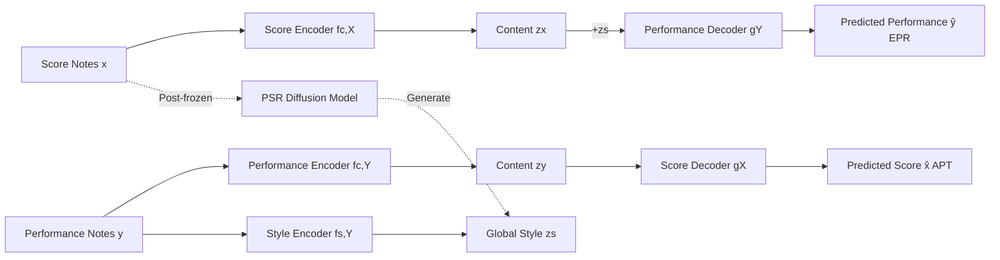

# Bridging Piano Transcription and Rendering via Disentangled Score Content and Style

**Conference**: ICLR 2026  
**OpenReview**: [https://openreview.net/forum?id=173Pq3F31r](https://openreview.net/forum?id=173Pq3F31r)  
**Code**: [https://wei-zeng98.github.io/joint-apt-epr/](https://wei-zeng98.github.io/joint-apt-epr/) (Demo site)  
**Area**: Music Information Retrieval / Symbolic Music Generation and Transcription  
**Keywords**: Expressive Performance Rendering (EPR), Automatic Piano Transcription (APT), Content-Style Disentanglement, Seq2Seq, Diffusion Style Recommendation  

## TL;DR
This paper unifies the inverse tasks of Expressive Performance Rendering (EPR, score-to-performance) and Automatic Piano Transcription (APT, performance-to-score) into a single Transformer Seq2Seq framework. By disentangling "note-level score content" and "global performance style" to achieve bidirectional modeling, and training an additional diffusion model to recommend appropriate styles directly from the score, the rendering is made both controllable and automated.

## Background & Motivation
- **Background**: Expressive Performance Rendering (EPR, score $\to$ performance) and Automatic Piano Transcription (APT, performance $\to$ score) are naturally inverse tasks in Music Information Retrieval (MIR). The former injects expressive timing, velocity, and articulation into symbolic scores to generate performance MIDI, while the latter filters these expressive details to recover the underlying score.
- **Limitations of Prior Work**: Despite being inverse transformations, previous works almost always model them as independent tasks. EPR systems typically rely on **note-level aligned data** (requiring preprocessing with alignment tools, which is unfriendly to ambiguous techniques like trills or ornaments) and often require composer/performer labels or manual adjustment of expressive parameters, making them difficult for average users.
- **Key Challenge**: EPR is essentially "one-to-many" (the same score can have multiple interpretations), requiring style as a condition; APT is "many-to-one" (filtering out expressions to keep only the score). A key difficulty is how to serve both directions with a unified representation while avoiding fine-grained alignment.
- **Goal**: Construct a framework that can jointly train EPR and APT using **only sequence-aligned data** (without note-level alignment) and automate style selection without expert labels.
- **Core Idea**: **Content-style disentanglement + task duality**. Both score and performance are encoded into a shared "note-level content space" $Z_c$ and a "global style vector" $Z_s$. The two directions are supervised via four sub-tasks: EPR, APT, and masked reconstruction. Furthermore, a **diffusion model generates style embeddings directly from score content** (PSR), mimicking a pianist's ability to "know how to play just by looking at the score."

## Method

### Overall Architecture
The framework consists of two parts: (1) A Transformer-based **joint Seq2Seq model** containing 5 components—Score, Performance, and Style encoders, and Score and Performance decoders—jointly trained on 4 sub-tasks (Masked Score Reconstruction, Masked Performance Reconstruction, EPR, and APT); (2) An **independent Performance Style Recommendation (PSR) diffusion model**, trained after the joint model is frozen, which generates style embeddings based solely on score content. Both scores and performances are represented as equal-length note-level sequences (8 discrete attributes per note for scores, 4 for performances), allowing the content encoder to learn modality-invariant representations.

### Key Designs

**1. Unified Dual Modeling: Using one set of encoders-decoders for both EPR and APT.** The authors treat the score domain $X$ and performance domain $Y$ as connected by two inverse processes, sharing a note-level content space $Z_c$, while EPR additionally depends on a style space $Z_s$. Given paired data, content encoders $f_{c,X}, f_{c,Y}$ and the style encoder $f_{s,Y}$ provide $z_x=f_{c,X}(x)$, $z_y=f_{c,Y}(y)$, and $z_s=f_{s,Y}(y)$. Decoding proceeds as: EPR via $\hat{y}=g_Y(z_x\oplus z_s)$ (style vector broadcast-added to each time step) and APT via $\hat{x}=g_X(z_y)$. Both are optimized using cross-entropy $L_{EPR}=CE(\hat{y},y)$ and $L_{APT}=CE(\hat{x},x)$. This design allows the tasks to supervise each other in a unified space, freeing EPR from dependency on note-level alignment and encouraging $z_x$ and $z_y$ to align to the same content representation.

**2. Masked Reconstruction for Large-scale Unpaired Data.** Paired score-performance data is scarce. The authors adopt the MAE approach by introducing masked reconstruction: randomly replacing some input tokens with ⟨MASK⟩ to get $\tilde{x}, \tilde{y}$, and requiring the model to reconstruct the full sequence—$L_{rec,X}=CE(g_X(f_{c,X}(\tilde{x})),x)$ and $L_{rec,Y}=CE(g_Y(f_{c,Y}(\tilde{y})\oplus f_{s,Y}(y)),y)$. This allows the use of 75,913 MuseScore public scores and unpaired performance MIDI transcribed from YouTube covers, significantly expanding the distribution of symbolic structures seen by the content encoder.

**3. Hierarchical Design for Content-Style Disentanglement + KL Regularization.** Disentanglement is ensured by both "training objectives" and "architectural hierarchy." Architecturally, content $z_c$ is a **note-level sequence vector** (encoding fine-grained attributes like pitch/rhythm), while style $z_s$ is a **single global vector** (obtained by taking the final hidden state of an initial ⟨CLS⟩ token in the Style Encoder). This hierarchical difference naturally segments fine-grained content and global style. During training, the content encoder is forced to capture only content information by the APT, EPR, and reconstruction losses. To ensure the style space is smooth and searchable, KL regularization is applied to $z_s$: $L_{KL}=D_{KL}(q(z_s\mid y)\,\|\,\mathcal{N}(0,I))$. The total objective is $L_{total}=\underbrace{L_{EPR}+L_{APT}}_{\text{Paired}}+\underbrace{L_{rec,X}+L_{rec,Y}}_{\text{Unpaired}}+\underbrace{L_{KL}}_{\text{Regularization}}$.

**4. Diffusion Style Recommendation (PSR): "Imagining" how to play directly from the score.** Once the joint model is trained and frozen, a separate module is trained to model the reasonable style distribution $p(z_s \mid e_g)$ given score $x$. It uses a separate score encoder $f_{g,X}$ (also using ⟨CLS⟩ for global content $e_g$) as a condition and employs DDPM for conditional denoising. The forward process is $z_s^t=\sqrt{\bar\alpha_t}z_s+\sqrt{1-\bar\alpha_t}\epsilon$, and the denoising network predicts the noise with loss $L_{PSR}=\mathbb{E}\big[\|\epsilon-g_s(e_g,z_s^t,t)\|_2^2\big]$, where the ground-truth $z_s$ is taken from the frozen joint model. During inference, $z_s$ is sampled from a Gaussian prior and iteratively denoised conditioned on $e_g$. This step automates style selection, supporting diverse generation without composer labels or manual tuning.

## Key Experimental Results

Datasets: ASAP (967 high-quality paired sequences, 8:1:1 split) for paired training/evaluation; MuseScore (75,913 MusicXML) and YouTube piano cover transcriptions for unpaired data; ATEPP (11,674 segments, 49 performers, 25 composers with labels) for OOD evaluation. Each Transformer component has 6 layers and 8 heads, 3072 FFN hidden dimensions, using RoPE + Pre-LN + SwiGLU; trained for 40k steps on 3×A5000.

### Main Results: APT (ASAP, Lower is Better)

| Method | MUSTER $E_{avg}$ | $E_{onset}$ | $E_{offset}$ | ScoreSim $E_{extra}$ | $E_{spell}$ |
|---|---|---|---|---|---|
| Neural (Liu 2022) | 28.04 | 68.28 | 54.11 | 17.67 | 9.71 |
| MuseScore | 23.35 | 47.90 | 49.44 | 16.74 | 9.69 |
| Shibata 2021 (Classical) | 13.95 | 22.58 | 29.84 | 11.28 | – |
| End-to-end (Beyer & Dai 2024) | 14.10 | **17.48** | 32.92 | 11.29 | 14.31 |
| **Ours** | **12.48‡** | 16.26† | **27.30‡** | **9.48‡** | **6.24‡** |

> Ours significantly outperforms the end-to-end strong baseline (‡ denotes p<0.01) on the MUSTER comprehensive error $E_{avg}$, offset deviation, extra-notes, and pitch spelling, achieving state-of-the-art or second-best on most sub-metrics.

### Comparative Experiments: EPR Objective Evaluation (Variance $\sigma^2$ closer to Human is better, KL/MAE lower is better)

| Method | $\sigma^2(O)$ | $\sigma^2(V)$ | KL(D) | KL(V) | MAE(V) |
|---|---|---|---|---|---|
| Human (Ref) | 0.12 | 241.04 | – | – | – |
| Score (Static baseline) | 0.07 | 1.36 | 13.01 | 13.00 | 29.14 |
| DExter (Zhang 2024) | 0.20 | 238.86 | 1.48 | 2.32 | 24.27 |

> Compared to the expressionless Score baseline, the diffusion-driven rendering is significantly closer to the human distribution in velocity variance $\sigma^2(V)$ and KL divergence, indicating that the generated performances contain reasonable expressions. EPR was further validated by a blind listening test with 11 musically trained participants.

### Key Findings
- The joint framework achieves **competitive** results in both EPR and APT, with APT significantly exceeding alignment-dependent baselines in several metrics.
- Disentanglement is effective: Style transfer and latent space visualization verify that content and style are separated; learned style embeddings encode both performer and composer information, with **composer features being more dominant**.
- PSR can generate "appropriate" style embeddings based solely on score content, proving the feasibility of "inferring style from the score."

## Highlights & Insights
- **Task Duality = Free Supervision**: Modeling EPR/APT as inverse tasks, analogous to ASR↔TTS bidirectional training, provides an elegant weak supervision approach where both ends constrain the content representation.
- **Hierarchical Disentanglement Trick**: Using "sequence vectors" for content and a "single ⟨CLS⟩ vector" for style achieves disentanglement through representation granularity, which is more stable than purely adversarial or mutual information losses.
- **Modeling Style Selection as a Generative Problem**: Using a diffusion model to sample style from the score solves the one-to-many nature of EPR while replacing expert labels or manual tuning with a one-click automated rendering solution.
- **Independence from Note-level Alignment**: Requiring only sequence alignment for EPR makes the model more robust to ambiguous techniques and allows the utilization of massive amounts of unpaired score/cover data.

## Limitations & Future Work
- Restricted to **symbolic-to-symbolic** (between MIDI and score); it does not handle raw audio end-to-end, and unpaired performance data still relies on an external audio-to-MIDI transcription model, which can propagate errors.
- Style is a **single global vector**, making it difficult to capture fine-grained expressive evolutions—such as rubato variations across different phrases—within a single piece.
- Validated primarily on piano and classical repertoire (ASAP/ATEPP); generalization across different instruments and genres has not been fully tested.
- PSR Evaluation lacks a "gold standard" for "style appropriateness," and the scale of the subjective listening test (5 pieces, 11 participants) was limited.

## Related Work & Insights
- **EPR**: Evolution from rule-based systems to RNN/LSTM, Transformers (Rhyu 2022, Borovik & Viro 2023, Tang 2023), and note-level diffusion control like DExter (Zhang 2024). This work uses Seq2Seq + global style to bypass fine-grained alignment and manual features.
- **APT**: Follows the alignment-free Seq2Seq transcription paradigm of Beyer & Dai (2024) as the backbone for content modeling.
- **Disentangled Representation Learning (DRL)**: While mature in CV/NLP, Zhang & Dixon (2023) previously explored unsupervised content/style disentanglement from performance. This work focuses on the less explored direction of "generating performance from score."
- **Cross-modal Music Translation**: Inspired by Jung et al. (2025), which suggests that cross-modal translation can be unified using only sequence alignment, echoing the trend of alignment-free supervision.

## Rating
- **Novelty**: ⭐⭐⭐⭐ — First to unify EPR and APT in a single disentangled framework with task duality and diffusion-based style recommendation, directly addressing field-specific pain points.
- **Experimental Thoroughness**: ⭐⭐⭐⭐ — Covers dual tasks (APT/EPR), objective/subjective metrics, disentanglement visualization, and OOD (ATEPP) performance with standard statistical significance; however, the EPR subjective sample size is small and lacks end-to-end audio experiments.
- **Writing Quality**: ⭐⭐⭐⭐ — Clear motivation, solid logic on duality/disentanglement, and good coordination between formulas and framework diagrams. Some modules (PSR training connection) require the appendix for full clarity.
- **Value**: ⭐⭐⭐⭐ — Provides a practical paradigm for bidirectional symbolic music modeling and controllable automated rendering, with direct implications for music education, re-interpretation, and performance analysis.

<!-- RELATED:START -->

## Related Papers

- [\[ACL 2026\] FC-TTS: Style and Timbre Control in Zero-Shot Text-to-Speech with Disentangled Speech Representations](../../ACL2026/audio_speech/fc-tts_style_and_timbre_control_in_zero-shot_text-to-speech_with_disentangled_sp.md)
- [\[ICLR 2026\] When Style Breaks Safety: Defending LLMs Against Superficial Style Alignment](when_style_breaks_safety_defending_llms_against_superficial_style_alignment.md)
- [\[ICLR 2026\] TVTSyn: Content-Synchronized Time-Varying Timbre for Streaming Voice Conversion and Anonymization](tvtsyn_content-synchronous_time-varying_timbre_for_streaming_voice_conversion_an.md)
- [\[ACL 2026\] MSU-Bench: Musical Score Understanding Benchmark](../../ACL2026/audio_speech/musical_score_understanding_benchmark_evaluating_large_language_models39_compreh.md)
- [\[ICLR 2026\] FlexiVoice: Enabling Flexible Style Control in Zero-Shot TTS with Natural Language Instructions](flexivoice_enabling_flexible_style_control_in_zero-shot_tts_with_natural_languag.md)

<!-- RELATED:END -->
