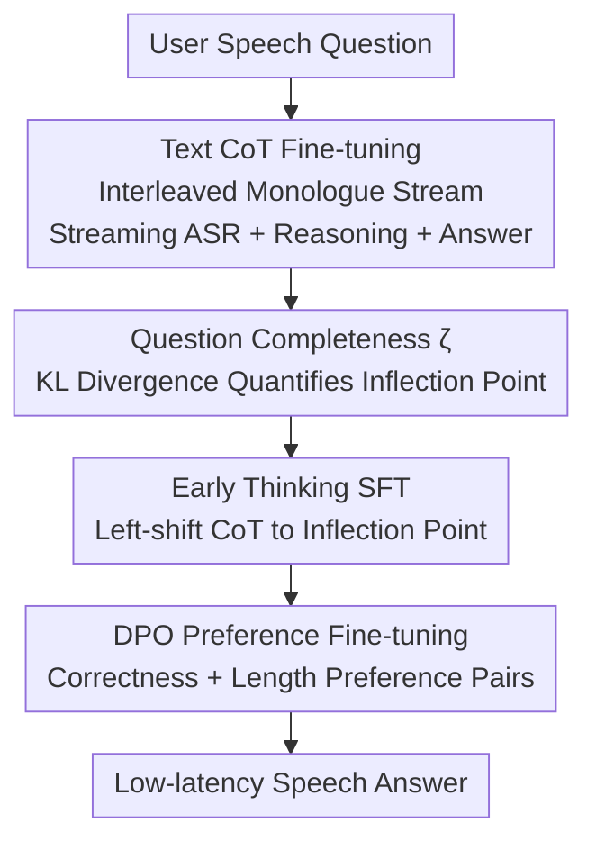

# Can Speech LLMs Think while Listening?

**Conference**: ICLR 2026  
**OpenReview**: [https://openreview.net/forum?id=dFVenZdVbX](https://openreview.net/forum?id=dFVenZdVbX)  
**Code**: None  
**Area**: Speech LLM / Reasoning / Multi-stream Architecture  
**Keywords**: Speech LLM, Chain-of-Thought, Streaming ASR, Thinking while Listening, Preference Fine-tuning

## TL;DR
This paper inserts text Chain-of-Thought (CoT) into the text monologue stream of a multi-stream speech LLM (Moshi), enabling reasoning in the text space and improving accuracy by an average of 2.4x. It further proposes a "question completeness" metric based on KL divergence, allowing the model to "think while listening" and initiate reasoning before the user finishes speaking. Combined with DPO preference fine-tuning, this reduces additional reasoning latency by approximately 70% without sacrificing accuracy.

## Background & Motivation
**Background**: Traditional speech assistants cascade ASR, text LLM, and TTS modules, leading to high latency and error accumulation. Recent speech LLMs process speech input/output directly in an end-to-end manner, modeling both semantic and paralinguistic features. They serve as an elegant alternative and perform well in chit-chat scenarios.

**Limitations of Prior Work**: However, speech LLMs significantly lag behind same-sized text LLMs in complex reasoning tasks (mathematics, social/physical common sense). While text LLMs have leveraged CoT to substantially improve reasoning, CoT in the speech domain has been largely confined to tasks like translation, dialogue, and detection, with no systematic study on "how to implement CoT for multi-stream speech LLMs."

**Key Challenge**: In speech interaction, reasoning and response latency are naturally at odds. Longer CoT yields higher accuracy, but serial execution ("finish listening → reason → start speaking") introduces silent reasoning gaps that significantly increase user-perceived latency and break natural dialogue flow. Existing "thinking while speaking" approaches (e.g., STITCH, Mini-Omni-Reasoner) allow reasoning while speaking, but chunk sizes are hardware-dependent and difficult to tune. Furthermore, vocalizing the reasoning process may delay reaching the final conclusion.

**Goal**: This work addresses two research questions: (i) Should speech LLMs use text or speech for reasoning? (ii) How can CoT be introduced while maintaining the real-time nature of speech interaction?

**Key Insight**: Drawing inspiration from the neuroscience phenomenon of "human thinking while listening," humans often begin organizing answers before a question is fully posed. If a model can initiate reasoning while the user's speech stream is still ongoing, the reasoning latency can be "hidden" within the user's speaking time.

**Core Idea**: This work interleaves "streaming ASR transcription + text reasoning + answer text" within the text monologue stream of a multi-stream architecture. A "question completeness" metric $\zeta$, defined by entropy/KL divergence, determines when enough information is present to trigger early reasoning. DPO preference fine-tuning is then used to push the accuracy-latency Pareto frontier.

## Method

### Overall Architecture
The objective is to enable multi-stream speech LLMs to reason without slowing down responses. The process consists of four steps. First, the base Moshi model is fine-tuned to generate text CoT in the text monologue stream, incorporating streaming ASR of user speech so the reasoning "sees" what the user is saying. This addresses reasoning capability. Second, a "question completeness" metric $\zeta$ is defined to quantify when information is sufficient, identifying the "inflection point" for each sample. Third, "Early Thinking SFT" is performed using training samples where CoT is left-shifted to the inflection point, teaching the model to predict the point and trigger reasoning early. Finally, DPO preference fine-tuning is applied using preference pairs based on correctness and length to enable dynamic corrections and compress redundant reasoning chains.

Moshi is a full-duplex multi-stream model that processes three aligned token streams at each timestep: user audio $A^U$, system audio $A^S$, and system text (text monologue) $T^S$. Audio is encoded via Mimi codec into 12.5 Hz, 8-codebook discrete tokens, while the text stream contains numerous [PAD]/[EPAD] tokens for alignment. All modifications in this work occur in the text monologue stream.

### Key Designs

**1. Text CoT + Streaming ASR in Text Monologue: Reasoning in Text Space**

To address the weakness of speech LLMs in complex reasoning, the authors choose text-based CoT over speech, as text tokens have much higher information density (experiments show speech CoT triples token length). Specifically, in Moshi's text monologue stream, the model generates pure reasoning tokens $R^T$ without corresponding audio, enclosed by `<start_cot>`/`<end_cot>` tags, alongside the original answer text $A^T$.

Crucially, **streaming ASR** transcription $Q^T$ of user speech is also written into the same text stream. The authors found that transcribing user speech while reasoning significantly improves accuracy (ARC-E drops from 77.7 to 55.8 without streaming ASR). Transcription follows a word-aligned, right-shifted $k$ token look-ahead ($k=6$, approx. 480 ms) to balance latency and Word Error Rate (WER). Consequently, the monologue stream carries user transcription $Q^T$, reasoning $R^T$, and answer $A^T$, facilitating their interleaving during "thinking while listening."

**2. Question Completeness ζ: Using KL Divergence to Decide "When to Think"**

To trigger early reasoning, one must determine the optimal moment. A naive fixed left-shift lacks semantic awareness—e.g., "What is the capital of France?" requires "France" to be informative. The authors define "question completeness" $\zeta$ as a semantic progress bar.

Given question $Q_{1:N}$, reasoning $R$, and answer $A$, the goal is to find an inflection point $p$ such that the prefix yields nearly the same reasoning/answer: $\Pr[R,A\mid Q_{1:p}] \approx \Pr[R,A\mid Q_{1:N}]$. Let $X_p = \Pr[R,A\mid Q_{0:p}]$ (estimated via an external LM), then:

$$\zeta(p) = 1 - \frac{D_{KL}(X_N \| X_p)}{D_{KL}(X_N \| X_0)},$$

where $X_N$ and $X_0$ correspond to the full question and no question, respectively. Thus $\zeta(0)=0$ and $\zeta(N)=1$, with values closer to 1 indicating higher semantic completeness. The inflection point is the first position exceeding threshold $\theta$: $\hat p = \min\{p : \zeta(p) \ge \theta\}$. This provides finer control over the accuracy-latency trade-off compared to heuristics.

**3. Early Thinking SFT: Teaching the Model to Predict Inflection Points**

Reasoning tokens in training samples are left-shifted to the inflection point. Since reasoning tokens now compete with ongoing streaming ASR tokens, `<switch_cot>`/`<switch_asr>` tokens are introduced. The model switches between "transcribing user" and "generating reasoning": it fills blank [PAD]/[EPAD] slots with CoT tokens between ASR tokens. This preserves temporal alignment while hiding reasoning in dialogue gaps.

During training, the first `<switch_cot>` occurs at the inflection point. By maximizing the likelihood of this token, the model learns to evaluate partial questions and judge when information is sufficient. During inference, the model spontaneously triggers reasoning based on its internal prediction.

**4. DPO Preference Fine-tuning: Correcting Reasoning and Reducing Length**

The authors found that SFT models struggle with the early reasoning distribution, failing to adapt to new user input or generating over-long reasoning for simple questions. DPO is applied using rejection sampling to create preference pairs. For a training subset, $K$ candidates are decoded by forcing `<start_cot>` at $\zeta(p)=\theta$. Pairs are constructed based on response correctness (to improve adaptability) and length (to reduce latency).

The DPO objective is:

$$L_{DPO}(\pi_\Theta;\pi_{ref}) = -\mathbb{E}_{(x,y_w,y_l)}\Big[\log\sigma\big(\beta\log\tfrac{\pi_\Theta(y_w|x)}{\pi_{ref}(y_w|x)} - \beta\log\tfrac{\pi_\Theta(y_l|x)}{\pi_{ref}(y_l|x)}\big)\Big],$$

with an added NLL term for stability: $L_{pref} = L_{DPO} - \lambda\,\mathbb{E}_{(x,y_w)}[\log\pi_\Theta(y_w|x)]$. Probabilities are calculated only on the text monologue stream $T^S$, excluding user streaming ASR tokens $Q^T$. Length-normalized DPO is also employed.

### Loss & Training
The SFT phase uses standard next-token NLL loss; the preference phase uses $L_{pref}$. Data is derived from CoT-Collection (1.8M text reasoning samples), filtered for length, "oralized" via LLM, and converted to 24 kHz mono audio via internal TTS to match speech dialogue scenarios.

## Key Experimental Results

### Main Results
The authors established SRQA (Spoken Reasoning QA), adapted from ARC-E/C, PIQA, SIQA, and GSM8K via LLM oralization and TTS. Evaluation used LLaMA-3.1 405B as a judge. Latency is measured in tokens to remain hardware-agnostic.

| Model | ARC-E | ARC-C | SIQA | PIQA | GSM8K | LLaMA-QS |
|------|-------|-------|------|------|-------|----------|
| Moshi (baseline) | 30.2 | 21.5 | 22.8 | 23.8 | 8.7 | 42.8 |
| **Moshi + CoT (Ours)** | **77.7** | **59.8** | **56.1** | **56.9** | **16.1** | 57.8 |
| Qwen2-Audio-7B-Instruct | 59.1 | 42.4 | 21.9 | 24.5 | 18.1 | 64.7 |
| Kimi-Audio-7B-Instruct | 83.0 | 71.5 | 32.9 | 34.4 | 15.7 | 61.7 |

Ours improves the Moshi baseline by ~29.1% absolute; most tasks see 2-3x gains. Despite Kimi-Audio having 18T tokens of pre-training (vs. 2.1T for Ours), Ours remains top-2 in all reasoning tasks.

### Ablation Study
| Configuration | ARC-E | GSM8K | Notes |
|------|-------|-------|------|
| Moshi + CoT (Full) | 77.7 | 16.1 | Includes streaming ASR (6-token lag) |
| w/o Streaming User ASR | 55.8 | 12.2 | Removing ASR causes a sharp drop in reasoning |
| Text CoT | – | 17.5 | Text-based reasoning |
| Speech CoT | – | 17.2 | Similar accuracy but 3x token length |
| No CoT (Direct QA SFT) | – | 3.5 | Lower than baseline |

DPO Length Preference (Base $\theta=0.75$) results:

| Dataset | Accuracy SFT→DPO | Latency SFT→DPO |
|--------|----------------|--------------|
| ARC-E | 62.8 → 65.4 | 49.2 → 12.0 |
| ARC-C | 43.2 → 46.0 | 49.9 → 13.2 |
| SIQA | 45.1 → 45.3 | 50.0 → 12.9 |
| GSM8K | 13.8 → 14.7 | 76.0 → 48.6 |

### Key Findings
- **Streaming ASR is Crucial**: Removing it drops performance significantly on reasoning but not on factual QA, suggesting ASR aids active reasoning rather than just memory. A 6-token look-ahead lag balances WER and accuracy.
- **Text CoT ≈ Speech CoT but Efficient**: Both achieve similar accuracy on GSM8K, but text CoT has a clear density advantage, saving 2/3 of tokens.
- **Direct QA SFT Harms Performance**: No CoT dropped GSM8K to 3.5 (below baseline 8.7), indicating gains come from the "act of thinking" and that forcing the model not to think harms its implicit reasoning.
- **ζ provides better control than heuristics**: While fixed word-shifts fail to reduce latency stably, $\zeta$ allows monotonic latency reduction as $\theta$ decreases. DPO aligns the CoT trigger point with the ground truth.

## Highlights & Insights
- **Translating Neuroscience to Trainable Objectives**: The core innovation is recognizing that multi-stream autoregressive models can synchronize tokens with streaming input, allowing "early thinking" to be modeled as the sampling of a `<switch_cot>` token supervised by KL divergence.
- **Question Completeness ζ as a "Semantic Progress Bar"**: Quantifying "how much is left to hear" via $1 - D_{KL}(X_N\|X_p)/D_{KL}(X_N\|X_0)$ is a transferable concept for any streaming decision scenario (e.g., when to commit in streaming translation).
- **Latency in Tokens**: Reporting latency in tokens instead of seconds decouples the metric from codec/hardware. The authors note that one forward pass (26 ms) is much faster than the 80 ms/token rate, suggesting potential for multi-token decoding in the future.

## Limitations & Future Work
- **Dependency on Synthetic Data**: Both training and evaluation data are LLM-oralized and TTS-synthesized. There is a distribution gap regarding spontaneous human speech (accents, hesitations, noise).
- **External LM for Inflection Point**: $\zeta$ estimation requires an external model and is not strictly monotonic due to local syntactic fluctuations.
- **Weak Hard Reasoning**: Accuracy on GSM8K remains low compared to text LLMs, indicating that text CoT injection has not yet fully bridged the reasoning gap for speech models.
- **Single-turn Only**: Interaction between "thinking while listening" and multi-turn context or user interruptions remains unexplored.

## Related Work & Insights
- **vs. STITCH / Mini-Omni-Reasoner**: These "think while speaking" models interleave speech and reasoning chunks, but can delay conclusions by vocalizing reasoning. Ours "thinks while listening," hiding reasoning in the hearing phase to compress perceived latency at the source.
- **vs. Streaming ASR for CoT**: While prior works used offline ASR, this work uses word-aligned streaming ASR to enable real-time interleaving of transcription and reasoning.

## Rating
- Novelty: ⭐⭐⭐⭐⭐ First to implement text CoT on multi-stream speech LLMs with "thinking while listening" and $\zeta$ metrics.
- Experimental Thoroughness: ⭐⭐⭐⭐ Solid SRQA benchmark and multi-dimensional ablation, though lacks real-world spontaneous speech.
- Writing Quality: ⭐⭐⭐⭐ Clear motivation, intuitive diagrams, and precise definitions of mechanisms.
- Value: ⭐⭐⭐⭐⭐ Directly addresses the "reasoning vs. latency" pain point for speech assistants; methodology is highly transferable.

<!-- RELATED:START -->

## Related Papers

- [\[NeurIPS 2025\] Can LLMs Outshine Conventional Recommenders? A Comparative Evaluation](../../NeurIPS2025/audio_speech/can_llms_outshine_conventional_recommenders_a_comparative_evaluation.md)
- [\[ICLR 2026\] Closing the Gap Between Text and Speech Understanding in LLMs](closing_the_gap_between_text_and_speech_understanding_in_llms.md)
- [\[ACL 2026\] StressTest: Can YOUR Speech LM Handle the Stress?](../../ACL2026/audio_speech/stresstest_can_your_speech_lm_handle_the_stress.md)
- [\[ICLR 2026\] The Devil behind the Mask: An Emergent Safety Vulnerability of Diffusion LLMs](the_devil_behind_the_mask_an_emergent_safety_vulnerability_of_diffusion_llms.md)
- [\[ICLR 2026\] When Style Breaks Safety: Defending LLMs Against Superficial Style Alignment](when_style_breaks_safety_defending_llms_against_superficial_style_alignment.md)

<!-- RELATED:END -->
