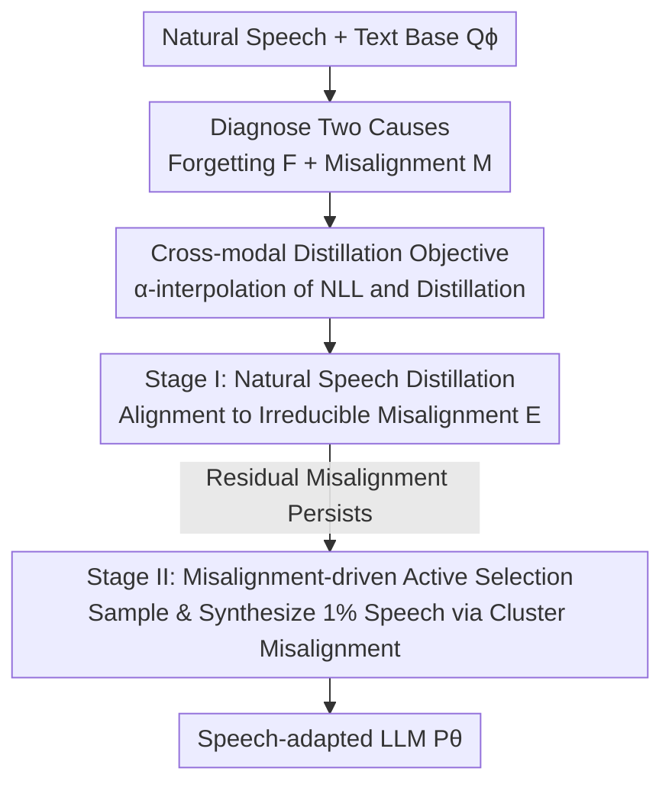

# Closing the Gap Between Text and Speech Understanding in LLMs

**Conference**: ICLR2026  
**OpenReview**: [https://openreview.net/forum?id=dDHnO3Vhyj](https://openreview.net/forum?id=dDHnO3Vhyj)  
**Code**: To be confirmed  
**Area**: Speech / Multimodal LLM  
**Keywords**: Speech-adapted LLM, cross-modal distillation, active data selection, catastrophic forgetting, speech language understanding  

## TL;DR
This paper deconstructs the phenomenon where "speech-adapted LLMs underperform their original text versions in language understanding" into two quantifiable causes: **forgetting** and **cross-modal misalignment**. Accordingly, it proposes SALAD—aligning the model on natural speech using cross-modal distillation, followed by active selection driven by misalignment signals to supplement a tiny fraction of synthetic speech. Using an order of magnitude less speech data than competitors, 3B/7B models achieve performance approaching the strongest open-source models across six broad-domain knowledge and reasoning benchmarks.

## Background & Motivation
**Background**: Extending text LLMs to speech follows two paths. The cascaded approach (ASR to text, then input to LLM) preserves text capabilities but loses paralinguistic cues like speaker and tone, making natural spoken interaction impossible. The end-to-end approach (directly processing speech representations) preserves these cues and has become the mainstream direction in recent years.

**Limitations of Prior Work**: End-to-end speech-adapted LLMs repeatedly falter in the core capability of "language understanding"—not only underperforming text LLMs of the same size but even failing to match cascaded systems. The authors formally name this discrepancy as the **text–speech understanding gap**: the performance drop of a speech-adapted model processing speech input relative to the original text LLM processing equivalent text input for the same language understanding task.

**Key Challenge**: Existing methods to narrow this gap are prohibitively expensive. One class relies on TTS synthesis of entire text corpora to align training distributions, often equivalent to hundreds of billions of text tokens, which is costly and heavily dependent on synthetic data quality. Another class uses millions of hours of private speech data, making results irreproducible. The root problem is that public speech or parallel speech-text data is extremely scarce compared to text, and **existing methods do not clarify what drives the gap, relying instead on brute-force data scaling**.

**Goal**: To first decompose the gap into measurable causes and then design a sample-efficient solution that reduces the gap even with public, narrow-domain speech.

**Key Insight**: The authors argue that to bridge the gap, a speech-adapted model must simultaneously achieve two things: (i) preserve the knowledge of the text base (no forgetting), and (ii) provide consistent outputs for semantically equivalent speech and text inputs (no misalignment). These are defined as two KL divergence metrics to empirically measure their correlation with the downstream gap.

**Core Idea**: Use "cross-modal distillation" (with the text base as the teacher) to solve both forgetting and alignment, then use "misalignment-driven active selection" to synthesize a minimal amount of critical speech to fill the domain gaps in narrow-domain corpora, reducing data requirements by an order of magnitude.

## Method

### Overall Architecture
SALAD (Sample-efficient Alignment with Learning through Active selection and cross-modal Distillation) aims to train a speech-adapted language model $P_\theta$ to predict the distribution of the next text token given speech input as closely as possible to the original text base $Q_\phi$. The architecture follows a standard three-part setup: a lightweight Mimi speech tokenizer as the encoder (frozen during training), a 122M-parameter Transformer decoder stack as the adapter, and the language model itself (initialized from Qwen2.5-3B/7B). The authors intentionally chose a simple encoder that is causal, streaming-friendly, and "dissimilar to text" representations to serve as a "worst-case" for input alignment, verifying that the method does not rely on complex representation alignment modules.

The approach is organized into two lines. The **Analysis Line** decomposes the gap into two measurable causes—forgetting $F$ and cross-modal misalignment $M$—and empirically proves they highly predict downstream performance. This yields two insights: cross-modal distillation suppresses misalignment and forgetting better than maximum likelihood, and matching the speech training data domain to the text pre-training domain yields further gains. The **Method Line** organizes training into two stages: Stage I aligns the model to $E$ (irreducible misalignment) using a distillation objective on natural speech, and Stage II uses the model's own misalignment signals to select the most critical domains, synthesizing only 1% of speech to specifically eliminate residual misalignment.

### Key Designs

**1. Decomposing the Gap into Measurable KL Divergences: Forgetting and Misalignment**

Previously, only "poor performance of speech-adapted models" was observed without clarity on where the problem lay. This paper provides two clear definitions. **Cross-modal misalignment** $M$ measures the difference in the next-token distribution when the model is given "text" versus "equivalent multimodal context":

$$M = \sum_{(w,c)\sim Q} D_{KL}\big(P_\theta(w_{i+1}\mid w_{\le i}) \,\|\, P_\theta(w_{i+1}\mid c_{\le i})\big)$$

**Forgetting** $F$ measures how much the speech-adapted model $P_\theta$ deviates from the original text base $Q_\phi$ on pure text input:

$$F = \sum_{w\sim Q} D_{KL}\big(Q_\phi(w_{i+1}\mid w_{\le i}) \,\|\, P_\theta(w_{i+1}\mid w_{\le i})\big)$$

Both are measured on a wide-domain corpus (FineWeb-Edu). Empirical findings show they highly predict downstream performance: speech performance decreases as $M$ increases (leave-one-out cross-validation $R^2=0.75$), and text performance decreases as $F$ increases ($R^2=0.74$). Partial $R^2$ further shows that misalignment independently explains speech variance, while forgetting independently explains text variance. This transforms a vague "gap" into two actionable, optimizable targets.

**2. $\alpha$-interpolated Training Objective: Distillation for Alignment and Anti-forgetting**

Diagnostics reveal that training with standard Negative Log-Likelihood (NLL) on narrow-domain speech causes misalignment to grow and performance to degrade as data scale increases. Conversely, a distillation objective—using the text base $Q_\phi$ as a teacher to match its full output distribution—improves both alignment and forgetting even on narrow-domain data. The authors interpolate the two with a coefficient $\alpha\in[0,1]$:

$$\mathcal{L}(D,\theta) = \alpha\,\mathcal{L}_{\text{DIST}}(D,\theta) + (1-\alpha)\,\mathcal{L}_{\text{NLL}}(D,\theta)$$

The distillation term $\mathcal{L}_{\text{DIST}}$ only computes the KL between $Q_\phi$ and $P_\theta$ at text positions in interleaved sequences (selected via $\mathbb{1}_{\{\text{text at }i+1\}}$). Scaling law fits for misalignment ($M = E + B\,D^{-\beta}$) show that for $\alpha>0$, misalignment saturates early to an irreducible term $E$, and $E$ decreases as $\alpha$ increases. This directly challenges the traditional path of "scaling up via NLL."

**3. Stage I: Distillation on Natural Speech to Saturation**

The first stage minimizes $\mathcal{L}_{\text{DIST}}$ exclusively on natural speech corpora (LibriHeavy + Emilia, ~140k hours), leveraging the "early saturation" scaling behavior of distillation to push misalignment near $E$ within an affordable budget (24B tokens). This stage uses no synthetic data. However, relying solely on narrow-domain natural speech leaves a "residual misalignment": natural speech corpora cover only a few domains (Figure 2 shows LibriHeavy/Emilia are concentrated in few areas compared to broad text), leaving domains not covered by speech poorly aligned.

**4. Stage II: Active Selection via Misalignment Signals**

The root of residual misalignment is the domain gap, but synthesizing the entire text corpus is too expensive. The authors adapt cluster-based importance sampling, letting the **model itself** indicate where supplementation is needed. Broad-domain text $D_{web}$ is partitioned into $K=128$ clusters using sentence embeddings and balanced k-means. Lacking a ground-truth target domain distribution, they use "intra-cluster divergence between $P_\theta$ and $Q_\phi$" as a proxy for the domain's deficiency, defining the target distribution:

$$P_{\text{target}}(c) \propto P_{web}(c)\, f_\gamma(M(c)),\qquad f_\gamma(m)=m^\gamma$$

where $M(c)$ is the intra-cluster misalignment measured on a small probe set, and $\gamma=5$ focuses sampling on high-misalignment clusters. Clusters are sampled, text is synthesized into speech, and added to the distillation pool until the budget—**just 1%** of $D_{speech}$—is reached. This targeting focuses synthetic data on scientific and technical domains where the model identifies its own misalignment.

### Loss & Training
The core objective is the $\alpha$-interpolated loss in Eq. (4). Both stages of SALAD utilize pure distillation ($\alpha=1$). Stage I is trained for 24B tokens and Stage II for an additional 1.9B tokens. The synthetic budget in Stage II is 1% of $D_{speech}$. Encoder parameters are frozen; only the adapter and LLM are optimized.

## Key Experimental Results

### Main Results
Evaluation is conducted on speech versions of six broad knowledge/reasoning benchmarks: StoryCloze, MMSU, OpenBookQA, HellaSwag, ARC-Challenge, PIQA, using few-shot prompting and accuracy as metrics. "Gap" = Text Acc. of base model − Speech Acc. of adapted model.

| Model | Avg. Speech Acc. | Avg. Gap | Speech Training Data |
|-------|------------------|----------|----------------------|
| Upper Bound (ASR+Qwen2.5-7B) | 79.4 | 2.2 | — (Topline) |
| Qwen2-Audio-7B | 53.7 | 17.8 | Large-scale |
| DiVA-Llama3.1-8B | 52.6 | 26.1 | Large-scale |
| GLM-4-Voice-9B | 63.4 | 20.1 | Large-scale synthetic |
| Qwen2.5-Omni-7B (Closed Recipe) | 76.7 | 5.0 | Millions of hours (Private) |
| **SALAD-3B** (Stage II) | 72.0 | 4.6 | **10x less than competitors** |
| **SALAD-7B** (Stage II) | 75.4 | 6.2 | **10x less than competitors** |

SALAD-3B outperforms all larger end-to-end baselines except Qwen2.5-Omni. Among models with open training recipes, SALAD reduces the gap by 11.7% relative to the runner-up and approaches the strongest closed-recipe system (within 1.2%) using significantly less data.

### Ablation Study

| Configuration | MMSU | OBQA | ARC-C | Notes |
|---------------|------|------|-------|-------|
| Stage II Uniform Sampling | 49.5 | 71.9 | 78.9 | Randomly selected synth. data |
| Stage II Active Selection | 52.5 | 76.7 | 79.9 | Misalignment-driven active |

Active selection provides the largest gains on MMSU, OpenBookQA, and ARC-C—tasks involving scientific questions and technical terms that likely fall outside the natural speech distribution of Stage I. This validates the logic of filling domain gaps based on misalignment.

Regarding text capability (Table 5): SALAD-3B achieves 76.9 Avg. Text Acc. (Gap -0.5), and SALAD-7B achieves 82.2 (Gap -0.9), significantly better than baselines (e.g., GLM-4-Voice-9B Gap is 13.6). This demonstrates that the distillation objective effectively constrains the model to remain faithful to the teacher.

### Key Findings
- Misalignment independently explains speech performance variance (partial $R^2 \approx 0.56$), and forgetting independently explains text variance (partial $R^2 \approx 0.32$). Both are effective, complementary handles.
- Training with NLL on narrow-domain speech causes misalignment to increase with data scale; distillation ($\alpha>0$) results in early saturation of misalignment, with $E$ decreasing as $\alpha$ increases.
- Simple domain matching (NLL on FineWeb-Edu) does not solve misalignment; it must be coupled with distillation for sustained gains.
- Active selection yields clear gains specifically for scientific/technical tasks that exceed the natural speech distribution.

## Highlights & Insights
- **Quantifying Vague Phenomena**: Decomposing the "gap" into two measurable KL divergences and proving their predictive power with regression is a methodology transferable to any modal adaptation scenario.
- **Model as a Domain Probe**: Stage II uses the "intra-cluster divergence between $P_\theta$ and $Q_\phi$" as a proxy for "missing domains" for importance sampling, reducing the synthesis budget to 1%. This "active learning driven by self-disagreement" can be applied where full-scale synthesis is too expensive.
- **Robustness through a "Worst-case" Encoder**: By choosing the causal, streaming Mimi encoder, the authors prove SALAD works without complex representation alignment, making it directly applicable to low-latency streaming speech interaction.

## Limitations & Future Work
- **Speech-to-Text Understanding Only**: The paper focuses on understanding with text as the intermediate representation; speech generation is left for future work. SALAD is not yet a full speech dialogue system.
- **Residual Reliance on Synthesis**: Although reduced to 1%, Stage II still requires TTS, and synthetic speech lacks natural paralinguistic richness.
- **English-only / Specific Base**: Results are validated on English corpora and the Qwen2.5 base; generalizability across languages and different base models remains to be verified.
- **Dependency on Broad-domain Probes**: Measurement of $M$, $F$, and active selection clusters depends on a representative broad-domain corpus; results may be biased if the probe set is subpar.

## Related Work & Insights
- **vs. Large-scale Synthesis (GLM-4-Voice / Zeng et al.)**: They synthesize the entire text pre-training corpus to match distributions (hundreds of billions of tokens). SALAD uses active selection to synthesize 1%, treating domain matching as adaptive gap-filling and noting that it only works when paired with distillation.
- **vs. Closed-recipe Large Data Models (Qwen2.5-Omni / Kimi)**: These achieve strong performance using millions of hours of private speech but are irreproducible. SALAD uses open narrow-domain corpora and achieves comparable performance (within 1.2%) with 10x less data.
- **vs. Representation Alignment (Tang et al. / Held et al.)**: They focus on the encoder/adapter to make speech representations "text-like," which is often unsuitable for low-latency streaming. SALAD uses a simple streaming encoder and shifts the alignment burden to the training objective and data selection.
- **vs. Pure Cross-modal Distillation (Wang et al. / Held et al., corresponding to $\alpha=1$)**: They proved distillation is superior to supervised learning in narrow domains but still leave residual misalignment. SALAD adds Stage II active selection to eliminate this residue and provides a scaling law explanation for why distillation is superior.

## Rating
- Novelty: ⭐⭐⭐⭐⭐ Quantifying the gap into two causes + using misalignment for active selection is highly cohesive.
- Experimental Thoroughness: ⭐⭐⭐⭐ Strong scaling laws and correlations, but limited to English and a single model family.
- Writing Quality: ⭐⭐⭐⭐⭐ Very clear narrative; every design choice is traced back to an empirical insight.
- Value: ⭐⭐⭐⭐⭐ Significantly reduces data requirements for speech-adapted LLMs with an open, reproducible recipe.

<!-- RELATED:START -->

## Related Papers

- [\[ACL 2026\] Closing the Modality Reasoning Gap for Speech Large Language Models](../../ACL2026/audio_speech/closing_the_modality_reasoning_gap_for_speech_large_language_models.md)
- [\[ACL 2026\] Computational Narrative Understanding for Expressive Text-to-Speech](../../ACL2026/audio_speech/computational_narrative_understanding_for_expressive_text-to-speech.md)
- [\[ICLR 2026\] DrVoice: Parallel Speech-Text Voice Conversation Model via Dual-Resolution Speech Representations](drvoice_parallel_speech-text_voice_conversation_model_via_dual-resolution_speech.md)
- [\[ICLR 2026\] Latent Speech-Text Transformer](latent_speech_text_transformer.md)
- [\[ICLR 2026\] Towards True Speech-to-Speech Models Without Text Guidance](towards_true_speech-to-speech_models_without_text_guidance.md)

<!-- RELATED:END -->
