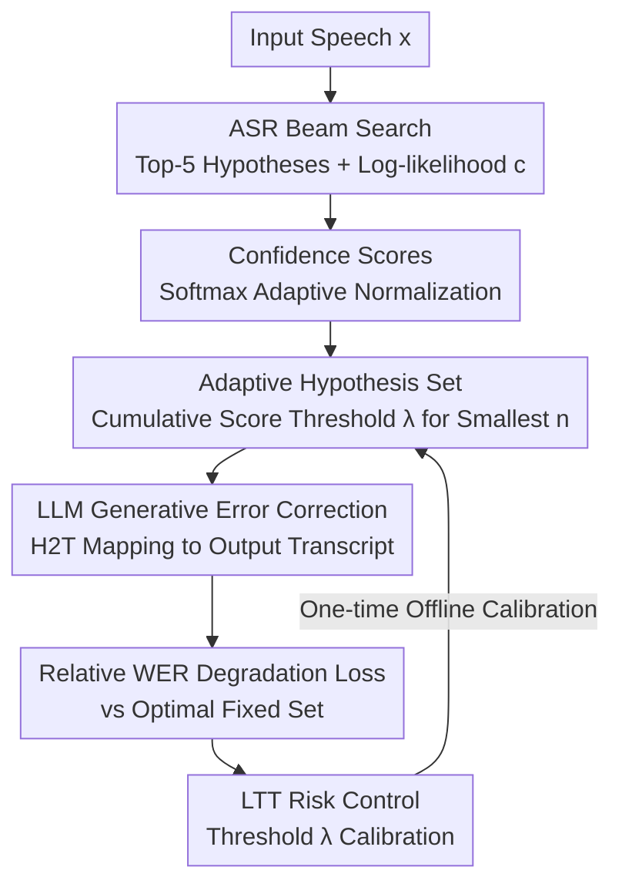

# Confident and Adaptive Generative Speech Recognition via Risk Control

**Conference**: ICLR2026  
**OpenReview**: [https://openreview.net/forum?id=ck5T7QeiDh](https://openreview.net/forum?id=ck5T7QeiDh)  
**Code**: https://github.com/amitdamritau/adaptive-ger  
**Area**: Speech Recognition / Uncertainty Quantization  
**Keywords**: Generative Error Correction, Risk Control, Learn then Test, Adaptive Hypothesis Set, ASR

## TL;DR
Addressing the issue where fixed $N$ in "LLM-based Generative Error Correction (GER) for ASR N-best hypotheses" either wastes computation or introduces noise, this paper adaptively determines the number of hypotheses per utterance based on ASR confidence scores. By employing the Learn then Test (LTT) risk control framework, it establishes a high-probability upper bound for "relative optimal performance degradation," reducing the average number of hypotheses by up to 52% across three datasets while maintaining or even improving correction performance.

## Background & Motivation
**Background**: Modern ASR systems (e.g., Whisper, Wav2Vec) are robust on clean speech but struggle with accents, noise, homophones, and domain shifts. A leading remedy is Generative Error Correction (GER): the ASR generates top-N candidates (N-best hypotheses) via beam search, which are then fed into a fine-tuned LLM to synthesize a superior transcript—formalized as the hypotheses-to-transcription (H2T) task in HyPoradise.

**Limitations of Prior Work**: Existing GER methods utilize a **fixed** hypothesis set size $N$ (typically $N=5$), treating clear and noisy speech identically. Curves plotted on TedLium-3 reveal three types of samples: those that improve monotonically with more hypotheses, those that plateau, and those where the **top-1 is correct but additional hypotheses mislead the LLM** (performance degradation). Fixed $N$ results in wasted computation for the first two categories and active noise pollution for the third.

**Key Challenge**: A trade-off exists between "information density" and "noise" in GER—more hypotheses provide more context but also more errors, and the optimal number is **sample-dependent**. Furthermore, existing methods lack **statistical guarantees** for corrected performance, failing to bound the gap relative to an oracle (using the optimal count for every sample).

**Goal**: Transform the selection of hypothesis counts into an adaptive decision-making problem with **high-probability performance guarantees**, optimizing computational efficiency without sacrificing accuracy.

**Key Insight**: The author notes that log-likelihood scores from the ASR contain inherent information regarding transcription confidence. Concentrated scores suggest high uncertainty requiring more context, while large gaps suggest a confident top-1. A score-based threshold rule determines the set size, with **risk control** providing a statistical safety net.

**Core Idea**: Replace fixed $N$ with a dynamic set constructed via a "cumulative confidence score threshold." Use Learn then Test to calibrate this threshold so that the expected "WER degradation relative to the optimal fixed set" is controlled below a user-specified level $\alpha$ (with confidence $1-\delta$).

## Method

### Overall Architecture
The method functions as an "adaptive set pruner" inserted **before** existing H2T/GER models, reducing fixed $5$ hypotheses to $n$ dynamic ones. The pipeline is: ASR beam search generates top-5 candidates and log-likelihoods $c \rightarrow$ Normalize likelihoods into confidence scores $s \rightarrow$ Select the smallest $n$ hypotheses such that cumulative scores exceed threshold $\lambda$ to form adaptive set $\Gamma_\lambda \rightarrow$ Feeding to a fine-tuned LLaMA for GER. The threshold $\lambda$ is calibrated once offline on a calibration set via LTT to control relative degradation against the best possible fixed-set performance.

### Key Designs

**1. Adaptive Hypothesis Set: Replacing Fixed N with Cumulative Thresholds**

To solve the inefficiency of fixed $N$, the paper defines a hypothesis set $\Gamma_\lambda(H_N)=\{(\hat y_1,c_1),\dots,(\hat y_n,c_n)\}$ using a threshold $\lambda$, where $n$ is the **minimum count to satisfy the cumulative score threshold**:

$$n=\min\Big\{\,j:\ \sum_{i=1}^{j} s_i \ge \lambda\,\Big\}$$

Here $s=(s_1,\dots,s_N)$ are normalized confidence scores sorted in descending order. Intuitively, if the top-1 or top-2 candidates accumulate sufficient confidence, $n$ is small; otherwise, $n$ increases to provide the LLM with more context. This pruner is transparent to the underlying H2T model.

**2. Relative WER Degradation Loss: Defining Target Constraints**

Controlling absolute WER is difficult as it depends heavily on dataset difficulty. Instead, the authors control the **degradation of each sample relative to its own optimal fixed-set performance**:

$$\ell(\Gamma_\lambda(H_N),y)=\mathrm{WER}\big(M_{H2T}(\Gamma_\lambda(H_N)),y\big)-\min_{j\in[N]}\mathrm{WER}\big(M_{H2T}(H_j),y\big)$$

This compares the adaptive set's WER against the best WER achievable using any $H_1, \dots, H_N$. This ensures the baseline for loss is $0$ across all datasets. In the worst case, selecting all 5 hypotheses reverts to the standard fixed-N baseline, ensuring it never performs worse than current methods.

**3. LTT Risk Control: High-Probability Guarantees**

Since the loss is non-monotonic (smaller sets are sometimes better), Conformal Risk Control (CRC) is inapplicable. The paper utilizes Learn then Test (LTT), framing risk control as **multiple hypothesis testing**. On a discrete parameter grid $\Lambda=\{\lambda_1,\dots,\lambda_k\}$, each $\lambda_j$ corresponds to a null hypothesis $H_j: R(\lambda_j)>\alpha$ (where $R$ is expected risk). P-values are calculated via the Hoeffding–Bentkus inequality. To control the Family-Wise Error Rate (FWER), Fixed Sequence Testing (FST) is applied. The resulting $\hat\lambda$ satisfies:

$$P\big(\mathbb{E}[\ell(\Gamma_{\hat\lambda}(H_N),Y)]\le\alpha\big)\ge 1-\delta$$

This provides the **first** distribution-free statistical guarantee in the GER field.

**4. Confidence Score Definition: Score-Agnostic Adaptation**

The pruning rule utilizes a composite score:

$$s=\mathrm{softmax}\Big(\frac{\phi_\gamma(c)}{\tau}\Big)$$

$\phi_\gamma$ is an adaptive normalization function controlled by $\gamma$ that interpolates between transformation modes; $\tau$ is the temperature. Both are selected on the validation set. The method is **score-agnostic**, meaning any calibration method (e.g., canonical calibration) for top-k hypotheses can be integrated.

### Loss & Training
The LLM is a LLaMA-2-7B fine-tuned with LoRA. During training, the model is **fixed to $N=5$** using standard next-token prediction. Adaptive pruning is only applied during inference. Crucially, this requires **no retraining of the LLM**, making it a drop-in upgrade for existing GER systems.

## Key Experimental Results

### Main Results
Testing on three HyPoradise datasets with $N=5$ and LLaMA-2-7B. $O_{llm}$ represents the post-LLM oracle lower bound.

| Dataset | Baseline (top-1) | Fixed-5 GER | Ours (WER) | Avg Set Size | $\alpha$/$\delta$ | Success Rate |
|---------|-----------------|-------------|------------|--------------|-------------------|--------------|
| TedLium-3 | 9.3 | 7.53 | **7.52** (−0.13%) | **2.48** (−50%) | 2.3% / 0.10 | 0.94 |
| CHiME-4 | 11.49 | 6.24 | 6.37 (+2.06%) | **3.866** (−23%) | 2.7% / 0.25 | 0.98 |
| CommonVoice | 12.44 | 8.32 | 8.51 (+2.28%) | **3.29** (−34%) | 1.9% / 0.10 | 0.92 |

**Key Takeaways**: On TedLium-3, hypothesis count is halved while WER slightly improves. CHiME-4 and CommonVoice achieve significant computational savings with minimal relative WER increases. Empirical success rates consistently exceed $1-\delta$.

### Ablation Study
- **Relative Loss**: Superior to absolute WER or coverage targets, which lack per-sample optimization.
- **Fixed-5 Training**: Confirmed as the most robust training strategy for all test configurations.
- **Scaling/Zero-shot**: Performance-efficiency trade-offs hold for LLaMA-2-13B and GPT-3.5-turbo.
- **Cross-domain**: Successfully generalized to Speech Translation (GenTranslate) with consistent savings.
- **LTT vs CRC**: While CRC lacks theoretical guarantees for non-monotonic losses, its empirical performance is similar to LTT, though LTT provides strict statistical validation.

### Key Findings
- **Score distribution dictates set size**: Case analyses show that highly distinguishable scores allow for Top-1 only, whereas blurred scores require the full set to hit the correct word (e.g., "gastroliths").
- **Non-monotonicity leads to savings**: Approximately 20% of samples are non-monotonic, allowing adaptive methods to outperform fixed sets.
- **Guarantees vs Experience**: Conservative gaps stem from limited sample bounds but narrow as calibration data increases.

## Highlights & Insights
- **Statistical Rigor**: By converting hypothesis selection into a risk control problem, the paper provides distribution-independent, high-probability bounds for adaptive inference efficiency.
- **Smart Loss Design**: Using per-sample optimal performance as a reference eliminates cross-dataset variance and creates a "safety net" ensuring performance never degrades significantly below the fixed-N baseline.
- **Zero-Retraining Pipeline**: The ability to apply this to any existing GER system with a simple offline calibration step makes it highly practical for deployment.

## Limitations & Future Work
- **Calibration Dependency**: requires labelled calibration data from the same distribution as the test set.
- **Efficiency Penalties**: Early stopping in FST can lead to larger sets than strictly necessary due to local non-monotonicity.
- **Hyperparameter Tuning**: Parameters like $\gamma$ and $\tau$ currently require per-dataset preset, though joint optimization was explored in the appendix.

## Related Work & Insights
- Compares against fixed-N systems like HyPoradise/RobustGER, showing superior efficiency and theoretical grounding.
- Improves upon traditional LM rescoring by allowing LLM synthesis while controlling risk.
- Extends the application of Learn then Test to non-monotonic linguistic losses.

## Rating
- Novelty: ⭐⭐⭐⭐⭐ 
- Experimental Thoroughness: ⭐⭐⭐⭐ 
- Writing Quality: ⭐⭐⭐⭐ 
- Value: ⭐⭐⭐⭐ 

<!-- RELATED:START -->

## Related Papers

- [\[ICLR 2026\] Automatic Stage Lighting Control: Is it a Rule-Driven Process or Generative Task?](automatic_stage_lighting_control_is_it_a_rule-driven_process_or_generative_task.md)
- [\[ICLR 2026\] SpeechOp: Inference-Time Task Composition for Generative Speech Processing](speechop_inference-time_task_composition_for_generative_speech_processing.md)
- [\[NeurIPS 2025\] Enabling Differentially Private Federated Learning for Speech Recognition: Benchmarks, Adaptive Optimizers and Gradient Clipping](../../NeurIPS2025/audio_speech/enabling_differentially_private_federated_learning_for_speech_recognition_benchm.md)
- [\[ICLR 2026\] Discovering and Steering Interpretable Concepts in Large Generative Music Models](discovering_and_steering_interpretable_concepts_in_large_generative_music_models.md)
- [\[ICLR 2026\] MambaVoiceCloning: Efficient and Expressive Text-to-Speech via State-Space Modeling and Diffusion Control](mambavoicecloning_efficient_and_expressive_text-to-speech_via_state-space_modeli.md)

<!-- RELATED:END -->
