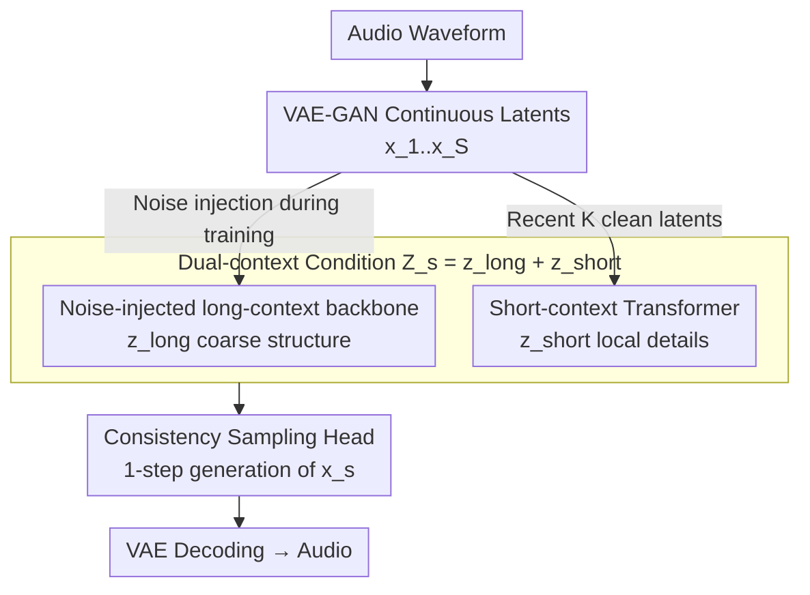

# Continuous Audio Language Models

**Conference**: ICLR2026  
**OpenReview**: [https://openreview.net/forum?id=MFrJ3NzA5H](https://openreview.net/forum?id=MFrJ3NzA5H)  
**Code**: https://github.com/kyutai-labs/pocket-tts (Pocket TTS)  
**Area**: Audio Speech Generation / Autoregressive Continuous Modeling  
**Keywords**: Continuous Audio Language Models, Consistency Models, VAE, Autoregressive Generation, Speech Synthesis

## TL;DR
The authors propose CALM (Continuous Audio Language Models), enabling autoregressive Transformers to directly predict audio frame-by-frame in the continuous latent space of a VAE. By replacing the diffusion head with a "consistency model sampling head" for single-step generation, the model bypasses the hard trade-off between audio quality and computational cost inherent in discrete RVQ tokens. It achieves higher fidelity and faster inference across both speech and music, supporting the release of Pocket TTS, a 100M-parameter model capable of running faster than real-time on a laptop CPU.

## Background & Motivation
**Background**: The current mainstream audio generation paradigm is the "Audio Language Model" (ALM), which compresses audio into discrete token sequences using neural codecs (e.g., SoundStream, Mimi) and models them with autoregressive Transformers. To control sequence length, codecs typically utilize Residual Vector Quantization (RVQ), compressing each audio frame into a hierarchy of tokens $\{q_{s,k}\}$ from coarse to fine, where $s$ is time and $k$ is codebook depth.

**Limitations of Prior Work**: Text tokens are reversible, but audio tokens derive from lossy codecs with finite bitrates. Improving audio quality requires increasing the bitrate, which means deepening RVQ levels and generating more tokens. Since tokens at different depths within the same frame have strong dependencies and cannot be generated fully in parallel, computational requirements grow linearly or even quadratically as quality improves. Existing mitigations—such as delay patterns or RQ-Transformer depth-autoregressive heads—offer some relief, but the fundamental constraint of the "quality-computation trade-off introduced by quantization" remains, particularly hindering high-quality audio on edge devices.

**Key Challenge**: Lossy quantization is the root problem. As long as modeling is performed on discrete tokens, high fidelity necessitates deeper codebooks, larger token matrices, and heavier sampling heads.

**Goal**: Bypassing quantization entirely by performing autoregressive modeling directly in a continuous latent space. The objective is to ensure both audio quality and stability (mitigating error accumulation in continuous autoregression) while making the sampling head sufficiently fast and lightweight.

**Key Insight**: Visual models like GIVT and MAR have demonstrated the feasibility of autoregressively modeling VAE continuous latents by using a large Transformer backbone to predict an intermediate latent $z_s$, followed by a small MLP (diffusion head) to model $p(x_s \mid z_s)$. However, direct application to audio fails, as music generation quickly diverges and sampling remains slow. The authors address these failures by systematically filling the gaps.

**Core Idea**: Replace RVQ discrete tokens with a VAE continuous latent space and substitute the diffusion sampling head with a "consistency model" for single-step generation, achieving higher audio quality than discrete models with lower computational cost.

## Method

### Overall Architecture
CALM addresses how to perform continuous audio autoregression both stably and rapidly. The pipeline is as follows: the raw waveform is first encoded by a VAE-GAN into a sequence of continuous latents $(x_1, \dots, x_S)$, where $x_s \in \mathbb{R}^C$. During the autoregressive phase, a causal backbone Transformer processes historical latents to produce a coarse long-range context $z_s^{\text{long}}$, while a lightweight short-context Transformer processes recent "clean" latents to produce a fine-grained $z_s^{\text{short}}$. Their summation forms the condition $Z_s$. Finally, a small MLP consistency sampling head, conditioned on $Z_s$, generates the next frame latent $\hat x_s$ from noise in a single step, which is then decoded back to a waveform by the VAE.

Crucially, noise is injected into the backbone's historical input during training (forcing it to focus on coarse structure and resist error accumulation), while the short-context path uses un-noised, clean latents (restoring local details lost to noise). This "noisy long-range + clean short-range" division of labor is central to stable music generation. Additional engineering innovations include the Head Batch Multiplier to amortize training costs, Gaussian temperature sampling for fidelity, and Latent CFG with latent distillation to support conditional generation and lightweight deployment.

### Key Designs

**1. VAE-GAN Continuous Latent Representation: Replacing RVQ Tokens with Continuous Latents**

This step addresses the "lossy quantization as the root cause" issue. The authors abandon the common RVQ-GAN in favor of a VAE-GAN framework: replacing the residual quantization bottleneck with a VAE bottleneck and using KL regularization to constrain the latent space to a Gaussian prior. VAEs are easier to train than vector quantization—avoiding codebook collapse, eliminating the need to balance quantization loss, and bypassing quantization training instability—while offering higher reconstruction fidelity at the same latent dimension. The architecture follows Mimi's fully causal design (adding Transformers alongside convolutions in the encoder/decoder). The speech VAE also utilizes WavLM for semantic distillation, but unlike Mimi which only distills the first codebook, this model extends distillation loss to the entire latent representation. The total loss combines time/frequency domain reconstruction, adversarial, feature matching, KL regularization, and semantic distillation:
$$L_{\text{VAE}} = \lambda_t L_t + \lambda_f L_f + \lambda_{\text{adv}} L_{\text{adv}} + \lambda_{\text{feat}} L_{\text{feat}} + \lambda_{\text{KL}} L_{\text{KL}} + \lambda_{\text{distill}} L_{\text{distill}}$$
Empirically, a 32-dimensional VAE matches the MOSNet audio quality of an 8-RVQ Mimi and outperforms it in semantic separability (ABX), PESQ, and STOI, demonstrating that replacing the discrete bottleneck with a continuous one does not sacrifice representation quality.

**2. Noise-injected Long-context Backbone + Short-context Transformer: Balancing Coarse Stability and Local Detail**

Directly applying MAR to music fails due to lack of robustness against error accumulation in continuous autoregression. The authors solve this with two complementary context paths. The long-context path injects noise into historical inputs during training: for each $s$, it samples $k_s \sim U(0,1)$ and $\epsilon_s \sim \mathcal N(0,I)$ to construct variance-preserving noisy inputs $\tilde x_s = \sqrt{k_s}\,\epsilon_s + \sqrt{1-k_s}\,x_s$, such that $z_s^{\text{long}} = T_{\text{long}}(\tilde x_1,\dots,\tilde x_{s-1})$ (no noise is added during inference). Noise injection forces the backbone to capture coarse structures and remain robust to historical perturbations, but it loses fine-grained information—music generated by this path alone preserves rhythm but fades into silence after several seconds.

A short-context path is added: a lightweight causal Transformer processes the $K$ most recent **un-noised** clean latents (for music, $K=10$ or ~0.4s), $z_s^{\text{short}} = T_{\text{short}}(x_{s-K},\dots,x_{s-1})$, restoring high-resolution local details. The final condition is $Z_s = z_s^{\text{long}} + z_s^{\text{short}}$. Ablations show that neither noise injection nor short-context alone is sufficient; their combination is essential for high-quality music generation.

**3. Consistency Sampling Head + Gaussian Temperature Sampling: 1-step Generation + Controllable Diversity**

Diffusion heads in MAR require hundreds of denoising steps per frame, which is too slow. The authors replace the diffusion head with a continuous-time consistency model (the TrigFlow form by Lu & Song, 2025) using $T=\tfrac\pi2$, $\alpha_t=\cos t$, $\sigma_t=\sin t$, and noise trajectory $x_t^s=\cos(t)\,x_s+\sin(t)\,\epsilon$. The consistency loss for the sequence is:
$$L_{\text{CALM}} = \sum_{s=1}^{S}\mathbb E_{t,\epsilon}\Big[e^{w_\psi(t)}\big\|F_\phi(x_t^s,t,Z_s)-F_{\bar\phi}(x_t^s,t,Z_s)-\cos(t)\tfrac{df_{\bar\phi}}{dt}\big\|_2^2 - w_\psi(t)\Big]$$
Backbone, short-context Transformer, consistency MLP, and adaptive weight $w_\psi$ are trained jointly. During inference, single-step generation is used by taking $t=1$ and $\epsilon \sim \mathcal N(0,I)$ to yield $\hat x_s = f_\phi(x_1^s=\epsilon,\,t=1,\,Z_s)$. Compared to RQ-Transformer heads, the consistency head speeds up music generation by $\sim$20× and speech by $\sim$12×.

To address the lack of diversity/fidelity "temperature" knobs in consistency models, the authors introduce a heuristic: analogous to the truncation trick in BigGAN, they **reduce the variance of the Gaussian noise** instead of truncating it. Setting the standard deviation to $\sqrt\tau$ is mathematically equivalent to applying temperature $\tau$, making continuous and discrete temperature values comparable. Using $\tau=0.8$ yields the best results for speech continuation.

**4. Head Batch Multiplier: Amortizing Backbone Computation**

Training bottleneck is the calculation of $z_s^{\text{long}}$ by the large causal Transformer. The authors observe that once $z_s^{\text{long}}$ is calculated, it can be reused for multiple noise samples of the same frame. Each training step calculates $z_s^{\text{long}}$ once but uses it for $N$ loss computations with independent noise levels $t$ and $\epsilon$. This effectively increases the sampling head's batch size by $N$ with almost no additional backbone overhead, accelerating convergence and stabilizing training through loss averaging.

**5. Latent CFG & Latent Distillation: Enhanced Generation + Pocket TTS Scaling**

Classifier-Free Guidance (CFG) improves conditional generation quality but relies on trajectory-based guiding, which is impossible in single-step consistency models. The authors implement **Latent CFG**: for a condition $C$ and coefficient $\alpha$, they calculate $Z_s^{\text{CFG}} = Z_s^{\varnothing} + \alpha(Z_s^{C}-Z_s^{\varnothing})$. To reduce inference overhead (which would otherwise double due to conditional/unconditional passes), they perform latent distillation: the teacher’s $Z_s^{\text{CFG}}$ is distilled into a student backbone using $\ell_2$ loss, while the MLP head is copied directly. Pocket TTS uses a 6-layer student distilled from a 24-layer teacher, resulting in a 100M parameter model that achieves real-time speed on a CPU.

### Loss & Training
- **VAE-GAN**: Equation (2), joint training of time/frequency reconstruction, adversarial, feature matching, KL, and (for speech) WavLM semantic distillation.
- **CALM Core**: Equation (3), continuous-time consistency loss, end-to-end optimization of backbone/short-context Transformer/MLP/weights; historical inputs are noise-injected via $\tilde x_s=\sqrt{k_s}\epsilon_s+\sqrt{1-k_s}x_s$.
- **Speech Specifics**: Uses a pretrained 2B Helium-1 text LM as the backbone, introducing an "inner monologue" text stream delayed by 2 frames (160ms) to decouple planning from synthesis.
- **Distillation**: Latent CFG Teacher $\to$ Student backbone ($\ell_2$ alignment of latents, copied MLP head).

## Key Experimental Results

### Main Results

Speech continuation (30s generation, compared to 8-RVQ RQ-Transformer head):

| Model | Temp | Sampling Head Speedup | Overall Speedup | Head Time % | Acoustic Quality(↑) | Semantic Elo(↑) | Rank |
|------|------|-----------|---------|----------|------|------|------|
| Ground Truth | – | – | – | – | 4.02 | 2180 | – |
| RQ-Transformer 8 RVQ | 0.8 | ×1.0 | ×1.0 | 26.7% | 2.75 | 1870 | 3 |
| CALM Consistency 1-step | 1.0 | ×12.3 | ×1.3 | 2.9% | 2.82 | 1947 | 2 |
| CALM Consistency 1-step | 0.8 | ×12.3 | ×1.3 | 2.9% | **3.45** | **2023** | **1** |

Text-to-Speech (LibriSpeech test-clean):

| Model | Params | WER(↓) | Acoustic Quality(↑) | Speaker Sim Elo(↑) |
|------|--------|--------|------|------|
| F5-TTS (NFE=32) | 336M | 2.42 | 54.7 | 2032 |
| DSM (16 RVQ, CFG=3) | 750M | 1.95 | 60.2 | 2112 |
| DiTAR (NFE=10) | 600M | 2.39 | – | – |
| CALM w/ LSD (NFE=1, CFG=1.5) | 313M | **1.81** | **61.1** | 1966 |

Music continuation (30s, compared to 32 RVQ RQ-Transformer baseline):

| Model | Overall Speedup(↑) | Head Speedup(↑) | Head Time % | FAD(↓) | Enjoyment Elo(↑) | Rank |
|------|------|------|------|------|------|------|
| RQ-Transformer 32 RVQ (Baseline) | ×1.0 | ×1.0 | 57.7% | 1.06 | 1824 | 4 |
| MusicGen Medium | ×1.3 | – | 0.0% | 1.72 | 1761 | 6 |
| CALM Consistency 1-step | **×2.2** | **×19.3** | 6.6% | 0.83 | 1857 | 2 |
| CALM Consistency 4-step | ×1.9 | ×5.4 | 20.1% | 0.71 | 1847 | 3 |
| CALM TrigFlow 100-step | ×0.3 | ×0.2 | 86.6% | **0.64** | **1921** | 1 |

### Ablation Study

| Configuration | Observation | Mechanism |
|------|------|------|
| Noise injection only (No short-term) | Music retains rhythm but fades to silence | Noise erases fine details; backbone alone is insufficient |
| Noise injection + Short-term context | Optimal audio quality | Clean short-range restores local details; key to high-quality music |
| No Head Batch Multiplier | Slower convergence, worse final result | Averaging multiple noise samples stabilizes training |
| TrigFlow vs. Consistency head | TrigFlow slightly better but extremely slow (Overall ×0.3) | Fidelity-speed trade-off; consistency chosen for real-time |

### Key Findings
- **Short-context Transformer is the primary contributor**: Its presence determines whether music can be generated stably over long durations; the window size $K$ itself is not sensitive.
- **Sampling heads are the computational black hole in discrete paradigms**: The RQ-Transformer head consumed 57.7% of inference time in the music baseline; replacing it with a consistency head reduced it to 6.6%, which accounts for the majority of the speedup.
- **Temperature sampling is surprisingly effective**: Reducing Gaussian variance is equivalent to applying temperature; $\tau=0.8$ significantly improves both speech quality and semantics.

## Highlights & Insights
- **Switching "Diffusion" to "Consistency" is high-leverage**: MAR-style methods are slowed by frame-wise multi-step denoising. Single-step consistency moves the sampling head from a bottleneck (57.7%) to a marginal cost (6.6%) without compromising quality—this is the critical differentiator for edge-deployed continuous audio autoregression.
- **"Dirty Long-range + Clean Short-range" Contextual Division**: Using noise injection to force the backbone to handle global structure while a clean short-context restores details effectively offsets the downsides of noise. This complementary design is transferable to other autoregressive tasks prone to drift.
- **Latent CFG + Distillation Loop**: Moving CFG to the latent space and then folding it into a single forward pass via distillation allows for high-quality, efficient generation, culminating in the highly practical Pocket TTS model.

## Limitations & Future Work
- **Lack of Semantic Distillation for Music VAE**: While speech uses WavLM, music lacks a clearly defined semantic distillation equivalent, potentially limiting long-range structure and controllability.
- **Speaker Similarity Discrepancy**: SIM for CALM w/ LSD is only 0.52. Although partly due to VAE reconstruction artifacts (GT dropped to 0.57 after VAE), it objectively trails discrete baselines in voice cloning scenarios.
- **TrigFlow Performance Ceiling**: The 100-step TrigFlow yields the highest quality but is unusable for real-time applications (×0.3 speed), suggesting that 1-step consistency still sacrifices some fidelity for speed.

## Related Work & Insights
- **Comparison with RQ-Transformer / Discrete ALM (MusicGen, Moshi, etc.)**: These models autoregress on lossy RVQ tokens; high fidelity requires deeper codebooks, causing sampling head costs to explode. CALM generates frames in a single step in a continuous VAE space, offering a better quality-compute trade-off.
- **Comparison with MAR / GIVT (Vision Continuous AR)**: CALM adopts the vision-style "backbone latent + small head" framework but replaces diffusion with consistency (1-step vs. hundreds) and adds dual contexts to address audio-specific drift.
- **Comparison with SALAD / DiTAR (MAR-style TTS)**: These apply MAR diffusion to small-scale TTS. CALM scales the paradigm to speech continuation (unsupervised) and music, highlighting the necessity of local short-context.

## Rating
- Novelty: ⭐⭐⭐⭐⭐ Systematically applies continuous VAE autoregression + single-step consistency to both speech and music domains.
- Experimental Thoroughness: ⭐⭐⭐⭐ Covers various tasks with human/auto evaluations, though several baselines are closed-source.
- Writing Quality: ⭐⭐⭐⭐ Clear motivation and explanation of incremental innovations.
- Value: ⭐⭐⭐⭐⭐ Real-world utility demonstrated through the CPU-ready Pocket TTS.

<!-- RELATED:START -->

## Related Papers

- [\[ICLR 2026\] JALMBench: Benchmarking Jailbreak Vulnerabilities in Audio Language Models](jalmbench_benchmarking_jailbreak_vulnerabilities_in_audio_language_models.md)
- [\[ICLR 2026\] Music Flamingo: Scaling Music Understanding in Audio Language Models](music_flamingo_scaling_music_understanding_in_audio_language_models.md)
- [\[ICLR 2026\] OWL: Geometry-Aware Spatial Reasoning for Audio Large Language Models](owl_geometry-aware_spatial_reasoning_for_audio_large_language_models.md)
- [\[ICLR 2026\] Measuring Audio's Impact on Correctness: Audio-Contribution-Aware Post-Training of Large Audio Language Models](measuring_audios_impact_on_correctness_audio-contribution-aware_post-training_of.md)
- [\[NeurIPS 2025\] Efficient Speech Language Modeling via Energy Distance in Continuous Latent Space](../../NeurIPS2025/audio_speech/efficient_speech_language_modeling_via_energy_distance_in_continuous_latent_spac.md)

<!-- RELATED:END -->
