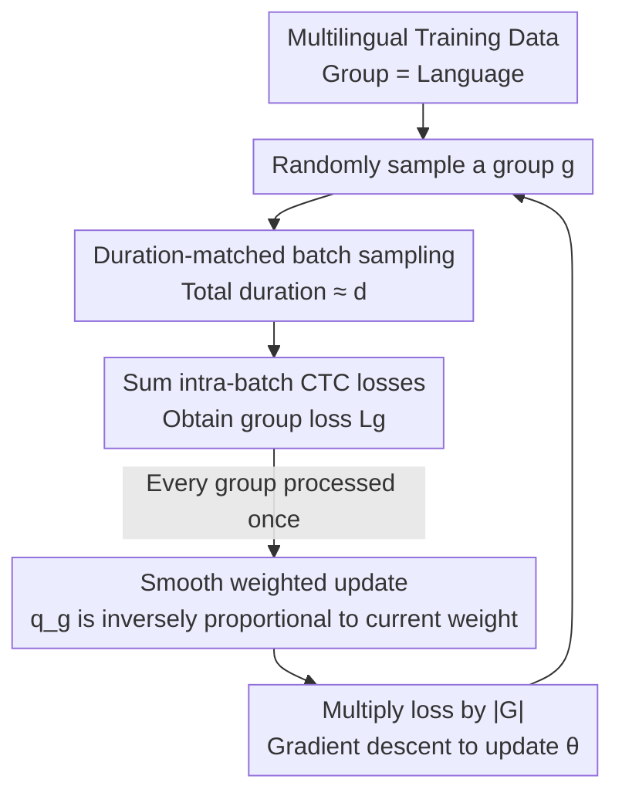

# CTC-DRO: Robust Optimization for Reducing Language Disparities in Speech Recognition

**Conference**: ICLR 2026  
**OpenReview**: [https://openreview.net/forum?id=yt40xuRBA9](https://openreview.net/forum?id=yt40xuRBA9)  
**Code**: https://github.com/Bartelds/ctc-dro  
**Area**: Speech Recognition / Distributionally Robust Optimization / Multilingual ASR  
**Keywords**: Multilingual ASR, CTC, group DRO, worst-group robustness, smooth weighting

## TL;DR
Addressing the issue of massive performance disparities among languages in multilingual speech recognition, this paper identifies that group DRO fails on CTC loss (due to CTC loss variance with audio length and acoustic characteristics, making it incomparable across groups). The authors propose CTC-DRO: using "duration-matched batch sampling" to flatten loss disparities caused by length, and "smooth weighted updates" to prevent weights from being monopolized by a single high-loss group. On five language sets of ML-SUPERB 2.0, it reduces the worst-case language error rate by up to 47.1% and the average error rate by up to 32.9%.

## Background & Motivation

**Background**: Multilingual ASR models (simultaneously performing Language Identification (LID) + transcription) exhibit wide performance gaps across different languages. The current mainstream approach involves fine-tuning self-supervised pre-trained encoders (XLS-R, MMS) with CTC objectives, which is preferred over autoregressive models like Whisper for faster inference and fewer hallucinations.

**Limitations of Prior Work**: To improve the performance of the worst-performing languages, group DRO is a natural tool as it assigns higher weights to "high-loss groups" during training to minimize worst-group loss. However, group DRO assumes that **training losses across groups are comparable**, a premise that does not hold in ASR.

**Key Challenge**: CTC loss $L_{CTC}=-\log P_{CTC}(Y\mid X)$ is defined by the negative log of the marginal probability over all valid alignments. It **grows with the input sequence length $D$**—the longer the sequence, the smaller the product of $D$ frame-level probabilities, resulting in a lower overall probability and higher loss. Consequently, a long audio clip may have a higher loss than a short one even with fewer errors. Systematic differences in audio duration distributions across languages (e.g., more long sentences in Spanish), combined with "irreducible loss" differences from acoustic/linguistic features, make CTC losses **systemically incomparable across groups**. Group DRO tends to accumulate weight $q_{g'}$ on the "highest loss" group (even if its downstream performance is acceptable), snowballing until it drains weights from other groups, leading to severe under-training of other languages.

**Goal**: Make DRO effective for CTC training without significantly increasing computational costs, reducing the error rate of the worst languages without sacrificing overall average performance.

**Key Insight**: The problem stems from two sources: the "scale" of the loss is contaminated by audio length, and the exponential weighting mechanism of group DRO is overly sensitive to persistently high-loss groups. Both can be addressed specifically.

**Core Idea**: Use "duration-matched batch sampling" to align the scale of losses across groups, and introduce a generalized group DRO update rule with a smoothing coefficient $\alpha$. This makes weight updates inversely proportional to current weights, preventing any single group from monopolizing the weight distribution.

## Method

### Overall Architecture

CTC-DRO modifies the group DRO training algorithm in two ways. The overall process remains a minimax online optimization loop: "sample a language group → calculate group loss → update group weights → update model with weighted loss." It only maintains a single scalar weight for each group, incurring nearly zero additional overhead.

Each training step involves: randomly sampling a language group $g$; using a **duration-matched sampler** to form a batch with a total duration approximately equal to a fixed value $d$ (approx. 50 seconds); calculating and **summing** (not averaging) the CTC losses of samples within the batch to obtain the group loss; updating all group weights $q_g$ using the **smooth weighted update** once each group has been sampled at least once; and finally performing gradient descent on model parameters $\theta$ using the group loss multiplied by the number of groups $|G|$.

### Key Designs

**1. Duration-matched batch sampling: Eliminating length bias in CTC loss**

This addresses the "CTC loss varies with length and is incomparable across groups" issue. The authors implemented a new batch sampler: each batch contains samples from only one randomly selected group $g$, and **samples are iteratively added until the total audio duration reaches or slightly exceeds a target duration $d$**. This ensures the "total duration" per batch is roughly fixed, so languages with longer audio clips are not unfairly penalized.

A critical detail is the loss aggregation: batches with many short samples have lower per-sample CTC losses, while those with few long samples have higher ones. The authors **sum the per-sample CTC losses within the batch** (Algorithm Line 10) and use this sum rather than the mean to update group weights. If a group is sampled multiple times before an update, the summed losses are averaged, effectively increasing the batch size for weight calculation. Before gradient descent, the loss is multiplied by $|G|$ (Algorithm Line 21) to ensure the training loss scale matches baseline settings without DRO, allowing shared hyperparameters like learning rates to remain unchanged. Appendix G confirms that simply scaling CTC loss by $D$ or $U$ is **insufficient** to resolve comparability issues.

**2. Smooth weighted update: Preventing weight monopoly by persistent high-loss groups**

This addresses the issue where group DRO concentrates weight on the highest-loss group, starving others. The original group DRO update is equivalent to the Hedge algorithm optimizing $\max_q \sum_g q_g L_g$, where the update $\delta q_g \propto q_g \exp(\eta_q L_g)$—larger weights and higher losses lead to faster growth, resulting in runaway positive feedback. This paper introduces a smoothing coefficient $\alpha$:

$$q_g \leftarrow \frac{q_g\cdot \exp\!\big(\eta_q \frac{L_g}{q_g+\alpha}\big)}{\sum_{g\in G} q_g\cdot \exp\!\big(\eta_q \frac{L_g}{q_g+\alpha}\big)}$$

Intuitively, $L_g$ is divided by $(q_g+\alpha)$ inside the exponent: when a weight $q_g$ is already large, its update magnitude is suppressed, preventing any group weight from becoming excessive relative to its loss. Conversely, if two groups have similar losses but different weights, **the group with the lower weight receives a larger update**, preventing under-training. $\alpha$ acts as a continuous knob: as $\alpha\to 0$, updates are extremely sensitive to "current weight," trending toward a uniform distribution; as $\alpha\to\infty$, it reduces to the original group DRO update.

The authors prove this update still minimizes the worst-case loss by optimizing the generalized objective $\max_q \sum_g \log(q_g+\alpha)L_g$. The Lagrangian stationary points satisfy $q_g+\alpha \propto \frac{L_g}{\sum_{g'} L_{g'}}$, meaning optimal weights still increase monotonically with loss—just more smoothly.

### Loss & Training
The model adds two Transformer layers and a softmax atop XLS-R / MMS self-supervised encoders, jointly predicting language tokens and character sequences via CTC (no separate LID head). Training runs for 40 epochs, keeping the checkpoint with the lowest dev loss. Gradients are accumulated across 16 batches, with a target batch duration of ~50 seconds for A6000 GPUs. DRO-specific hyperparameters were tuned on the dev set: $\eta_q\in\{10^{-3},10^{-4}\}$, $\alpha\in\{0.1,0.5,1\}$.

## Key Experimental Results

The dataset used is ML-SUPERB 2.0 (141 languages, 15 corpora). Main experiments utilize 5 randomly selected language sets, each comprising 6 "language-corpus" pairs (1 hour of training data each, covering high/medium/low CER quantiles). Imbalanced settings (more data) were tested on the first two sets. Metrics include Worst-case CER (primary), Average CER, and LID Accuracy.

### Main Results (Balanced Data, selection from Table 1)

| Set | Model | Method | Worst CER | Avg CER | LID |
|----|------|------|------|------|-----|
| 5 | XLS-R | Base | 114.8 (JPN) | 29.9 | 89.0 |
| 5 | XLS-R | GDRO | 92.9 (JPN) | 36.8 | 57.7 |
| 5 | XLS-R | **CTC-DRO** | **71.5 (JPN)** | **23.8** | **91.0** |
| 5 | MMS | Base | 90.0 (JPN) | 26.0 | 96.3 |
| 5 | MMS | **CTC-DRO** | **57.5 (JPN)** | **24.3** | 90.5 |
| 2 | XLS-R | Base | 68.8 (YUE) | 19.0 | 94.2 |
| 2 | XLS-R | **CTC-DRO** | **45.0 (YUE)** | **15.8** | 89.3 |

The largest improvement occurred in the imbalanced set 2 for XLS-R: worst-case CER was reduced by **47.1%** relative to the baseline. CTC-DRO achieved the best average CER in 13 out of 14 settings (7 sets × 2 models), with a maximum relative reduction of **32.9%**. Conversely, group DRO worsened the worst-case CER in 7 of 14 settings and increased the average CER in all settings, confirming its failure in this context.

### Ablation Study (Table 3, set 5)

| Configuration | Worst CER (XLS-R) | Average CER | Note |
|------|------|------|------|
| Base | 114.8 | 29.9 | Baseline |
| **CTC-DRO (Full)** | **71.5** | **23.8** | Full Model |
| − Dur (w/o Duration Matching) | 115.2 | 50.6 | Length bias persists; degrades to baseline |
| − Smooth (w/o Smoothing) | 194.2 | 61.4 | Out-of-control weights; worse than baseline |

### Key Findings
- **Both components are indispensable, with smooth updates contributing more**: Removing either component causes worst-case CER to rise by up to 171.6% and average CER by up to 302.9%. The failure without smoothing (−Smooth) is most catastrophic, indicating it is the core mechanism.
- **Stabler Weight Trajectories**: In group DRO, weights oscillate wildly and are often monopolized by a single language. In CTC-DRO, weights are more evenly distributed and less volatile.
- **Scalability**: CTC-DRO remains effective when scaling to 18 languages, reducing worst-case CER by 8.9% (MMS) / 9.2% (XLS-R) in balanced settings.
- **Stability**: Retesting with 4 random seeds on sets with minimal gains (Set 1, 3) confirmed that the worst-case language improvements are stable.

## Highlights & Insights
- **Thoroughly diagnosing and treating loss incomparability**: The authors pinpointed the root causes (CTC length scaling + irreducible loss variance) and addressed them with independent sampling and weighting mechanisms.
- **Continuous Generalization**: The smooth update rule elegantly bridges the gap between uniform weighting ($\alpha \to 0$) and original group DRO ($\alpha \to \infty$), ensuring optimal weights still follow the DRO principle without spiraling out of control.
- **Zero Cost**: Only one scalar weight per group is maintained, and the $|G|$ scaling allows existing hyperparameters to be reused, making it highly practical for production.
- **Transferability**: The approach is likely applicable to other domains where "group training losses are naturally incomparable" (e.g., medical imaging across different devices/modalities).

## Limitations & Future Work
- The experiments focus on relatively small-scale data (1–9 hours per language). While gains are expected to persist at scale, this has not been directly verified on industrial-scale datasets.
- The method is tied to the CTC objective; adaptation for autoregressive models (like Whisper) is not discussed.
- Three extra hyperparameters ($\alpha, \eta_q, d$) require tuning on a dev set, which may increase costs when dealing with many groups or extreme imbalance.
- Evaluation relies heavily on CER across randomly sampled language sets; results might still be influenced by specific language combinations.

## Related Work & Insights
- **vs group DRO (Sagawa et al. 2020)**: Group DRO assumes comparable losses and uses $\exp(\eta_q L_g)$ weighting; CTC-DRO identifies the failure of this assumption in CTC and introduces smooth updates and duration matching.
- **vs Loss Calibration / Proxy Models (Oren et al. 2019; Słowik & Bottou 2022)**: These usually increase computation significantly or require a reliable proxy for "group difficulty," which is lacking in speech. CTC-DRO avoids these dependencies.
- **vs Simple $D/U$ Scaling**: The authors prove in Appendix G that per-sample normalization is insufficient, highlighting the necessity of duration-matched sampling.

## Rating
- Novelty: ⭐⭐⭐⭐ Precisely identifies and theoretically justifies the fix for group DRO/CTC incompatibility.
- Experimental Thoroughness: ⭐⭐⭐⭐ Robust evaluation across multiple sets, models, imbalanced settings, and ablations.
- Writing Quality: ⭐⭐⭐⭐⭐ Clear progression from diagnosis to methodology and proof.
- Value: ⭐⭐⭐⭐ Low-cost, deployable, and potentially transferable to other fields.

<!-- RELATED:START -->

## Related Papers

- [\[ICLR 2026\] Pay Attention to CTC: Fast and Robust Pseudo-Labelling for Unified Speech Recognition](pay_attention_to_ctc_fast_and_robust_pseudo-labelling_for_unified_speech_recogni.md)
- [\[ICLR 2026\] StableToken: A Noise-Robust Semantic Speech Tokenizer for Resilient SpeechLLMs](stabletoken_a_noise-robust_semantic_speech_tokenizer_for_resilient_speechllms.md)
- [\[ICLR 2026\] AVERE: Improving Audiovisual Emotion Reasoning with Preference Optimization](avere_improving_audiovisual_emotion_reasoning_with_preference_optimization.md)
- [\[ICLR 2026\] Learnable Fractional Superlets with a Spectro-Temporal Emotion Encoder for Speech Emotion Recognition](learnable_fractional_superlets_with_a_spectro-temporal_emotion_encoder_for_speec.md)
- [\[ICLR 2026\] Data-Centric Lessons To Improve Speech-Language Pretraining](data-centric_lessons_to_improve_speech-language_pretraining.md)

<!-- RELATED:END -->
