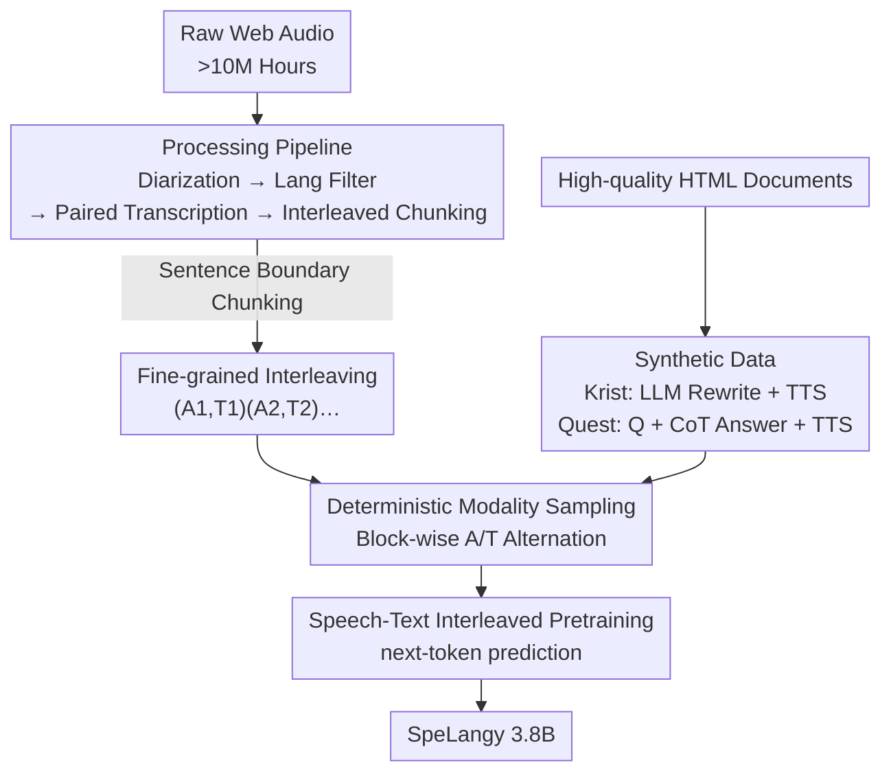

# Data-Centric Lessons To Improve Speech-Language Pretraining

**Conference**: ICLR 2026  
**OpenReview**: [https://openreview.net/forum?id=4amNkYCDqX](https://openreview.net/forum?id=4amNkYCDqX)  
**Code**: None  
**Area**: Speech-Language Models / Multimodal Pretraining  
**Keywords**: Spoken QA, Data Engineering, Speech-Text Interleaving, Synthetic Data, Modality Alignment

## TL;DR
This paper systematically migrates mature "data-centric" methodologies from the language/vision domains to speech-language pretraining. Through controlled ablations, it addresses three questions: how to chunk raw audio, how to generate synthetic data, and how to sample interleaved data. These insights are distilled into a 3.8B SpeechLM (SpeLangy), which outperforms models three times its size by 10.2% on Spoken Question-Answering (SQA).

## Background & Motivation

**Background**: Spoken Question-Answering (SQA) is a core capability for speech assistants. Current mainstream approaches utilize a "Speech Encoder + Connector + LLM" architecture, enhanced by speech-text interleaved pretraining (next-token prediction on alternating sequences of speech and text tokens). Recent models like Kimi-Audio, GLM-4-Voice, and MiMo-Audio follow this paradigm.

**Limitations of Prior Work**: While previous works clarify **modeling choices** (architecture, tokenizer), the **data pipeline** is rarely evaluated under controlled conditions. Questions such as the optimal length for raw audio chunks, the viability of back-synthesizing speech from text corpora, and the optimal interleaving of modality tokens remain largely unexplored in the speech domain.

**Key Challenge**: In the language (FineWeb, DCLM) and vision (DINOv2/v3) domains, data governance has been proven as the primary driver of performance. However, the speech-language domain lacks similarly rigorous data ablations, making it difficult to pinpoint the source of performance gains. Furthermore, small models often exhibit modality conflicts when calculating loss simultaneously on speech and text tokens during pretraining.

**Goal**: To answer three fundamental data questions on a clean experimental bed—stripped of confounding factors like task interference and sub-optimal data ratios: (1) How to process raw web audio into trainable interleaved chunks; (2) How to construct synthetic data to supplement web-crawled data; (3) How to sample interleaved modalities during training.

**Key Insight**: The authors intentionally restrict the pretraining task to **speech-text interleaving only**, eliminating typical pipeline task interference and data mixture noise. This allows for the measurement of the causal effect of each data variable—a strategy inspired by "single-modality clean testbeds" like DCLM and DataComp.

**Core Idea**: Without altering the model architecture, the authors systematically improve SQA performance through three data-level interventions: fine-grained interleaving, synthetic data augmentation, and deterministic modality sampling.

## Method

### Overall Architecture

The study is a two-phase research consisting of "controlled data ablations → distillation into the final model." A ~3.8B SpeechLM is fixed (1B Conformer speech encoder + Finite Scalar Quantizer outputting 12.5Hz discrete tokens, initialized from a 2.8B text-only base LM with speech tokens added to the vocabulary). Pretraining is restricted to the speech-text interleaving task with a fixed data mixture of 60% pure text and 40% speech-text. On this platform, the authors perform A/B ablations on three stages of the data lifecycle: **audio chunking** (coarse vs. fine), **synthetic data construction** (Krist / Quest), and **modality sampling** (deterministic vs. stochastic). Each configuration is evaluated on SQA benchmarks (SWQ / STQ / SLQ) and 12 text benchmarks. Finally, the winning configurations are combined to train SpeLangy on 1.67T tokens.

### Key Designs

**1. Fine-grained Interleaving: Chunking by Sentence Boundaries instead of Speaker Merging**

Raw audio typically yields transcriptions segments after diarization. Previous works (e.g., Kimi-Audio, Baichuan-Audio) defaults to **merging consecutive segments of the same speaker** into long chunks (coarse interleaving, avg. 19.2s). This paper proposes the opposite: retaining short segments and further splitting them by sentence boundaries (fine-grained interleaving, avg. 5.2s). Each training sample is represented as $X_i=\{(A_1,T_1),(A_2,T_2),\dots,(A_n,T_n)\}$, where $A$ is a speech chunk and $T$ is the corresponding text.

Fine-grained chunking is superior because shorter blocks imply more **frequent alternation** between speech and text tokens, forcing the model to align modalities at a finer granularity. Coarse chunks provide sparse cross-modal signals. Experiments show that fine-grained interleaving improves SQA by 3.1% (37.6% → 40.7%) without degrading text performance, challenging the industry default of speaker-based merging.

**2. Synthetic Data (Krist + Quest): Back-synthesizing Clean Speech from Text Corpora**

While web-crawled audio is abundant (>10M hours), its **domain distribution is heavily skewed** toward podcasts, interviews, and monologues (entertainment, sports, religion), with a lack of high-priority domains like tech, health, and education. Furthermore, transcription hallucinations and noise introduce "dirty" labels. The authors synthesized two datasets: **Krist** (Knowledge-Rich Interleaved Speech-Text), derived from HTML documents with knowledge-intensive domains extracted via GPT-4o-mini and synthesized via Melo-TTS (5 accents); and **Quest** (Question-Answering Speech-Text), specifically organized into "Question → CoT → Answer" formats to match downstream SQA task structures.

Mechanism: Synthetic data accurately fills the undersampled domains of web data, reducing the distribution gap. Quest improves MMLU and SQA by 2.1% and 7.2%, respectively, suggesting the QA format is naturally suited for SQA tasks.

**3. Deterministic Modality Sampling: Maximizing Modality Switches**

Given interleaved samples $X_i=\{(A_1,T_1),\dots,(A_n,T_n)\}$, training must decide whether to consume a block as speech or text. Prior works use **stochastic sampling** ($p=0.5$ for each block). This paper proposes **deterministic sampling**: strictly alternating as $\{A_1,T_2,A_3,\dots,A_{n-1},T_n\}$ to maximize modality switches. The expectation of switches is $n-1$ for deterministic versus $\frac{n-1}{2}$ for stochastic.

Frequent switching forces the model to perform repeated cross-modal alignment, learning stronger speech-to-text mappings. Stochastic sampling often results in consecutive blocks of the same modality, diluting the cross-modal signal. Deterministic sampling improves SQA by an additional 1% (41.4% → 42.4%).

### Loss & Training

Standard next-token prediction is used. By default, loss is calculated on **both** speech and text tokens. The authors additionally ablated an "understanding-only" setting (masking loss on speech tokens). All data interventions remained effective under this setting (SQA +9.3%), and absolute performance was higher (51.8% vs. 42.4%), confirming that modality conflicts between speech and text tokens exist in small models.

## Key Experimental Results

### Main Results

SpeLangy (3.8B) outperforms larger base models and approaches the performance of instruction-tuned models:

| Type | Model | Params | SWQ | STQ | SLQ | Avg |
|------|------|--------|-----|-----|-----|------|
| Base | Kimi-Audio | 10.5B | 44.0 | 33.8 | 47.0 | 41.6 |
| Base | Qwen-Audio | 8.4B | 45.7 | 30.3 | 46.0 | 40.7 |
| Base | Qwen-2-Audio | 8.4B | 45.7 | 33.4 | 47.0 | 42.0 |
| Base | **SpeLangy** | **3.8B** | 45.7 | 44.6 | 65.0 | **51.8** |
| SFT | Voxtral-mini | 4.7B | 41.6 | 46.6 | 65.3 | 51.2 |
| SFT | GLM-4-Voice | 9.9B | 43.3 | 52.4 | 64.7 | 53.4 |

SpeLangy outperforms Kimi-Audio and Qwen-2-Audio by 10.2% and 9.8%, respectively, despite being ~2-3x smaller. It matches the performance of post-trained models like Voxtral-mini without task-specific fine-tuning.

### Ablation Study

Individual gains from data interventions (SQA avg):

| Intervention | Config | SQA Avg | Note |
|--------------|------|---------|------|
| Granularity | Coarse | 37.6 | Speaker-merged long chunks |
| Granularity | **Fine** | 40.7 | Sentence-level short chunks, +3.1% |
| Synthetic Data | Web-crawl 100% | 40.7 | Baseline |
| Synthetic Data | +Krist | 41.5 | +0.8% |
| Synthetic Data | **+Quest** | 47.9 | +7.2%, QA format match |
| Modality Sampling | Stochastic | 41.4 | Independent 0.5 prob |
| Modality Sampling | **Deterministic** | 42.4 | Strict alternation, +1% |

### Key Findings

- **Quest's Impact**: QA-formatted synthetic data contributes most (+7.2% SQA) as its structure mimics the structure of downstream SQA tasks.
- **Mechanism Evidence**: (1) Modality Alignment: Fine-grained interleaving reduces the reverse-KLD between speech-conditioned and text-conditioned output distributions. (2) Domain Coverage: Krist/Quest compensate for web audio's skew toward entertainment by oversampling technical and educational domains.
- **Contamination is Negligible**: De-contamination analysis shows minimal impact on SQA benchmarks, and the gains from synthetic data (+3.7%~19%) far exceed delta from potential contamination (≤2%).

## Highlights & Insights
- **Transferring Data Science to Speech**: The study provides a clean experimental bed to quantify the causal effects of data variables, establishing a "controlled ablation" paradigm for new modalities.
- **Challenging Industry Defaults**: The finding that fine-grained chunking outperforms speaker-based merging challenges common practices in models like Kimi-Audio.
- **Back-synthesizing for Domain Gaps**: Krist/Quest demonstrate a path to overcome the scarcity of specialized speech data by leveraging LLM-rewriting and TTS.
- **Efficiency via Quality**: A 3.8B model outperforming a 10.5B model reinforces the idea that data governance is a more significant driver than sheer parameter count.

## Limitations & Future Work
- **Optimal Data Mixture**: The exact ratio between Krist/Quest and web-crawled data remains an open question due to complex interactions.
- **Dependency on Closed-source Models**: Synthesis relies heavily on GPT-4o and specific TTS engines, which may limit scalability or introduce specific biases.
- **MCQ Evaluation**: SQA is evaluated via 4-choice MCQ log-likelihood, which may not perfectly reflect real-world open-ended generative speech QA performance.

## Related Work & Insights
- **vs. Kimi-Audio / Baichuan-Audio**: These models use coarse chunking and do not disclose data governance details; this paper makes the pipeline transparent and proves fine-grained chunking is superior.
- **vs. DCLM / FineWeb**: This work extends the data-centric paradigm of NLP to the speech-language domain.
- **vs. Voxtral-mini / GLM-4-Voice**: While those models rely on SFT, SpeLangy shows that high-quality data during **pretraining** can achieve comparable gains.

## Rating
- Novelty: ⭐⭐⭐⭐ (Techniques are known, but the systematic ablation in the speech-language domain is pioneering.)
- Experimental Thoroughness: ⭐⭐⭐⭐⭐ (Includes ablations, modality transfer, post-training validation, and mechanistic analysis.)
- Writing Quality: ⭐⭐⭐⭐⭐ (Clear three-question structure with takeaways.)
- Value: ⭐⭐⭐⭐⭐ (Provides a reproducible data recipe for the SpeechLM community.)

<!-- RELATED:START -->

## Related Papers

- [\[CVPR 2026\] Unlocking Strong Supervision: A Data-Centric Study of General-Purpose Audio Pre-Training Methods](../../CVPR2026/audio_speech/unlocking_strong_supervision_a_data-centric_study_of_general-purpose_audio_pre-t.md)
- [\[AAAI 2026\] End-to-end Contrastive Language-Speech Pretraining Model For Long-form Spoken Question Answering](../../AAAI2026/audio_speech/end-to-end_contrastive_language-speech_pretraining_model_for_long-form_spoken_qu.md)
- [\[ACL 2026\] How Tokenization Limits Phonological Knowledge Representation in Language Models and How to Improve Them](../../ACL2026/audio_speech/how_tokenization_limits_phonological_knowledge_representation_in_language_models.md)
- [\[ICCV 2025\] 2.5 Years in Class: A Multimodal Textbook for Vision-Language Pretraining](../../ICCV2025/audio_speech/25_years_in_class_a_multimodal_textbook_for_visionlanguage_p.md)
- [\[ICLR 2026\] ParaS2S: Benchmarking and Aligning Spoken Language Models for Paralinguistic-Aware Speech-to-Speech Interaction](paras2s_benchmarking_and_aligning_spoken_language_models_for_paralinguistic-awar.md)

<!-- RELATED:END -->
