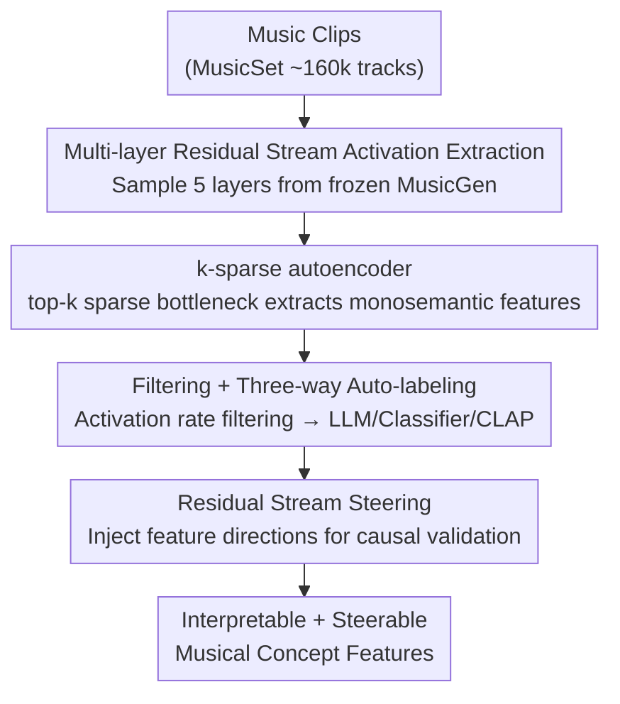

# Discovering and Steering Interpretable Concepts in Large Generative Music Models

**Conference**: ICLR2026  
**arXiv**: [2505.18186](https://arxiv.org/abs/2505.18186)  
**Code**: [musicdiscovery.media.mit.edu](https://musicdiscovery.media.mit.edu)  
**Area**: Audio & Speech  
**Keywords**: Sparse Autoencoder, Music Generation, interpretability, MusicGen, Feature Steering

## TL;DR

This work represents the first application of Sparse Autoencoders (SAE) to the audio/music domain, extracting interpretable musical concept features from the residual stream of the autoregressive music generation model MusicGen and leveraging these features for steerable generation.

## Background & Motivation

- While deep generative models produce high-quality music, suggesting an implicit internal theory of musical structure, these representations remain a black box to humans.
- Existing probing methods only verify "if the model encodes **known** concepts" (e.g., chords, tempo) and cannot discover **unknown** structures learned autonomously by the model.
- The music domain lacks large-scale paired "music-text" data, making unsupervised concept discovery particularly challenging.
- In NLP and vision, SAEs have proven effective at extracting interpretable sparse features from Transformer activations (Templeton et al., 2024), but they have not yet been applied to the audio modality.

Core Motivation: **Shifting from "Does the model learn X?" to "What exactly did the model learn?"**—discovering all internally encoded musical concepts in an unsupervised manner.

## Core Problem

1. How can interpretable musical concepts be discovered in an **unsupervised** manner from the intermediate representations of music generation models?
2. How can thousands of potential features be evaluated and annotated **automatically and at scale**?
3. Can the discovered features **causally** control (steer) the generative output?

## Method

### Overall Architecture

To determine which musical concepts a generative model learns and whether they can be manipulated, this paper proposes a four-step pipeline. First, intermediate activations are extracted from multiple residual stream layers of a **frozen** MusicGen using approximately 160,000 music clips. Second, a k-sparse autoencoder is trained to rewrite these entangled activations into a set of sparse, monosemantic features. Third, thousands of features are filtered by activation rates and automatically labeled/scored using a three-way automated approach. Finally, specific feature directions are injected back into the residual stream to verify if they can causally steer the generated music. The first two steps handle "extraction and disentanglement," the third handles "filtering and naming," and the fourth provides causal validation of steerability.

### Key Designs

**1. Multi-layer Residual Stream Activation Extraction: Probing across depth**

To discover concepts, intermediate representations must be extracted from the generative model. The authors use the MusicSet dataset (~160,000 10-second clips from MTG-Jamendo / MusicCaps / MusicBench) and feed them into pre-trained MusicGen-Large (MGL, $d=2048$) and MusicGen-Small (MGS, $d=1024$). The models remain frozen. Activations are sampled from five residual stream layers across the depth: Layer 2, 25%, 50%, 75%, and the penultimate layer (MGL: $\{2,12,24,36,46\}$; MGS: $\{2,6,12,18,22\}$). This allows for a comparison of interpretability across different depths.

**2. k-sparse autoencoder: Disentangling activations via a sparse bottleneck**

Residual stream activations suffer from superposition, where a single dimension may encode multiple concepts. The authors train a k-sparse autoencoder to rewrite these as sparse features. The encoder $\mathbf{h}=\text{ReLU}(\mathbf{W}_e\mathbf{x}+\mathbf{b}_e)$ is followed by a top-k projection that retains only the $k$ largest activations, setting the rest to zero. The decoder $\hat{\mathbf{x}}=\mathbf{W}_d\mathbf{h}+\mathbf{b}_d$ reconstructs the original activation under MSE loss. Forced sparsity compels each feature to carry a single meaning. Each column of the decoder $\mathbf{W}_{d,j}$ represents a "direction" for a specific feature, reused for steering. The dictionary size is controlled by an expansion factor $\epsilon\in\{4,32\}$, with sparsity $k\in\{32,100\}$.

**3. Filtering + Three-way Auto-labeling: Scaling concept identification**

With thousands of potential features, manual naming is impossible. First, activation rate filtering is applied: features with $r_i=0$ (dead), $r_i>0.25$ (too generic), and $r_i<0.01$ (too rare) are removed. This yields 4,697 valid features. Three labeling pathways follow: Generative labeling sends merged audio of the top-10 activations to Gemini Flash 1.5 for labels and descriptions; Classifier labeling uses Essentia to extract genre, instrument, and mood tags; CLAP scoring calculates the cosine similarity between the text label and audio embeddings to quantify label alignment.

**4. Residual Stream Steering: Causal validation of feature directions**

To prove that features are "actionable directions," the authors inject the scaled decoder direction of a target feature $j$ back into the residual stream during inference:

$$\mathbf{x}' = \mathbf{x} + \alpha \cdot \beta \cdot \mathbf{W}_{d,j}$$

where $\mathbf{W}_{d,j}$ is the learned direction, $\beta$ is the maximum activation strength of feature $j$, and $\alpha\in(0,1)$ is the steering strength. A neutral prompt ("Simple melody") is used to isolate the effect. If the output audio shifts toward the concept, the direction is validated.

## Key Experimental Results

### Feature Discovery Statistics

- A total of **4,697 valid features** were retained after filtering.
- MGL significantly outperforms MGS: MGL at $\epsilon=32, k=100$ produces 2,344 features at Layer 12, whereas MGS rarely exceeds 100 features across configurations.
- An expansion factor of 32 combined with $k=100$ proved most effective.

### Automatic Labeling Quality

- Essentia classifier labels generally achieved higher CLAP alignment scores than Gemini-generated labels.
- Human evaluation (400 features/method, 80 participants): Essentia confidence 3.96/5 (71% > 4), Gemini confidence 3.19/5 (47% > 4).

### Hierarchical Patterns

- Deeper layers in MGL show higher CLAP scores, suggesting that **deeper layers encode more interpretable concepts**.
- Layer prediction MLP accuracy: MGL 50.29%, MGS 40.51%—denoting that **feature differentiation across layers is more pronounced in larger models**.

### Steering Effectiveness

- Across SAE configurations, **15%–35% of features** demonstrated positive steering improvement.
- Best configuration: MGL L36, $\epsilon=32, k=100$ reached 35.1% positive improvement.
- Human listening tests (10 people × 10 groups): 66/100 correctly identified SAE-steered audio (vs. 17 for baseline, 17 for random), $\chi^2=48.02, p<.0001$.

## Highlights

- **First Audio SAE Application**: Successfully migrates SAE interpretability methods from NLP/Vision to music generation, opening a new research direction.
- **Unsupervised Concept Discovery**: Recovers classic concepts (Taiko drums, Hardstyle Techno, Baroque Harpsichord) and discovers **new patterns not yet encoded by theory** (e.g., "electronic beeps/boops", "single-note instruments").
- **Comprehensive Evaluation**: A multi-layered pipeline combining multi-modal LLMs, pre-trained classifiers, CLAP alignment, and human validation.
- **Causal Steering**: Causal evidence that discovered features correspond to **actionable directions** within the model.

## Limitations & Future Work

- Steering success rates are only 15%–35%; many features are interpretable but not necessarily steerable.
- Validated only on MusicGen; diffusion-based music models or other architectures remain untested.
- Automatic labeling constraints: Gemini labels are less stable than classifier labels.
- Heuristic filtering thresholds (1%–25%) may miss edge cases.
- MGS produces very few valid features, leaving the lower bound for model scale and SAE effectiveness under-discussed.

## Related Work & Insights

| Method | Strategy | Concept Source | Limitations |
|------|------|----------|------|
| Probing (Wei et al., 2024a; Ma & Xia, 2024) | Supervised Probing | Pre-defined | Limited to known concepts |
| DecoderLens (Vásquez et al., 2024) | Intermediate Visualization | Layer-wise Evolution | Primarily qualitative |
| Concept Bottleneck Models | Bottleneck Constraint | Hand-specified | Requires prior knowledge |
| Protein LM SAE (Simon & Zou, 2024) | SAE Discovery | Unsupervised | Different domain |
| **Ours** | **SAE + Auto-labeling + Steering** | **Unsupervised** | **First audio app with causal validation** |

## Rating
- Novelty: 9/10
- Experimental Thoroughness: 8/10
- Writing Quality: 9/10
- Value: 8/10

<!-- RELATED:START -->

## Related Papers

- [\[ICLR 2026\] Steering Autoregressive Music Generation with Recursive Feature Machines](steering_autoregressive_music_generation_with_recursive_feature_machines.md)
- [\[AAAI 2026\] Aligning Generative Music AI with Human Preferences: Methods and Challenges](../../AAAI2026/audio_speech/aligning_generative_music_ai_with_human_preferences_methods_and_challenges.md)
- [\[ICLR 2026\] Music Flamingo: Scaling Music Understanding in Audio Language Models](music_flamingo_scaling_music_understanding_in_audio_language_models.md)
- [\[ICLR 2026\] Confident and Adaptive Generative Speech Recognition via Risk Control](confident_and_adaptive_generative_speech_recognition_via_risk_control.md)
- [\[ICML 2026\] Sparse Autoencoders for Interpretable Emotion Control in Text-to-Speech](../../ICML2026/audio_speech/sparse_autoencoders_for_interpretable_emotion_control_in_text-to-speech.md)

<!-- RELATED:END -->
