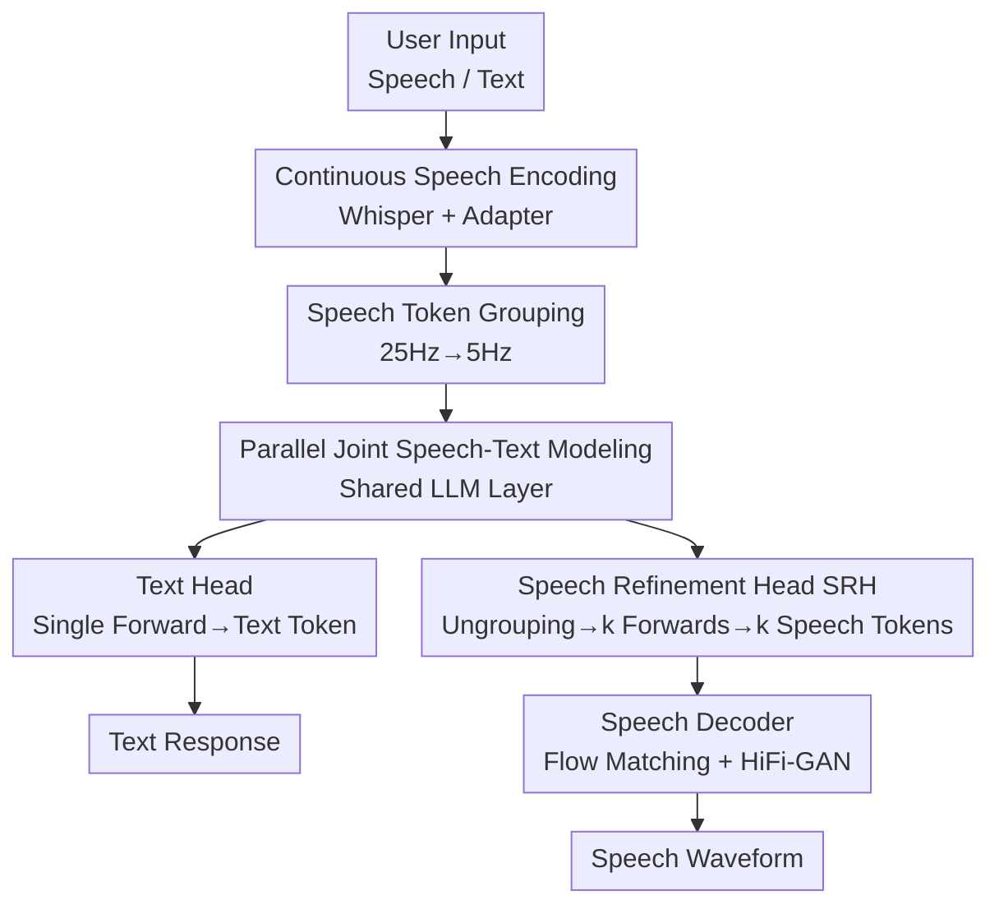

# DrVoice: Parallel Speech-Text Voice Conversation Model via Dual-Resolution Speech Representations

**Conference**: ICLR2026  
**OpenReview**: [https://openreview.net/forum?id=h5AiVx0Aiv](https://openreview.net/forum?id=h5AiVx0Aiv)  
**Code**: https://github.com/FunAudioLLM/Fun-Audio-Chat  
**Area**: Voice Conversation / Speech Foundation Models / Multimodal  
**Keywords**: Joint Speech-Text Modeling, Dual-Resolution Representations, End-to-End Voice Conversation, Speech Token Grouping, Parallel Decoding

## TL;DR
DrVoice reduces the speech frame rate entering the LLM from the mainstream 12.5Hz to 5Hz. By employing a dual-resolution scheme—"compression via grouping for understanding and a specialized refinement head at the original frame rate for generation"—this approach saves nearly 50% of training GPU hours and mitigates the frame rate mismatch between speech and text tokens. The 7B open-source model achieves SOTA performance across OpenAudioBench, VoiceBench, UltraEval-Audio, and Big Bench Audio.

## Background & Motivation
**Background**: End-to-end (E2E) voice conversation models compress the traditional ASR + LLM + TTS pipeline into a single model, allowing the LLM to directly consume speech representations and output speech tokens. "Joint Speech-Text" models, where the LLM simultaneously generates text and speech tokens that feed back into each other, are considered more promising than "text-driven" approaches. They allow text output to be conditioned on generated speech, capturing paralinguistic information like emotion and prosody.

**Limitations of Prior Work**: Kimi-Audio, a leading joint model, utilizes a **12.5Hz** audio representation. This leads to two issues: first, the high token rate (12.5 tokens/s) increases training and inference costs; second, there is a severe **frame rate mismatch** between speech tokens (12.5Hz) and text tokens (~3Hz). For the same sentence, the speech side has far more tokens than the text side, which dilutes semantic information and hinders the LLM's inherent linguistic capabilities.

**Key Challenge**: Speech tokens require a **high frame rate** to preserve fine-grained acoustic details (ensuring generation quality), but high frame rates **increase the distance** from text tokens, slowing down understanding and computation. While lowering the frame rate (e.g., to 6.25Hz) saves computation and aligns better with text, experiments from GLM-4-Voice show that WER deteriorates significantly at 12.5Hz/6.25Hz. Understanding prefers low resolution, while generation prefers high resolution—a natural trade-off.

**Goal**: To compress the speech frame rate entering the LLM backbone to 5Hz (lower than all existing methods) without sacrificing speech generation quality, while mitigating frame rate mismatch and preserving the LLM's semantic abilities.

**Key Insight**: The authors observe that requirements for understanding and generation are **contradictory tasks**; therefore, they should not be served by the same resolution. Understanding can be performed at low resolution (post-grouping), while generation should occur at high resolution (token-by-token post-ungrouping).

**Core Idea**: A "Dual-Resolution Speech Representation (DRSR)" approach is proposed to divide and conquer: **the input side groups 25Hz speech tokens into 5Hz** for LLM understanding, while **the output side uses a specialized Speech Refinement Head (SRH) to ungroup LLM hidden states, autoregressively outputting speech tokens at the original frame rate** for generation.

## Method

### Overall Architecture
DrVoice is a **parallel joint speech-text conversation model**. User input (speech or text) is mapped to a unified semantic space. A multimodal LLM (MLLM) simultaneously produces text and speech responses, generated in parallel at each step and fed back into the model. The system consists of three components: (1) **Speech Encoding / Tokenization**: Whisper-Large-v3 extracts continuous features from the user, while S3Tokenizer extracts discrete semantic tokens for the assistant; (2) **MLLM**: A shared LLM layer (initialized with Qwen2.5) followed by two heads—a Text Head for single-forward text token prediction and a Speech Refinement Head (SRH) for multi-forward speech token prediction; (3) **Speech Decoding**: Flow Matching + HiFi-GAN reconstructs speech tokens into waveforms.

The dual-resolution mechanism is centralized: before entering the LLM, 25Hz speech tokens are **grouped** into 5Hz (low-res for understanding); after exiting the LLM, the shared layer hidden states are **ungrouped** by the SRH to the original frame rate to generate speech tokens (high-res for generation). Text and speech embeddings are added at each step to form the LLM input, creating a "parallel" structure.

### Key Designs

**1. Dual-Resolution Speech Representation (DRSR): Low Frame Rate for Understanding, High Frame Rate for Generation**

This is the core architectural innovation addressing the frame rate contradiction. Instead of a single resolution, the pipeline is split. The input side samples at 25Hz (a sweet spot for quality and length, as 25Hz and 50Hz show similar WER, but 12.5Hz/6.25Hz perform worse). A **grouping mechanism** then concatenates $k$ consecutive speech tokens and linearly projects them into a vector aligned with the text dimension:

$$g_i = \text{Linear}\Big(\big\Vert_{j=ik}^{(i+1)k-1} s_j\Big) \in \mathbb{R}^{d_{\text{text}}}$$

Where $s_j$ represents speech tokens, $\Vert$ denotes feature concatenation, and $k$ is the grouping factor. This reduces the sequence length from $T$ to $T/k$. When $k=5$, 25Hz is compressed to 5Hz, yielding better alignment with text tokens and saving computation (reducing training GPU hours by nearly 50%).

**2. Speech Refinement Head (SRH): Ungrouping to Original Frame Rate via Autoregressive Generation**

Experiments show that while grouping favors understanding, it lacks fine-grained acoustic details for **generation**. If generation remains at the low resolution of the grouped input, speech quality suffers. The SRH maps the last hidden state of the shared LLM (SLLM) via linear projection into a group-sized embedding:

$$h_{ug} = W_p\, h[\text{SLLM}], \quad W_p \in \mathbb{R}^{d_g \times d_h}$$

It is then split into $k$ parts $H = \text{Split}_k(h_{ug}) = [h_{ug}^{(1)}, \dots, h_{ug}^{(k)}]$ (the "Ungrouping" step). The SRH then generation speech tokens **autoregressively**, conditioned on $H$:

$$\mathcal{L}_{\text{SRH}} = -\sum_{i=1}^{T} \log P(s_i \mid s_{<i}, H_{<i})$$

By being autoregressive, the SRH restores acoustic details better than "one-shot parallel projection." The SRH is initialized with a pre-trained TTS model. The entire MLLM is optimized via a multi-task loss:

$$\mathcal{L}_{\text{MLLM}} = \lambda \mathcal{L}_{\text{TH}} + \mu \mathcal{L}_{\text{SRH}}$$

**3. Parallel Joint Speech-Text Modeling: Text Stream as a Semantic Scaffold**

Following the Moshi approach, this addresses the lack of text utilization during speech token generation. An explicit text stream serves as a common semantic scaffold. **Modal alignment is performed only on the assistant side**, fitting the asymmetry of human-computer interaction. At each step, the embeddings of the generated speech token $s_t$ and text token $t_t$ are summed:

$$c_t = E_{\text{speech}}(s_t) + E_{\text{text}}(t_t)$$

Shorter sequences are padded with a special `<|SIL|>` token. Speech generation is thus real-time conditioned on text within a single autoregressive framework.

**4. CoM-Mixing Training: Chain-of-Modality and Seven Interaction Modes**

Chain-of-Modality (CoM) directs the model to **generate a full text response before parallel speech-text generation**. Text acts as an intermediate reasoning step to organize the "thought," improving modal alignment. The authors define **seven modes** (e.g., S2M: Speech to Speech+Text, S2T: Speech to Text Only, STC: Speech to Transcript to Text to Multimodal) controlled by system prompts. Training involves mixing data variants across these modes to provide curriculum learning and data augmentation.

**5. Core-Cocktail Training: Balancing Knowledge Preservation and Optimization**

To solve the "learning rate dilemma" (high LR damages LLM knowledge, low LR hinders loss reduction), a two-stage strategy is used. **Stage 1**: Full-parameter fine-tuning with a high LR to reach a favorable region in the loss landscape. To fix the resulting performance degradation, **model merging** is applied between the trained model $M_1$ and the base LLM $M_0$:

$$M_r \leftarrow \alpha M_1 + (1-\alpha) M_0$$

**Stage 2**: Precise fine-tuning on $M_r$ with a low LR.

### Loss & Training
- **Initialization**: Whisper-Large-v3 (Speech Encoder), Qwen2.5 (Shared LLM), pre-trained TTS (SRH); CosyVoice S3Tokenizer/Detokenizer are frozen.
- **Data**: ~100K hours of speech-text pairs for SRH pre-training. Post-training uses CosyVoice to synthesize speech for ~3B text tokens, selecting ~26K hours for dialogue and ~20K hours of user speech for speech-to-text. ~10K hours of English ASR data are added for robust understanding.

## Key Experimental Results

### Main Results
DrVoice-7B achieves SOTA across four benchmarks with a frame rate (FR In/Out) of only 5/5.

| Benchmark (Metric) | DrVoice-7B (Ours) | Kimi-Audio | Step-Audio2-Mini | Qwen2.5-Omni |
|--------|------|------|------|------|
| OpenAudioBench Overall (S2T) | **72.04** | 69.08 | 60.69 | 66.34 |
| VoiceBench Overall (S2T) | **80.17** | 76.93 | 63.84 | 72.83 |
| UltraEval-Audio Overall (S2S) | **56.66** | 42.79 | 46.89 | 50.46 |
| Big Bench Audio Overall | **74.0** | 55.2 | 49.2 | 53.9 |
| FR (In/Out) | 5/5 | 12.5/12.5 | 12.5/25+τ | 25/τ |

Regarding speech quality, UTMOS remains high (4.29), comparable to Qwen2.5-Omni (4.28) and far exceeding Kimi-Audio (3.06).

| Model | FR(In/Out)↓ | UTMOS↑ | ASR-WER↓ |
|------|-------------|--------|----------|
| Qwen2.5-Omni | 25/τ | 4.28 | 3.48 |
| Kimi-Audio | 12.5/12.5 | 3.06 | 21.06 |
| Step-Audio2-Mini | 12.5/25+τ | 4.53 | 9.50 |
| **DrVoice** | **5/5** | **4.29** | **8.36** |

### Ablation Study
Conducted on DrVoice-Small (1.5B) using Llama Questions (T/S for text/speech scores):

| Configuration | S2M (T/S) | S2T | T2T |
|------|-----------|-----|-----|
| DrVoice-Small | 68.67 / 56.00 | 72.33 | 75.33 |
| w/o CSE (Cont. Speech Enc.) | 61.67 / 53.00 | 62.33 | 74.00 |
| w/o SRH-Pretraining | 38.33 / 30.33 | 56.00 | 73.33 |
| w/o SRH | 21.67 / 15.33 | 56.00 | 73.00 |
| w/o CoM-Mixing | 58.00 / 49.00 | 58.00 | 68.33 |

### Key Findings
- **SRH is critical for generation**: Adding SRH increases S2M(T) by 76.9%.
- **Grouping improves both understanding and generation**: Increasing the grouping factor from 1 to 5 improved S2T by 13.7% while saving ~50% GPU hours.
- **Core-Cocktail recovers performance**: Stage 2 brings the text baseline back from 70.19 to 74.73.
- **CoM system prompts provide gains**: STC(T) reached 75.67, significantly higher than direct S2M(T).

## Highlights & Insights
- **Dual-resolution is a clean insight**: Splitting the pipeline into input grouping and output ungrouping satisfies the conflicting needs of speech tokens effectively.
- **Efficiency does not conflict with performance**: A grouping factor of 5 simultaneously improves results and saves computation, challenging the assumption that compression implies performance loss.
- **Core-Cocktail for the learning rate dilemma**: High LR training followed by model merging is a practical "fast yet stable" recipe for fine-tuning without knowledge loss.

## Limitations & Future Work
- **WER gap**: The ASR-WER of 8.36 is higher than Qwen2.5-Omni (3.48), as hidden states provide weaker conditioning than explicit text for the speech module.
- **Synthetic data dependency**: Reliance on CosyVoice synthetic data may introduce distribution bias compared to real human speech.
- **Manual mode switching**: Interaction modes rely on manual system prompt prepending; an automated detection mechanism is needed for full-duplex systems.

## Related Work & Insights
- **vs Kimi-Audio**: DrVoice uses 5Hz (vs 12.5Hz), achieving higher efficiency and better alignment with text tokens.
- **vs Moshi**: While Moshi predicts $k$ tokens from current-step representations, DrVoice uses an autoregressive SRH for higher acoustic fidelity.
- **vs Qwen2.5-Omni**: Qwen follows a "Thinker-Talker" text-driven path. DrVoice uses joint modeling for mutual feedback but currently shows a larger alignment error.

## Rating
- Novelty: ⭐⭐⭐⭐⭐ 
- Experimental Thoroughness: ⭐⭐⭐⭐⭐ 
- Writing Quality: ⭐⭐⭐⭐ 
- Value: ⭐⭐⭐⭐⭐ 

<!-- RELATED:START -->

<!-- RELATED:END -->

## Related Papers

- [\[ACL 2025\] OmniFlatten: An End-to-end GPT Model for Seamless Voice Conversation](../../ACL2025/audio_speech/omniflatten_an_end-to-end_gpt_model_for_seamless_voice_conversation.md)
- [\[ICLR 2026\] Beyond Instance-Level Alignment: Dual-Level Optimal Transport for Audio-Text Retrieval](beyond_instance-level_alignment_dual-level_optimal_transport_for_audio-text_retr.md)
- [\[ICLR 2026\] UniSS: Unified Expressive Speech-to-Speech Translation with Your Voice](uniss_unified_expressive_speech-to-speech_translation_with_your_voice.md)
- [\[ICLR 2026\] Closing the Gap Between Text and Speech Understanding in LLMs](closing_the_gap_between_text_and_speech_understanding_in_llms.md)
- [\[ACL 2026\] FC-TTS: Style and Timbre Control in Zero-Shot Text-to-Speech with Disentangled Speech Representations](../../ACL2026/audio_speech/fc-tts_style_and_timbre_control_in_zero-shot_text-to-speech_with_disentangled_sp.md)

<!-- RELATED:END -->
