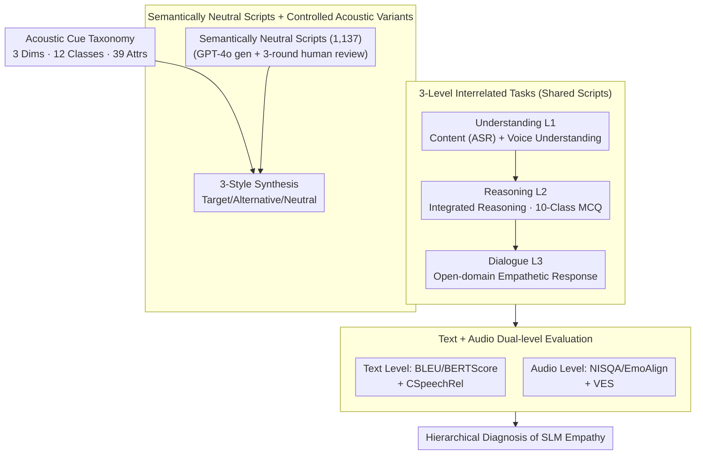

# EchoMind: An Interrelated Multi-level Benchmark for Evaluating Empathetic Speech Language Models

**Conference**: ICLR2026  
**arXiv**: [2510.22758](https://arxiv.org/abs/2510.22758)  
**Code**: [Project Homepage](https://hlt-cuhksz.github.io/EchoMind/)  
**Area**: Audio & Speech  
**Keywords**: Speech Language Model, Empathetic Dialogue, benchmark, Vocal Cue, Evaluation

## TL;DR

EchoMind is proposed as the first interrelated multi-level benchmark for empathetic dialogue. It systematically evaluates the ability of Speech Language Models (SLMs) to perceive non-verbal acoustic cues and generate empathetic responses through a cognitive workflow of "Understanding → Reasoning → Dialogue."

## Background & Motivation

Speech Language Models (SLMs) have made significant progress in spoken language understanding, seeing wide application in scenarios like intelligent assistants and emotional companionship. However, effective dialogue requires understanding not just "what was said," but also "who is speaking," "how it is said," and "in what context." Non-verbal acoustic cues (prosody, emotion, physiological signals, ambient sound, etc.) are crucial for natural and emotionally resonant communication.

Prior benchmarks suffer from three main limitations: (1) They typically evaluate a single capability (understanding, reasoning, or dialogue) without joint evaluation across capabilities; (2) There is a lack of shared context between tasks, making it impossible to study hierarchical dependencies; (3) Empathy is rarely evaluated directly, hindering the development of emotional intelligence in SLMs.

## Core Problem

Can current SLMs truly perceive non-lexical acoustic cues in speech (such as prosody, emotion, and ambient sounds) and provide empathetic responses consistent with the emotional state and context?

## Method

### Overall Architecture

EchoMind is an empathetic speech evaluation benchmark built around the "Understanding → Reasoning → Dialogue" cognitive process. The data pipeline is divided into three stages: "Data Construction — Task Execution — Evaluation." During data construction, a set of semantically neutral scripts is prepared without any emotional or contextual prompts. These scripts are then synthesized into multiple acoustic variants using an acoustic cue taxonomy to isolate "how it is said" from "what was said." During task execution, all acoustic variants are fed into three hierarchical tasks (Understanding → Reasoning → Dialogue) that share the same scripts to analyze inter-level dependencies. Finally, scoring is performed at both text and audio levels to assess whether the response content and the voice itself are empathetic, providing a hierarchical diagnosis of the model's empathetic capabilities.

### Key Designs

**1. Acoustic Cue Taxonomy: An Enumerable Coordinate System for "Non-verbal Information"**

A challenge in empathetic dialogue is that emotion and context are often hidden in non-lexical sounds. EchoMind structures acoustic cues into 3 coarse-grained dimensions, 12 fine-grained categories, and 39 specific attributes. Speaker information includes gender and age; paralinguistic information is the most diverse, covering physiological states (hoarseness, breathiness, vocal fatigue, sobbing), 6 emotions, volume (shouting/whispering), speaking rate, and non-verbal expressions (laughing, yawning, etc.); environmental information covers weather, locations, background voices, sudden events (alarms, horns), and other sounds like music or barking. This taxonomy serves as the "coordinate system" for synthesis, allowing for the measurement of which acoustic attributes a model is sensitive to or "deaf" to.

**2. Semantically Neutral Scripts + Controlled Acoustic Variants: Isolating Acoustic Contribution**

If scripts contain emotional words or contextual hints, models might guess correctly based on text without actually "hearing" the tone. EchoMind deliberately uses semantically neutral scripts—devoid of explicit emotional or contextual cues. Each script is presented in three variants: Target, Alternative, and Neutral. Since the text remains constant while only the acoustic dimension changes, any performance variance must be attributed to the model's perception of sound. Following three rounds of human review of GPT-4o outputs, 1,137 high-quality scripts were retained. Audio synthesis utilized a combination of Doubao TTS, YouTube voice cloning, and GPT-4o-mini-TTS, with AudioCaps background sounds mixed in to approach real-world scenarios.

**3. Three-Level Interrelated Tasks: Shared Context and Dependency Analysis**

Empathy is a chain of "hearing clearly, reasoning through, and responding appropriately." EchoMind designs three progressive tasks that share the same scripts. The Understanding level (Level 1) includes content understanding (ASR under noise) and voice understanding (MCQs on acoustic cues). The Reasoning level (Level 2) requires integrated higher-order judgments, categorized into 10 MCQ tasks such as personalized recommendation matching and antecedent event inference. The Dialogue level (Level 3) involves open-domain response generation to test if the model produces coherent, socially appropriate, and empathetic responses. The shared context allows for direct analysis of how failures in understanding impact reasoning and dialogue.

**4. Text + Audio Dual-level Evaluation: Evaluating Content and Voice Empathy**

Empathy is reflected both in what is said and how it is said. The text level uses objective metrics (BLEU, ROUGE-L, METEOR, BERTScore) and subjective scoring by GPT-4o on a 5-point scale, including Context Fitting (CCtxFit), Response Naturalness (CRespNat), Colloquiality (CColloqDeg), and Speech Relevance (CSpeechRel). CSpeechRel specifically measures if the response utilizes the acoustic cues from the input. The audio level uses NISQA/UTMOS for quality and EmoAlign for emotional alignment, while Gemini-2.5-Pro provides a Vocal Empathy Score (VES). A human-recorded version (EchoMind-Human) is also provided to compare the difficulty gap between real and synthetic speech.

### Mechanism Example

Consider the semantically neutral line: "You came back quite early today." It is synthesized as a Target variant with a sobbing, breathy tone (Level 0). In the Understanding level, the model must transcribe the words (Content) and identify the "sobbing" and "breathy" attributes (Voice). In the Reasoning level, the model infers the speaker may be distressed and selects an appropriate empathetic response from candidates. In the Dialogue level, the model generates an original response that is both contextually relevant and consolatory in tone. Finally, CSpeechRel checks if the text responded to the sobbing, and VES checks if the response voice itself conveyed empathy—linking "hearing" to "understanding" and then to "responding."

## Key Experimental Results

12 advanced SLMs (1 closed-source GPT-4o-Audio + 11 open-source models) were tested:

| Key Findings | Data |
|---|---|
| Open-source models with Voice Understanding accuracy > 60% | Only 3 (Audio-Flamingo3, Qwen2.5-Omni-7B, etc.) |
| Open-source models with Reasoning accuracy > 60% | Only 1 (DeSTA2.5-Audio) |
| Highest CSpeechRel (Speech cue utilization) | GPT-4o-Audio: 3.42 (No model exceeded 4.0) |
| Highest VES (Vocal Empathy Score) | GPT-4o-Audio: 3.34 |
| Upper bound CSpeechRel Gain | Step-Audio +1.10, GPT-4o-Audio +1.03 |
| Arena win rate | GPT-4o-Audio 42% > Step-Audio 34% > Qwen2.5-Omni-7B 28% |
| Human Recording vs. TTS | Human speech was more challenging across all levels; Dialogue level had the largest gap |

Key Insights (RQ):
1.  **Prompt Sensitivity**: 7/12 models achieved the highest CSpeechRel with augmented prompts, yet some performed better without prompts, exposing instruction-following weaknesses.
2.  **Voice Source Impact**: Human recordings are harder to process than TTS due to real-world acoustic variability and prosodic nuances.
3.  **Empathetic Bound**: Providing ideal acoustic information improved all models, but a significant gap to perfection remained.

## Highlights

-   **First Interrelated Multi-level Evaluation**: Hierarchical design (Understanding → Reasoning → Dialogue) with shared scripts allows for cross-layer correlation analysis, unique among benchmarks.
-   **Semantically Neutral Design**: Scripts exclude emotional words to strictly isolate the contribution of acoustic cues to model perception.
-   **Comprehensive Coverage**: 39 acoustic attributes across speaker, paralinguistic, and environmental dimensions.
-   **Dual-level Evaluation**: Evaluates empathy in both content and voice, combining objective metrics with Model-as-judge and human evaluations.
-   **Identifying Bottlenecks**: No model exceeded a score of 4 in CSpeechRel, highlighting a systemic weakness in SLMs' utilization of acoustic cues.

## Limitations & Future Work

-   Dialogue scripts are LLM-generated; while human-reviewed, they may still contain biases. Future work could include real human conversations.
-   Most audio is synthetic; the human version is limited in scale (491 items), lacking total real-world coverage.
-   Evaluation focuses on single-turn dialogue, not the maintenance of empathy over multi-turn interactions.
-   Heavy reliance on GPT-4o for scoring (Model-as-judge), which shows lower consistency (Spearman 0.64) on nuanced dimensions like CSpeechRel.
-   Current focus is exclusively on English.

## Related Work & Insights

Comparison with existing benchmarks:
-   **SD-Eval / VoxDialog / EChat-eval**: Evaluate dialogue only; lack understanding/reasoning and inter-task correlation.
-   **AIR-Bench / SAKURA / MMAU**: Evaluate understanding or reasoning only; lack dialogue components.
-   **URO-Bench**: Covers all three levels but lack correlation between tasks (Corr. = ✗) and only supports single expression styles.
-   **Ours (EchoMind)**: The only benchmark satisfying multi-level tasks, inter-task correlation (Corr. = ✓), multiple expression styles (M), and environmental sound support.

## Rating

-   Novelty: ⭐⭐⭐⭐ — First interrelated empathetic benchmark; clever use of neutral scripts and controlled variants.
-   Experimental Thoroughness: ⭐⭐⭐⭐⭐ — Comprehensive testing of 12 models, multi-dimensional evaluation, and deep analysis.
-   Writing Quality: ⭐⭐⭐⭐ — Clear structure and rich visualizations.
-   Value: ⭐⭐⭐⭐ — Identifies systemic bottlenecks in SLM acoustic perception, providing clear direction for the community.

<!-- RELATED:START -->

## Related Papers

- [\[ICLR 2026\] TTSDS2: Resources and Benchmark for Evaluating Human-Quality Text to Speech Systems](ttsds2_resources_and_benchmark_for_evaluating_human-quality_text_to_speech_syste.md)
- [\[ICML 2026\] MultiBreak: A Scalable and Diverse Multi-turn Jailbreak Benchmark for Evaluating LLM Safety](../../ICML2026/audio_speech/multibreak_a_scalable_and_diverse_multi-turn_jailbreak_benchmark_for_evaluating_.md)
- [\[AAAI 2026\] HPSU: A Benchmark for Human-Level Perception in Real-World Spoken Speech Understanding](../../AAAI2026/audio_speech/hpsu_a_benchmark_for_human-level_perception_in_real-world_spoken_speech_understa.md)
- [\[ICLR 2026\] MMSU: A Massive Multi-task Spoken Language Understanding and Reasoning Benchmark](mmsu_a_massive_multi-task_spoken_language_understanding_and_reasoning_benchmark.md)
- [\[ICLR 2026\] ParaS2S: Benchmarking and Aligning Spoken Language Models for Paralinguistic-Aware Speech-to-Speech Interaction](paras2s_benchmarking_and_aligning_spoken_language_models_for_paralinguistic-awar.md)

<!-- RELATED:END -->
