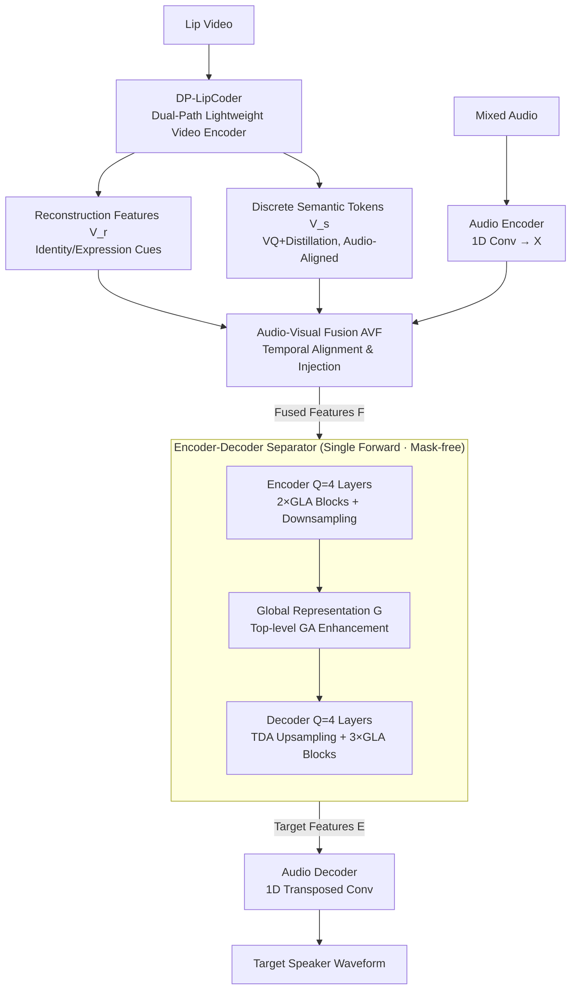

# Efficient Audio-Visual Speech Separation with Discrete Lip Semantics and Multi-Scale Global-Local Attention

**Conference**: ICLR 2026  
**arXiv**: [2509.23610](https://arxiv.org/abs/2509.23610)  
**Code**: Available ([https://cslikai.cn/Dolphin](https://cslikai.cn/Dolphin))  
**Area**: Audio & Speech  
**Keywords**: Audio-Visual Speech Separation, Discrete Lip Semantics, Vector Quantization, Global-Local Attention, Lightweight

## TL;DR

This paper proposes the Dolphin model, which maps lip movements into discrete semantic tokens using a dual-path lightweight video encoder (DP-LipCoder) and designs a Global-Local Attention (GLA) separator. It surpasses SOTA on three benchmarks while reducing parameters by 50%+, MACs by 2.4×, and accelerating GPU inference by 6×.

## Background & Motivation

Audio-Visual Speech Separation (AVSS) utilizes visual cues (lip movements) to extract target speaker speech from noisy mixtures. Existing methods face two key challenges:

**Path Dependency Dilemma of Video Encoders**: Large-scale pre-trained video backbones (e.g., 3D ResNet-18) have strong semantic alignment but extremely high computational costs; direct compression leads to severe degradation in semantic representation; designing lightweight encoders from scratch often only extracts shallow pixel-level features.

**Efficiency-Quality Trade-off in Separators**: High-performance methods (e.g., AV-Mossformer2) have massive parameters unsuitable for deployment; lightweight solutions (RTFSNet, AVLiT) rely on multiple iterations, resulting in high inference latency.

## Method

### Overall Architecture

Dolphin aims to lighten the two most computationally intensive components of AVSS—the video encoder and the separator—without sacrificing separation quality. The pipeline operates as follows: Lip video enters the DP-LipCoder (a lightweight dual-path video encoder), which simultaneously outputs reconstruction features $\mathbf{V}_r$ (preserving speaker identity/expression) and discrete semantic tokens $\mathbf{V}_s$ (aligned with audio). Mixed audio is processed by a 1D convolutional audio encoder into $\mathbf{X} \in \mathbb{R}^{N_a \times T_a}$. The two visual paths and the audio are aligned and injected in the Audio-Visual Fusion (AVF) module to form fused features $\mathbf{F}$, which are fed into a TDANet-based encoder-decoder separator. Each layer embeds GLA blocks to perform simultaneous global long-range and local detail modeling, outputting target speaker features $\mathbf{E}$. Finally, a 1D transposed convolutional audio decoder restores $\mathbf{E}$ directly into the target speaker's time-domain waveform.

### Key Designs

**1. DP-LipCoder: Compressing Lip Video into Discrete Semantic Tokens without Losing Speaker Cues**

This addresses the path dependency dilemma of video encoders. Dolphin adapts the architecture of the MagVIT video generation network to build a dual-path autoencoder where each path handles a specific task. The reconstruction path consists of cascaded 3D residual blocks, spatial attention blocks, and alternating spatial downsampling, responsible for extracting compressed visual features $\mathbf{V}_r$ to retain identity and expression. The semantic path is an encoder with the same structure but non-shared parameters, followed by a **Vector Quantization (VQ) module**. Knowledge distillation from AV-HuBERT is used to guide this path to map continuous lip video into discrete semantic tokens $\mathbf{V}_s$ aligned with audio. The decoder reconstructs the video by summing the outputs of both paths, constraining both paths during training. Three losses are jointly optimized:

$$\mathcal{L} = \mathcal{L}_{\text{commit}} + \mathcal{L}_{\text{distill}} + \mathcal{L}_{\text{recon}}$$

| Loss | Function |
|------|------|
| $\mathcal{L}_{\text{recon}}$ | Reconstruction loss, driving the reconstruction path to capture speaker visual cues. |
| $\mathcal{L}_{\text{distill}}$ | AV-HuBERT teacher distillation, guiding the semantic path to extract audio-aligned features. |
| $\mathcal{L}_{\text{commit}}$ | VQ commitment loss, constraining encoder output consistency with the codebook. |

A key efficiency trick: during AVSS inference, only the encoder and VQ module are run; the decoder is used only during training and discarded during inference. Compared to 3D ResNet-18, parameters are reduced by 93% (0.78M vs 11.19M) and MACs by 70%, while SI-SNRi only drops by 0.2 dB—the discriminative power of discrete semantics nearly compensates for the compression cost.

**2. Audio-Visual Fusion Module: Aligning Visual Features Temporally to Audio**

The visual features from DP-LipCoder must be aligned with audio. The AVF module utilizes two mechanisms: video-guided gated fusion $\mathcal{F}_1$ and attention-based cross-feature space fusion $\mathcal{F}_2$. They fuse $\mathbf{V}_r, \mathbf{V}_s$ with audio features $\mathbf{X}$ into $\mathbf{F} \in \mathbb{R}^{N_a \times T_a}$. Since the separator operates in the time domain, fusion only requires upsampling visual features along the temporal dimension to align with audio, avoiding frequency-axis processing required by frequency-domain solutions.

**3. Encoder-Decoder Separator: Single Forward Pass, Direct Target Feature Output**

To eliminate the latency caused by multiple iterations in lightweight schemes, Dolphin uses a single-pass encoder-decoder (using TDANet as a backbone but removing its original iterations). The encoder has $Q=4$ layers, each with 2 GLA blocks and a downsampling layer to extract multi-scale features. Features at all scales are downsampled to the lowest resolution and summed to produce a global representation $\mathcal{G}$, further enhanced by a top-level GA block. The decoder also has $Q=4$ layers, with TDA upsampling and 3 GLA blocks per layer. It **directly outputs target speaker features** $\mathbf{E}$ rather than predicting a mask, fundamentally avoiding distortions introduced by mask multiplication.

**4. GLA Block: Global Attention for Long-range, Local Attention for Details**

Each layer of the separator uses GLA blocks to capture information at two scales. Both branches are optimized for efficiency. The global branch (GA block) uses Coarse-grained Self-Attention (CSA): the sequence is downsampled to $T_a/2^Q$ before performing MHSA and then upsampled back, reducing complexity to $1/2^{2Q}$, followed by an FFN with DWConv1D (kernel=3). The local branch (LA block) uses **Heat Diffusion Attention (HDA)**, which leverages the heat diffusion equation as a physical prior for learnable multi-scale filtering. Features are transformed to the frequency domain using DCT, and an exponential decay filter is applied:

$$\tilde{\mathbf{A}}(p) = \mathbf{A}(p) \cdot \exp(-\mathbf{k}_c (p\pi/T_a)^2)$$

where $\mathbf{k}_c \in \mathbb{R}^{N_a}$ is a per-channel adaptive learnable diffusion coefficient. It is then transformed back to the time domain via IDCT and gated as $\breve{\mathbf{F}}_0 = \mathcal{P}(\hat{\mathbf{x}} \odot \text{SiLU}(\mathbf{z}))$. This models local features without the limited receptive field of convolutional kernels, using fewer parameters than large-kernel Conv1D while providing finer filtering.

### Loss & Training

- Separator Optimization Goal: SI-SNR
- Adam optimizer, lr=1e-3, halved after 15 epochs of validation loss plateau, early stopping after 30 epochs.
- L2 gradient clipping threshold 5, batch=48, 8× RTX 5090 GPUs.
- DP-LipCoder parameters are frozen; only the separation network is trained.

## Key Experimental Results

### Main Results

**Table 1: Comparison of Pre-trained Video Encoders (LRS2)**

| Method | SI-SNRi(dB)↑ | SDRi(dB)↑ | PESQ↑ | Params(MB)↓ | MACs(G/s)↓ |
|------|-------------|-----------|-------|-------------|------------|
| 3D ResNet-18 | 17.0 | 17.1 | 3.30 | 11.19 | 7.95 |
| AE | 15.2 | 15.4 | 3.15 | 0.05 | 0.17 |
| LipCoder | 16.3 | 16.4 | 3.24 | 0.65 | 5.33 |
| **DP-LipCoder** | **16.8** | **16.9** | **3.29** | **0.78** | **2.38** |

**Table 2: SOTA Comparison of AVSS Methods (Three Datasets)**

| Method | LRS2 SI-SNRi | LRS3 SI-SNRi | VoxCeleb2 SI-SNRi |
|------|-------------|-------------|-------------------|
| IIANet | 16.0 | 18.3 | 13.6 |
| AV-Mossformer2 | 15.1 | 17.7 | 14.0 |
| **Ours** | **16.8** | **18.8** | **14.6** |

**Table 3: Efficiency Comparison (including Video Encoder)**

| Method | Params(M)↓ | MACs(G)↓ | GPU Latency(ms)↓ |
|------|-----------|---------|-------------|
| IIANet | 15.01 | 26.51 | 142.30 |
| AV-Mossformer2 | 68.52 | 124.46 | 62.30 |
| **Ours** | **7.00** | **10.89** | **33.24** |

### Ablation Study

**GLA Component Ablation (LRS2)**:

| GA | LA | SI-SNRi↑ | Params(MB)↓ |
|----|---|---------|------------|
| ✗ | ✗ | 10.4 | 2.04 |
| ✓ | ✗ | 15.9 | 5.23 |
| ✗ | ✓ | 15.6 | 3.81 |
| ✓ | ✓ | **16.8** | 7.00 |

HDA Layer vs. Conv1D: HDA achieves 16.9 dB SI-SNRi, outperforming Conv1D's 16.5 dB with fewer parameters (7.00M vs 7.57M).

### Key Findings

1. VQ discrete encoding improves SI-SNRi by at least 1.0 dB over continuous autoencoders; the VQ module contributes approximately 0.5 dB.
2. DP-LipCoder generalizes to other AVSS models: replacing video encoders reduces parameters by 10M+ with negligible performance loss.
3. Single iteration + GLA outperforms multi-iteration schemes.
4. Compared to SOTA IIANet: Params -53%, MACs -59%, GPU inference 4.3× faster.

## Highlights & Insights

- **Superiority of Discrete Representation**: Mapping video streams to a "visual vocabulary" is more compact and discriminative than continuous representations—offering broad inspiration for multimodal system design.
- **Heat Diffusion Physical Prior**: Introducing the heat equation into local attention allows for fine-grained local feature modeling with only learnable scaling/gating parameters, reducing overfitting risks.
- **Dual-Path Complementarity**: The reconstruction path preserves identity/expression auxiliary info, while the semantic path extracts audio-aligned info.

## Limitations & Future Work

1. Reliability depends on clean, synchronized lip video; lack of robustness to large head poses, occlusions, or extreme lighting.
2. Deployment on extremely resource-constrained devices remains challenging; quantization/pruning could be explored.
3. Discrete tokens may lose fine-grained phonetic cues; hierarchical codebooks or discrete-continuous hybrid representations could be investigated.
4. Validated only on English datasets; cross-lingual generalization needs exploration.

## Related Work & Insights

- **TDANet** provides the base separation architecture; this work adds GLA blocks and removes iterations.
- **AV-HuBERT** serves as the teacher model for semantic distillation.
- **MagVIT** video generation architecture is creatively adapted into a video encoder.
- Insight: Physical priors (Heat Diffusion) can be injected into attention mechanisms as inductive biases.

## Rating

- Novelty: ⭐⭐⭐⭐ — Dual-path discrete encoding + heat diffusion local attention.
- Technical Depth: ⭐⭐⭐⭐ — Well-designed modules with comprehensive ablation.
- Experimental Thoroughness: ⭐⭐⭐⭐⭐ — Three datasets + multi-dimensional efficiency comparison + ablation.
- Value: ⭐⭐⭐⭐⭐ — Significant efficiency gains with clear deployment scenarios.

<!-- RELATED:START -->

## Related Papers

- [\[ICLR 2026\] Token-based Audio Inpainting via Discrete Diffusion](token-based_audio_inpainting_via_discrete_diffusion.md)
- [\[ICLR 2026\] Knowing When to Quit: Probabilistic Early Exits for Speech Separation Networks](knowing_when_to_quit_probabilistic_early_exits_for_speech_separation_networks.md)
- [\[ICML 2026\] A Semantically Consistent Dataset for Data-Efficient Query-Based Universal Sound Separation](../../ICML2026/audio_speech/a_semantically_consistent_dataset_for_data-efficient_query-based_universal_sound.md)
- [\[ICLR 2026\] MAPSS: Manifold-Based Assessment of Perceptual Source Separation](mapss_manifold-based_assessment_of_perceptual_source_separation.md)
- [\[ICLR 2026\] Aurelius: Relation Aware Text-to-Audio Generation At Scale](aurelius_relation_aware_text-to-audio_generation_at_scale.md)

<!-- RELATED:END -->
