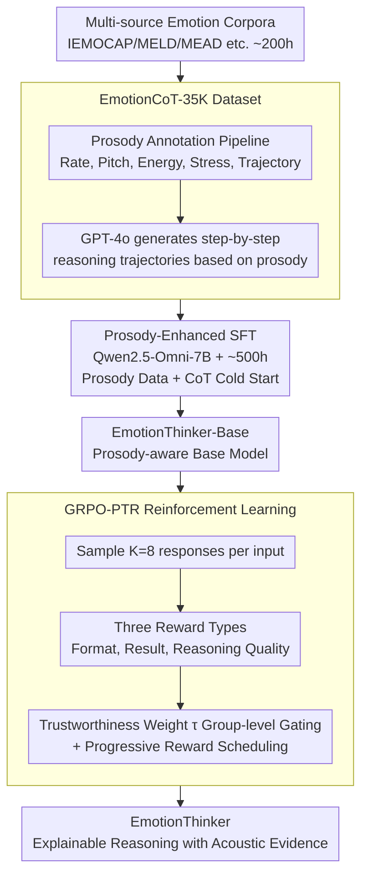

# EmotionThinker: Prosody-Aware Reinforcement Learning for Explainable Speech Emotion Reasoning

**Conference**: ICLR 2026 Oral  
**arXiv**: [2601.15668](https://arxiv.org/abs/2601.15668)  
**Code**: [Available](https://github.com/dingdongwang/EmotionThinker)  
**Area**: Audio and Speech  
**Keywords**: Speech Emotion Recognition, Explainable Reasoning, Reinforcement Learning, Prosody-Aware, Chain-of-Thought

## TL;DR
This work reframes Speech Emotion Recognition (SER) as a deep reasoning problem for the first time, utilizing a prosody-enhanced base model combined with GRPO-PTR (Progressive Trustworthy Reasoning) reinforcement learning to generate explainable emotional reasoning grounded in acoustic evidence.

## Background & Motivation
- Current SpeechLLMs still treat emotion recognition as a simple classification task, providing labels without explaining "why."
- Existing SFT-based descriptive methods remain at the level of acoustic feature description, lacking a **causal reasoning chain** from acoustic observations to emotional judgments.
- Three major challenges:
  1. Lack of high-quality reasoning datasets, as existing emotion corpora lack fine-grained acoustic annotations.
  2. Weak prosody perception in SpeechLLMs (insufficient perception of pitch, energy, speaking rate, and stress).
  3. Standard RL relies solely on rule-based rewards (result accuracy), failing to supervise the quality of open-ended reasoning.

## Method

### Overall Architecture
EmotionThinker transforms SER from "labeling" to "generating reasoning chains" through a three-step process: first, an automated annotation pipeline creates the prosody-aware CoT dataset EmotionCoT-35K; second, prosody-enhanced SFT is performed on Qwen2.5-Omni-7B to obtain EmotionThinker-Base, which can perceive acoustic details; finally, GRPO-PTR reinforcement learning is used to progressively introduce trustworthy reasoning rewards to refine the reasoning quality. These stages progress naturally—data provides causal paradigms, SFT enables prosodic "hearing," and RL incorporates reasoning quality into the optimized supervisory signal.

### Key Designs

**1. EmotionCoT-35K Dataset: Translating Acoustic Cues into Reasoning Trajectories**

To learn the causal chain (e.g., "judged as anger due to sharp pitch rise and accelerated rate"), the model requires data demonstrating acoustic observations. The authors aggregated ~200 hours of speech from IEMOCAP, MELD, Expresso, MEAD, and EARS into 35K audio-reasoning pairs covering 9 emotions. An automated pipeline decomposes prosody: standard tools extract low-level features (rate, pitch, energy), WhiStress locates stressed words from transcriptions, and frame-level pitch/energy trajectories are smoothed via Savitzky-Golay and classified into coarse styles and fine-grained patterns. These annotations are fed to GPT-4o to generate reasoning trajectories, creating the first prosody-aware CoT dataset.

**2. Prosody-Enhanced SFT: Enabling Acoustic Perception**

SpeechLLMs often struggle with para-linguistic information like pitch and stress. The authors perform SFT with ~500 hours of prosody-enhanced data across four tasks: word-level stress perception, prosodic attribute classification, comparative prosody enhancement (ranking modified versions of the same sentence), and 5K EmotionCoT samples for cold-start reasoning. The comparative task is particularly effective, forcing the model to distinguish subtle differences through relative ranking. This improved base model performance on prosody perception tests from 25%–30% to 60%–75%.

**3. GRPO-PTR: Supervising Both Correctness and Quality**

Standard RL only rewards result accuracy, failing to regulate open-ended reasoning quality. GRPO-PTR (Progressive Trustworthy Reasoning) addresses this with a progressive reward mechanism. For each input, $K=8$ responses are sampled and scored on: Format Reward $R_f$ (binary for XML tags), Outcome Reward $R_o$ (binary for label accuracy), and Reasoning Quality Reward $R_t$ (provided by a 3B reward model fine-tuned on 101.4K samples across four dimensions).

To prevent "reward hacking" (where a model generates fancy but incorrect reasoning), a **trustworthiness weight $\tau$** is introduced for group-level gating. Responses are grouped by correctness; if the reasoning score of the incorrect group exceeds the correct group, $\tau$ decays exponentially to penalize the contradiction. Finally, **Progressive Scheduling** is used: early training focuses on $R_o + R_f$ until accuracy stabilizes (~50%), after which $R_t$ is introduced to ensure stability.

### Loss & Training
The final reward is weighted as $R_i = 0.3\,R_f + 1.0\,R_o + 0.5\,\tau\,R_t$, where $\tau$ applies only to the reasoning term. RL is performed on Qwen2.5-Omni-7B for 3000 steps with a KL coefficient of 0.04 and a learning rate of 1e-6.

## Key Experimental Results

### Main Results

| Model | IEMOCAP | MELD | RAVDESS | SAVEE | Avg Acc | Reasoning Quality Avg |
|------|---------|------|---------|-------|---------|------------|
| Kimi-Audio | 57.72 | 59.13 | 61.07 | 55.21 | 58.83 | 2.72 |
| BLSP-Emo | 76.00 | 57.30 | 72.00 | 63.73 | 65.41 | 2.73 |
| Qwen2.5-Omni-7B | 45.70 | 54.64 | 64.77 | 52.49 | 50.83 | 2.87 |
| MiniCPM-O | 35.54 | 52.78 | 40.93 | 35.47 | 43.60 | 3.01 |
| **Ours** | **77.68** | **59.71** | **71.56** | **73.96** | **68.89** | **3.98** |

EmotionThinker achieves the highest emotion accuracy (68.89%) and significantly leads in reasoning quality (3.98).

| Prosody Perception Test | Pitch | Rate | Energy | Intonation | Stress |
|------------|------|------|------|------|------|
| Qwen2.5-Omni-7B | 25.71 | 29.94 | 27.67 | 25.83 | 30.24 |
| EmotionThinker-Base | **75.11** | **68.70** | **69.42** | **60.25** | **71.50** |

### Ablation Study

| Variant | SER Acc | Reasoning Quality |
|------|---------|---------|
| Qwen2.5-Omni-7B (Baseline 1) | 50.83 | 2.87 |
| EmotionThinker-Base (Baseline 2) | 52.63 | 3.41 |
| SFT (V1) | 53.91 | 3.78 |
| GRPO (V2) | 62.91 | 3.45 |
| GRPO-PTR w/o Trained RM (V3) | 66.67 | 3.36 |
| GRPO-PTR w/o Trust Weight (V4) | 67.71 | 3.74 |
| GRPO-PTR w/o Progressive (V5) | 62.80 | 3.76 |
| **GRPO-PTR Full (V6)** | **68.89** | **3.98** |

### Key Findings
1. SFT improves reasoning quality but has limited accuracy gains; GRPO boosts accuracy but yields mediocre reasoning; GRPO-PTR excels in both.
2. Training the reward model is crucial to avoid noise (V3 vs V6).
3. Removing the trustworthiness weight (V4) hurts reasoning quality, showing its role in preventing logical contradictions.
4. Removing progressive scheduling (V5) causes accuracy to drop significantly, highlighting stability challenges in multi-signal RL.

## Highlights & Insights
- **First** to reframe SER as an RL-driven deep reasoning problem.
- Prosody-enhanced SFT is a critical prerequisite: reasoning cannot be grounded in acoustic reality without perceptual capabilities.
- The weight $\tau$ in GRPO-PTR is elegantly designed to align reasoning quality with result correctness.
- The four-dimensional reasoning assessment framework is transferable to other multimodal reasoning tasks.

## Limitations & Future Work
- The reward model 3B size may introduce evaluation bias.
- Nine emotion labels may lack fine-grained nuance (e.g., sarcasm).
- Validation is limited to English; cross-lingual generalization remains unknown.
- Reasoning generation increases latency, limiting real-time applications.

## Related Work & Insights
- Aligns with the DeepSeek-R1 philosophy (RL-incentivized reasoning) but extends it to speech with the PTR strategy.
- Moves beyond descriptive methods like SECap by establishing causal chains from acoustics to inference.
- Prosody-enhanced SFT strategies (especially comparative tasks) are applicable to other speech understanding tasks.

## Rating
- Novelty: 5/5
- Experimental Thoroughness: 4/5
- Writing Quality: 4/5
- Value: 5/5

<!-- RELATED:START -->

## Related Papers

- [\[ACL 2026\] Privacy-preserving Prosody Representation Learning](../../ACL2026/audio_speech/privacy-preserving_prosody_representation_learning.md)
- [\[ICLR 2026\] AVERE: Improving Audiovisual Emotion Reasoning with Preference Optimization](avere_improving_audiovisual_emotion_reasoning_with_preference_optimization.md)
- [\[CVPR 2026\] SAVE: Speech-Aware Video Representation Learning for Video-Text Retrieval](../../CVPR2026/audio_speech/save_speech-aware_video_representation_learning_for_video-text_retrieval.md)
- [\[ICLR 2026\] Learnable Fractional Superlets with a Spectro-Temporal Emotion Encoder for Speech Emotion Recognition](learnable_fractional_superlets_with_a_spectro-temporal_emotion_encoder_for_speec.md)
- [\[ICLR 2026\] OWL: Geometry-Aware Spatial Reasoning for Audio Large Language Models](owl_geometry-aware_spatial_reasoning_for_audio_large_language_models.md)

<!-- RELATED:END -->
