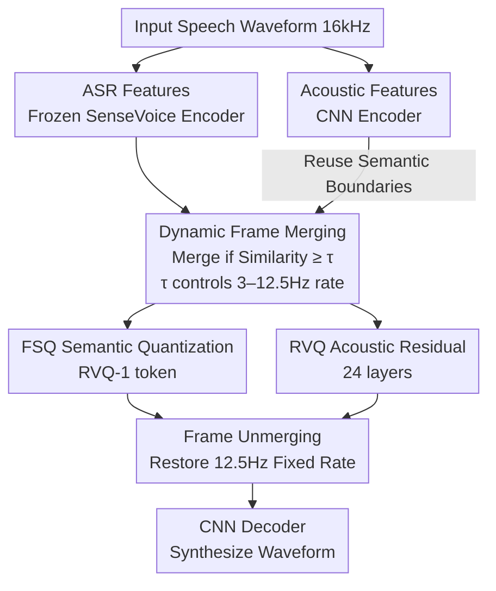

# FlexiCodec: A Dynamic Neural Audio Codec for Low Frame Rates

**Conference**: ICLR 2026  
**arXiv**: [2510.00981](https://arxiv.org/abs/2510.00981)  
**Code**: [amphionteam/flexicodec](https://github.com/amphionteam/flexicodec)  
**Area**: Speech & Audio  
**Keywords**: Neural Audio Codec, Dynamic Frame Rate, Low Frame Rate, Speech Tokenization, TTS

## TL;DR

FlexiCodec is proposed, implementing a high-quality speech codec at ultra-low frame rates (3–12.5Hz) through an ASR-feature-guided dynamic frame merging strategy, while maintaining superior semantic information retention.

## Background & Motivation

**Background**: Neural audio codecs (e.g., EnCodec, DAC, SpeechTokenizer) serve as fundamental components for speech language models (LLMs), converting speech into discrete tokens for AR LLM paradigms. However, mainstream codecs typically utilize frame rates $\geq$ 50Hz (50+ tokens per second), which significantly mismatches the $\sim$ 4.5Hz frame rate of text.

**Limitations of Prior Work**: High frame rates lead to two issues: (1) quadratic complexity of attention resulting in massive computational overhead; (2) text-speech modality frame rate mismatch reducing LLM performance. Although Mimi and DualCodec reduce rates to 12.5Hz, a gap remains compared to text (~4.5Hz), and research into codecs below 12.5Hz is nearly non-existent.

**Key Challenge**: Directly pushing existing codecs to extremely low rates (<12.5Hz) causes severe semantic loss. Experiments show that when DualCodec is reduced from 12.5Hz to 6.25Hz, the RVQ-1 WER surges from 5.93% to 31.5%. The root causes are: (a) insufficient decoupling of semantic and acoustic information, where limited capacity forces a trade-off; (b) fixed frame rate downsampling loses transient speech details, whereas natural phonemes/syllables occur at dynamic rates.

**Goal**: To maintain semantic integrity and high reconstruction quality at 6.25Hz or lower, while supporting controllable frame rates at inference time.

**Key Insight**: (a) Dynamic frame rates—allocating more frames to information-dense regions and merging frames in sparse regions (silence, long vowels); (b) using ASR features instead of SSL features for more condensed semantic information; (c) supporting 3–12.5Hz continuous controllable rates in a single model.

**Core Idea**: Utilize the cosine similarity of pre-trained ASR features to dynamically merge semantically similar frames, achieving content-adaptive low-frame-rate speech encoding.

## Method

### Overall Architecture

FlexiCodec splits speech into two parallel streams: a "semantic stream" using a frozen ASR encoder to capture content, and an "acoustic stream" using a CNN to capture timbre and waveform. Both are initially aligned at 12.5Hz. The core innovation lies in the dynamic frame merging module, which merges consecutive similar frames based on ASR feature similarity. This allows the frame rate to adaptively decrease to 3–12.5Hz based on content. Subsequently, the semantic stream is quantized via FSQ (RVQ-1), and the acoustic residual via RVQ. During decoding, the dynamic frame sequence is expanded back to a fixed 12.5Hz rate for the CNN decoder to synthesize the waveform.

### Key Designs

**1. ASR Features Replacing SSL: Cleaner RVQ-1 Input**

At low frame rates, information capacity per frame is pushed to the limit. The authors found that traditional SSL features (HuBERT, WavLM), trained for reconstruction, contain redundant acoustic/semantic mixtures. When assigned to RVQ-1, semantic retention is poor. By replacing SSL with the last hidden layer of a frozen SenseVoice-Small (230M) ASR encoder $e_s \in \mathbb{R}^{T \times d}$, which is trained via CTC loss for text prediction, the features become naturally "pure-semantic." This single replacement reduced the DualCodec 6.25Hz RVQ-1 WER from 31.5% to 6.0%.

**2. Dynamic Frame Merging: Content-Adaptive Rates**

Information density in natural speech is non-uniform. FlexiCodec calculates the cosine similarity of adjacent semantic frames $s_t = \cos(e_s[t], e_s[t+1])$. It scans from left to right, merging consecutive segments $[i, j]$ where $\min_{t=i}^{j-1} s_t \geq \tau$ into a single frame by averaging, while recording frame lengths $\ell_k = j - i + 1$. A local windowed attention (window ±8) Transformer then refines the context. The acoustic stream reuses the same boundaries. This merging is deterministic and content-adaptive: the resulting rate correlates strongly with phoneme rate (Pearson $r = 0.775$).

**3. Controllable Inference Rate: Tuning 3–12.5Hz via $\tau$**

The threshold $\tau$ acts as both a training hyperparameter and an inference knob. During training, $\tau \in [0.7, 1.0]$ is randomly sampled. At inference: $\tau = 1.0$ yields no merging (12.5Hz), while lower $\tau$ values result in more aggressive merging and lower frame rates. A single model can adjust between 3–12.5Hz without retraining for specific rates.

**4. FSQ for Semantics, RVQ for Acoustics**

The semantic stream uses Finite Scalar Quantizer (FSQ, $D=5, L=8$, resulting in $8^5 = 32768$ entries) to obtain RVQ-1 tokens. FSQ avoids codebook collapse and handles large codebooks easily. The acoustic residual is encoded using 24 layers of RVQ (4096 entries per layer) to refine details.

### Loss & Training

The total loss is:

$$\mathcal{L} = \mathcal{L}_{\text{recon}} + \lambda_{\text{GAN}} \mathcal{L}_{\text{GAN}} + \lambda_{\text{RVQ}} \mathcal{L}_{\text{RVQ}} + \lambda_{\text{feat}} \mathcal{L}_{\text{feat}}$$

- $\mathcal{L}_{\text{recon}}$: Multi-scale L1 Mel-spectrogram reconstruction loss.
- $\mathcal{L}_{\text{GAN}}$: Adversarial and feature matching losses (MPD + MRSD).
- $\mathcal{L}_{\text{RVQ}}$: Codebook update and commitment losses (FSQ requires no extra loss).
- $\mathcal{L}_{\text{feat}}$: L2 alignment loss between RVQ-1 semantic token embeddings and unquantized features.

Training Strategy:
- Data: Librilight-Large, 54k hours, 16kHz.
- 800k steps, 8×V100 32GB GPUs.
- Quantizer dropout: Randomly select $n \in [1, N]$ RVQ layers.
- Random sampling of $\tau \in [0.7, 1.0]$ per step.
- Maximum merge length $\ell_k = 8$, local attention window ±8.

## Key Experimental Results

### Main Results: Comparison with Open-Source Codecs (Table 5)

| System | Rate (Hz) | Bitrate (kbps) | WER(RVQ1)↓ | WER(RVQ1:8)↓ | PESQ↑ | UTMOS↑ | MCD↓ | SIM↑ |
|------|-----------|---------------|------------|--------------|-------|--------|------|------|
| DAC | 75 | 6.0/8q | 31.2 | 2.27 | 3.77 | 3.62 | 2.34 | 0.90 |
| EnCodec | 75 | 6.0/8q | 5.90 | 2.24 | 3.12 | 3.01 | 2.60 | 0.89 |
| SpeechTokenizer | 50 | 4.0/8q | 5.56 | 2.47 | 3.01 | 3.90 | 3.17 | 0.85 |
| DualCodec | 12.5 | 1.2/8q | 5.93 | 2.26 | 3.29 | 4.18 | 2.81 | 0.85 |
| **Ours @12.5Hz** | 12.5 | 1.3/8q | **2.76** | **2.23** | **3.35** | **4.22** | **2.76** | 0.85 |
| WavTokenizer | 75 | 0.90/1q | 4.57 | 4.57 | 2.86 | 3.98 | 3.51 | 0.68 |
| XCodec2 | 50 | 0.80/1q | 2.80 | 2.80 | 2.77 | 4.08 | 3.65 | 0.82 |
| **Ours @8.3Hz** | 8.3 | 0.85/8q | **2.98** | **2.28** | **3.03** | **4.21** | **3.10** | 0.78 |
| TaDiCodec | 6.25 | 0.15/1q | 4.32 | 4.32 | 1.73 | 4.05 | 9.75 | 0.83 |
| SemantiCodec | 25 | 0.34/1q | 23.8 | 23.8 | 1.89 | 2.93 | 5.92 | 0.40 |
| **Ours @6.25Hz** | 6.25 | 0.64/8q | **4.15** | **2.53** | **2.76** | **4.18** | **3.42** | 0.71 |

Ground Truth WER = 2.1%. FlexiCodec achieves SOTA semantic retention and audio quality across bitrate ranges.

### Ablation Study: Contribution of Dynamic Rates (Tables 3 & 4)

**Semantic Ablation:**

| Config | WER(RVQ1)↓ | Rel. Change | WER(RVQ1:8)↓ | Rel. Change | ASR Probing WER↓ | Rel. Change |
|------|------------|----------|--------------|----------|-----------------|----------|
| Ours @8.3Hz | 2.98 | — | 2.28 | — | 13.0 | — |
| → Remove Dynamic (FFR) | 3.56 | +19% | 2.43 | +6% | 14.5 | +12% |
| Ours @6.25Hz | 4.15 | — | 2.53 | — | 15.6 | — |
| → Remove Dynamic (FFR) | 5.22 | +26% | 2.73 | +8% | 18.8 | +21% |

**Acoustic Ablation:**

| Config | PESQ↑ | MCD↓ | UTMOS↑ | SIM↑ |
|------|-------|------|--------|------|
| Ours @8.3Hz | 3.03 | 3.10 | 4.21 | 0.78 |
| → Remove Dynamic | 3.03 | 3.18 | 4.21 | 0.76 |
| Ours @6.25Hz | 2.76 | 3.42 | 4.18 | 0.71 |
| → Remove Dynamic | 2.76 | 3.47 | 4.18 | 0.70 |

### Key Findings

- **Strong correlation between frame rate and phoneme rate** ($r=0.775$), validating that dynamic rates adaptively allocate more frames to complex content.
- **Dynamic rate gains are more significant at lower rates**: Removing dynamic rates at 6.25Hz degrades RVQ-1 WER by 26% vs. 19% at 8.3Hz.
- **Dynamic rates primarily improve semantic retention** with minimal impact on acoustic metrics (PESQ/UTMOS).
- **Efficiency**: RTF is 0.018 (encoding) and 0.006 (decoding).
- **Downstream TTS**: FlexiCodec-TTS achieves competitive performance while being significantly faster than high-frame-rate baselines.

## Highlights & Insights

1. **Deep Problem Insight**: Precisely identified two root causes of semantic loss at low frame rates—insufficient decoupling and loss of transient details in fixed downsampling.
2. **Elegant Dynamic Rate Design**: Uses ASR feature cosine similarity for frame merging without extra trainable parameters, naturally supporting controllable rates via $\tau$.
3. **Dual Use of ASR Features**: The same ASR features are used for both semantic encoding and guiding merging boundaries, making the design concise and efficient.
4. **Comprehensive Evaluation**: Covers reconstruction, semantic retention, ASR probing, downstream TTS, audio understanding, cross-lingual generalization, and efficiency.
5. **Phoneme Encoding Efficiency**: The finding that each merged frame encodes approximately 2 phonemes provides a quantitative reference for the information theory of low-rate codecs.

## Limitations & Future Work

1. **Degradation at extremely low rates (<4Hz)**: At 3Hz, WER reaches 51.5%, indicating bottlenecks in extreme compression.
2. **Acoustic Quality Constraints**: Dynamic merging mainly improves semantics; acoustic quality remains limited by bitrate.
3. **Cross-lingual Zero-shot Gap**: Models trained on English perform poorly on unseen languages without fine-tuning.
4. **Overhead**: Frame length attributes require an extra 3 bits per frame.
5. **FSQ Scope**: RVQ-rest does not yet utilize FSQ (e.g., rFSQ), which might improve acoustic quantization.
6. **End-to-End Generation**: AR models currently do not generate dynamic frame sequences directly; unmerging is still required.

## Related Work & Insights

- **Vs. DualCodec**: Inherits the dual-stream decoupling but replaces SSL with ASR features and adds dynamic merging to significantly boost semantics.
- **Vs. Token Merging (ToMe)**: Adapts the concept of merging tokens based on pre-trained feature similarity to 1D temporal signals.
- **Vs. TaDiCodec**: TaDiCodec requires text transcripts for 6.25Hz synthesis (TTS-like); FlexiCodec follows the traditional codec paradigm without transcript dependencies.
- **Implications for Speech LLMs**: Reducing frame rates to text-like levels (4.5Hz) can drastically shorten sequences in multimodal LLMs.

## Rating

- **Novelty**: ⭐⭐⭐⭐ — Dynamic frame rate approach is novel and ASR feature reuse is clever, though sub-modules utilize existing concepts.
- **Experimental Thoroughness**: ⭐⭐⭐⭐⭐ — Extremely comprehensive across multiple tasks and baselines.
- **Writing Quality**: ⭐⭐⭐⭐⭐ — Clear logic, strong motivation, and high-quality visualizations.
- **Value**: ⭐⭐⭐⭐ — Provides practical infrastructure for low-rate codecs and speech LLMs.

<!-- RELATED:START -->

## Related Papers

- [\[ACL 2026\] Indic-CodecFake meets SATYAM: Towards Detecting Neural Audio Codec Synthesized Speech Deepfakes in Indic Languages](../../ACL2026/audio_speech/indic-codecfake_meets_satyam_towards_detecting_neural_audio_codec_synthesized_sp.md)
- [\[ACL 2025\] Analyzing and Mitigating Inconsistency in Discrete Audio Tokens for Neural Codec Language Models](../../ACL2025/audio_speech/audio_token_consistency.md)
- [\[ICLR 2026\] Toward Complex-Valued Neural Networks for Waveform Generation](toward_complex-valued_neural_networks_for_waveform_generation.md)
- [\[ICLR 2026\] Gogo: Group-wise Granularity-ordered Codec for Stable and Efficient Speech Generation](gogo_group-wise_granularity-ordered_codec_for_stable_and_efficient_speech_genera.md)
- [\[ICML 2025\] FLAM: Frame-Wise Language-Audio Modeling](../../ICML2025/audio_speech/flam_frame-wise_language-audio_modeling.md)

<!-- RELATED:END -->
