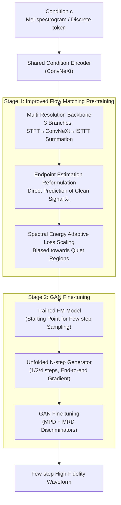

# Flow2GAN: Hybrid Flow Matching and GAN with Multi-Resolution Network for Few-step High-Fidelity Audio Generation

**Conference**: ICLR 2026  
**arXiv**: [2512.23278](https://arxiv.org/abs/2512.23278)  
**Code**: [GitHub](https://github.com/k2-fsa/Flow2GAN)  
**Area**: Diffusion Models/Audio Generation  
**Keywords**: Flow Matching, GAN, Audio Generation, Multi-resolution, Few-step Inference

## TL;DR
The paper proposes Flow2GAN, a two-stage training framework. It first utilizes improved Flow Matching to learn generative capabilities, then applies GAN fine-tuning to achieve few-step (1/2/4 steps) high-fidelity audio generation, incorporating a multi-resolution network architecture to process Fourier coefficients at different time-frequency resolutions.

## Background & Motivation

**Background**: Audio generation primarily relies on two paradigms: GANs (e.g., HiFi-GAN, BigVGAN) and diffusion models (e.g., DiffWave, RFWave). GANs capture multi-granular audio details through carefully designed discriminators for efficient one-step inference; diffusion/Flow Matching models offer stable training and high generation quality but require multi-step sampling.

**Limitations of Prior Work**: GAN training converges slowly and faces mode collapse risks; diffusion methods incur high computational overhead for multi-step inference. Existing acceleration methods (distillation, consistency training, etc.) often sacrifice quality or require expensive retraining.

**Key Challenge**: The specificity of audio signals poses additional challenges for Flow Matching: (a) silence regions/zero-energy bands require precise noise cancellation, making velocity estimation difficult; (b) MSE loss treats all regions uniformly, which does not align with human auditory perception (errors in quiet regions are more perceptually obvious).

**Goal**: To simultaneously obtain the stable training characteristics of FM and the efficient few-step inference capability of GANs, while optimizing the FM training objective specifically for audio characteristics.

**Key Insight**: Reformulating the FM objective from velocity estimation to endpoint estimation to avoid estimation difficulties in empty regions; introducing spectral energy-adaptive loss scaling; and using GAN fine-tuning to accelerate inference.

**Core Idea**: Improved FM for pre-training (endpoint estimation + energy loss scaling) + GAN fine-tuning to achieve few-step high fidelity.

## Method

### Overall Architecture
Flow2GAN aims to combine the stable training of Flow Matching with the efficient few-step inference of GANs by splitting training into two stages. The generative backbone is a multi-branch ConvNeXt network: input conditional representations (Mel-spectrograms or discrete tokens) pass through a shared ConvNeXt condition encoder to extract features, then split into three branches to process complex STFT coefficients at different time-frequency resolutions. Each branch uses ISTFT to restore the waveform, and their sum forms the output. Stage 1 pre-trains this backbone using an audio-modified Flow Matching objective—changing the prediction target from velocity to the clean signal endpoint and scaling the loss adaptively based on spectral energy. Stage 2 unfolds the pre-trained FM model into a few-step (1/2/4 steps) generator and applies MPD/MRD discriminators for adversarial fine-tuning, rapidly refining high-frequency details.

### Key Designs

**1. Multi-Resolution Architecture: Parallel Branches for Different Time-Frequency Resolutions**

The complexity of audio is difficult to characterize with a single STFT resolution; single-resolution ConvNeXt designs like Vocos face information bottlenecks. This paper splits the backbone into three branches. Each branch converts the input signal into complex Fourier coefficients via STFT, feeds the concatenated real and imaginary parts into a ConvNeXt to produce output coefficients, and restores the waveform via ISTFT. The three waveforms are then summed; since STFT/ISTFT are differentiable, the entire network is end-to-end trainable. The low-frame-rate branch uses a larger embedding dimension, while the two high-frame-rate branches use smaller dimensions to balance performance and efficiency. Furthermore, a shared ConvNeXt condition encoder extracts deep features from Mel-spectrograms or token embeddings—during FM inference, this encoder only needs one forward pass, and features are reused across sampling steps. Parallel multi-resolution coverage allows the network to capture audio details more comprehensively than single-resolution approaches.

**2. Endpoint Estimation Reformulation: Predicting the Clean Signal to Avoid Silence Region Issues**

Standard FM requires the network to predict the velocity from noise to data $v_t = x_1 - x_0$. However, massive silence regions and zero-energy bands in audio make velocity estimation tricky—in these areas, the network must learn both $x_1 - x_0$ and $-x_0$, leading to conflicting gradients. This work reformulates the target as the endpoint itself, letting the network directly output $\hat{x}_1 = g_\theta(x_t, t|\mathbf{c})$. The loss is rewritten as:

$$\mathcal{L}'_{\text{FM}} = \mathbb{E}_{t,x_0,x_1}\big[\|g_\theta(x_t,t|\mathbf{c}) - x_1\|^2\big]$$

This ensures the network's task is consistently "reconstructing the clean signal" regardless of the region. During inference, the endpoint estimation is converted back to velocity for Euler steps:

$$x_{t_{i+1}} = x_{t_i} + (t_{i+1}-t_i)\frac{g_\theta(x_{t_i},t_i|\mathbf{c}) - x_{t_i}}{1-t_i}$$

This reformulation also removes the implicit weighting factor $\frac{1}{(1-t)^2}$ in the velocity loss, shifting training focus from large $t$ to smaller $t$ intervals, which is more beneficial for few-step generation.

**3. Spectral Energy Adaptive Loss Scaling: Focus on Perceptually Sensitive Quiet Regions**

Standard MSE treats all time-frequency points equally, but perceptually, errors in quiet regions are more grating than in loud regions. This paper scales the error of each time-frequency point by the inverse of the reference signal's spectral energy:

$$\mathcal{L}''_{\text{FM}} = \mathbb{E}\Big[\sum_{i,j}\Big(\frac{\mathcal{S}(g_\theta - x_1)}{\sqrt{\mathcal{S}(x_1)+\epsilon}}\Big)_{i,j}\Big]$$

Where $\mathcal{S}(x) = \text{LinFB}(|\text{STFT}(x)|^2)$ is the energy spectrum aggregated by a linear filter bank. Regions with low energy (quiet) have smaller denominators and thus higher weights, forcing the model to fit these areas more accurately. Unlike previous work that only scales per-frame, this method differentiates energy across both time and frequency dimensions, providing finer granularity closer to human hearing.

**4. GAN Fine-tuning: Strong Initializations from Pre-trained FM with Adversarial Detail Enhancement**

While the Stage 1 FM model is stable, pure few-step sampling still lacks high-frequency details. This work treats it as a starting point to construct an $N$-step generator $G_\theta^N$, unfolding the multi-step sampling process with end-to-end gradients across forward passes. Adversarial fine-tuning is performed using MPD and MRD discriminators. The training objective is a combination of HingeGAN adversarial loss, L1 feature matching, and multi-scale Mel reconstruction loss. Critically, because FM pre-training provides a superior starting point, the GAN does not need to learn the audio distribution from scratch and can recover high-frequency details within few iterations (e.g., 11k steps). Ablations show that GAN fine-tuning based on standard FM results in significantly lower 1-step quality compared to the improved FM version, indicating this "free lunch" depends on the endpoint estimation and energy scaling foundation.

### Loss & Training
- Stage 1: Improved FM loss (Endpoint estimation + Energy scaling) using ScaledAdam optimizer.
- Stage 2: HingeGAN + L1 feature matching + Multi-scale Mel reconstruction loss (7 window sizes).

## Key Experimental Results

### Main Results
LibriTTS test set (Mel-spectrogram conditioned):

| Model | Params | PESQ↑ | ViSQOL↑ | V/UV F1↑ | Periodicity↓ | FSD↓ |
|------|--------|-------|---------|----------|-------------|------|
| BigVGAN-v2* | 112.4M | 4.379 | 4.971 | 0.978 | 0.055 | 0.014 |
| PeriodWave-Turbo (4 steps) | 70.2M | 4.434 | 4.965 | 0.958 | 0.096 | 0.020 |
| WaveFM (1 step) | 19.5M | 3.540 | 4.894 | 0.943 | 0.124 | 0.098 |
| Flow2GAN (1 step) | 78.9M | 4.189 | 4.957 | 0.975 | 0.063 | 0.028 |
| Flow2GAN (2 steps) | 78.9M | 4.440 | 4.979 | 0.983 | 0.044 | 0.023 |
| Flow2GAN (4 steps) | 78.9M | **4.484** | **4.986** | **0.985** | **0.037** | 0.016 |

### Ablation Study

| Configuration | PESQ↑ | ViSQOL↑ | Description |
|------|-------|---------|------|
| Standard FM + GAN (1 step) | Significant drop | Drop | Standard FM pre-training is insufficient |
| Improved FM (No GAN) 2 steps | Medium | Medium | Improvement exists but lacks details |
| Improved FM + GAN 1 step | 4.189 | 4.957 | Complete solution |
| Improved FM + GAN 4 steps | 4.484 | 4.986 | More steps yield better quality |

### Key Findings
- Improved FM (endpoint estimation + energy scaling) is the critical prerequisite for successful GAN fine-tuning—1-step GAN fine-tuning performance using standard FM is far inferior.
- Spectral energy scaling performs better when applied over both time and frequency dimensions rather than just the time dimension.
- GAN fine-tuning requires only a small number of iterations to achieve rapid quality improvements, acting as an efficient "free lunch."
- The multi-resolution architecture significantly outperforms the single-resolution Vocos.

## Highlights & Insights
- **Simplicity of Endpoint Estimation**: Avoiding velocity estimation difficulties in empty regions through simple target reformulation shows significant impact without complex architectural changes.
- **Complementarity of Two-stage Strategy**: FM provides stable training and strong initialization, while GAN provides detail enhancement and few-step inference. This hybrid approach is generalizable to other generative domains.
- **Perception-aligned Energy Scaling**: Using the inverse of signal energy as a loss weight forces the model to focus on perceptually sensitive quiet regions—simple yet effective.

## Limitations & Future Work
- Model size (78.9M) is significantly larger than Vocos (13.5M); computational efficiency warrants attention.
- The clamp range for energy scaling (0.01-100) is empirical; the optimal range has not been deeply analyzed.
- The selection of the three resolutions lacks systematic ablation; better configurations might exist.
- Validated only on speech and general audio; extension to other domains like music generation is not yet explored.

## Related Work & Insights
- **vs BigVGAN**: BigVGAN with pure GAN training requires large datasets; Flow2GAN’s two-stage strategy approaches BigVGAN's large-data performance on the same dataset.
- **vs PeriodWave-Turbo**: Shares the idea of GAN fine-tuning for FM, but Flow2GAN’s 1-step model based on improved FM significantly outperforms versions based on standard FM.
- **vs WaveFM (Consistency Distillation)**: Flow2GAN's GAN fine-tuning scheme far exceeds consistency distillation in 1-step generation quality.

## Rating
- Novelty: ⭐⭐⭐⭐ Combination of endpoint estimation and energy scaling is tailored for audio; two-stage training is practical.
- Experimental Thoroughness: ⭐⭐⭐⭐⭐ Comprehensive coverage across Mel/Token conditions, TTS vocoder, and ablations.
- Writing Quality: ⭐⭐⭐⭐ Clear structure, thorough comparisons, and online demos available.
- Value: ⭐⭐⭐⭐ Direct practical value for the audio generation field; code is open-source.

<!-- RELATED:START -->

## Related Papers

- [\[ICLR 2026\] TangoFlux: Super-Fast and Faithful Text-to-Audio Generation with Flow Matching and CLAP-Ranked Preference Optimization](tangoflux_super_fast_and_faithful_text_to_audio_generation_with_flow_matching_an.md)
- [\[ACL 2026\] ZipVoice-Dialog: Non-Autoregressive Spoken Dialogue Generation with Flow Matching](../../ACL2026/audio_speech/zipvoice-dialog_non-autoregressive_spoken_dialogue_generation_with_flow_matching.md)
- [\[ICLR 2026\] AlignSep: Temporally-Aligned Video-Queried Sound Separation with Flow Matching](alignsep_temporally-aligned_video-queried_sound_separation_with_flow_matching.md)
- [\[ICML 2025\] BinauralFlow: A Causal and Streamable Approach for High-Quality Binaural Speech Synthesis with Flow Matching Models](../../ICML2025/audio_speech/binauralflow_a_causal_and_streamable_approach_for_high-quality_binaural_speech_s.md)
- [\[NeurIPS 2025\] MGAudio: Model-Guided Dual-Role Alignment for High-Fidelity Open-Domain Video-to-Audio Generation](../../NeurIPS2025/audio_speech/model-guided_dual-role_alignment_for_high-fidelity_open-domain_video-to-audio_ge.md)

<!-- RELATED:END -->
