# From Natural Alignment to Conditional Controllability in Multimodal Dialogue

**Conference**: ICLR 2026  
**OpenReview**: [https://openreview.net/forum?id=fBagP6w6yE](https://openreview.net/forum?id=fBagP6w6yE)  
**Code**: [https://github.com/jessyjinzy/MM-Dia](https://github.com/jessyjinzy/MM-Dia)  
**Area**: Multimodal Dialogue Generation / Speech Synthesis / Datasets & Benchmarks  
**Keywords**: Multimodal Dialogue, Controllable Speech Synthesis, Movie/TV Data Annotation, Cross-modal Style Consistency, MM-DIA  

## TL;DR
Ours proposes MM-DIA, a large-scale expressive multimodal dialogue dataset (360 hours, 54.7k dialogues) automatically constructed from movies and TV series, along with the MM-DIA-BENCH benchmark. "Controllable Multimodal Dialogue Generation (MDG)" is formalized as a unified conditional generation problem covering explicit prompt control and implicit cross-modal control tasks.

## Background & Motivation
**Background**: Dialogue is the most natural form of human interaction, involving text, audio, and visual channels. In the AIGC era, dialogue research is split into two lines: **Semantic Generation** represented by ChatGPT (producing coherent, contextually appropriate responses) and **Modal Mapping** that projects semantics into a single modality (e.g., text-to-speech, text-to-motion). Both lines produce realistic content in isolated modalities.

**Limitations of Prior Work**: Existing methods focus on the realistic transmission of "modality-isolated" content but systematically ignore **cross-modal interaction style** modeling, limiting expressivity and controllability. Specific issues include: (1) Lack of high-quality native multimodal dialogue data—existing datasets have narrow sources and missing modalities; (2) Lack of scalable interaction-level semantic annotation methods—manual category labels like MELD are expensive and fail to capture the continuous nature of human interaction; (3) Lack of systematic benchmarks and evaluation protocols—existing benchmarks focus on local coherence rather than dialogue-level controllability and cross-modal style consistency.

**Key Challenge**: Movie/TV materials are highly expressive (rich emotions, high tension, close to real interaction), but background noise, sudden peaks, and mumbled whispers for sensory effects degrade ASR. Artistic cinematography causes off-screen voices and flashbacks, making dialogue boundary detection and speaker assignment difficult—**the most expressive data is often the hardest to process automatically**.

**Goal**: To build a large-scale expressive multimodal dialogue dataset, introduce a new annotation paradigm, and establish a systematic benchmark to make "controllable multimodal dialogue generation" a researchable and evaluable paradigm.

**Core Idea**: **(1) Automated Movie/TV Data Pipeline**—robustly segment dialogue boundaries and assign speakers using multimodal cues, distilling over 700 hours of movie/TV content into synchronized audio-visual-text dialogues with fine-grained labels; **(2) Dual Complementary Expressivity Paradigms**—using "affective triplets $\langle \text{Relationship, Interaction Mode, Emotional Tone} \rangle$" for structured control and "freestyle descriptions" for per-speaker, per-turn fine-grained natural language control; **(3) Unified MDG Formalization**—modeling controllable multimodal dialogue generation as a conditional distribution $P(Y \mid C, Z)$, distinguishing between explicit and implicit control across three representative tasks.

## Method

### Overall Architecture
The work consists of four blocks: "Data-Annotation-Benchmark-Task". The first half is an end-to-end movie/TV dialogue data pipeline: starting from raw materials, through subtitle alignment, boundary extraction, and multi-level annotation, producing the MM-DIA dataset and the high-expressivity MM-DIA-BENCH. The second half formalizes MDG as conditional generation $P(Y \mid C, Z)$ and instantiates three tasks.

```mermaid
flowchart TD
    A[Raw Movie/TV Assets<br/>200+ Movies / 9 Series / 700h+] --> B[Step 1: Subtitle Sync & Calibration<br/>Multi-source Subtitles + ASR Alignment]
    B --> C[Step 2: Tolerance-Enhanced Scene Detection<br/>VLM Scene Judgment + LLM Boundary Cutting<br/>Dynamic Keyframe Buffer]
    C --> D[Step 3: Sentence-level Annotation<br/>Gemini-2.5-flash Speaker Attribution<br/>Non-verbal Sounds + Speaker Visibility]
    D --> E[Step 4: Dialogue-level Expressivity Annotation<br/>Gemini-2.5-pro<br/>Affective Triplets + Freestyle Descriptions]
    E --> F[MM-DIA 54.7k / 360h]
    F --> G[MM-DIA-BENCH 309 Dual-Speaker High-Expressivity]
    F --> H[MDG Conditional Generation P&#40;Y｜C,Z&#41;]
    H --> T1[Task 1 Explicit Control<br/>Style-Controllable Dialogue TTS]
    G --> T2[Task 2 Implicit Control<br/>Vision-Conditioned Dialogue TTS]
    G --> T3[Task 3 Implicit Control<br/>Audio-Driven Dialogue Video Gen]
```

### Key Designs

**1. Tolerance-Enhanced Dialogue Boundary Extraction.** Dialogue boundaries differ from shot/scene boundaries; a dialogue may span multiple shots. Ours first uses a VLM to judge scene continuity and then uses an LLM to refine dialogue boundaries. A key innovation is the **dynamic keyframe buffer mechanism**: unlike traditional frame-by-frame matching, the buffer allows the model to bridge segments across rapid cuts, flashbacks, or perspective shifts, maintaining dialogue continuity.

**2. Multimodal Speaker Attribution + Sentence-level Fine-grained Annotation.** Conventional tools often fail in movie scenes due to noise (audio-only) or speakers being off-screen (visual-only). Ours uses Gemini-2.5-flash with synchronized audio-visual clips and subtitles. A **Character Bank** of protagonists is provided for name recognition; otherwise, identities are assigned based on visual appearance. Non-verbal sounds are also annotated to capture fine-grained expressive cues.

**3. Dual-Paradigm Modeling of Dialogue Expressivity.** "Dialogue expressivity" is defined as cross-modal interaction consistency beyond semantic content. Two paradigms are proposed: **Affective Triplet Control** $S_{\text{triplet}} = V_R \times V_I \times V_E$ (Relationship, Interaction Mode, Emotional Tone) to model social dynamics and precise scene-level control; and **Freestyle Description Control** to capture style trajectories per turn/speaker. Both together cover structured and natural language control.

**4. Unified MDG Formalization.** Given multimodal context $C = \{C_{txt}, C_{aud}, C_{vis}\}$, the goal is to generate dialogue behavior $Y = \{Y_{txt}, Y_{aud}, Y_{vis}\}$ satisfying semantic coherence, cross-modal alignment, and controllability. This is modeled as $P(Y \mid C, Z)$, where $Z$ is the control variable. Three tasks are instantiated:
*   **Task 1 (Explicit Control)**: Style-Controllable TTS sampling $\hat{A} \sim P(A \mid T, Z_{exp})$ where $Z_{exp} \in S_{triplet} \cup L_{desc}$. Audio is modeled as a **continuous single-pass dialogue flow** rather than turn-wise concatenation.
*   **Task 2 (Implicit Control)**: Vision-Conditioned TTS where style is inferred from keyframes $Z_{imp} = \psi(V_{key})$, generating $\hat{A} \sim P(A \mid T, \psi(V_{key}))$.
*   **Task 3 (Implicit Control)**: Audio-Driven Video Generation $\hat{V} \sim P(V \mid A, T, Z)$.

## Key Experimental Results

### Dataset Statistics

| Metric | MM-DIA | MM-DIA-BENCH |
|---|---|---|
| Total Dialogues | 54,700 | 309 |
| Total Turns | 449,138 | 1,851 |
| Total Duration (h) | 360.26 | 1.69 |
| Avg Speakers / Dialogue | 2.29 | 2.00 |
| Avg Turns / Dialogue | 8.21 | 5.99 |
| Emotion Intensity (Gemini/Human) | 6.76 / 5.22 | 7.81 / 5.74 |
| Emotion Flow Volatility (Gemini/Human) | 5.32 / 4.36 | 7.45 / 5.68 |

MM-DIA is the first dataset focusing on "cross-modal dialogue-level expressivity," providing speaker IDs (S-ID), non-verbal cues (N-V), and speaker visibility (S-V) alongside tri-modal data.

### Main Results: Task 1 Explicit Control (Description Control, Test Set)

| Model | WER↓ | UTMOS↑ | sa-SIM↑ | cp-WER↓ | Human-MOS Qual↑ | Human-MOS IF↑ |
|---|---|---|---|---|---|---|
| Dia-Base | 19.99 | 2.27 | 0.389 | 51.71 | 2.41 | 2.50 |
| Dia-SFT | 29.07 | 1.97 | 0.447 | 57.81 | 2.89 | 2.88 |
| Higgs-Audio-V2-Base | 31.25 | 3.09 | 0.475 | 104.87 | 3.58 | 3.11 |
| **Higgs-Audio-V2-SFT** | **4.45** | **3.28** | 0.447 | **33.77** | **4.44** | **4.13** |

Fine-tuning on MM-DIA reduced Higgs-Audio's WER from 31.3 to 4.5 and cp-WER from 104.8 to 33.8. There is a slight trade-off between controllability and speaker timbre consistency (sa-SIM 0.48 $\rightarrow$ 0.45).

### Implicit Control Experiment: Task 2 Vision-Conditioned TTS (MM-DIA-BENCH)

| Model | WER↓ | sa-SIM↑ | cp-WER↓ | Label-Recall Mean↑ | Gemini IF↑ |
|---|---|---|---|---|---|
| HarmoniVox (End-to-End) | 21.22 | 0.62 | 30.98 | 40.47 | 2.41 |
| Cascaded Gemini + Higgs | 5.78 | 0.499 | 16.27 | 42.33 | 3.35 |
| Cascaded GPT + Higgs | 5.79 | 0.476 | 14.58 | **52.17** | **3.52** |

### Key Findings
*   **Fine-tuning is effective but requires architectural matching**: Higgs-Audio (native condition support) outperformed Dia-1.6B (using adapters), showing that datasets yield the most Gain when paired with backbones designed for conditional generation.
*   **Style consistency degrades under implicit control**: In Task 2, cascaded approaches outperformed end-to-end models. However, subjective scores plummeted compared to Task 1, showing that **cross-modal style consistency collapses** when cues are provided implicitly via vision.
*   **Exposing architectural bottlenecks**: Current models can produce fluent dialogue but fail to maintain interaction-level style alignment across modalities, which is the core challenge identified by MM-DIA-BENCH.

## Highlights & Insights
*   **Decoupling expressivity from semantics**: Ours distinguishes "modality-isolated content" from "cross-modal interaction style," a previously neglected area in dialogue generation.
*   **Achieving human-level annotation with LLMs**: The pipeline overcomes movie-specific audio-visual non-synchronization via tolerance-enhanced detection and character-bank-guided attribution.
*   **Benchmarking "Failure Modes"**: MM-DIA-BENCH is designed to reveal the limitations of existing models in cross-modal style alignment rather than just maximizing scores.
*   **Scalable formalization**: The $P(Y \mid C, Z)$ framework unifies various generation tasks, with explicit or implicit control simply being different sources of $Z$.

## Limitations & Future Work
*   **Heavy reliance on closed-source LLMs**: Key pipeline steps depend on the Gemini-2.5 series, creating reproducibility costs and dependency on third-party APIs.
*   **Copyright constraints**: Data sources from 200+ movies pose practical constraints on large-scale public release.
*   **Infrastructure focus**: Ours provides data and benchmarks rather than a new generative model; achieving robust style consistency under implicit cross-modal conditions remains an open problem.

## Related Work & Insights
*   **Multimodal Dialogue Datasets**: Compared to MELD or MovieBench, MM-DIA provides synchronized 4-way (audio-visual-text-image) data with dialogue-level style annotations.
*   **Multimodal Generation**: While MoonCast and Higgs-Audio capture natural turn-taking, and video generation models like SVD produce high fidelity, fine-grained interaction-level control across audio/visual/text remains a gap that Ours addresses.
*   **Insights**: The affective triplet schema could potentially be transferred to dialogue emotion recognition or social computing tasks.

## Rating
*   **Novelty**: ⭐⭐⭐⭐ — First dataset focusing on cross-modal dialogue expressivity; the affective triplet paradigm is original.
*   **Experimental Thoroughness**: ⭐⭐⭐⭐ — Comprehensive evaluation across three tasks, multiple backbones, and multi-dimensional metrics (Objective, Human, and Gemini-as-Judge).
*   **Writing Quality**: ⭐⭐⭐⭐ — Clear problem decomposition and clean formalization.
*   **Value**: ⭐⭐⭐⭐⭐ — Provides essential infrastructure for controllable multimodal dialogue and identifies key challenges for the community.

<!-- RELATED:START -->

## Related Papers

- [\[ICLR 2026\] FlexiVoice: Enabling Flexible Style Control in Zero-Shot TTS with Natural Language Instructions](flexivoice_enabling_flexible_style_control_in_zero-shot_tts_with_natural_languag.md)
- [\[NeurIPS 2025\] A TRIANGLE Enables Multimodal Alignment Beyond Cosine Similarity](../../NeurIPS2025/audio_speech/a_triangle_enables_multimodal_alignment_beyond_cosine_simila.md)
- [\[ACL 2026\] ImmersiveTTS: Environment-Aware Text-to-Speech with Multimodal Diffusion Transformer and Domain-Specific Representation Alignment](../../ACL2026/audio_speech/immersivetts_environment-aware_text-to-speech_with_multimodal_diffusion_transfor.md)
- [\[ICLR 2026\] When Style Breaks Safety: Defending LLMs Against Superficial Style Alignment](when_style_breaks_safety_defending_llms_against_superficial_style_alignment.md)
- [\[ICLR 2026\] Scalable Multilingual Multimodal Machine Translation with Speech-Text Fusion](scalable_multilingual_multimodal_machine_translation_with_speech-text_fusion.md)

<!-- RELATED:END -->
