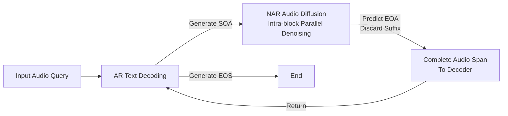

# From Text to Talk: Audio-Language Model Needs Non-Autoregressive Joint Training

**Conference**: ICLR 2026  
**OpenReview**: [https://openreview.net/forum?id=e3XLWHFrnr](https://openreview.net/forum?id=e3XLWHFrnr)  
**Code**: [https://github.com/ai4ed/TtT](https://github.com/ai4ed/TtT)  
**Area**: Audio/Speech, Speech Dialogue Large Model  
**Keywords**: Speech-to-Speech, Audio-Language Model, Discrete Diffusion, Non-Autoregressive Generation, Joint Training  

## TL;DR
Addressing the fundamental mismatch in end-to-end speech dialogue models that use the same autoregressive objective for both text and audio, TtT unifies Autoregressive (AR) text generation with Non-Autoregressive (NAR) discrete diffusion for audio within a single Transformer. Leveraging the "arbitrary-order AR" property of absorbing state diffusion, it establishes a unified training objective and introduces three training strategies to eliminate the training-inference gap, enabling a 3B model to outperform same-scale and even some 7B baselines across Audio-QA, ASR, AAC, and S2S.

## Background & Motivation
- **Background**: End-to-end speech-to-speech (S2S) dialogue models (Moshi, GLM-4-Voice, VITA-Audio, etc.) are replacing "ASR→LLM→TTS" cascaded pipelines by using a single model to autoregressively interleave text and audio tokens, which are then reconstructed by codec/diffusion decoders.
- **Limitations of Prior Work**: These models **apply the same AR training objective to both modalities**, ignoring inherent differences in their generation mechanisms. Text exhibits strong "target-target dependency," where each token explicitly depends on previous tokens, causing error propagation (exposure bias). Conversely, audio primarily shows "source-target dependency," where the output depends mainly on the source text rather than preceding audio tokens—current audio should remain faithful to the source even if previous audio tokens were predicted incorrectly.
- **Key Challenge**: Imposing a pure AR objective on audio introduces unnecessary sequential constraints, amplifying error propagation and deteriorating training dynamics. Furthermore, the mismatch in tokenization rates leads to variable-length final audio spans; predicting ⟨EOA⟩ at fixed positions creates positional bias, hindering content-aware variable-length termination.
- **Goal**: Construct a unified model where text follows AR and audio follows NAR to eliminate the mismatch caused by treating both modalities with a unified AR objective.
- **Key Insight**: **Discrete Diffusion Bridge**—the training objective of absorbing discrete diffusion is theoretically equivalent to "arbitrary-order autoregressive modeling" (AO-ARM). Thus, a unified framework can incorporate "fixed left-to-right AR for text" and "arbitrary-order AR for audio" into the same partial-order factorization, proving that the joint training objective is an **upper bound** of the negative log-likelihood of the joint distribution.

## Method

### Overall Architecture
TtT (Text-to-Talk) is initialized from a pretrained text LLM (Qwen2.5-Base), expanding the vocabulary with audio codebook tokens and control symbols (⟨SOA⟩/⟨EOA⟩). Interleaved text and audio spans are processed within the **same Transformer**: text spans use standard causal cross-entropy (AR), and audio spans use absorbing state discrete diffusion (NAR). During inference, the model dynamically switches between AR text decoding and NAR audio block-wise diffusion. Each audio span is immediately passed to the decoder to achieve low first-packet latency streaming synthesis.

### Key Designs
**1. Unified AR-NAR partial-order factorization and upper bound guarantee: Embedding "strictly ordered text and arbitrarily ordered audio" into one probabilistic model.** The research uses a partially ordered set (poset) to characterize interleaved sequences: text tokens maintain left-to-right causality, while **tokens within the same audio span form an antichain**—sharing no forced order but all conditioned on the cross-modal context $T_{\le m}\cup A_{<m}$. Any linear extension yields a valid chain decomposition; taking the expectation over all permutations for audio spans results in the order-marginalized condition $\tilde p_\theta(A_m\mid T_{\le m},A_{<m})=\mathbb{E}_{\pi_m}\prod_j q_\theta(a_{m,\pi_m(j)}\mid\cdots)$. By Jensen’s inequality, the optimizable loss provides an upper bound for the target distribution $L_{\text{Unified}}(x)=L_{\text{AR}}(x)+L_{\text{AO}}(x)\ge -\log\tilde p_\theta(x)$.

**2. Absorbing discrete diffusion for audio: Parallel masking + Arbitrary-order denoising.** For each training sample, a mask intensity $\lambda\sim U([0,1])$ is sampled. **Only audio tokens** are independently replaced by the mask $[M]$ with probability $\lambda$, while text remains intact. Masking is applied to all audio spans simultaneously for single-forward parallel training. The model minimizes the $\lambda$-denoising cross-entropy, equivalent to the AO-ARM objective $L_{\text{AO}}(x)=\sum_m\mathbb{E}_{\pi_m}\sum_j -\log q_\theta(a_{m,\pi_m(j)}\mid T_{\le m},A_{<m},a_{m,\pi_m(<j)})$. This ability to predict masked tokens given any subset is the source of parallel generation during inference.

**3. Three training strategies to eliminate the training-inference gap.** Under the hybrid paradigm, audio is partially masked during training but generated within a clean context during inference. Three strategies address this inconsistency: (i) **BANOM** (Batch-level AR & NAR Objective Mixture) skips noise addition with probability $p_{\text{mix}}$ to calculate only AR loss for text, allowing text to observe clean audio; (ii) **PPM** (Prefix Preservation Masking) keeps $A_{<m}$ unmasked and applies diffusion loss only to $A_{\ge m}$ for $p_{\text{prefix}}$ of samples, matching the sequential generation of spans; (iii) **SST** (Random Span Truncation) randomly truncates the last audio span and removes ⟨EOA⟩ with probability $p_{\text{trunc}}$, breaking the positional bias of ⟨EOA⟩ and forcing termination based on semantic content.

**4. Modality-aware attention: Single forward compatibility for causal text and bidirectional audio.** Attention is layered: the input prompt uses standard causal attention; text tokens are strictly causal, attending to the prompt and prior spans; audio tokens use hybrid attention—causally attending to the prompt and earlier spans, but **bidirectionally attending within the same audio span**. This allows NAR diffusion to model each audio span as a whole while avoiding information leakage from future spans.

## Key Experimental Results
The training corpus consists of 6.3 million samples. Qwen2.5-Base (1.5B/3B) serves as the backbone, with the audio tokenizer and decoder adopted from GLM-4-Voice. Evaluations cover Audio-QA, ASR, AAC, and URO-Bench.

### Main Results (Architecture Validation: AR vs NAR vs Hybrid, excerpt 3B)

| Model | AE.↑ | LQ.↑ | TQA.↑ | WQ.↑ | A2.(WER)↓ | A1.(WER)↓ |
|------|------|------|-------|------|-----------|-----------|
| Qwen2.5-3B (Pure AR) | 14.42 | 10.00 | 0.60 | 0.70 | 54.94 | 72.01 |
| Qwen2.5-3B (Pure NAR) | 11.31 | 0.67 | 1.21 | 0.70 | 212.27 | 160.58 |
| **TtT-3B (AR–NAR)** | **17.46** | **34.68** | **6.53** | **11.61** | **12.53** | **13.65** |

The hybrid architecture achieves gains of +3.04/+24.68/+5.93/+10.91 in Audio-QA categories and reduces absolute WER by 42.41/58.36 on AISHELL compared to pure AR. Pure NAR degrades significantly due to applying order-agnostic objectives to sequential interleaved data.

### Ablation Study (TtT-3B removing single strategy, excerpt)

| Variant | LQ.↑ | A2.(WER)↓ | A1.(WER)↓ |
|------|------|-----------|-----------|
| Full TtT-3B | 34.68 | 12.53 | 13.65 |
| w/o BANOM | 19.87 | 18.58 | 21.35 |
| w/o PPM | 22.79 | 15.63 | 18.83 |
| w/o SST | 10.20 | 25.43 | 31.03 |

Each strategy contributes positively. SST has the greatest impact; removing it causes LQ to drop from 34.68 to 10.20 and AISHELL-2 WER to double, confirming its role in mitigating ⟨EOA⟩ positional bias.

### Key Findings
- **Small models outperform large models**: Within the ≤3B efficient model category, TtT (3B) achieves SOTA in Audio-QA and ASR, exceeding 7B-class models like SpeechGPT and Moshi in several tasks.
- **Competitive from scratch**: Even without multimodal pretraining, TtT is comparable to or better than AR baselines; with ~200B token pretraining, it consistently matches or exceeds Pretrain+AR.
- **Stable perceptual quality**: TtT maintains NMOS/UTMOS between 3.89–4.25, reflecting good synthesis quality.

## Highlights & Insights
- **Generating paradigm alignment**: Distinguishing between text's target-target and audio's source-target dependencies is not an empirical trick but maps to distinct factorizations of "AR vs Arbitrary-order AR," ensuring theoretical consistency.
- **Diffusion as a bridge**: By utilizing the equivalence between discrete diffusion and AO-ARM, the model integrates NAR objectives into a single likelihood framework with upper bound guarantees.
- **Addressing inference gaps**: BANOM, PPM, and SST effectively mitigate inconsistencies regarding audio cleanliness, prefix masking, and positional bias, specifically solving the pain points of variable-length streaming generation.

## Limitations & Future Work
- Audio representations were not jointly optimized, as the model relies on the GLM-4-Voice codec, limiting perceptual quality to the codec's ceiling.
- The scalability of the hybrid AR-NAR approach beyond the 3B scale (7B+) has not yet been verified.
- A performance gap remains compared to 9B models like GLM-4-Voice, likely due to the 3× difference in parameter count.
- Multimodal alignment pretraining is costly, requiring ~200B tokens; exploring low-budget approximations is a future direction.

## Related Work & Insights
- **End-to-End S2S Models**: Models such as Moshi and GLM-4-Voice utilize pure AR interleaved generation; this work identifies and addresses the mismatch in their unified AR objectives.
- **Discrete Diffusion**: The theoretical foundation relies on the equivalence between absorbing diffusion and AO-ARM, enabling "NAR as arbitrary-order AR."
- **Mechanism**: By treating audio spans as blocks with source-target dependencies, the model generalizes the success of NAR TTS to unified dialogue systems.

## Rating
- **Novelty**: ⭐⭐⭐⭐ Unifies text AR and audio NAR diffusion in a single Transformer with upper bound proofs.
- **Experimental Thoroughness**: ⭐⭐⭐⭐ Comprehensive evaluation across four task types and two scales with detailed ablations.
- **Writing Quality**: ⭐⭐⭐⭐ Clear logic from theory to experiment with rigorous derivations and illustrations.
- **Value**: ⭐⭐⭐⭐ Provides an efficient, reproducible hybrid paradigm that lets 3B models challenge 7B systems.

<!-- RELATED:START -->

## Related Papers

- [\[ICLR 2026\] SmartDJ: Declarative Audio Editing with Audio Language Model](smartdj_declarative_audio_editing_with_audio_language_model.md)
- [\[ACL 2026\] ZipVoice-Dialog: Non-Autoregressive Spoken Dialogue Generation with Flow Matching](../../ACL2026/audio_speech/zipvoice-dialog_non-autoregressive_spoken_dialogue_generation_with_flow_matching.md)
- [\[ICLR 2026\] Measuring Audio's Impact on Correctness: Audio-Contribution-Aware Post-Training of Large Audio Language Models](measuring_audios_impact_on_correctness_audio-contribution-aware_post-training_of.md)
- [\[ICLR 2026\] UALM: Unified Audio Language Model for Understanding, Generation and Reasoning](ualm_unified_audio_language_model_for_understanding_generation_and_reasoning.md)
- [\[ICLR 2026\] Steering Autoregressive Music Generation with Recursive Feature Machines](steering_autoregressive_music_generation_with_recursive_feature_machines.md)

<!-- RELATED:END -->
## Related Papers

- [\[ICLR 2026\] SmartDJ: Declarative Audio Editing with Audio Language Model](smartdj_declarative_audio_editing_with_audio_language_model.md)
- [\[ACL 2026\] ZipVoice-Dialog: Non-Autoregressive Spoken Dialogue Generation with Flow Matching](../../ACL2026/audio_speech/zipvoice-dialog_non-autoregressive_spoken_dialogue_generation_with_flow_matching.md)
- [\[ICLR 2026\] Measuring Audio's Impact on Correctness: Audio-Contribution-Aware Post-Training of Large Audio Language Models](measuring_audios_impact_on_correctness_audio-contribution-aware_post-training_of.md)
- [\[ICLR 2026\] UALM: Unified Audio Language Model for Understanding, Generation and Reasoning](ualm_unified_audio_language_model_for_understanding_generation_and_reasoning.md)
- [\[ICLR 2026\] Steering Autoregressive Music Generation with Recursive Feature Machines](steering_autoregressive_music_generation_with_recursive_feature_machines.md)

<!-- RELATED:END -->
