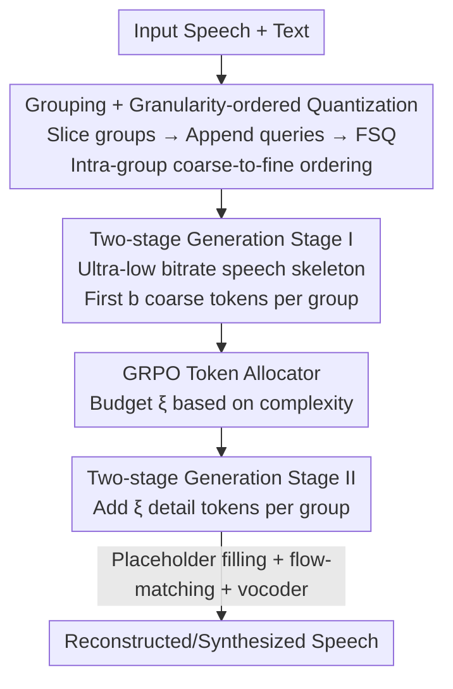

# Gogo: Group-wise Granularity-ordered Codec for Stable and Efficient Speech Generation

**Conference**: ICLR 2026  
**OpenReview**: [https://openreview.net/forum?id=JbLmIoWwDC](https://openreview.net/forum?id=JbLmIoWwDC)  
**Code**: Demo page https://happycolor.github.io/gogo (No open-source repository)  
**Area**: Speech Generation / Speech Codec / Speech Language Models  
**Keywords**: Speech codec, granularity-ordered quantization, two-stage TTS, adaptive token allocation, GRPO

## TL;DR
This paper proposes Gogo—a speech codec that packs several consecutive frames into "groups" and orders tokens within each group from "coarse to fine." Coarse tokens encode high-level semantics, while fine tokens gradually restore acoustic details. Building on this, the authors develop GogoSpeech, a two-stage speech language model (constructing the skeleton first, then adding details), and a GRPO-trained token allocator (dynamically allocating budgets based on group complexity). It achieves SOTA reconstruction quality at an ultra-low token rate of 47 Hz and demonstrates improved stability and efficiency in long-form zero-shot TTS.

## Background & Motivation

**Background**: Speech Language Models (SLMs) transfer the LLM paradigm to speech—first discretizing waveforms into tokens using an audio codec, then modeling text and speech tokens autoregressively. The success of this pipeline relies heavily on the codec: its tokens must contain high-level cues (content, semantics, structural properties) for easy modeling by the autoregressive model, while retaining low-level details (acoustic fluctuations) for perceptual quality.

**Limitations of Prior Work**: Traditional codecs (EnCodec, DAC, etc.) employ **frame-wise quantization**, where each frame is compressed independently. This paradigm offers high fidelity but suffers from a strong "locality bias": each token focuses only on a small waveform segment, making it difficult to extract high-level cues. Later works introduced self-supervised representations (SpeechTokenizer, Mimi) or ASR features (S3 tokenizer) to inject semantics, but the **frame-wise foundations remained unchanged**, limiting the capacity to learn high-level information. Another overlooked issue is that speech information density is naturally **non-uniform**: silent segments contain almost no information, while complex phonemes are information-dense. Existing codecs assign the same bitrate to all segments, leading to redundant encoding for simple segments and low generation efficiency.

**Key Challenge**: There is a structural conflict between high-fidelity reconstruction (requiring fine-grained, high-bitrate frame-wise tokens) and efficient, stable autoregressive modeling (requiring sparse, high-level, short-sequence tokens). The frame-wise paradigm forces a trade-off between the two and cannot scale bitrates with information density.

**Goal**: ① Break frame-wise quantization to allow a single codec to produce both "AR-friendly" coarse tokens and "detail-preserving" fine tokens; ② Enable a generation framework that captures the backbone before filling in details to improve stability and mitigate error accumulation; ③ Adapt the bitrate to speech complexity to eliminate redundant tokens in simple segments like silence.

**Key Insight**: The authors observe that by grouping consecutive frames and forcing a "coarse-to-fine" order within the group, the first few tokens naturally prioritize encoding global/high-level information (to minimize loss even when only they are kept), while subsequent tokens fill in acoustic details. Thus, the same set of tokens becomes inherently layered, allowing downstream tasks to "take the top $k$ as needed."

**Core Idea**: Replace frame-wise quantization with "grouping + intra-group granularity-ordered quantization" to let a single codec generate hierarchical tokens; split generation into two stages—"skeleton first, details later"—and use a reinforcement learning-trained allocator to dynamically decide the number of detail tokens based on group complexity.

## Method

### Overall Architecture

The system consists of three components: the **Gogo codec** discretizes speech into "coarse-to-fine" intra-group tokens and reconstructs waveforms; **GogoSpeech** is a two-stage SLM built on Gogo tokens that generates high-level skeletons before enriching details; the **Token Allocator** dynamically determines the detail token budget for each group during the second stage.

Specifically, the input waveform is converted to mel-spectrograms and sliced into non-overlapping "groups" (each with $g$ frames). Each group is appended with $n_q$ learnable queries. After passing through a Transformer encoder, finite scalar quantization (FSQ) is applied only at query positions to obtain $n_q$ tokens per group, trained to be ordered from coarse to fine. During reconstruction, these tokens fill placeholders, are reassembled along the time axis, and fed into a flow-matching model to predict mel-spectrograms, which are then restored to waveforms by a Vocos vocoder. For generation, GogoSpeech treats the first $b$ tokens of each group as the "speech skeleton." Stage I uses text to generate the skeleton group-by-group at an ultra-low token rate (~14 Hz). Stage II then fills in the remaining detail tokens; the token allocator examines each skeleton to decide how many detail tokens to add, using fewer or zero for simple segments (e.g., silence).

### Key Designs

**1. Gogo: Grouping + Intra-group Granularity-ordered Quantization**

This design directly addresses the "frame-wise quantization lacks high-level cues" pain point. Rather than independent frame quantization, Gogo groups $g$ consecutive mel-spectrogram frames into $x_i \in \mathbb{R}^{g\times d}$, appends $n_q$ learnable queries to get $z_i=\mathrm{Cat}(x_i, q_i)$, and applies FSQ only to the query positions after Transformer encoding. This forces queries to "query" the entire group, naturally condensing global information across frames.

To ensure the $n_q$ tokens are ordered from coarse to fine, two mechanisms are used. First, **nested dropout**: during training, a retention number $n_k\in\{1,\dots,n_q\}$ is uniformly sampled, and the last $(n_q-n_k)$ tokens are replaced with a mask. This forces the model to pack critical high-level abstractions into early tokens, leaving difficult acoustic details to later tokens. Since later tokens are updated less frequently, the gradient for the $j$-th token is scaled by $w_j = 0.5/(1-(j-1)/n_q)$. Second, a **loss balancer** dynamically adjusts the weights of ASR loss and flow-matching (CFM) loss based on $n_k$:

$$\lambda_{\mathrm{CFM}} = \lambda_{\min} + \frac{(n_k-1)(\lambda_{\max}-\lambda_{\min})}{n_q-1},\quad \lambda_{\mathrm{ASR}} = \lambda_{\max} - \frac{(n_k-1)(\lambda_{\max}-\lambda_{\min})}{n_q-1}.$$

When $n_k$ is small (only coarse tokens), $\lambda_{\mathrm{ASR}}$ dominates to ensure coarse tokens capture linguistic content; when $n_k$ is large, $\lambda_{\mathrm{CFM}}$ dominates to focus on acoustic details. The reconstruction uses conditional flow matching: $L_{\mathrm{CFM}}=\mathbb{E}\big[\|v_\theta(x_t,\bar x,t)-(x_1-x_0)\|_2^2\big]$. Probe experiments confirm the ordering: the first 3 tokens encode global info (duration, voiced/unvoiced ratio, word count), middle tokens encode rhythm (jitter, shimmer), and the last 3 encode fine acoustics (pitch, energy, spectral centroid).

**2. GogoSpeech: Two-stage "Skeleton-to-Detail" Generation**

Generation is split into layers using the ordered tokens. Tokens are organized into a matrix $S\in\mathbb{R}^{n_g\times n_q}$, where the first $b$ tokens $S_{:,1:b}$ serve as the "speech skeleton" (~14 Hz for $b=3$). **Stage I** uses an autoregressive model to generate the target skeleton $\tilde S_{:,1:b}$ conditioned on text $y$ and prompt skeletons. Operating at this ultra-low rate results in shorter sequences that are "AR-friendly," leading to more stable prediction and reduced error accumulation. **Stage II** then fills in detail tokens $\tilde S_{i,b+1:n_q}$ conditioned on the prompt, previously generated groups, and the current group's skeleton. Perplexity experiments show group-wise tokens have lower perplexity at all granularities compared to frame-wise tokens (e.g., pos 1: 0.9 vs 2.3), providing a solid foundation for this hierarchical design.

**3. GRPO-trained Token Allocator: Dynamic Budgeting**

To address the "fixed bitrate" issue, an allocator $\pi_\omega$ is introduced before Stage II. It reads the skeleton $\tilde S_{i,1:b}$ and outputs a budget $\xi_i\in\{0,1,\dots,n_q-b\}$, determining how many detail tokens to generate. It uses an improved GRPO: since the action space is small, it **enumerates** all choices and reconstructs speech for each. The reward $R = \lambda_n R_n + \lambda_d R_d$ balances token count $R_n$ and reconstruction distortion $R_d$. This allows the allocator to learn a strategy that minimizes token usage while maintaining fidelity, reducing the average token rate from 47 Hz to 36 Hz with minimal performance loss.

### Loss & Training
- **Gogo**: $L_{\text{Gogo}}=\lambda_{\mathrm{CFM}}L_{\mathrm{CFM}}+\lambda_{\mathrm{AR}}L_{\mathrm{AR}}+\lambda_{\mathrm{ASR}}L_{\mathrm{ASR}}$. $\lambda_{\mathrm{AR}}=0.06$ (with 50x gradient scaling for AR prior). $\lambda_{\mathrm{CFM}}/\lambda_{\mathrm{ASR}}$ are dynamically adjusted by the loss balancer.
- **Configuration**: 24 kHz audio, 100-dim log-mel, hop size 256 (~94 Hz). Group size $g=20$, $n_q=10$ queries per group (47 Hz token rate). Skeleton $b=3$ (~14 Hz). Both GogoSpeech stages are initialized from LLaMA-3.2-1B.
- **Data**: Trained on the English subset of Emilia (~50k hours).

## Key Experimental Results

### Main Results: Codec Reconstruction (LibriTTS test-clean)

| Model | TPS | UT-MOS | DNS-MOS | PESQ-WB | SIM | WER |
|------|-----|--------|---------|---------|-----|-----|
| Ground Truth | - | 4.13 | 3.83 | 4.64 | 1.00 | 5.86 |
| DAC (High Bitrate) | 600 | 3.78 | 3.75 | 3.52 | 0.98 | 6.10 |
| MagiCodec | 50 | 4.21 | 3.96 | 2.55 | 0.86 | 7.45 |
| X-codec2 | 50 | 4.17 | 3.90 | 2.45 | 0.83 | 6.40 |
| TAAE | 50 | 4.27 | 3.89 | 2.14 | 0.87 | 8.18 |
| **Gogo** | **47** | **4.19** | **3.99** | **2.59** | **0.91** | **6.35** |

At only 47 TPS, Gogo outperforms most models in the 50 TPS category. Its UT-MOS and DNS-MOS exceed Ground Truth (attributed to the generative nature of the flow-matching decoder).

### Ablation Study: AR Perplexity (Group-wise vs. Frame-wise)

| Scheme | Pos 1 | Pos 3 | Pos 7 | Pos 10 |
|------|-------|-------|-------|--------|
| Frame-wise | 2.3 | 84.4 | 441.8 | 691.4 |
| Group-wise | 0.9 | 42.0 | 204.1 | 228.3 |

Group-wise tokens show significantly lower perplexity, confirming they are more "AR-friendly." Coarse tokens are much easier to predict than fine tokens.

### Key Findings
- **Hierarchical tokens exhibit clear labor division**: Probes show early tokens handle global/linguistic info, while late tokens handle acoustic details.
- **Stability gains are most evident in long-form speech**: GogoSpeech achieves superior SIM/WER in long-form TTS, proving that the low-bitrate skeleton effectively mitigates error accumulation.
- **Allocator improves efficiency for "free"**: Reducing 47 Hz to 36 Hz (~23% savings) results in negligible quality drops.

## Highlights & Insights
- **"Grouping + Query + Nested Dropout" for inherent granularity**: This avoids the complexity of RVQ layers or assembling separate semantic/acoustic codecs. A single set of tokens serves both modeling and detail preservation goals.
- **Enumerative GRPO for small action spaces**: By enumerating all budget choices instead of sampling, the allocator avoids high variance in policy gradients—a practical approach for discrete budgeting.
- **Loss Balancer ties "what to learn" to "how many tokens are kept"**: Dynamically shifting between ASR and CFM weights is the critical engineering detail that makes granularity ordering functional.

## Limitations & Future Work
- **Ours** acknowledges that placeholder tokens in the flow-matching decoder can occasionally introduce artifacts. The 47 Hz rate is still higher than certain 25 Hz low-bitrate codecs.
- Scaling GogoSpeech to larger LLMs and multi-lingual datasets remains to be explored.
- Future directions include replacing placeholders with learnable priors to reduce artifacts and exploring even more aggressive skeleton compression (<14 Hz).

## Related Work & Insights
- **vs. SpeechTokenizer / Mimi**: These still use frame-wise foundations with added semantic info. Gogo changes the structural paradigm to group-wise learning.
- **vs. AudioLM**: While AudioLM uses semantic-to-acoustic stages, GogoSpeech compresses the skeleton stage to ~14 Hz, achieving better stability through shorter sequences.
- **vs. VRVQ / TFC**: These use adaptive bitrates but don't optimize for SLM generation or joint reconstruction-distortion. Gogo uses RL (GRPO) to optimize the efficiency-quality trade-off directly.

## Rating
- Novelty: ⭐⭐⭐⭐⭐ (Breaking frame-wise paradigm + enumerative GRPO is highly innovative).
- Experimental Thoroughness: ⭐⭐⭐⭐ (Comprehensive codec and TTS evaluations, though limited to English).
- Writing Quality: ⭐⭐⭐⭐⭐ (Clear logic, well-structured method and validation).
- Value: ⭐⭐⭐⭐⭐ (Directly improves the SLM/TTS pipeline for stable long-form generation).

<!-- RELATED:START -->

## Related Papers

- [\[CVPR 2026\] Hierarchical Codec Diffusion for Video-to-Speech Generation](../../CVPR2026/audio_speech/hierarchical_codec_diffusion_for_video-to-speech_generation.md)
- [\[ICLR 2026\] FlexiCodec: A Dynamic Neural Audio Codec for Low Frame Rates](flexicodec_a_dynamic_neural_audio_codec_for_low_frame_rates.md)
- [\[ICLR 2026\] MambaVoiceCloning: Efficient and Expressive Text-to-Speech via State-Space Modeling and Diffusion Control](mambavoicecloning_efficient_and_expressive_text-to-speech_via_state-space_modeli.md)
- [\[ICLR 2026\] Efficient Audio-Visual Speech Separation with Discrete Lip Semantics and Multi-Scale Global-Local Attention](efficient_audio-visual_speech_separation_with_discrete_lip_semantics_and_multi-s.md)
- [\[ICLR 2026\] PrismAudio: Decomposed Chain-of-Thought and Multi-dimensional Rewards for Video-to-Audio Generation](prismaudio_decomposed_chain-of-thought_and_multi-dimensional_rewards_for_video-t.md)

<!-- RELATED:END -->
