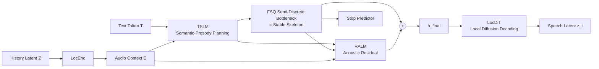

# Hierarchical Semantic-Acoustic Modeling via Semi-Discrete Residual Representations for Expressive End-to-End Speech Synthesis

**Conference**: ICLR 2026  
**OpenReview**: [https://openreview.net/forum?id=h5KLpGoqzC](https://openreview.net/forum?id=h5KLpGoqzC)  
**Code**: [https://voxcpm.github.io/VoxCPM-demopage/](https://voxcpm.github.io/VoxCPM-demopage/) (VoxCPM, featuring demos)  
**Area**: Speech Synthesis / TTS / Audio Generation  
**Keywords**: zero-shot TTS, end-to-end speech synthesis, FSQ semi-discrete bottleneck, residual acoustic modeling, hierarchical semantic-acoustic modeling, local diffusion decoding  

## TL;DR
VoxCPM employs a **differentiable FSQ semi-discrete bottleneck** to naturally decouple "semantic-prosody planning" from "fine-grained acoustic rendering" within a single end-to-end model. TSLM generates a stable semantic skeleton, RALM compensates for acoustic residuals, and LocDiT predicts high-fidelity speech latents. Trained on 1 million hours of data, the 0.5B model achieves SOTA performance for open-source zero-shot TTS and operates **entirely without reliance on external discrete speech tokenizers**.

## Background & Motivation
- **Background**: Modern TTS has evolved from being "intelligible" to "human-like." Two main technical routes dominate: (1) **Discrete token route** (e.g., VALL-E, CosyVoice series), which quantizes speech into discrete tokens using codecs like EnCodec/DAC and uses LLMs for autoregressive prediction, offering scalability and strong in-context capabilities; (2) **Continuous representation route** (e.g., Tacotron2, MELLE, F5-TTS, DiTAR), which directly models mel-spectrograms or latents, providing higher fidelity.
- **Limitations of Prior Work**: The discrete route hits a "**quantization ceiling**," where compression irreversibly discards subtle acoustic details. To remedy this, SOTA systems adopt **multi-stage hybrid pipelines** (LLM for discrete tokens → independent diffusion decoder for refinement). However, this creates a **semantic-acoustic gap**: the LLM operates in an abstract discrete space unaware of acoustic nuances, while the diffusion model performs local refinement without "understanding" high-level context, precluding end-to-end optimization. The continuous route avoids quantization loss, but **semantic-prosody planning and acoustic rendering are forced into the same learning objective**. The model must act as both a global planner and a local renderer; without a natural structural division, attention is diverted by low-level acoustic textures, leading to error accumulation or failures in long sequences.
- **Key Challenge**: **Expressiveness vs. Stability**—discrete models are stable but sacrifice expressiveness, while continuous models are expressive but suffer from error accumulation due to task entanglement. The authors further identify a neglected bottleneck: using FSQ/VQ to create discrete codebooks for LLMs results in an exponential explosion of codebook size as dimensionality increases, creating a massive sparse vocabulary that LLMs cannot predict accurately.
- **Goal**: To achieve **explicit architectural separation** between semantic-prosody planning and acoustic rendering within a **single, end-to-end trainable** system, while preserving acoustic details and avoiding external tokenizers.
- **Core Idea**: **Semi-discrete residual representation**. A differentiable FSQ layer serves as an **internal bottleneck rather than a prediction target**, inducing a natural labor division: the quantized "skeleton" carries stable semantic-prosody content, while the continuous "residuals" carry acoustic details. Their summation guides a local diffusion decoder, and the entire architecture is trained end-to-end under a simple diffusion objective.

## Method

### Overall Architecture
VoxCPM is a **hierarchical autoregressive** model that generates continuous speech latents $Z=\{z_1,...,z_M\}$ patch-by-patch (where each $z_i\in\mathbb{R}^{P\times D}$ is a segment of $P$ frames and $D$-dimensional VAE latents), conditioned on text tokens $T$, decomposed as $p(Z|T)=\prod_i p(z_i|T,Z_{<i})$. The core of each patch generation is summing the "skeleton + residual" into a unified conditional signal $h_i^{\text{final}}$ for the local diffusion decoder:

$$z_i \sim \text{LocDiT}(h_i^{\text{final}}),\quad h_i^{\text{final}}=\underbrace{\text{FSQ}(\text{TSLM}(T,E_{<i}))}_{\text{Stable Skeleton}}+\underbrace{\text{RALM}(\cdot)}_{\text{Acoustic Residual}}$$

Here, $E_{<i} = \text{LocEnc}(Z_{<i})$ represents the historical audio context. Four modules form the pipeline: LocEnc compresses historical latents → TSLM produces semantic-prosody representations → FSQ acts as a semi-discrete bottleneck skeleton → RALM supplements acoustic residuals → LocDiT diffuses high-fidelity latents. Gradients (including those through FSQ via straight-through estimation) flow through the entire process.

### Key Designs

**1. Semi-discrete FSQ Bottleneck: Quantization as "Regularization" rather than "Target" for Semantic Stability.** This is the core of the paper. TSLM (24 layers, initialized from the pre-trained text LLM MiniCPM-4-0.5B, using BPE text tokens directly instead of phonemes) first produces continuous semantic-prosody hidden states. FSQ performs deterministic scalar quantization on each dimension: $h_{i,j}^{\text{FSQ}}=\Delta\cdot\text{clip}(\text{round}(h_{i,j}^{\text{TSLM}}/\Delta),-L,L)$, which is discrete in the forward pass and differentiable via straight-through in the backward pass. The **novel usage** of FSQ here is critical: traditional discrete routes treat quantized codes as the prediction target for the LLM (leading to codebook explosion). Here, FSQ is merely a **differentiable inductive bias** in the data stream—analogous to the first layer of RVQ—capturing coarse-grained semantic-prosody skeletons like content and intonation. This provides a clear signal of "what information to retain," easing the modeling burden on TSLM and suppressing error accumulation. It intentionally uses **much higher dimensions** than standard FSQ (hence "semi-discrete") to ensure information capacity. Ablations confirm a "summary space" sweet spot: too low (d4) causes over-constraint and insufficient prosody; too high (d1024) lacks discrete intensity and keeps tasks entangled; d256 is optimal.

**2. Residual Acoustic Modeling (RALM): Explicit Labor Division for Acoustic Detail.** Fine-grained acoustic information discarded by FSQ (speaker timbre, spectral fine structure, micro-prosody) is specifically recovered by RALM (6 layers, randomly initialized). It is conditioned on the TSLM hidden states (text), the semi-discrete representation (speech), and historical acoustic embeddings: $h_i^{\text{residual}}=\text{RALM}(H_{\text{text}}^{\text{TSLM}},H_{<i}^{\text{FSQ}}\oplus E_{<i})$. The final condition $h_i^{\text{final}}=h_i^{\text{FSQ}}+h_i^{\text{residual}}$ combines semantic stability and acoustic expressiveness via **residual addition**. This design induces a natural **labor division**: the TSLM+FSQ path handles content stability and prosodic coherence, while the RALM path handles acoustic expressiveness and speaker identity. T-SNE visualizations show TSLM-FSQ clusters by semantic-prosody content, while RALM residuals show strong speaker-dependent variations.

**3. Local Diffusion Decoder (LocDiT) + Flow Matching E2E Objective: Generation as "Outpainting."** LocDiT follows the bidirectional Transformer architecture of DiTAR, modeling the full receptive field within each patch. By including the **previous patch $z_{i-1}$ as an additional condition**, it reframes the task from "independent patch generation" to "outpainting," significantly improving consistency. LM guidance is randomly masked to support CFG during inference. The entire model is trained end-to-end using a **Conditional Flow Matching** objective: $L_{\text{FM}}=\mathbb{E}\big[|v_\theta(z_i^t,t,h_i^{\text{final}},z_{i-1})-\tfrac{d}{dt}(\alpha_t z_i^0+\sigma_t\epsilon)|^2\big]$, plus a binary stop loss $L_{\text{Stop}}$ at the FSQ output to determine sequence end. The combined objective is $L=L_{\text{FM}}+\lambda L_{\text{Stop}}$. Gradients propagate through the entire autoregressive hierarchy (including FSQ's STE, TSLM, and LocEnc), enabling the roles of planning, stabilization, and refinement to co-evolve. At the base, a **Causal VAE** (mel reconstruction + multi-period/multi-scale discriminator GAN loss + minimal KL) compresses speech into the latent space; causality ensures streaming capability and low latency.

## Key Experimental Results

### Main Results (SEED-TTS-EVAL, Open-Source Comparison, Excerpts)

| Model | Params | Data/Hours | EN WER↓ | EN SIM↑ | ZH CER↓ | ZH SIM↑ | Hard CER↓ |
|------|------|-----------|---------|---------|---------|---------|-----------|
| F5-TTS | 0.3B | 100K | 2.00 | 67.0 | 1.53 | 76.0 | 8.67 |
| CosyVoice2 | 0.5B | 170K | 3.09 | 65.9 | 1.38 | 75.7 | 6.83 |
| IndexTTS 2 | 1.5B | 55K | 2.23 | 70.6 | 1.03 | 76.5 | 7.12 |
| FireRedTTS-2 | - | 1.4M | 1.95 | 66.5 | 1.14 | 73.6 | - |
| HiggsAudio-v2 | 3B | 10M | 2.44 | 67.7 | 1.50 | 74.0 | 55.07 |
| **VoxCPM** | **0.5B** | 1.8M | **1.85** | **72.9** | **0.93** | **77.2** | 8.87 |

VoxCPM, with 0.5B parameters, achieves open-source SOTA across EN-WER, ZH-CER, and bilingual SIM, demonstrating clear intent and high speaker similarity without massive parameter scaling (significantly smaller than 1.5B-3B competitors).

### Ablation Study (FSQ Dimension + Core Architecture, Emilia 200K steps)

| Setting | EN-WER↓ | ZH-CER↓ | ZH-hard CER↓ |
|------|---------|---------|--------------|
| default (FSQ d256s9) | **2.98** | **1.77** | **18.19** |
| FSQ d4s9 (Low Dim) | 5.18 | 4.05 | 19.55 |
| FSQ d1024s9 (Weak Discreteness) | 3.07 | 2.38 | 20.38 |
| w/o FSQ (Pure Continuous d1024s∞) | 3.67 | 2.30 | 24.92 |
| w/o RALM: TSLM(24L) → LocDiT | 4.34 | 3.05 | 25.00 |
| w/o RALM: TSLM(30L partially LM init) | 4.12 | 3.07 | 26.20 |
| w/o $E_{<i}$ in RALM | 4.91 | 4.94 | 27.17 |
| w/o $h^{\text{residual}}$ (TSLM→FSQ→LocDiT) | 3.86 | 3.05 | 23.65 |
| Hierarchical, w/o LM init in TSLM | 5.24 | 2.41 | 24.66 |

### Key Findings
- **FSQ Bottleneck Is Crucial for Stability**: Purely continuous models without FSQ fail significantly on hard samples (ZH-CER 24.92%), validating the hypothesis that semantic-acoustic entanglement in continuous space leads to error accumulation. There is a sweet spot for dimensionality (d256 is best).
- **Hierarchical Labor Division > Scaling Capacity**: Increasing a single-stream model from 24 to 30 layers yields marginal gains (EN-WER 4.34 to 4.12), whereas the hierarchical structure drops it to 2.98. Division of labor is the primary driver of stability.
- **Residual Acoustic Input Is Essential**: Removing historical acoustic context $E_{<i}$ from RALM causes ZH-CER to spike to 4.94, confirming that fine-grained acoustic information is required to restore speaker timbre.
- **Pre-trained Text LLM Initialization**: Removing LM initialization degrades EN-WER from 2.98 to 5.24. Interestingly, SIM slightly increases with random initialization, suggesting the model allocates more capacity to acoustics when linguistic priors are absent.
- **Real-world Robustness**: On CV3-EVAL, it achieves ZH-CER 3.40% / EN-WER 4.04%. Its CV3-Hard-EN WER of 7.89% even surpasses the closed-source CosyVoice 3. Lower DNSMOS is attributed to **faithful cloning of the prompt recording environment** (low DNSMOS prompts result in low DNSMOS output).

## Highlights & Insights
- **Downgrading "quantization" from a prediction target to a regularization bottleneck** effectively bypasses the codebook explosion of discrete routes while inheriting the stability of discrete representations.
- **"Semi-discrete + Residual" achieves functional decoupling** within a single end-to-end framework, gaining the architectural benefits of multi-stage pipelines without the inability to optimize end-to-end or the dependence on external tokenizers.
- **Direct BPE text input + Pre-trained LLM initialization** eliminates the need for phonemizers and strengthens text understanding; while phoneme routes (like DiTAR) might offer more stability, they are less versatile.
- VoxCPM is a **streamable, low-latency, 0.5B, open-source** practical system with high data efficiency (competitive with 1.7M hour models using only 1M hours).

## Limitations & Future Work
- DNSMOS on CV3-Hard is relatively low; while explained as "faithful cloning of low-quality prompts," there is still a gap compared to some NAR models (e.g., MaskGCT) in objective audio quality metrics.
- Chinese N-MOS naturalness is slightly behind IndexTTS 2, which authors attribute to certain prompt qualities (mumbling/monotony), implying sensitivity to prompt quality.
- Reliance on 1M+ hours of data and 40×H100 for peak results makes reproduction expensive; FSQ dimensionality and other hyperparameters require careful tuning.
- The stack of causal VAE, CFG, and various modules results in a complex system where the single forward pass link is relatively long.

## Related Work & Insights
- **Discrete Token TTS**: VALL-E, AudioLM, CosyVoice, SparkTTS, FireRedTTS, IndexTTS2—the quantization ceiling remains their common pain point, driving hybrid pipelines.
- **Continuous Representation TTS**: Tacotron2, MELLE, NaturalSpeech2, VoiceBox, F5-TTS, **DiTAR** (patch-based causal LM + local diffusion, from which VoxCPM's LocDiT draws inspiration), VibeVoice—yet they generally suffer from semantic-acoustic entanglement.
- **Hierarchical/Residual TTS**: HierSpeech++, HALL-E, MARS6, QTTS—while these explored hierarchy or residual quantization, few have unified "explicit residual design + semi-discrete bottleneck" into an end-to-end framework to achieve implicit decoupling without external dependencies.
- **Insight**: Using a differentiable quantization bottleneck as an "inductive bias to induce labor division" is a powerful concept that could transfer to other continuous autoregressive generation tasks requiring decoupling of global planning and local rendering (e.g., video, motion, music).

## Rating
- **Novelty**: ⭐⭐⭐⭐ — Repositioning FSQ as a regularization bottleneck rather than a target, paired with residual acoustic modeling, is a distinct and clever approach to decoupling.
- **Experimental Thoroughness**: ⭐⭐⭐⭐⭐ — Large-scale training (1M+ hours), dual benchmarks, extensive ablations (FSQ dimensions, hierarchy vs. capacity, input component isolation, T-SNE validation) provide a very convincing chain of evidence.
- **Writing Quality**: ⭐⭐⭐⭐ — The arguments regarding task entanglement and error accumulation are clear. Mathematical formulas and diagrams are well-integrated, though the density of components requires careful reading.
- **Value**: ⭐⭐⭐⭐⭐ — A 0.5B open-source model achieving zero-shot TTS SOTA without external tokenizers and supporting streaming is highly practical for both industry and the community.

<!-- RELATED:START -->

## Related Papers

- [\[NeurIPS 2025\] E2E-VGuard: Adversarial Prevention for Production LLM-based End-To-End Speech Synthesis](../../NeurIPS2025/audio_speech/e2e-vguard_adversarial_prevention_for_production_llm-based_end-to-end_speech_syn.md)
- [\[ICLR 2026\] MambaVoiceCloning: Efficient and Expressive Text-to-Speech via State-Space Modeling and Diffusion Control](mambavoicecloning_efficient_and_expressive_text-to-speech_via_state-space_modeli.md)
- [\[ACL 2026\] VoxMind: An End-to-End Agentic Spoken Dialogue System](../../ACL2026/audio_speech/voxmind_an_end-to-end_agentic_spoken_dialogue_system.md)
- [\[ICLR 2026\] AC-Foley: Reference-Audio-Guided Video-to-Audio Synthesis with Acoustic Transfer](ac-foley_reference-audio-guided_video-to-audio_synthesis_with_acoustic_transfer.md)
- [\[AAAI 2026\] End-to-end Contrastive Language-Speech Pretraining Model For Long-form Spoken Question Answering](../../AAAI2026/audio_speech/end-to-end_contrastive_language-speech_pretraining_model_for_long-form_spoken_qu.md)

<!-- RELATED:END -->
