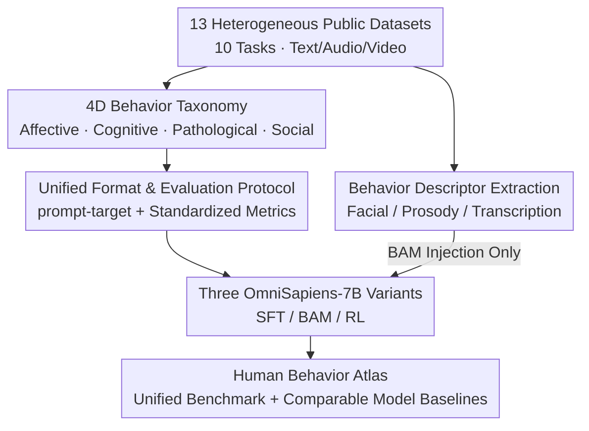

# Human Behavior Atlas: Benchmarking Unified Psychological and Social Behavior Understanding

**Conference**: ICLR 2026  
**arXiv**: [2510.04899](https://arxiv.org/abs/2510.04899)  
**Code**: Public after review  
**Area**: Medical Imaging  
**Keywords**: Behavior understanding benchmark, psychological and social behavior, multimodal learning, unified model, affective computing

## TL;DR

Constructed Human Behavior Atlas—the first large-scale multimodal unified benchmark (101K+ samples) covering four dimensions of emotional, cognitive, pathological, and social processes—and validated its effectiveness in multi-task training and transfer learning by training three OmniSapiens-7B model variants.

## Background & Motivation

Perceiving psychological and social behavior through intelligent systems—specifically states of emotion, cognition, and pathology manifested through observable behavior and social interaction—has been a core challenge in the AI field. Major issues with existing work include:

**Fragmentation**: Each task (sentiment analysis, depression detection, action recognition, etc.) has specialized datasets and single-task systems, lacking cross-task scalability and transferability.

**Inconsistent Formats**: Datasets are highly heterogeneous in input representation (pre-extracted features vs. raw signals), output format (subjective annotations vs. categorical labels), and evaluation protocols.

**Redundant Effort**: Each task Requires independent architecture design, data collection, and training pipelines, resulting in significant resource waste.

**Lack of Unified Models**: The community has made limited progress in training unified models capable of simultaneous understanding of emotional, cognitive, pathological, and social behaviors.

Human Behavior Atlas aims to fill this gap by standardizing data formats and unifying evaluation metrics to drive the development of general-purpose behavior understanding models.

## Method

### Overall Architecture

Human Behavior Atlas incorporates psychological and social behavior tasks scattered across more than ten datasets into a unified benchmark. Its construction follows a pipeline: first, defining a **behavior taxonomy** covering four dimensions to provide a common coordinate system for fragmented tasks; next, rewriting 13 heterogeneous public datasets (10 tasks, 101,964 text/audio/video samples) into the same **prompt-target format with standardized evaluation metrics** to align inputs, outputs, and scoring criteria; meanwhile, extracting a separate stream of **behavior descriptors** from raw signals as optional enhancement signals; finally, training three **OmniSapiens-7B variants** (SFT / BAM / RL) on this benchmark. This providing both a "dataset + evaluation protocol" and a unified model baseline for direct horizontal comparison.

### Key Designs

**1. 4D Behavior Taxonomy: A Common Coordinate System for Fragmented Tasks**

Existing tasks (depression detection, humor recognition, action understanding, etc.) operate in isolation, lacking a unified organizational perspective. The authors categorize all behaviors into four dimensions: Affective State (from short-term feelings like anger and joy to persistent affect), Cognitive State (intrinsic mental processes like attention, reasoning, surprise, and decision-making), Pathology (mental health status such as depression and anxiety), and Social Processes (social interactions such as humor, intent, and cooperation). Crucially, a single task can span multiple dimensions—for example, emotion recognition involves both affect and cognition—allowing the taxonomy to organize existing tasks while reserving space for new fields like autism.

**2. Unified Format & Evaluation Protocol: Aligning Heterogeneous Inputs, Outputs, and Scoring**

Heterogeneity is the greatest barrier to unified modeling: datasets vary wildly in input representation, output format, and evaluation protocols. The authors reformatted all samples across 10 tasks (Sentiment SEN, Emotion recognition EMO, Social inference SOC, Intent recognition INT, Non-verbal communication NVC, Humor detection HUM, Sarcasm detection SAR, Anxiety detection ANX, Depression detection DEP, PTSD detection) into a single prompt-target format: the prompt declares available modalities, and the target is free-form text or a discrete label set. Continuous outputs like PHQ-9 scores are discretized into labels according to clinical guidelines from original papers to ensure consistent annotation criteria. Scoring is also unified: categorical tasks use Weighted F1 (Binary Weighted F1 for SEN; Weighted F1 for HUM/SAR/ANX/DEP/PTSD), while EMO uses the mean of weighted accuracy across categories. Since open-ended generation tasks like SOC/INT/NVC cannot be matched with fixed labels, LLM-Judge accuracy is used, where GPT-4o-mini (noted as GPT-5-nano in original text) determines if the generated response is semantically consistent with the reference. To eliminate annotation noise, emotion labels were unified (merging joy/happiness, distinguishing positive/negative surprise), making cross-task comparisons truly comparable.

**3. Behavior Descriptor Extraction: Domain Priors as Optional Enhancement Signals**

Pure end-to-end models often overlook subtle facial and vocal cues. The authors extract structured descriptors from three modalities: visual features use MediaPipe for facial landmarks and body pose keypoints; audio features use OpenSMILE (ComParE 2016 feature set) for prosodic features like pitch, energy, and spectral attributes; text uses Whisper v3 Large to transcribe missing speech. These descriptors do not enter the backbone directly but serve as external signals that the BAM variant calls as needed—benefiting relevant tasks while being ignored by others.

**4. Three OmniSapiens-7B Variants: Comparing Three Modeling Paradigms on One Benchmark**

All three models are based on Qwen2.5-Omni-7B but follow different paths. SFT performs direct supervised fine-tuning, using penultimate representations connected to classification and decoding heads for different task types. BAM adds a residual Behavioral Adapter Module after SFT freezing, injecting behavior descriptors encoded via FFN as $z_f$ into the backbone representation $h_{\text{adapt}} = h_{\text{penult}} + \alpha \cdot z_f$. The residual form ensures the original representation is not disrupted, adding domain cues only when needed. RL uses GRPO (Group Relative Policy Optimization) training, channeling all tasks through the decoding head and requiring reasoning chain output in the format `<think>...</think>\boxed{answer}`, converting classification into generation with explicit reasoning. Parallel evaluation of these three aims to verify the complementarity of supervised fine-tuning, feature enhancement, and reinforcement learning on the same benchmark.

### Loss & Training

Training configurations vary across the three variants: SFT is trained for 5 epochs using LoRA ($r=32,\ \alpha=64$) with a learning rate of $1\times10^{-4}$ and batch size of 512; BAM is trained for 4 epochs with a frozen backbone, training only the adapter and output heads with an adapter hidden dimension of 256; RL is trained for 10 epochs with a learning rate of $1\times10^{-6}$, sampling $n=5$ per group, using a composite reward function based on accuracy, format compliance, and semantic similarity.

## Key Experimental Results

### Main Results for Multi-task Training

| Model | EMO | HUM | INT | PTSD | ANX | DEP | SEN | SAR | SOC | NVC |
|------|-----|-----|-----|------|-----|-----|-----|-----|-----|-----|
| Gemma-3-4B | .550 | .597 | .227 | .499 | .601 | .463 | .738 | .529 | .191 | .023 |
| Qwen2.5-Omni-7B | .583 | .543 | .254 | .760 | .793 | .714 | .672 | .656 | .254 | .069 |
| HumanOmniV2-7B | .597 | .638 | .263 | .824 | .527 | .654 | .742 | .395 | .282 | .093 |
| **OmniSapiens-7B SFT** | **.631** | .532 | .256 | **1.00** | .909 | .733 | **.768** | .624 | .257 | .121 |
| **OmniSapiens-7B BAM** | **.645** | **.644** | .177 | **1.00** | **.909** | **.789** | **.786** | **.795** | .201 | **.162** |
| **OmniSapiens-7B RL** | .573 | **.639** | **.486** | .968 | .919 | .772 | .396 | .647 | **.304** | .133 |

SFT and BAM outperform general multimodal LLMs in 8 out of 10 tasks.

### Transfer Learning Experiments

| Dataset | OmniSapiens-7B SFT | Qwen2.5-Omni-7B | Gain |
|--------|-------------------|----------------|------|
| MOSEI (SEN) | 0.724 | 0.612 | +18.3% |
| MELD (EMO) | 0.711 | 0.684 | +3.95% |
| DAIC-WOZ (DEP) | 0.749 | 0.579 | +29.4% |
| MUStARD (SAR) — New Task | 0.658 | 0.473 | **+39.1%** |

### Effect of Behavior Descriptors (BAM vs SFT)

| Task | SFT | BAM | Change |
|------|-----|-----|------|
| NVC | 0.12 | 0.16 | +33.0% |
| SAR | 0.62 | 0.80 | +29.0% |
| HUM | 0.53 | 0.64 | +21.0% |
| DEP | 0.73 | 0.79 | +8.2% |
| SOC | 0.26 | 0.20 | -23.1% |
| INT | 0.26 | 0.18 | -30.8% |

### Key Findings

- **Complementarity of SFT and RL**: SFT is stronger in structured classification tasks, while RL excels in open-ended generation tasks (INT, SOC), reflecting the complementary nature of the two strategies.
- **Selective Benefits of Behavior Descriptors**: BAM shows significant improvements in tasks relying on subtle facial/vocal cues (NVC, SAR, HUM) but declines in tasks requiring reasoning (SOC, INT), suggesting descriptors should be used selectively rather than globally.
- **Pragmatic Recognition Supported by Pre-training**: In sarcasm detection, OmniSapiens-7B can identify pragmatic cues (e.g., Chandler Bing's irony), whereas Qwen2.5-Omni-7B defaults to predicting "no sarcasm" (93.2% prediction rate).
- **Cross-task Transfer**: Even for the SAR task unseen during pre-training, pre-training on the Human Behavior Atlas improves transfer performance by 39.1%.

## Highlights & Insights

1. **Systematic Benchmarking Methodology**: The paper provides not just a dataset, but a methodological framework for building a "Behavior Atlas"—from taxonomy definition and data standardization to unified metrics and model evaluation—which is generalizable to specific domains like autism.
2. **Integration of End-to-End and Feature Engineering**: Use of the residual BAM adapter achieves non-intrusive integration of behavior descriptors, enhancing specific tasks as needed without disrupting the backbone representation.
3. **Potential of RL in Behavior Understanding**: OmniSapiens-7B RL demonstrates the unique advantages of reinforcement learning in social understanding tasks requiring reasoning, hinting at directions for future hybrid training strategies.
4. **Diversity of Data Sources**: Datasets originate from multiple regions in North America, Europe, and Asia, possessing a degree of cultural diversity.

## Limitations & Future Work

1. **Sample Imbalance**: Data volume varies greatly across tasks (CMU-MOSEI 31K vs DAIC-WOZ 189), potentially affecting the balance of multi-task training.
2. **Dependence on LLM Judge**: SOC/INT/NVC rely on GPT-based judgment, for which consistency and bias have not been fully analyzed.
3. **Lack of Real-world Validation**: All data comes from laboratory or film/TV scenarios, creating a gap from real-world natural interactions.
4. **Subjectivity in Emotion Label Merging**: The decision to merge joy/happiness and split surprise lacks rigorous theoretical justification.
5. **Limited Model Scale**: Only 7B parameter models were tested; the scaling effects have not been explored.
6. **Privacy and Ethics**: Using real human behavior data involves privacy and informed consent issues, which are not deeply discussed in the paper.

## Related Work & Insights

- **eMotions (Wu et al., 2025)**: A short-video emotion analysis dataset, but covering only single emotion recognition tasks.
- **HumanOmni (Zhao et al., 2025)**: A human-centric understanding dataset, primarily targeting scene understanding rather than psychological behavior.
- **PaLI / BLIP / Kosmos**: Paradigms of large-scale multimodal pre-training, proving the generalization capabilities of multi-task pre-training.
- **Affective Computing (Picard, 2000)**: Pioneering work in affective computing; this paper expands its scope to cognitive, pathological, and social dimensions.

## Rating

- Novelty: ⭐⭐⭐⭐ — The first unified benchmark covering four behavior dimensions; the methodological framework has high promotion value.
- Experimental Thoroughness: ⭐⭐⭐⭐⭐ — Comprehensive analysis with three model variants, multi-task + transfer + descriptor ablation.
- Writing Quality: ⭐⭐⭐⭐ — Clear structure with intuitive data presentation, though some details require consulting the appendix.
- Value: ⭐⭐⭐⭐ — Fills the gap in unified behavior understanding benchmarks, providing vital research infrastructure for the community.

<!-- RELATED:START -->

## Related Papers

- [\[ICLR 2026\] UALM: Unified Audio Language Model for Understanding, Generation and Reasoning](ualm_unified_audio_language_model_for_understanding_generation_and_reasoning.md)
- [\[CVPR 2026\] Omni-MMSI: Toward Identity-Attributed Social Interaction Understanding](../../CVPR2026/audio_speech/omni-mmsi_toward_identity-attributed_social_interaction_understanding.md)
- [\[ICML 2026\] Attend to Anything: Foundation Model for Unified Human Attention Modeling](../../ICML2026/audio_speech/attend_to_anything_foundation_model_for_unified_human_attention_modeling.md)
- [\[ICLR 2026\] SpeechJudge: Towards Human-Level Judgment for Speech Naturalness](speechjudge_towards_human-level_judgment_for_speech_naturalness.md)
- [\[ICLR 2026\] JALMBench: Benchmarking Jailbreak Vulnerabilities in Audio Language Models](jalmbench_benchmarking_jailbreak_vulnerabilities_in_audio_language_models.md)

<!-- RELATED:END -->
